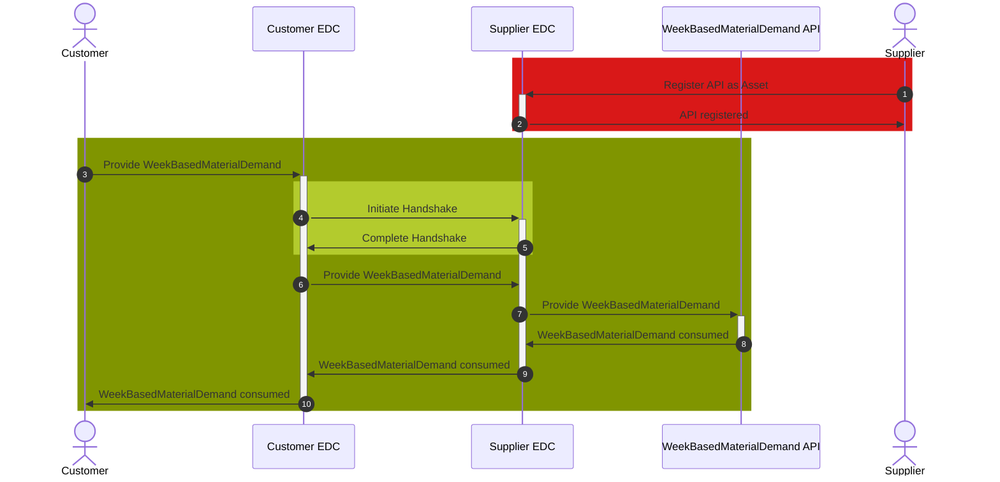

## WeekBasedMaterialDemand API

The WeekBasedMaterialDemand API is owned and registered as an EDC asset by the supplier. The customer provides material demand data to the API via POST request.

### Roles and Functions

|Role / Function|API Owner|POST to API|
|-|-|-|
|Customer||X|
|Supplier|X||

### Data Exchange

Figure: *Exchanging WeekBasedMaterialDemand via API*

### Open API documentation

|API|Link|
|-|-|
|WeekBasedMaterialDemand|N/A|

For further details, please refer to [CX-0128 Demand and Capacity Management Data Exchange][StandardLibrary].

## Notice

This work is licensed under the [CC-BY-4.0](https://creativecommons.org/licenses/by/4.0/legalcode)

- SPDX-License-Identifier: CC-BY-4.0
- SPDX-FileCopyrightText: 2023 BASF SE
