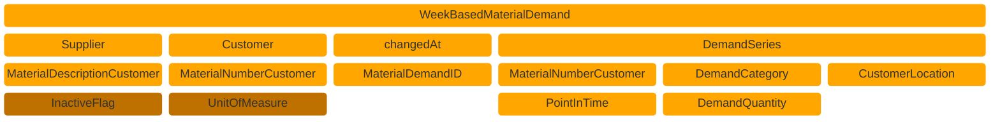

## Aspect Model "WeekBasedMaterialDemand"

Customer provide suppliers demand data as `WeekBasedMaterialDemand` aspect models.

### Roles and Rights

|Role / Right|Create|Change|Read|
|-|-|-|-|
|Customer|X|X|X|
|Supplier|||X|

### Structure of a WeekBasedMaterialDemand




Figure: *WeekBasedMaterialDemand structure*

### Example data

```json
{
  "unitOfMeasureIsOmitted" : false,
  "unitOfMeasure" : "unit:piece",
  "materialDescriptionCustomer" : "Spark Plug",
  "materialGlobalAssetId" : "urn:uuid:48878d48-6f1d-47f5-8ded-a441d0d879df",
  "materialDemandId" : "0157ba42-d2a8-4e28-8565-7b07830c1110",
  "materialNumberSupplier" : "MNR-8101-ID146955.001",
  "supplier" : "{{CATENAX-SUPPLIER-BPNL}}",
  "changedAt" : "2023-11-05T08:15:30.123-05:00",
  "demandSeries" : [ {
    "expectedSupplierLocation" : "{{CATENAX-SUPPLIER-BPNS}}",
    "demands" : [ {
      "demand" : 1000,
      "pointInTime" : "2023-10-09"
    } ],
    "customerLocation" : "{{CATENAX-CUSTOMER-BPNS}}",
    "demandCategory" : {
      "demandCategoryCode" : "0001"
    }
  } ],
  "materialDemandIsInactive" : true,
  "materialNumberCustomer" : "MNR-7307-AU340474.002",
  "customer" : "{{CATENAX-CUSTOMER-BPNL}}"
}
```

All file formats and serializations are derived from a RDF turtle file. It is the source for the Semantic Aspect Meta Model. You can access the RDF turtle file at the following URL:

```text
https://github.com/eclipse-tractusx/sldt-semantic-models/blob/main/io.catenax.week_based_material_demand/3.0.0/WeekBasedMaterialDemand.ttl
```

For further details, please refer to [CX-0128 Demand and Capacity Management Data Exchange][StandardLibrary].

## Notice

This work is licensed under the [CC-BY-4.0](https://creativecommons.org/licenses/by/4.0/legalcode)

- SPDX-License-Identifier: CC-BY-4.0
- SPDX-FileCopyrightText: 2023 BASF SE
- SPDX-FileCopyrightText: 2023 Bayerische Motoren Werke Aktiengesellschaft (BMW AG)
- SPDX-FileCopyrightText: 2023 Fraunhofer-Gesellschaft zur Förderung der angewandten Forschung e.V (Fraunhofer)
- SPDX-FileCopyrightText: 2023 Henkel AG & Co.KGaA
- SPDX-FileCopyrightText: 2023 Mercedes Benz Group AG
- SPDX-FileCopyrightText: 2023 SAP SE
- SPDX-FileCopyrightText: 2023 SupplyOn AG
- SPDX-FileCopyrightText: 2023 Volkswagen AG
- SPDX-FileCopyrightText: 2023 ZF Friedrichshafen AG
- SPDX-FileCopyrightText: 2023 Contributors to the Eclipse Foundation

[StandardLibrary]: https://catenax-ev.github.io/docs/next/standards/CX-0128-DemandandCapacityManagementDataExchange
