This page describes the most important parts for the software implementation of the DCM standards. For the full
technical specification, please refer to the
standard [CX-0128 Demand and Capacity Management Data Exchange][StandardLibrary].

## Introduction

This document provides developers with resources to accelerate the development of apps and services.

## Capabilities of a DCM application

[CX-0128 Demand and Capacity Management Data Exchange][StandardLibrary] describes the following capabilities:

|Capability|Category|Related Aspect Models|Related APIs|
|-|-|-|-|
|Providing and consuming demand data|Core|WeekBasedMaterialDemand|WeekBasedMaterialDemand API|
|Providing and consuming capacity data|Core|WeekBasedCapacityGroup|WeekBasedCapacityGroup API|
|Comparing demand and capacity data|Core|WeekBasedMaterialDemand <br/> WeekBasedCapacityGroup|N/A|
|Demand volatility metrics|Outer Core|WeekBasedCapacityGroup|WeekBasedCapacityGroup API|
|Simulated delta production|Outer Core|WeekBasedCapacityGroup|WeekBasedCapacityGroup API|
|Load factors|Outer Core|WeekBasedCapacityGroup|WeekBasedCapacityGroup API|
|Digital twins|Extended|WeekBasedMaterialDemand <br/> WeekBasedCapacity Group|DCM Asset Administration Shell API|
|Request for update|Extended|IdBasedRequestForUpdate|IdBasedRequestForUpdate AP|
|Comments|Extended|IdBasedComment|IdBasedComment API|
|Supply chain disruption notifications|Extended|demandAndCapacityNotification|DemandAndCapacityNotification API|

- Core capabilities are mandatory within the standard.
- Outer core capabilities share APIs and aspect models with core capabilities, but are optional.
- Extended capabilities introduce aspect models or APIs beyond the core and are optional.

A MVP approach can be followed when developing software, implementing CX-0128, by taking care of core capabilities first, followed by outer core and finishing with extended capabilities.

## Roles and rights of a DCM application

[CX-0128 Demand and Capacity Management Data Exchange][StandardLibrary] describes the business roles customer and supplier. In addition an admin role might be a sensible addition to any application. Most companies within a supply chain will have need of both business roles. Individual users within a company might need access to both business roles.

|Role|Capabilities|
|-|-|
|Customer| - Modify WeekBasedMaterialDemand <br/> - Compare WeekBasedMaterialDemand to WeekBasedCapacityGroup <br/> - Utilize comments <br/> - Utilize supply chain disruption notification|
|Supplier| - Modify WeekBasedCapacityGroup <br/> - Compare WeekBasedMaterialDemand to WeekBasedCapacityGroup <br/> - Link WeekBasedMaterialDemand to WeekBasedCapacityGroup <br/> - Utilize comments <br/> - Utilize supply chain disruption notification|
|Admin| - Configure Request for update|

## Aspect models utilized by a DCM application

- [WeekBasedMaterialDemand](./model-material-demand.md)
- [WeekBasedCapacityGroup](./model-capacity-group.md)
- [IdBasedRequestForUpdate](./model-rfu.md)
- [IdBasedComment](./model-comment.md)

## Application Programming Interfaces

### APIs as data assets

The data consumer registers one data-asset per API with its own EDC. Those data-assets need a `dataAddress` with a `baseURL` pointing to the URI of the API endpoint. The same `dataAddress` needs to be setup to use the consumers EDC as a proxy, utilizing the different proxy related properties within the `dataAddress` object.

#### Asset example

```json
{
  "@id": "capacitygroup-prod",
  "@type": "Asset",
  "properties": {
    "http://purl.org/dc/terms/type": {
      "@id": "https://w3id.org/catenax/taxonomy#DcmWeekBasedCapacityGroup"
    },
    "https://w3id.org/catenax/ontology/common#version": "2.0",
    "id": "capacitygroup-prod"
  },
  "dataAddress": {
    "@type": "DataAddress",
    "proxyPath": "false",
    "oauth2:clientId": {{clientID}},
    "oauth2:tokenUrl": {{tokenUrl}},
    "type": "HttpData",
    "proxyMethod": "true",
    "oauth2:clientSecretKey": "dcm-api-client-secret",
    "oauth2:scope": "roles",
    "proxyQueryParams": "true",
    "proxyBody": "true",
    "baseUrl": "https://myDCMapp.mycompany.com/catx/apis/weekbasedcapacitygroup"
  },
```

### Data exchange

The data provider is required to use HTTP POST to call the API in order to transfer the data. The POST request has to contain a messageHeader and can contain multiple information objects, with information objects being the different aspect models. Because one API is dedicated to one aspect models mixing different aspect models into the same payload as information objects will result in a malformed payload.

#### Payload structure

```json
{
  "messageHeader":
      <messageHeaderObject>,
 
  "content":{
      "informationObject":[
        <informationObject>,
        <informationObject>
      ]
  }
}
```

This format ensures that the header, which contains metadata about the message, is kept separate from the content, which includes the actual data being exchanged. The content section can hold multiple `informationObject` entries. These objects can be one of the following types: `WeekBasedMaterialDemand`, `WeekBasedCapacityGroup`, `IdBasedComment` or `IdBasedRequestForUpdate`.

The master reference for generating additional file formats and serializations is the RDF turtle file, which is an instance of the Semantic Aspect Meta Model. The RDF turtle file for the `messageHeaderObject` is defined in a centralized shared aspect model and can be accessed at the following URL:

```text
https://github.com/eclipse-tractusx/sldt-semantic-models/blob/main/io.catenax.shared.message_header/3.0.0/MessageHeaderAspect.ttl
```

Within the RDF turtle file, you will find detailed descriptions for how to use the message header.

For further information on the APIs and how to use them in order to facilitate data exchange, please refer to [CX-0128 Demand and Capacity Management Data Exchange][StandardLibrary] and [CX-0018 Dataspace Connectivity][StandardLibrary]

## APIs utilized by a DCM application

- [WeekBasedMaterialDemand API](./api-material-demand.md)
- [WeekBasedCapacityGroup API](./api-capacity-group.md)
- [RequestForUpdate API](./api-rfu.md)
- [IdBasedComment API](./api-comment.md)
- [DCM Asset Administration Shell API (AAS API)](./api-aas.md)

[StandardLibrary]: https://catenax-ev.github.io/docs/next/standards/CX-0128-DemandandCapacityManagementDataExchange

## Testing a DCM application

Having a well organized and documented testing of a DCM application is advantageous not only for the whole development process, but especially because test-runs can be used as proof for required certification of the application.

It is recommended to compartmentalize tests into test-sets from which different user journeys can be built, depending on which specific capabilities are supposed to be tested by the user journey. Below you will find tests, test-sets and user journeys. Please be aware that they do not provide full coverage of the standard and depending on how you build your application you will need to expand on them.

### List of Test-Sets

|Test-Set|Description|Tests in test-set|
|--|--|--|
|[Customer: Prepare yourself](./test-customer#customer-prepare-yourself)|Prepares customer for the user journey, by setting up EDC, data assets, wallet, certificates etc.|- Setup EDC<br/>- Register APIs as assets<br/>- Check wallet for certificates<br/>- Prepare variables for other tests<br/>- User journey specific preparation|
|[Supplier: Prepare yourself](./test-supplier#supplier-prepare-yourself)|Prepares supplier for the user journey, by setting up EDC, data assets, wallet, certificates etc.|- Setup EDC<br/>- Register APIs as assets<br/>- Check wallet for certificates<br/>- Prepare variables for other tests<br/>- User journey specific preparation|
|[Customer: Create WeekBasedMaterialDemand](./test-customer#customer-create-weekbasedmaterialdemand)|Tests the implementation of the aspect model|- Create valid aspect model<br/>- Create invalid aspect model<br/>- Create user journey specific aspect model|
|[Customer: Provide WeekBasedMaterialDemand](./test-customer#customer-provide-weekbasedmaterialdemand)|Tests communication via EDC|- Provide valid payload<br/>- Provide invalid payload<br/>- Provide user journey specific payload|
|[Supplier: Consume WeekBasedMaterialDemand](./test-supplier#supplier-consume-weekbasedmaterialdemand)|Tests the implementation of the API and the aspect model|- Consume valid payload<br/>- Consume invalid payload<br/>- Consume user journey specific payload|
|[Supplier: Create WeekBasedCapacityGroup](./test-supplier#supplier-create-weekbasedcapacitygroup)|Tests the implementation of the aspect model|- Create valid aspect model<br/>- Create invalid aspect model<br/>- Create user journey specific aspect model|
|[Supplier: Provide WeekBasedCapacityGroup](./test-supplier#supplier-provide-weekbasedcapacitygroup)|Tests communication via EDC|- Provide valid payload<br/>- Provide invalid payload<br/>- Provide user journey specific payload|
|[Customer: Consume WeekBasedCapacityGroup](./test-customer#customer-consume-weekbasedcapacitygroup)|Tests the implementation of the API and the aspect model|- Consume valid payload<br/>- Consume invalid payload<br/>- Consume user journey specific payload|
|[Customer: Visualize CapacityGroup together with MaterialDemand](./test-customer#customer-visualize-capacitygroup-together-with-materialdemand)|Minor user acceptance test|- Bottleneck calculation<br/>- Surplus calculation<br/>- Zero deviation calculation<br/>- User journey specific calculation|
|[Supplier: Visualize CapacityGroup together with MaterialDemand](./test-supplier#supplier-visualize-capacitygroup-together-with-materialdemand)|Minor user acceptance test|- Bottleneck calculation<br/>- Surplus calculation<br/>- Zero deviation calculation<br/>- User journey specific calculation|
|[Customer: Create IdBasedRequestForUpdate](./test-customer#customer-create-idbasedrequestforupdate)|Tests the implementation of the aspect model|- Create valid aspect model<br/>- Create invalid aspect model<br/>- Create user journey specific aspect model|
|[Customer: Provide IdBasedRequestForUpdate](./test-customer#customer-provide-idbasedrequestforupdate)|Tests communication via EDC|- Provide valid payload<br/>- Provide invalid payload<br/>- Provide user journey specific payload|
|[Supplier: Consume IdBasedRequestForUpdate](./test-supplier#supplier-consume-idbasedrequestforupdate)|Tests the implementation of the API and the aspect model|- Consume valid payload<br/>- Consume invalid payload<br/>- Consume user journey specific payload|
|[Supplier: Create IdBasedRequestForUpdate](./test-supplier#supplier-create-idbasedrequestforupdate)|Tests the implementation of the aspect model|- Create valid aspect model<br/>- Create invalid aspect model<br/>- Create user journey specific aspect model|
|[Supplier: Provide IdBasedRequestForUpdate](./test-supplier#supplier-provide-idbasedrequestforupdate)|Tests communication via EDC|- Provide valid payload<br/>- Provide invalid payload<br/>- Provide user journey specific payload|
|[Customer: Consume IdBasedRequestForUpdate](./test-customer#customer-consume-idbasedrequestforupdate)|Tests the implementation of the API and the aspect model|- Consume valid payload<br/>- Consume invalid payload<br/>- Consume user journey specific payload|
|[Customer: Create IdBasedComment](./test-customer#customer-create-idbasedcomment)|Tests the implementation of the aspect model|- Create valid aspect model<br/>- Create invalid aspect model<br/>- Create user journey specific aspect model|
|[Customer: Provide IdBasedComment](./test-customer#customer-provide-idbasedcomment)|Tests communication via EDC|- Provide valid payload<br/>- Provide invalid payload<br/>- Provide user journey specific payload|
|[Supplier: Consume IdBasedComment](./test-supplier#supplier-consume-idbasedcomment)|Tests the implementation of the API and the aspect model|- Consume valid payload<br/>- Consume invalid payload<br/>- Consume user journey specific payload|
|[Supplier: Create IdBasedComment](./test-supplier#supplier-create-idbasedcomment)|Tests the implementation of the aspect model|- Create valid aspect model<br/>- Create invalid aspect model<br/>- Create user journey specific aspect model|
|[Supplier: Provide IdBasedComment](./test-supplier#supplier-provide-idbasedcomment)|Tests communication via EDC|- Provide valid payload<br/>- Provide invalid payload<br/>- Provide user journey specific payload|
|[Customer: Consume IdBasedComment](./test-customer#customer-consume-idbasedcomment)|Tests the implementation of the API and the aspect model|- Consume valid payload<br/>- Consume invalid payload<br/>- Consume user journey specific payload|
|[Customer: Visualize IdBasedComment together with CapacityGroup and MaterialDemand](./test-customer#customer-visualize-idbasedcomment-together-with-capacitygroup-and-materialdemand)|Minor user acceptance test|- Comment linked to WeekbasedCapacityGroup<br/>- Comment linked to WeekbasedMaterialGroup<br/>- Comment linked to IdBasedComment|
|[Supplier: Visualize IdBasedComment together with CapacityGroup and MaterialDemand](./test-supplier#supplier-visualize-idbasedcomment-together-with-capacitygroup-and-materialdemand)|Minor user acceptance test|- Comment linked to WeekbasedCapacityGroup<br/>- Comment linked to WeekbasedMaterialGroup<br/>- Comment linked to IdBasedComment|

### List of User-Journeys

|#|User Journey|Test-Sets|Tested Capabilities|
|--|--|--|--|
|1|[Base journey](#base-journey)|- Customer: Prepare yourself<br/> - Supplier: Prepare yourself<br/> - Customer: Create WeekBasedMaterialDemand<br/> - Customer: Provide WeekBasedMaterialDemand<br/> - Supplier: Consume WeekBasedMaterialDemand<br/> - Supplier: Create WeekBasedCapacityGroup<br/> - Supplier: Provide WeekBasedCapacityGroup<br/> - Customer: Consume WeekBasedCapacityGroup<br/> - Customer: Visualize CapacityGroup together with MaterialDemand<br/> - Supplier: Visualize CapacityGroup together with MaterialDemand<br/> - Customer: Provide IdBasedRequestForUpdate<br/> - Supplier: Consume IdBasedRequestForUpdate<br/> - Supplier: Provide IdBasedRequestForUpdate<br/> - Customer: Consume IdBasedRequestForUpdate<br/> - Customer: Create IdBasedComment<br/> - Customer: Provide IdBasedComment<br/> - Supplier: Consume IdBasedComment<br/> - Supplier: Create IdBasedComment<br/> - Supplier: Provide IdBasedComment<br/> - Customer: Consume IdBasedComment<br/> - Customer: Visualize IdBasedComment together with CapacityGroup and MaterialDemand<br/> - Supplier: Visualize IdBasedComment together with CapacityGroup and MaterialDemand|- Providing and consuming demand data<br/> - Providing and consuming capacity data<br/> - Comparing demand and capacity data<br/> - Request for update<br/> - Comments|
|2|[Demand volatility metrics journey](#demand-volatility-metrics-journey)|- Customer: Prepare yourself<br/> - Supplier: Prepare yourself<br/> - Customer: Create WeekBasedMaterialDemand<br/> - Customer: Provide WeekBasedMaterialDemand<br/> - Supplier: Consume WeekBasedMaterialDemand<br/> - Supplier: Create WeekBasedCapacityGroup<br/> - Supplier: Provide WeekBasedCapacityGroup<br/> - Customer: Consume WeekBasedCapacityGroup<br/> - Customer: Visualize CapacityGroup together with MaterialDemand<br/> - Supplier: Visualize CapacityGroup together with MaterialDemand|- Providing and consuming demand data<br/> - Providing and consuming capacity data<br/> - Comparing demand and capacity data<br/> - Demand volatility metrics|
|3|[Simulated delta production journey](#simulated-delta-production-journey)|- Customer: Prepare yourself<br/> - Supplier: Prepare yourself<br/> - Customer: Create WeekBasedMaterialDemand<br/> - Customer: Provide WeekBasedMaterialDemand<br/> - Supplier: Consume WeekBasedMaterialDemand<br/> - Supplier: Create WeekBasedCapacityGroup<br/> - Supplier: Provide WeekBasedCapacityGroup<br/> - Customer: Consume WeekBasedCapacityGroup<br/> - Customer: Visualize CapacityGroup together with MaterialDemand<br/> - Supplier: Visualize CapacityGroup together with MaterialDemand|- Providing and consuming demand data<br/> - Providing and consuming capacity data<br/> - Comparing demand and capacity data<br/> - Simulated delta production|
|4|[Load factors journey](#load-factors-journey)|- Customer: Prepare yourself<br/> - Supplier: Prepare yourself<br/> - Customer: Create WeekBasedMaterialDemand<br/> - Customer: Provide WeekBasedMaterialDemand<br/> - Supplier: Consume WeekBasedMaterialDemand<br/> - Supplier: Create WeekBasedCapacityGroup<br/> - Supplier: Provide WeekBasedCapacityGroup<br/> - Customer: Consume WeekBasedCapacityGroup<br/> - Customer: Visualize CapacityGroup together with MaterialDemand<br/> - Supplier: Visualize CapacityGroup together with MaterialDemand|- Providing and consuming demand data<br/> - Providing and consuming capacity data<br/> - Comparing demand and capacity data<br/> - Load factors|

#### Base Journey

``` mermaid
sequenceDiagram
actor c as Customer
actor s as Supplier
rect rgb(57,57,57)
  note right of c: Prepare for E2E test
  c->>c: Check EDC
  c->>c: Check Data Assets
  c->>c: Check Wallet
  s->>s: Check EDC
  s->>s: Check Data Assets
  s->>s: Check Wallet
end
rect rgb(221,130,0)
autonumber 1
  note right of c: Transfer WeekBasedMaterialDemand
  c->>s: FileTransfer ALPHA containing MaterialDemand ALPHA,BETA and GAMMA
  s->>c: HTTP 200 OK
  c->>s: FileTransfer BETA containing MaterialDemand DELTA
  s->>c: HTTP 200 OK
end
rect rgb(128,149,0)
  note right of c: Transfer WeekBasedCapacityGroup
  s->>c: FileTransfer GAMMA containing CapacityGroup ALPHA and BETA
  c->>s: HTTP 200 OK
  s->>c: FileTransfer DELTA containing CapacityGroup GAMMA and DELTA
  c->>s: HTTP 200 OK
end
rect rgb(57,57,57)
  note right of c: GUI test
  c->>c: Visualize bottleneck calculation
  autonumber 9
  s->>s: Visualize bottleneck calculation
end
rect rgb(4,107,153)
  note right of c: Transfer IdBasedRequestForUpdate
  c->>s: FileTransfer EPSILON containing RequestForUpdate ALPHA
  s->>c: HTTP 200 OK
end
rect rgb(128,149,0)
  note right of c: React to Request for Update
  s->>c: FileTransfer ETA containing CapacityGroup ALPHA
  c->>s: HTTP 200 OK
end
rect rgb(4,107,153)
  note right of c: Transfer IdBasedRequestForUpdate
  s->>c: FileTransfer ZETA containing RequestForUpdate BETA
  c->>s: HTTP 200 OK
end
rect rgb(221,130,0)
  note right of c: React to Request for Update
  c->>s: FileTransfer THETA containing MaterialDemand GAMMA
  s->>c: HTTP 200 OK
end
rect rgb(4,107,153)
  note right of c: Transfer IdBasedComment
c->>s: Filetransfer IOTA containing Comment ALPHA and BETA
s->>c: HTTP 200 OK
end
rect rgb(4,107,153)
  note right of c: Transfer IdBasedComment
s->>c: Filetransfer KAPPA containing Comment GAMMA and DELTA
c->>s: HTTP 200 OK
end
rect rgb(57,57,57)
  note right of c: GUI test
  c->>c: Visualize Comment
  autonumber 22
  s->>s: Visualize Comment
end
```



#### Demand Volatility Metrics Journey

``` mermaid
sequenceDiagram
actor c as Customer
actor s as Supplier
rect rgb(57,57,57)
  note right of c: Prepare for E2E test
  c->>c: Check EDC
  c->>c: Check Data Assets
  c->>c: Check Wallet
  s->>s: Check EDC
  s->>s: Check Data Assets
  s->>s: Check Wallet
end
rect rgb(221,130,0)
autonumber 1
  note right of c: Transfer WeekBasedMaterialDemand
  c->>s: FileTransfer ALPHA containing MaterialDemand ALPHA_v1
  s->>c: HTTP 200 OK
  c->>s: FileTransfer BETA containing MaterialDemand ALPHA_v2
  s->>c: HTTP 200 OK
end
rect rgb(128,149,0)
  note right of c: Transfer WeekBasedCapacityGroup
  s->>c: FileTransfer GAMMA containing CapacityGroup ALPHA
  c->>s: HTTP 200 OK
end
rect rgb(57,57,57)
  note right of c: GUI test
  c->>c: Visualize bottleneck calculation
  autonumber 7
  s->>s: Visualize bottleneck calculation
end
rect rgb(221,130,0)
  note right of c: Transfer WeekBasedMaterialDemand
  c->>s: FileTransfer DELTA containing MaterialDemand ALPHA_v3
  s->>c: HTTP 200 OK
end
rect rgb(57,57,57)
  note right of c: GUI test
  c->>c: Visualize bottleneck calculation
  autonumber 10
  s->>s: Visualize bottleneck calculation
end
rect rgb(221,130,0)
  note right of c: Transfer WeekBasedMaterialDemand
  c->>s: FileTransfer EPSILON containing MaterialDemand ALPHA_v4
  s->>c: HTTP 200 OK
end
rect rgb(57,57,57)
  note right of c: GUI test
  c->>c: Visualize bottleneck calculation
  autonumber 13
  s->>s: Visualize bottleneck calculation
end
```



#### Simulated Delta Production Journey

``` mermaid
sequenceDiagram
actor c as Customer
actor s as Supplier
rect rgb(57,57,57)
  note right of c: Prepare for E2E test
  c->>c: Check EDC
  c->>c: Check Data Assets
  c->>c: Check Wallet
  s->>s: Check EDC
  s->>s: Check Data Assets
  s->>s: Check Wallet
end
rect rgb(221,130,0)
autonumber 1
  note right of c: Transfer WeekBasedMaterialDemand
  c->>s: FileTransfer ALPHA containing MaterialDemand ALPHA
  s->>c: HTTP 200 OK
end
rect rgb(128,149,0)
  note right of c: Transfer WeekBasedCapacityGroup
  s->>c: FileTransfer BETA containing CapacityGroup ALPHA
  c->>s: HTTP 200 OK
end
rect rgb(57,57,57)
  note right of c: GUI test
  c->>c: Visualize bottleneck calculation
  autonumber 5
  s->>s: Visualize bottleneck calculation
end
```



#### Load Factors Journey

``` mermaid
sequenceDiagram
actor c as Customer
actor s as Supplier
rect rgb(57,57,57)
  note right of c: Prepare for E2E test
  c->>c: Check EDC
  c->>c: Check Data Assets
  c->>c: Check Wallet
  s->>s: Check EDC
  s->>s: Check Data Assets
  s->>s: Check Wallet
end
rect rgb(221,130,0)
autonumber 1
  note right of c: Transfer WeekBasedMaterialDemand
  c->>s: FileTransfer ALPHA containing MaterialDemand ALPHA and BETA
  s->>c: HTTP 200 OK
end
rect rgb(128,149,0)
  note right of c: Transfer WeekBasedCapacityGroup
  s->>c: FileTransfer BETA containing CapacityGroup ALPHA
  c->>s: HTTP 200 OK
end
rect rgb(57,57,57)
  note right of c: GUI test
  c->>c: Visualize bottleneck calculation
  autonumber 5
  s->>s: Visualize bottleneck calculation
end
```



## Notice

This work is licensed under the [CC-BY-4.0](https://creativecommons.org/licenses/by/4.0/legalcode)

- SPDX-License-Identifier: CC-BY-4.0
- SPDX-FileCopyrightText: 2023 BASF SE
- SPDX-FileCopyrightText: 2023 Bayerische Motoren Werke Aktiengesellschaft (BMW AG)
- SPDX-FileCopyrightText: 2024 CatX Service GmbH
- SPDX-FileCopyrightText: 2023 Fraunhofer-Gesellschaft zur Förderung der angewandten Forschung e.V (Fraunhofer)
- SPDX-FileCopyrightText: 2023 Henkel AG & Co.KGaA
- SPDX-FileCopyrightText: 2023 Mercedes Benz Group AG
- SPDX-FileCopyrightText: 2023 SAP SE
- SPDX-FileCopyrightText: 2023 SupplyOn AG
- SPDX-FileCopyrightText: 2023 Volkswagen AG
- SPDX-FileCopyrightText: 2023 ZF Friedrichshafen AG
- SPDX-FileCopyrightText: 2023 Contributors to the Eclipse Foundation
