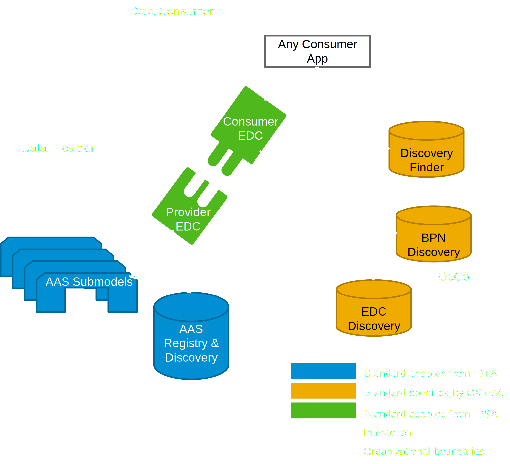

### Digital Twin KIT

<!--
Documentation of the kit.
-->

Based on the information provided in this kit, it is possible to run and program against an infrastructure of
Digital Twins the Catena-X-way. This infrastructure empowers Data Consumers to consume the network's data as agreed with
each Data Provider and facilitated by an Operating Company. They run central and decentral services that allow them to
discover each other, exchange information and contextualize it according to a standardized semantics.

The APIs for digital twins are based on the specifications of the Asset Administration Shell (AAS) as defined in
CX-0002.

## Deployment

| Service Name          | Description                                                                                                                                                                                                                                                                                                                                                                                                                                                                                                                                                                                                                                          | Reference Implementation                                                                                                                                                                                                                                                                                                                                                                                                                           | [Standardized in](https://catena-x.net/de/standard-library) |
|-----------------------|------------------------------------------------------------------------------------------------------------------------------------------------------------------------------------------------------------------------------------------------------------------------------------------------------------------------------------------------------------------------------------------------------------------------------------------------------------------------------------------------------------------------------------------------------------------------------------------------------------------------------------------------------|----------------------------------------------------------------------------------------------------------------------------------------------------------------------------------------------------------------------------------------------------------------------------------------------------------------------------------------------------------------------------------------------------------------------------------------------------|-------------------------------------------------------------|
| Discovery Finder      | A microservice resolving a type of specific asset identifiers, e.g. `manufacturerPartId` or `intrinsicId` against a set of BPN-, and EDC-Discovery Servers hosted at Catena-X operating companies. These identifiers are often shared across use-cases (see [Industry Core](../Industry-core-kit/software-development-view)) but are not specified by the DT Kit and standards.                                                                                                                                                                                                                                                              | [Tractus-X Discovery Finder](https://github.com/eclipse-tractusx/sldt-discovery-finder)                                                                                                                                                                                                                                                                                                                                                            | CX - 0053                                                   |
| BPN Discovery         | A microservice resolving a particular specific asset identifier (consisting of its type - defined above - and the value for a particular asset) against the registered [Business Partner Number](../business-partner-kit/adoption-view.md.md#business-value) of its owner. This is useful in discovery when the location of data on a particular asset is unknown.                                                                                                                                                                                                                                                                             | [Tractus-X BPN Discovery](https://github.com/eclipse-tractusx/sldt-bpn-discovery)                                                                                                                                                                                                                                                                                                                                                                  | CX - 0053                                                   |
| EDC Discovery         | A microservice that resolves a BPN against a list of EDC endpoints. It is populated during onboarding and is the last step of the discovery sequence preceeding the DSP-interaction starting with the catalog-request.                                                                                                                                                                                                                                                                                                                                                                                                                               | [Tractus-X Portal including EDC Discovery API](https://github.com/eclipse-tractusx/portal-backend)                                                                                                                                                                                                                                                                                                                                                 | CX - 0001                                                   |
| Digital Twin Registry | A registry for digital twins. Here, a provider publicises digital representations (digital twins) of the assets the participant has data on. This data is encapsulated in submodels accessible via instructions that a consumer will find in the Digital Twin Registry (DTR). The DTR adheres to the [AssetAdministrationShellRegistryServiceSpecification](https://app.swaggerhub.com/apis/Plattform_i40/AssetAdministrationShellRegistryServiceSpecification/V3.0_SSP-002#/) and the [DiscoveryServiceSpecification](https://app.swaggerhub.com/apis/Plattform_i40/DiscoveryServiceSpecification/V3.0.1_SSP-001) and thus contains only meta-data. | [Tractus-X Digital Twin Registry](https://github.com/eclipse-tractusx/sldt-digital-twin-registry)                                                                                                                                                                                                                                                                                                                                                  | CX - 0002                                                   |
| Submodel Server       | The data source adhering to a subset of the Submodel API as defined in AAS Part-2 3.0. It delivers the actual data that the consumer is looking for via a structured endpoint defined by the [SubmodelServiceSpecification](https://app.swaggerhub.com/apis/Plattform_i40/SubmodelServiceSpecification/V3.0_SSP-003) and according to the structured data formats defined in the [Semantic Models Repository](https://github.com/eclipse-tractusx/sldt-semantic-models).                                                                                                                                                                             | There are no official reference implementations for the Submodel-API. Implementations of the API exist in frameworks such as [FA³ST-Framework](https://github.com/FraunhoferIOSB/FAAAST-Service), [Eclipse Basyx](https://github.com/eclipse-basyx/basyx-java-sdk), [AASX Server](https://github.com/admin-shell-io/aasx-server). These implementations are not certified according to the standard nor involved in systematic end-to-end testing. | CX - 0002                                                   |

- IDSA: [International Data Spaces Association](https://internationaldataspaces.org/)
- IDTA: [Industrial Digital Twin Association](https://industrialdigitaltwin.org/)
- OpCo: Operating Company. Also called Core Service Provider A in
  the [CX Operating Model](https://catena-x.net/fileadmin/_online_media_/CX_Operating_Modelv2.1_final.pdf).

## Setup Guide

Detailed guidance on setup of the abovementioned components can be found in the repositories of their linked reference
implementations.

## Notice

This work is licensed under the [CC-BY-4.0](https://creativecommons.org/licenses/by/4.0/legalcode).

- SPDX-License-Identifier: CC-BY-4.0
- SPDX-FileCopyrightText: 2023, 2024 Contributors of the Eclipse Foundation
- Source
  URL: [https://github.com/eclipse-tractusx/eclipse-tractusx.github.io](https://github.com/eclipse-tractusx/eclipse-tractusx.github.io)
