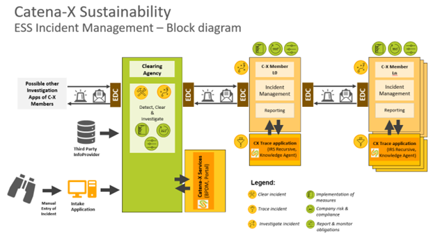
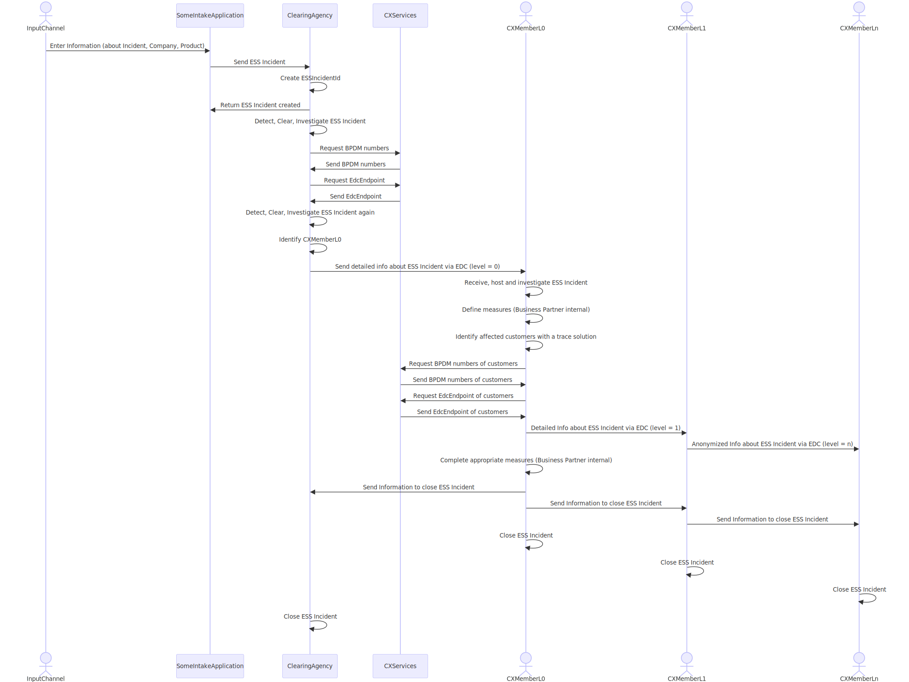

## Building block view

The following figure shows the current high-level architecture of the use case "Occasion-related tracking of ESS-related incidents".

## Sequence view

This simplified sequence view shows the process starting from an Input Channel.

As the use case ESS believes that the most promising way to solve an ESS incident will be a bottom - up approach, this process is the basis for the sequence view.

The Input Channel can be a whistle-blower, a third-party application, or another Input channel of a CatenaX member. Someone reports an incident and maintains as much information as possible about the incident. The incident is processed at the Clearing Agency. It is enriched with information from CatenaX-Services and then transferred to the CXMemberL0 who is the originator of the incident.

The Incident originator L0 investigates further about the incident and takes appropriate measures. To identify affected Business Partners along the supply chain, that need to be informed, the CXMemberL0 can use a CX trace solution like recursive IRS or Knowledge Agent. The Knowledge Agent can provide the complex search logic that might be needed to find the affected customers.

To be able to address the affected Business Partners / Customers via EDC CatenaX-Services can be used.

Now, the incident traverses upwards within the supply chain to the next levels one by one.

The CXMemberL1 is related directly to L0, so he will receive detailed information about the ESS incident from CXMemberL0.

The CXMemberLn is not related directly to L0, so he will receive anonymized information about the ESS incident from CXMemberL1.

As soon as the ESS incident can be closed, the CXMemberL0 informs the Clearing Agency and the Business Partners in the Supply Chain to close it.

## Notice

This work is licensed under the CC-BY-4.0.

- SPDX-License-Identifier: CC-BY-4.0
- SPDX-FileCopyrightText: 2024 ZF Friedrichshafen AG
- SPDX-FileCopyrightText: 2024 BASF SE
- SPDX-FileCopyrightText: 2024 Mercedes Benz Group
- SPDX-FileCopyrightText: 2024 Bayerische Motoren Werke Aktiengesellschaft (BMW AG)
- SPDX-FileCopyrightText: 2024 SAP SE
- SPDX-FileCopyrightText: 2024 Robert Bosch GmbH
- SPDX-FileCopyrightText: 2024 Gris Group
- SPDX-FileCopyrightText: 2024 Contributors to the Eclipse Foundation
