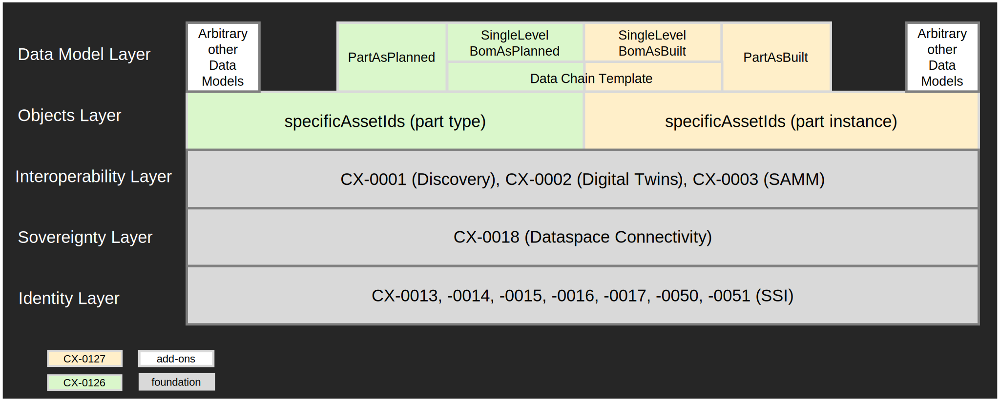

import FutureConcepts from './parts/future-concepts.mdx'

The following page offers an architecture perspective including the main building blocks and information regarding
communication between different components, shown as sequence diagrams in a runtime view. In general, data access must
be provided in the Catena-X network using the Data Space Protocol (DSP). As standard for data-level interoperability,
the Asset Administration Shell (AAS) standard is used - this is relevant for registering data via the Digital Twin
Registry (short DTR), as well as for delivery of said data. SAMM is used as modelling language to model a Digital Twin's
aspects, yielding json-schema that defines the payloads and context for runtime data.

## Assumptions

This architecture is based on the following assumptions:

- There is a complete setup of the Catena-X Dataspace available with all Core Services as defined by the [Operating Model Whitepaper v2.1](https://catena-x.net/fileadmin/_online_media_/CX_Operating_Modelv2.1_final.pdf).
- All users have **completed onboarding** to the Catena-X network. This includes:
    - All participants hold a Verifiable Credential issued by an Operating Company (Core Service Provider B)
    - All participants have at least one Dataspace Connector deployed that's linked to their BPNL at the EDC Discovery
      Service.
    - All participants have an active network membership that is represented in their membership credential.
    - Data Providers operate a Digital Twin Registry according to
      the [Digital Twin Kit](../digital-twin-kit/adoption-view)
    - Data Providers expose their data via the Submodel API according to the Digital Twin Kit.
- The **customers of parts** (on catalog and instance level) must be known when creating a digital twin and registering
  its data. Registering data in EDC and DTR requires data providers to define appropriate access permissions to prevent
  exposing data to unauthorized parties. For Traceability, the customer of a part must have access to the digital twin
  in
  the DTR as well as to the digital twin's data in the EDC. If the customer is not known when a digital twin is created,
  additional processes must be set up by the data provider to add access permissions for the customer at a later time.

## Digital Twin - Asset Administration Shell

This section provides guidance on the consideration of digital twins as a basis for data structuring and data discovery within Catena-X. Details on the exact usage of AAS and Digital Twins can be obtained in the [Digital Twin KIT](/docs-kits/category/digital-twin-kit)

### General Guidance

Digital twins and their technical representation as an Asset Administration Shell within Catena-X are a crucial element for interoperability and reusability. By leveraging an AAS-compliant Digital Twin Registry, the provisioning and publishing of object-related data via standardized submodel templates through the standardized API enables reusable data discovery and consumption mechanisms across various use cases.

However, the provisioning of a digital twin incurs certain costs. Therefore, the Industry Core provides the following guidance and highlights potential benefits:

#### Discrete Nature of Digital Twins

Digital twins should be associated with an underlying object (real or virtual) to which data will be attached. Creating a digital twin for a pure set of mass data (e.g., generic usage data) not related to a specific discrete object may be unnecessary, as it might already be represented by a data asset in dataspace terms according to CX-0018 Dataspace Connectivity.

Examples of Discrete Objects in the automotive context:

- a part number / catalog part (as described in "Industry Core: PartType")
- a serialized part / material (as described in "Industry Core: Part Instance")
- a product batch
- a quality case
- a production line
- serialized production equipment
- ...

Even with an underlying object, the usage of a digital twin might still not be necessary based on the predefined exclusive utilization of the data within a use-case. Therefore the following questions should be answered:

- Is the object and especially the data linked to it shared or likely to be shared between different use cases ?
- Is the object itself linked to different sets of data (submodels), that are individually accessed ?
- Is the object identified by different identifiers, requiring the use or translation of these identifiers for discovery mechanisms ?
- Is the object commonly accessed individually and not via mass data requests ?
- Is the data intended to be used more than once and therefore worth to be discovered ?

If all of the above questions are answered with a clear "No", a twin might be overhead for an object or data to be shared within one specific use-case. Examples include: 
- the data to be shared is a set of mass data not linked to a specific instance of an object
- the data is only being used and intended to be used by a single use-case and there is no cross-use-case relevancy anticipated
  
### Additional Recommendations and Comments

If mass data is used for analysis to generate new data applicable to a specific object (e.g., material, serialized part, batch), this data should be linked to a digital twin at that level, while the originating mass data sets are not required to be linked. For example, analytics use cases leveraging mass data sets regarding multiple objects could feed their outcome back into the digital twins of the known objects, while the potentially use-case proprietary mass data sets are not necessarily represented by digital twins or submodels.

Data that is shared via request and answer schemes, due to the need of additional processes to generate, may also be attached - once generated - in addition to the direct data sharing.

The AAS does not alter data structures; it defines a method to link data (submodels) to objects and establishes a standardized path for data discovery. Data Structures and Semantics should be described by semantic models to support easy consumption.

Linking data to multiple twins does not increase its persistence footprint. The Digital Twin Registry merely points to the actual data sources.

## Non-Functional Requirements

### Lawfulness

Automotive supply chains hold sensitive data. Not only can improper exposure lead to the loss of trade-secrets but it can also violate antitrust regulations - especially when gaining access to sensitive data of horizontal competitors. As this can jeopardize the business of a company, especially Data Providers (and by proxy Business Application Providers) must ensure that their solutions are not only secure by default but also provide ergonomic and reliable means for configuration.

### Correctness

Data Chains are built up of the links to resources distributed among the supply chain. This is reflected in distributed data. Publishing incorrect or outdated data to the network will have ripple-on effects that may break the chain for all interested parties. To avoid this, implementation strictly according to standard, verified by rigorous certification, is critical for the success of the Industry Core and the network as a whole.

### Resilience

While processing data for publishing it to Catena-X, a data provider needs to access the digital twins of built-in parts from suppliers. These must be available in Catena-X at this point. If these digital twins are not found while the data provider is looking them up, the data provider will not be able to integrate these built-in parts into BoM aspect models (e.g., SingleLevelBomAsBuilt) as it is missing the built-in parts' Unique ID. Reasons for not finding a built-in part's digital twin can be:

  1. There is a network failure while the data provider's is looking for the digital twin.
  2. The supplier did not yet create the digital twin, e.g., because its internal processes were delayed
  3. The supplier is not yet part of the Catena-X network.

Resilience means that the data provider implements a pipeline that can cope with these issues. Digital twins are provided with the information that is available and are updated once more information is available (e.g., the supplier provides digital twins for built-in parts later on).

### Backward Compatibility and Versioning

Effective management of versions and changes for Catena-X standards, KITs, and open source reference implementations is crucial to guarantee compatibility, interoperability and security especially in a decentralized data space. The Catena-X lifecycle management coordinates quarterly releases, including one major release and three minor releases per year. Only a major release may contain breaking changes and does not need to be backward compatible.

The Catena-X data space aims to support a parallel phase of two major versions of 12 months to ensure a smooth upgrade process. Data providers and data consumers must take special care to prepare for such releases by planing necessary migrations in time. This means that, e.g., a Traceability app that was built for the previous (major) Catena-X release will still work in an environment that is running the new major release.

  - **For digital twins and aspect models**, this means that data providers and data consumers must at least support mandatory aspect model versions from the oldest, still supported major release. Newer mandatory aspect model versions can be optionally supported. A data provider cannot assume that all data consumers are already able to process newer aspect model versions. A data consumer cannot assume that all data providers already provide their data in newer aspect model versions.

  Mandatory versions for aspect models can only change in a major release as this change is breaking. Optional versions can be introduced with minor and patch versions, e.g., to introduce a future mandatory version first as optional for easier migration later on.

  A data provider that wants to support several versions of an aspect models must add a separate submodelDescriptor for every supported aspect model version to the digital twin. The submodelDescriptors will have different semanticIds and might also point to different EDC assets - depending on the asset structure used in the EDC for providing the digital twin's sumodel.

  A data consumer must search the submodelDescriptors of a digital twin for supported semanticIds and then select the most suitable one for further processing.

  - **For Notification APIs**, a separate EDC asset must be created for every major API version, e.g., for versions v1 and v2 of the API separate EDC assets must be created. The API version must be documented in the `https://w3id.org/catenax/ontology/common#version` property on a minor release level (e.g., 1.1). It is not necessary to create a separate EDC asset for every minor or patch version as these versions must always be backward compatible.

More information about backward compatibility and versioning can be found here:
- [Life Cycle Management 101](https://catena-x.net/fileadmin/_online_media_/231006_Whitepaper_LifeCycleManagement.pdf) from the Catana-X Standard Library,
- [Digital Twin KIT - Registration at EDC](../digital-twin-kit/software-development-view/dt-kit-software-development-view/#registration-at-edc) with details about versioning of EDC assets (for submodels as well as for Notification assets) including examples.

## Building Block View

The basic features of Industry Core build the foundation for message-based and digital-twin-based data sharing in Catena-X. Message-based communication or respectively data push scenarios can leverage the notification feature, whilst data pull scenarios can leverage the digital-twin-based data discovery as well as data sharing orchestration.

Use cases are intended to build upon the foundation provided by the Industry Core to support use case agnostic interoperability, reusability, monitoring and minimized entry barriers towards new use cases.

A shared technical foundation offers significant advantages for dataspace participants and software providers. By minimizing the technical footprint required for multi-use-case participation and software development, it enables substantial reductions in development, maintenance costs and cross-usecase reusability.

### Digital Twins

### Notifications

With notifications, the Industry Core defines a message-based data sharing within Catena-X. The message is sent from one Catena-X partner - called sender - to another Catena-X partner - called receiver - using simple messages in JSON format via Catena-X connector, as shown in the following figure:

- In the context of this KIT, notifications are messages in JSON format with a standardized data format consisting of a standardized header and a use-case-specific content.
- The notification API consists of a set of operations that can be used to exchange notifications between sender and receiver. Each operation has a defined request, i.e., the notification, and a response which consists of HTTP error codes. Operations can use notifications with different data formats. It is not required to use the same notification data format for all operations.
- The notification exchange is done via Catena-X connectors. So, this KIT also defines assets, asset properties, and usage policies that are required for implementation.

Together, these artifacts define the message-based data sharing, called notification API. This KIT also defines a standardized way to document all these artifacts of a notification API in Catena-X standard documents and KITs.

Use cases can define and standardize their own notification APIs. They need to extend the Industry Core notification API by adding their own business content.

- They must extend the content part of the notification data format with their own business content.
- They must define a set of operations that should be supported with the use case specific notification API.
- They also must define a name for their notification API which is, for example, used in the `dct:type` property of the connector asset.  

As all use cases use the same underlying notification technology based on Industry Core, use cases still are interoperable. Data and app providers only need to implement one notification technology that is jointly used by all use cases and do not need to implement several different technologies for message-based data sharing.

## Runtime View

The runtime patterns represent a subset of the interactions specified in the Digital Twin Kit.
Its ["Interaction Patterns" section](../digital-twin-kit/software-development-view/interaction-patterns)
describes the interaction between a Data Provider and Data Consumer including the necessary configuration steps.
Since the Discovery Services according to CX-0053 are not part of the Industry Core, all calls going to the components
`DiscoveryFinder` and `BPN Discovery Service` can be omitted.

<FutureConcepts components={props.components} />

## Standards

A formal definition of the Industry Core's content is given in the standards CX-0151 (Industry Core: Basics), CX-0126 and CX-0127. These standards build on a common subset of technologies that are themselves described in separate Catena-X standards.

The Industry Core standards share a common set of base technologies. And while the Industry Core does provide Business-relevant capabilities for Data Consumers, it can likewise serve as a launchpad for new use-cases.

The Interoperability Layer the Industry Core Standards build on defines API structures of Data Providers and relevant
core services hosted centrally. They depend on the EDC Discovery Service defined in standard CX-0001 to discover a
participant's the EDC-endpoint. CX-0002 is the standard for the integration between assets and related data - leveraging
the Asset Administration Shell standard as adopted by Catena-X. Its correct deployment is especially critical as its
services (Digital Twin Registry and Submodel Endpoints) are operated by all Data Providers.

The Identity and Sovereignty Layers are defined in a variety of Catena-X standards that are assumed to be deployed and
integrated form the foundation for data sharing in Catena-X.

All relevant standards can be downloaded from the official [Catena-X Standard Library](https://catena-x.net/de/standard-library):

- Industry Core specific
    - [CX-0151 Industry Core: Basics 1.0](https://catena-x.net/de/standard-library)
    - [CX-0126 Industry Core Part Type 2.1](https://catena-x.net/de/standard-library)
    - [CX-0127 Industry Core Part Instance 2.0](https://catena-x.net/de/standard-library)
- Interoperability Layer
    - [CX-0001 EDC Discovery API 1.0](https://catena-x.net/de/standard-library)
    - [CX-0002 Digital Twins in Catena-X 2.2](https://catena-x.net/de/standard-library)
    - [CX-0003 SAMM Aspect Meta Model 1.2](https://catena-x.net/de/standard-library)
- Sovereignty Layer
    - [CX-0018 Dataspace Connectivity 3.2](https://catena-x.net/de/standard-library)
- Identity Layer
    - [CX-0013 Identity of Member Company 2.0](https://catena-x.net/de/standard-library)
    - [CX-0014 Employees and Technical Users 1.0](https://catena-x.net/de/standard-library)
    - [CX-0015 IAM & Access Control Paradigm for Users and Clients 1.0](https://catena-x.net/de/standard-library)
    - [CX-0149 Verified Company Identity 1.0](https://catena-x.net/de/standard-library)
    - [CX-0050 Framework Agreement Credential 2.1](https://catena-x.net/de/standard-library)

## Terminology

The following terms are especially relevant for the understanding of this KIT:

**Catena-X Partner:** A company participating in the Catena-X network. A partner can act as both, a notification sender or notification receiver.

**Message**: Data with a defined format exchanged between two partners, a sender and a receiver. 

**Notification**: In Catena-X, notifications are JSON messages with a standardized data format consisting of a standardized header and a use-case-specific content.

**Notification Sender:** The sender of a Catena-X notification

**Notification Receiver:** The receiver of a Catena-X notification. The receiver provides an asset in the connector to which notifications can be sent.

**Notification API**: A message-based data sharing within Catena-X that supports a set of operations.

**Unique ID / Catena-X ID**: A Unique ID uniquely identifies a particular real-world asset. In Industry Core, these are: serialized parts (including vehicles), batches, JIS parts (Just-in-Sequence) and catalog parts. A Unique ID is a URN and has the following format: urn:uuid:&lt;UUIDv4&gt;, i.e., the NID is "uuid" and the NSS is an UUID Version 4 (as described here: https://en.wikipedia.org/wiki/Universally_unique_identifier). Unique IDs are used in several places in Industry Core, e.g., as globalAssetId for digital twins. Although they share the same format with other identifiers like, e.g., the AAS identifier, they are separate identifiers that identify different resources and should not be mistaken with these other identifiers.

## NOTICE

This work is licensed under the [CC-BY-4.0](https://creativecommons.org/licenses/by/4.0/legalcode).

- SPDX-License-Identifier: CC-BY-4.0
- SPDX-FileCopyrightText: 2023 BASF SE
- SPDX-FileCopyrightText: 2023 Bayerische Motoren Werke Aktiengesellschaft (BMW AG)
- SPDX-FileCopyrightText: 2023 Fraunhofer-Gesellschaft zur Foerderung der angewandten Forschung e.V. (represented by Fraunhofer ISST & Fraunhofer IML)
- SPDX-FileCopyrightText: 2023 German Edge Cloud GmbH & Co. KG
- SPDX-FileCopyrightText: 2023 Mercedes Benz AG
- SPDX-FileCopyrightText: 2023 Robert Bosch Manufacturing Solutions GmbH
- SPDX-FileCopyrightText: 2023 SAP SE
- SPDX-FileCopyrightText: 2023 Siemens AG
- SPDX-FileCopyrightText: 2023 T-Systems International GmbH
- SPDX-FileCopyrightText: 2023 ZF Friedrichshafen AG
- SPDX-FileCopyrightText: 2023 Contributors to the Eclipse Foundation
- Source URL: https://github.com/eclipse-tractusx/eclipse-tractusx.github.io/tree/main/docs-kits/kits/industry-core-kit (latest version)