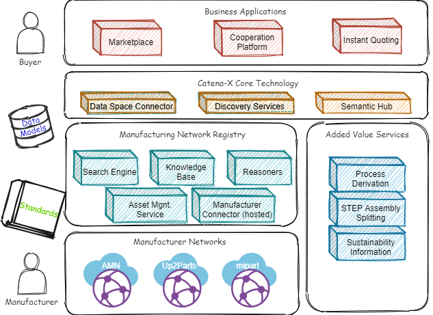
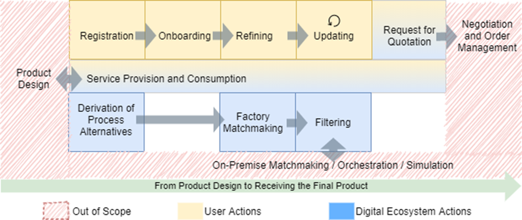

### Manufacturing as a Service KIT

## Vision & Mission

**Enable interoperable, federated network of networks linking manufacturing demand with manufacturing capabilities to enable digital manufacturing as a service**.

**Comprehensive reference architecture with standardized interfaces for on-demand manufacturing**.

The Manufacturing-as-a-Service (MaaS) KIT defines the mechanisms and services required for an interoperable, federated network of networks where manufacturing demand meets manufacturing capabilities. The Catena-X Digital Manufacturing as a Service Ecosystem (CDME) provides a comprehensive reference architecture with standardized interfaces and data models, including first implemented services, to present the operational network of networks with a single entry point into the world of domain-independent on-demand manufacturing (ODM). The main focus is on the mediation of manufacturing demand and manufacturing supply, which is offered in a service-orientated manner. In addition, IT services enable connectivity and process automation to be part of this digital marketplace.

## Business Value

### Stakeholder Benefit

Stakeholders of a Manufacturing-as-a-service ecosystem are on the one hand consumers, who need support in manufacturing process steps, here called buyers, and on the other hand suppliers, who provide manufacturing tasks, here single manufacturers, supplier networks and on-demand-manufacturing (ODM) platforms. In addition, there are digital service providers, supporting in process automation.
Buyers should get an easy access to a multi-domain network of networks, not limited to before known suppliers and not forced to be registered at several domain-specific networks or ODM platforms. They can use standardized formats and communication channels that are not subject to the heterogeneous restrictions defined by the supplier, and they are guided in defining their requirements and preparing all the necessary information to obtain a reliable offer.
Suppliers get higher visibility with company promotion on digital marketplaces to be automatically found by new customers with capability tailored manufacturing requests and reduced time-consuming and expensive offering effort. They get access to supporting services like instant quoting or production planning and they achieve an increased utilization of free capacities.
Service providers get a new market platform for services supporting Manufacturing-as-a-Service processes, like part analyzing and work plan derivation, manufacturing process depending step file splitting, instant quoting or connectivity to the network.

### Reference architecture

The reference architecture includes standardized and tested interfaces and data models that can be used for the development and implementation of Manufacturing-as-a-Service solutions (Chaper 4 of Whitepaper).

### Standards

Standardizing the necessary interfaces and data models of our architecture enables to exchange data with different systems and users and to extend the reference architecture with additional services, replace certain individual services with equivalent ones or to remove optional services.
Within the Manufacturing-as-a-Service KIT, two main standards were defined:

- [Manufacturing Capability Model and API](#standards-1) - for declaration of offered and required manufacturing capabilities
- [Request for Quotation Model and API](#standards-1) - for manufacturing demand configuration

### First implemented example services and applications

There are several demonstrators and services that provide different building blocks within the reference architecture and support the workflow of a MaaS marketplace for customers.

- SFW Connector - for manufacturer onboarding of their offered capabilities
- Supplier Knowledge Base - knowledge base for supplier information including capabilities
- Asset Management Service - register, update and delete manufacturing capabilities
- Asset Management and Refinement Application (AMARA) - central user interface and recommender system to enable a supplier to refine its information within the Supplier Knowledge Base
- Sustainability Knowledge Base - knowledge base for manufacturer sustainability information (including certifications, PCF, CCF, etc.)
- Supply Chain Sustainability Service - collects information for a supply chain from the Sustainability Knowledge Base
- SFW Search Engine - performs the matchmaking process between the manufacturer and the buyer, based on the information provided by these manufacturers
- Process Derivation Service - to derive required manufacturing processes
- STEP File splitting service - to split assembly products in single part components
- MaaS Portal - GUI appplication for demand configuration and supplier selection
- Digital Service Instant Quoting - enables automated price calculation for production requests

## UseCase / Domain explanation

MaaS in Catena-X concentrates on the matchmaking between the manufacturing capability demand and the offered manufacturing capability.

The goal is a federated marketplace for Manufacturing-as-a-Service, connecting single manufacturers and on-demand manufacturing platforms over different manufacturing domains, including the support in digitalization and automation by provided services supporting specific steps in the offering process. Manufacturers who want to offer their manufacturing resources as a service, will do so by onboarding their manufacturing capabilities directly to the federated marketplace or to existing on-demand manufacturing platforms or networks. Capabilities can include knowledge of the factories, e.g., machinery, employee expertise, past production outputs and processes, capability terms like “band sawing”, certifications, etc. Buyers search for the manufacturing capabilities they need to produce a specific product (usually parts or assemblies). This can include individual manufacturing steps to cover missing capabilities related to existing productions or even fully external production offers. Both the ODM platform and the marketplace can perform the necessary matchmaking between required and offered capabilities. Typically, the ODM platforms offer the production of a specific part and often act as manufacturers, whereas the marketplace only offers the production by an arbitrary number of manufacturers. However, both may utilize additional IT or engineering services to provide their customers with added values such as onboarding application, automated process derivation or sustainability services. A federated marketplace not only offers manufacturing capabilities registered directly by the manufacturers, but also capabilities registered with ODM platforms. As a result, a network of networks is built, which connects different networks of manufacturers (according to their capabilities) and different domains. This approach enables a single-entry point to the network of networks via the marketplace.


*Marketplace use case overview (Schoeppenthau et al. 2023)[^1].*

## Whitepaper

To empower MaaS for the automotive industry we built a reference architecture of a digital MaaS ecosystem based on a dataspace-agnostic reference architecture for open, sustainable, and resilient digital manufacturing ecosystems. To perform the capability matchmaking and capability data integration, the prototypical implementation of this reference architecture consists of components for smart semantic integration to bridge the semantic gap between different manufacturing capability descriptions, as well as a search engine and a multi-purpose API connector. Furthermore, the standardization of interfaces and data models for the most relevant communication within the architecture ensures exchangeability of and interoperability between all major components. This prevents the vendor lock-in effect, enables a market for MaaS services and opportunities for interested operating companies. The architecture fully supports existing manufacturing networks like on-demand manufacturing platforms by federating them in utilizing a network of networks approach.

The journal article [“Building a Digital Manufacturing as a Service Ecosystem for Catena-X”](https://www.researchgate.net/publication/373383262_Building_a_Digital_Manufacturing_as_a_Service_Ecosystem_for_Catena-X) describes the dataspace-agnostic basis for the Catena-X MaaS reference architecture.



*Building a Digital Manufacturing as a Service Ecosystem for Catena-X[^1].*

## Semantic Models

Knowledge of manufacturing capabilities is based on extensive knowledge from different distributed sources, in different disciplines, and the interoperability of systems that use and manage this information is a major challenge. The reason for this is that the majority of these systems use their own proprietary data structures and vaguely describe semantics, as well as different interpretations of the terms used and applied to describe the capabilities. For this reason, the CDME architecture does not rely on standardized semantics. However, basic concepts are defined as aspect models, to provide a common semantics where appropriate.

### Manufacturing Capability Model

An aspect model representing manufacturing capabilities, based on the concepts for products, processes, resources and capabilities, as well as their relations to each other. Sharing information about the required and available manufacturing capabilities in an interoperable manner is fundamental for any MaaS solution providing basic and value-added services such as automated search and matchmaking.

Link to the semantic data model: [https://github.com/eclipse-tractusx/sldt-semantic-models/tree/main/io.catenax.manufacturing_capability/3.1.0](https://github.com/eclipse-tractusx/sldt-semantic-models/tree/main/io.catenax.manufacturing_capability/3.1.0)

### Request for QuotationModel

An aspect model defining detailed requirements, deadlines and evaluation criteria for obtaining quotations from potential manufacturers for specific products or services. Manufacturing-as-a-Service (MaaS) scenarios focus on connecting buyers having a request for specific manufacturing process steps or products to be manufactured with the appropriate manufacturing supplier, who has the corresponding capabilities and resources. Sharing information about the demand with all required configuration and contact data is necessary for potential suppliers to evaluate the request and formulate an offer. A common description of the request for quotation based on a standardized semantic definition is therefore key for facilitating such an information exchange between Catena-X participants. This ensures an open network for every Catena-X member to join and enables interoperability between the partners.

Link to the semantic data model:

- [https://github.com/eclipse-tractusx/sldt-semantic-models/tree/main/io.catenax.request_for_quotation/3.0.0](https://github.com/eclipse-tractusx/sldt-semantic-models/tree/main/io.catenax.request_for_quotation/3.0.0)

## Logic / Schema

In general, the MaaS KIT does not consider specific business logic. However, a capability matchmaking is a central requirement for every MaaS KIT-based architecture. This leads to the phases depicted in the figure below. The figure segments the phases into phases containing ecosystem and user actions. For the matchmaking to work, manufacturers have to register themselves with the ecosystem in order to onboard their capability-related information. Furthermore, since they have the domain-expertise regarding their capabilities, they refine them, which from their point of view is similar to search engine optimization. For all that, they can use services provided by the digital ecosystem (cf. Service Provision and Consumption). Stakeholders with a demand for manufacturing capabilities can further use services to communicate this demand to the systems which perform the matchmaking. Additionally, if the demand is not yet available as process alternatives or similar machine-interpretable structures, it has to be transformed accordingly. If manufacturers have been found by their matching capabilities, they have to be further filtered by additional aspects, e.g. carbon footprints, to fit respective prerequisites for an order. For this, the information of interest has to be requested from factory endpoints or further services.

The figure also depicts phases which are currently out of scope.



*Phases of a capability matchmaking MaaS use case (Schoeppenthau et al. 2023)[^1].*

[^1]: ```Schöppenthau, F.; Patzer, F.; Schnebel, B.; Watson, K.; Baryschnikov, N.; Obst, B.; Chauhan, Y.; Kaever, D.; Usländer, T.; Kulkarni, P. Building a Digital Manufacturing as a Service Ecosystem for Catena-X. Sensors 2023, 23, 7396. https://doi.org/10.3390/s23177396```

## Standards

Standardizing the necessary interfaces and data models of our architecture enables to exchange data with different
systems and users and to extend the reference architecture with additional services, replace certain individual services
with equivalent ones or to remove optional services.

Within the Resiliency KIT Manufacturing as a service, two main standards were defined:

- [CX - 0052: Manufacturing Capability Model and API](https://catena-x.net/fileadmin/user_upload/Standard-Bibliothek/Update_Januar_2024/CX-0052-AspectModelManufacturingCapability-v1.0.0.pdf) -
  for declaration of offered and required manufacturing capabilities
- [CX - 0129:Request for Quotation Model and API](https://catena-x.net/de/standard-library) - for manufacturing demand
  configuration

## Notice

This work is licensed under the [CC-BY-4.0](https://creativecommons.org/licenses/by/4.0/legalcode).

- SPDX-License-Identifier: CC-BY-4.0
- SPDX-FileCopyrightText: 2024 Fraunhofer-Gesellschaft zur Foerderung der angewandten Forschung e.V. (represented by
  Fraunhofer IOSB)
- SPDX-FileCopyrightText: 2024 ISTOS GmbH
- SPDX-FileCopyrightText: 2024 mipart GmbH
- SPDX-FileCopyrightText: 2024 Siemens AG
- SPDX-FileCopyrightText: 2024 up2parts GmbH
