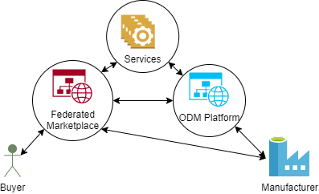

## 1 Introduction and Goals

Manufacturing as a Service (MaaS) requires a matchmaking between the requirements to produce a part or assembly and the capabilities manufacturers can provide, not mentioning the manufacturer’s respective capacities. In addition, manufacturers who are able to offer certain capabilities may never have produced for the product area to which they can contribute. The automotive industry has massive supply chains consisting of manufacturers from nearly every manufacturing domain there is. In such a cross-domain setup, the heterogeneity of production requirements and manufacturing capability descriptions, as well as highly different technical interfaces and governance requirements are major challenges to build an ecosystem for MaaS.

To empower MaaS for the automotive industry the Catena-X MaaS team built the **C**atena-X **D**igital **M**aaS **E**cosystem (**CDME**).

**This CDME architecture documentation is mostly based on the article \*[Building a Digital Manufacturing as a Service Ecosystem for Catena-X](https://doi.org/10.3390/s23177396)**\***. See chapter "Solution Strategy" for more details.**

## 2 Constraints

Business interests of manufacturing network platforms have to be supported. Examples:

- business models where a platform hides its manufacturing network and acts as a manufacturer towards the market itself.
- business models where a platform's unique selling point is the provision of additional engineering services.

## 3 Context and Scope

### 3.1 Business Context

#### 3.1.1 Use Cases

MaaS in Catena-X concentrates on the matchmaking between the manufacturing capability demand and the offerings. For this purpose, business models have been researched and use cases have been defined (cf. ***[Building a Digital Manufacturing as a Service Ecosystem for Catena-X](https://doi.org/10.3390/s23177396))***.

One of these use cases has been utilized to build the main scenario of CDME. This use case builds on a federated marketplace for manufacturing capabilities. For this, the manufacturer onboards their capabilities directly in the federated marketplace or on another MaaS marketplace (e.g., an on-demand manufacturing (ODM) platform) which then onboards their capabilities for them as a proxy. Capabilities include knowledge about the factories, e.g., machinery, human expertise, past production outputs and processes, capability terms like “band sawing”, certifications, etc. Buyers are further able to search for the manufacturing capabilities they require to produce a certain product (usually parts or assemblies). This can include individual manufacturing steps to cover missing capabilities in regard to existing productions or even fully external production offers. Both the ODM platform and the marketplace can perform the necessary matchmaking between required and offered capabilities. Usually, the ODM platforms offer the production of a certain part and often act as manufacturers, whereas the marketplace only offers the production by an arbitrary number of manufacturers. However, both may use additional IT or engineering services to provide their customers with added values such as feasibility analysis or optimization for cost reduction. Moreover, marketplaces can build hierarchies within themselves or with ODM platforms. This is the case in Catena-X, where a marketplace not only offers manufacturing capabilities registered directly by the manufacturers, but also capabilities registered with ODM platforms. In consequence, a network of networks is built which connects different networks of manufacturers (according to their capabilities) and offers multiple layers of monetarization and added value. This approach enables a single-entry point to the network of networks via the marketplace.



*Figure - Marketplace use case overview. (Schoeppenthau et al. 2023).*

| Stakeholder              | Description                                                                                                                                                                                                                                                                                                                         |
| ------------------------ | ----------------------------------------------------------------------------------------------------------------------------------------------------------------------------------------------------------------------------------------------------------------------------------------------------------------------------------- |
| Buyer                    | The buyer is a stakeholder who wants to order a component (part or assembly) to be produced by an external manufacturer.                                                                                                                                                                                                            |
| Manufacturer             | The manufacturer can be a single manufacturer or a manufacturing network. In the simplest case, a single manufacturer is a company with one production machine (e.g., 3D printer, lathe, etc.). A manufacturing network consists of several manufacturers that offer their manufacturing capabilities, e.g., via an ODM platform.   |
| Platform Operator        | Platform operators offer a software, usually cloud-based, which implements on-demand manufacturing, marketplace, and other use cases, including the respective user journey.                                                                                                                                                        |
| Digital Service Provider | Digital service providers offer IT or engineering logic and expertise as a digital service. They can offer their digital services to support the automation of digital manufacturing processes and reach a wider audience, thus scaling-up their business. Moreover, they support service customers in increasing their businesses. |

#### 3.1.2 Business Process

The following diagram covers the general business process addressed in the CDME.


*Figure - Business process considered for CDME. Out of scope steps have not been elaborated and are therefore not covered by the technical architecture. (Schoeppenthau et al. 2023).*

#### 3.1.3 System Context


*Figure - System context view. (Schoeppenthau et al. 2023).*

| Actor                             | Description                                                                                                                                                                           |
| --------------------------------- | ------------------------------------------------------------------------------------------------------------------------------------------------------------------------------------- |
| Event Management                  | Events, e.g. issues within the supply chain, will be reported by external components and lead to reactions or status updates within the CDME.                                         |
| External Services                 | External digital services are communicating with the CDME even without dataspace connector protection, e.g. when no operational data is communicated.                                 |
| External IAM                      | Identity and Access Management of participating companies has to be supported by CDME.                                                                                                |
| Factory IT/OT                     | A factory's IT and OT may be connected to certain CDME components, e.g. for onboarding manufacturing capabilities via a CDME connector component.                                     |
| External Marketplace              | External marketplaces may be connected to the CDME, e.g. to federate them.                                                                                                            |
| Dataspaces                        | CDME is based on the dataspace-agnostic Smart Factory Web reference architecture and can be connected to multiple dataspaces.                                                         |
| External Data and Knowledge Bases | Services and applications with CDME may exchange data with external databases, e.g. to consume ESG (Environmental, Social, Corporate Governance) information from data hubs.          |
| Manufacturing Network Platform\*  | Like marketplaces, other external platforms, e.g. for process optimization or cooperation matchmaking, can be connected to and federated by the CDME.                                 |
| External Application              | External applications can consume CDME services or exchange data with the CDME. Whether the data needs to be protected by dataspace technology is to be decided by the data provider. |

| \*Manufacturing Network Platforms | Description                                                                                                                                                                                                                                                                                                                                                                                                                                                                                                                                                                                                                                                                                       | Website                                                                                                                       |
| --------------------------------- | ------------------------------------------------------------------------------------------------------------------------------------------------------------------------------------------------------------------------------------------------------------------------------------------------------------------------------------------------------------------------------------------------------------------------------------------------------------------------------------------------------------------------------------------------------------------------------------------------------------------------------------------------------------------------------------------------- | ----------------------------------------------------------------------------------------------------------------------------- |
| Additive Manufacturing Network    | The Siemens Additive Manufacturing Network is an online order-to-delivery collaboration platform for the industrial additive manufacturing community, incl. 3D printing, but also CNC machining, surface treatment and finishing. It connects the ecosystem, simplifies the collaboration process, and streamlines the production process. Siemens’ AM Network digitalizes and consistently improves your processes and ultimately accelerates the value in using Additive Manufacturing.                                                                                                                                                                                                         | [Siemens Additive Manufacturing: Unlocking the true potential of AM](https://additive-manufacturing-network.sws.siemens.com/) |
| mipart                            | Mipart is an on demand manufacturing platform. As part of Catena-X, mipart acts as a Manufacturing Network Platform and fulfills the intermediation between the own manufacturer network and the Catena-X network. Mipart gives manufacturers who are unable to connect their resources to the Catena-X network due to limited IT options the opportunity to participate in the Catena-X network. If requests are forwarded from Catena-X to Mipart, it acts as an independent platform and matches the relevant manufacturers itself.                                                                                                                                                            | [https://mipart.com/](https://mipart.com/)                                                                                                         |
| up2parts                          | up2parts is a software company with the vision to increase the utilization of manufacturing companies througha cloud based platform that automates quoting and CAM with the help of AI. With their software solutions, up2parts aims for more transparency, availability of production-relevant component information, future-proof processes, and security of company expertise. This makes creation of work plans, calculations and CAM programs easier than ever. As part of Catena-X, up2parts acts as a Manufacturing Network Platform and contributes its own digital services to the MaaS architecture. Two central services are the Process Derivation Service (PDS) and Instant Quoting. | [https://up2parts.com/](https://up2parts.com/)                                                                                                       |

#### 3.1.4 Stakeholders

The CDME architecture covers all stakeholder roles as defined in ***[Building a Digital Manufacturing as a Service Ecosystem for Catena-X](https://doi.org/10.3390/s23177396)***. The following diagram and table list and describe these stakeholder roles and their relationships.


*Figure - Key Roles in CDME. Eco system roles for governance are not addressed by the technological architecture. (Schoeppenthau et al. 2023).*

| **Role** | **Description** |
| IT/Engineering Service Broker | Application which consumes IT or engineering services in order to cover user journeys, offering business logics and workflows for IT/Engineering Service Users. |
| IT/Engineering Service User | Person or application using IT or engineering services directly or through the IT/Engineering Service Broker, in order to fulfil business needs, e.g., to support engineering with feasibility analysis or costs forecast. |
| IT/Engineering Service Provider | Party providing IT or engineering services, e.g., feasibility analysis or costs forecast for a designed part. |
| Manufacturing Service User | Person (or organization) using a manufacturing service, e.g., the milling and drilling to produce a wheel suspension of their own design. |
| Manufacturing Service Provider | Organization providing a manufacturing service, such as milling or drilling. |
| Manufacturing Service Discovery | Application able to identify Manufacturing Service Providers based on manufacturing capabilities required by a Manufacturing Service User. |
| Manufacturing Service Broker | Application or organization providing Manufacturing Service Users with manufacturing services provided by manufacturing Service Providers. A Manufacturing Service Broker is also a Manufacturing Service Provider, if it also offers its own manufacturing services as well. |

The following diagram visualizes an examplary allocation of roles to MaaS stakeholders and applications.


*Figure - Example allocation of roles to stakeholders and applications. (Schoeppenthau et al. 2023).*

### 3.2 Technical Context

The CDME supports five types of interfaces, including two interface types to communicate via dataspaces, one for the management of the respective connectors, and another covering data consumer and provider interfaces, usually containing backend adapters. As the CDME deploys a market for digital services, the services’ interfaces, usually HTTP-based APIs, like REST or GraphQL, are covered by CDME as well. Moreover, the CDME does not require such interfaces to communicate via dataspace connectors, since it is not restricted to dataspace usage. The use of a dataspace is the result of the data owner's decisions on what data should be protected by what type of technology and governance. Since Manufacturing-as-a-Service in general covers the entire production within any global supply chain, CDME must also follow an open design approach without a lock-in effect.


*Figure - CDME interfaces. (Schoeppenthau et al. 2023).*

## 4 Solution Strategy

The foundational concept of the CDME architecture originates from the [Smart Factory Web reference architecture](https://doi.org/10.3390/app11146585), the Fraunhofer IOSB introduced to Catena-X. During the Catena-X project, that reference architecture has been further developed. The resulting new, service-based version has been published as the [Smart Factory Web Version 2](https://doi.org/10.3390/s23177396). The Smart Factory Web Version 2 enables the federation of multiple manufacturing networks, focussing on information integration to enable cross manufacturing network lookups and matchmaking. The Smart Factory Web is dataspace-agnostic. The CDME architecture applies the Catena-X technology stack to the Smart Factory Web, resulting in a Catena-X embedding of the Smart Factory Web.

In order to reduce the hurdle of market entry, the Catena-X MaaS digital ecosystem architecture is designed to support advanced alternatives of many of its components. As an example, the Manufacturing Network Registry can be built using AI-based information integration and situation-aware search query construction as described in the Smart Factory Web. However, an alternative registry can consist of a simple capability term to ODM platform mapping. The advanced version covers the search for federated, cross-domain information on manufacturers and provides filtering before manufacturers or ODM platforms are even queried. The simple register, on the other hand, does not offer a powerful search, but a phonebook-like lookup and therefore filters less, which may result in many more ODM platforms and manufacturers being sent queries. Since both approaches are valid, an operator could start with a simple registry and develop it into a more sophisticated registry as more information about manufacturers' capabilities and more resources for software development become available.

## 5 Building Block View

### 5.1 1st Level Whitebox


*Figure - 1st level whitebox view of CDME.*

#### 5.1.1 Components

| Component                      | Description                                                                                                                                                                                                                                                                                                                                                                                                           |
| ------------------------------ | --------------------------------------------------------------------------------------------------------------------------------------------------------------------------------------------------------------------------------------------------------------------------------------------------------------------------------------------------------------------------------------------------------------------- |
| Manufacturing Network Platform | Any platform containing their own manufacturing network (i.e. registered manufacturers) that has information about the manufacturers' capabilities, e.g. ODM platforms like mipart or Additive Manufacturing Network (AMN) or production optimization platforms like Up2Parts.                                                                                                                                        |
| MaaS Manufacturer Application  | An application on the manufacturer's side, able to provide the manufacturer's capabilities as well as consume requests for quotation. A manufacturer either needs such an application or has to use a Manufacturing Network Platform as a proxy. In the latter case, the platform acts as supplier within the network of networks and needs the interoperability and functionalities of the manufacturer application. |
| MaaS Buyer Application         | An application on the buyer's side, able to configure and send requests for quotation as well as listing matching manufacturers.                                                                                                                                                                                                                                                                                      |
| Digital Service                | Any digital service, the marketplace will perform as broker for, e.g. feasibility analysis or derivation of manufacturing processes based on geometric part descriptions.                                                                                                                                                                                                                                             |
| Marketplace                    | A MaaS marketplace acting as a round table for demanded and offered manufacturing capabilities as well as a broker for digital services.                                                                                                                                                                                                                                                                              |
| Manufacturing Network Registry | A system able to onboard the capabilities of manufacturers, persist them and perform manufacturing network searches.                                                                                                                                                                                                                                                                                                  |

The prototypical implementation of the CDME can be allocated to these components as follows:

| Implemented Component                                                                                                                                                                              | Architecture Component         |
| -------------------------------------------------------------------------------------------------------------------------------------------------------------------------------------------------- | ------------------------------ |
| Up2Parts, mipart, Additive Manufacturing Network                                                                                                                                                   | Manufacturing Network Platform |
| SFW Connector, Up2Parts                                                                                                                                                                            | MaaS Manufacturer Application  |
| MaaS Portal (acts as Marketplace as well)                                                                                                                                                          | MaaS Buyer Application         |
| Supply Chain Sustainability Service, Process Derivation Service (PDS), Search Engine, Asset Management Service (AMS), Asset Management and Refinement Application (AMARA), Instant Quoting Service | Digital Service                |
| MaaS Portal (acts as MaaS Buyer Application as well)                                                                                                                                               | Marketplace                    |
| Search Engine, Asset Management Service (AMS), Supplier Knowledge Base (SKB), Asset Management and Refinement Application (AMARA)                                                                  | Manufacturing Network Registry |

The Manufacturing Network Registry is implemented by the bundle of four components (Search Engine, AMS, SKB and AMARA). This bundle handles complex semantic integration tasks and will be explained in more detail within the next chapters. However, alternative, more simple Manufacturing Network Registries are possible.

Currently, there are no on-premise solutions for MaaS Buyer and Manufacturer Applications implemented. However, in a productive environment this would likely be covered by ERP systems extended with EDCs and respective adapters covering at least a Manufacturing Capability API (for supplier) and a Request for Quotation API (for both, suppliers and buyers).

#### 5.1.2. APIs

Manufacturing-as-a-Service (MaaS) scenarios focus on connecting buyers having a request for specific manufacturing process steps or products to be manufactured with the appropriate manufacturing supplier, who has the corresponding capabilities and resources. This connection depends on the capabilities that are offered on the supplier side and that are required on the buyer side. In order to enable the exchange and comparison of both sides, the following APIs were defined, which are based on the corresponding semantic models (cf. Chapter 8.2).

##### Manufacturing Capability API

The Manufacturing Capability API defines how to share the manufacturing capabilities, e.g. to onboard them to a Manufacturing Network Registry. The API uses the Manufacturing Capability Model. The Manufacturing Capability model is designed to represent manufacturing capabilities based on the concepts of products, processes, resources and capabilities and their relations to each other (cf. section 8.2.1).

Find more at [Development View Link](/pages/createpage.action?spaceKey=ARTIV&title=Development+View+Link&linkCreation=true&fromPageId=16799861)

##### Request for Quotation API

The Request for Quatation API defines how to communicate the exact requirements, specifications and needs a buyer has for a product, to the supplier. The supplier should be able to make an offer with this information. The API uses the Request for Quotation Model. The Request for Quotation Model defines detailed requirements, deadlines and evaluation criteria for obtaining quotations from potential manufacturers for specific products or services (cf. section 8.2.2).

Find more at [Development View Link](/pages/createpage.action?spaceKey=ARTIV&title=Development+View+Link&linkCreation=true&fromPageId=16799861)

##### Manufacturing Network Search API

The Manufacturing Network Search API defines how a Manufacturing Network Registry is supposed to be queried for manufacturers having the manufacturing capabilities to cover a certain (sub-)process. The API uses the Bill of Process Model (cf. section 8.2.3) and certain requirements (e.g. delivery times) for requests and returns a list of matching manufacturer groups. Each group in the result list can potentially cover the requested bill of process while fulfilling the additional requirements.

##### Process Derivation Service and Instant Quoting API

The up2parts Public API (Service-specific API) was extended in the project by the Calculation endpoint, among other things, to enable users in Catena-X/MaaS to obtain the necessary process steps for production and a (instant) cost calculation for the production of parts based on uploaded CAD files and additional parameters.

Find more at [https://api.up2parts.com/docu.html#tag/Beta:-Calculation](https://api.up2parts.com/docu.html#tag/Beta:-Calculation)

##### Catena-X Core Components

As illustrated in the deployment view, the software components of this whitebox will usually be hosted and owned by different companies. Thus, each communication between the components on this whitebox level is protected by [Eclipse Dataspace Connectors (EDCs)](https://eclipse-tractusx.github.io/docs-kits/next/kits/connector-kit/adoption-view). Moreover, EDC and asset discovery are applied as described by the [Digital Twin KIT](https://eclipse-tractusx.github.io/docs-kits/category/digital-twin-kit).

### 5.2 2nd Level Whitebox

#### 5.2.1 Manufacturing Network Registry


*Figure - Whitebox view of Manufacturing Network Registry.*

Further information on the following components of the Manufacturing Network Registry, realized by the Fraunhofer IOSB, can be found on the \*[**Fraunhofer IOSB** ***website***](https://disc-ecosystem.com/)\*or in ***[Building a Digital Manufacturing as a Service Ecosystem for Catena-X](https://doi.org/10.3390/s23177396)***.

| Component                                           | Description                                                                                                                                                                                                                                                                                                                                                                                                                                                                                                                                                                                                                                                                                                                                                                                                                                                                                                                                                          |
| --------------------------------------------------- | -------------------------------------------------------------------------------------------------------------------------------------------------------------------------------------------------------------------------------------------------------------------------------------------------------------------------------------------------------------------------------------------------------------------------------------------------------------------------------------------------------------------------------------------------------------------------------------------------------------------------------------------------------------------------------------------------------------------------------------------------------------------------------------------------------------------------------------------------------------------------------------------------------------------------------------------------------------------- |
| Supplier Knowledge Base                             | The graph-based Supplier Knowledge Base consists of manufacturing capability information and related data. It contains and links this information within interlinked semantically enriched knowledge graphs. Since it contains the onboarding data submitted by suppliers and ODM platforms (via the Asset Management Service), it enables the matchmaking between offered and required manufacturing capabilities. To achieve this, the Supplier Knowledge Base contains several AI modules for semantic integration and automated linking to autocomplete the graphs.                                                                                                                                                                                                                                                                                                                                                                                              |
| Asset Management and Refinement Application (AMARA) | AMARA is the central user interface and recommender system to enable a supplier to refine its information within the Supplier Knowledge Base. Since this improves the discoverability of the suppliers, it acts as a search engine optimization tool. The semantic mapping and linking of data play a key role for a uniform interpretation of the information in the Supplier Knowledge Base (cf. Section 5.3.1). Specifically, AMARA’s recommender system supports the user in linking its own capabilities to existing ones. For example, the capability “drilling with a drill attachment for metal” can be linked to the capability “metal drilling”. AMARA allows incomplete data to be completed using several AI modules. Thus, AMARA can support suppliers with the onboarding process and the registration of production capabilities in the Supplier Knowledge Base.                                                                                      |
| Asset Management Service (AMS)                      | The AMS is a micro service providing a GraphQL interface to manage asset information, such as enterprises, factories, processes, manufacturing capabilities and many other types of information within the Supplier Knowledge Base. Among other data, manufacturers and ODM platforms can register, update and delete their manufacturing capabilities via the AMS and are thus discoverable by the Search Engine. The Asset Management Service's GraphQL API is documented here: [https://www.smartfactoryweb.de/assetmanagementservice/schema-doc/](https://www.smartfactoryweb.de/assetmanagementservice/schema-doc/)                                                                                                                                                                                                                                                                                                                                                                                                                |
| Search Engine                                       | This micro service processes certain requirements (e.g. delivery times) and bill of process alternatives containing manufacturing capabilities and retrieves manufacturer groups (more specifically, their factories) from the Supplier Knowledge Base which are together able to meet these requirements. The Search Engine thus performs the matchmaking process between offered and required manufacturing capabilities, based on the information provided by these manufacturers. In the context of the CDME prototype, the Search Engine is utilized by the MaaS Portal for searching manufacturers and supply chains for a set of required production processes. For this, the Search Engine contains logic to generate SPARQL queries to navigate through the knowledge graphs in order to discover the desired capabilities. Additionally, the Search Engine calculates the coverage of the requested capabilities according to the found manufacturer sets. |
| Keycloak                                            | Keycloak is an open source software which handels the identity and access management (IAM) for the Manufacturing Network Registry.                                                                                                                                                                                                                                                                                                                                                                                                                                                                                                                                                                                                                                                                                                                                                                                                                                   |
| API Gateway                                         | A security gateway protecting the exposed interfaces from AMS and Search Engine by proxying them and controlling access to them.                                                                                                                                                                                                                                                                                                                                                                                                                                                                                                                                                                                                                                                                                                                                                                                                                                     |

#### 5.2.2 Marketplace / MaaS Buyer Application - MaaS Portal

The MaaS Portal is a prototypical implementation of a federated marketplace in CDME. It is a cloud-based application, that was created with the Siemens low code platform Mendix, and connects offer and demand within a manufacturing network of networks.
The prototypical environment also acts as the MaaS Buyer Application. A user account management organizes the access and menu workflow. The MaaS Portal further offers a request configuration, including a user account-specific request history. After searching for potential suppliers, the graphical user interface plots a list of suppliers or shows them in a map view, including all filter criteria information for supplier selection and quotation request. In addition, users can obtain information about the network partners and the onboarding process. The idea is to also offer a marketplace for digital services, supporting the order management and execution process.


| component             | description                                                                                                                                                                                                                                                                                                                                                                                                                                                                                                                                                                                                                                                                                 | picture                                                                                                           |
| --------------------- | ------------------------------------------------------------------------------------------------------------------------------------------------------------------------------------------------------------------------------------------------------------------------------------------------------------------------------------------------------------------------------------------------------------------------------------------------------------------------------------------------------------------------------------------------------------------------------------------------------------------------------------------------------------------------------------------- | ----------------------------------------------------------------------------------------------------------------- |
| User management       | The user management handles the registration of users and administrates their account and login information. It is supporting different user roles like, buyer, supplier and service provider. Currently the buyer usage view has a more detailed and sophisticated workflow with functionality behind, as decribed in the following components for Request management, Request Broker and Result Management. For suppliers, there is an information page with link to onboarding with "SFW Connector". For service provider currently this is just an information page.                                                                                                                    | <br/>                      |
| Request management    | The request management supports the user (buyer) in the request configuration. The grapical user interface follows a workflow to receive all necessary information to formulate a manufacturing request. To support this process, further services such as the Process Derivation Service (PDS) can be used to generate the required manufacturing process steps (as a workplan or bill of process). Here the Catena-X standard model "Bill of Process" (BoP) can be used. All the request information is formatted to the Catena-X standard model "Request for Quotation" (RFQ).All configured requests of a user are stored in a request history overview and can be reworked or tracked. |   <br/>  |
| Request Broker        | The request broker spreads the manufacturing request with its required capabilities (BoP) to be matched with the capabilities from onboarded suppliers and to filter, who would be able to fulfill the manufacturing request. This matchmaking is possible through the "Manufacturing Network Registry" (cf. Section 5.2.1).The request broker is then collecting the responses with all information about the matched suppliers and with the decision criteria to be listed as potential suppliers. Therefore the Catena-X standard model "Manufacturing Capability Model" can be used.                                                                                                    |                                                                                                                   |
| Result Management     | The result management plots the matched and potential suppliers with all information about the suppliers' request related resources, related capabilities, location, and additional information (e.g. carbon footprint), as a tabled list or on a map. The user (buyer) is able compare the decision criteria, choose his favorite supplier and send his request for quotation to him via the Catena-X standard "Request for Quotation" API.                                                                                                                                                                                                                                                |   <br/>               |
| Onboarding management | The onboarding management could manage a list of supplier ids. This could be used for spreading the request for searching and matchmaking, or for listing the request matched potential suppliers, or for sending the request for quotation . Currently the onboarding of new suppliers, single manufacturers or manufacturer networks, is covered by the "Manufacturing Network Registry". Suppliers can therefore use the link to the "SFW Connector" or onboard directly via the API of the Asset Management Service (AMS)                                                                                                                                                               |                                                                       |
| App management        | The idea of the app management is to host digital services, supporting the order management and execution process. Every service provider could upload apps, like the services developed in Catena-X MaaS (e.g. Process Derivation Service, Asset Management Service, Search Engine, Supply Chain Sustainability Service, STEP File splitting service,...) to be validated and to be ready for download. Idea is to couple this with the Catena-X App Store.Currently it is just an information page without any functionality.                                                                                                                                                             |                                                                       |

#### 5.2.3 Digital Service - Process Derivation Service

The Process Derivation Service (PDS) is primarily used to extract a Bill of Process (BoP) from a CAD file (in this case the STEP file format) for subtractive processes like milling and turning. A request to the PDS must contain essential information such as a STEP file, material selection, and tolerance class. Given this information, the up2parts AI algorithm analyzes the part geometry and calculates an optimized BoP, considering factors such as the best raw material and machine resources from the master data available. The resulting BoP consists of multiple work plan proposals encompassing hierarchical process steps, for instance, milling or turning. Furthermore, the probabilities associated with each work plan proposal are calculated and attached, enabling the identification of the best solution. Consequently, these results are returned by the PDS as a response to the service request.

#### 5.2.4 Digital Service - Instant Quoting

The Digital Service - Instant Quoting from up2parts enables automated price calculation for production requests.

1.Instant quoting for suppliers, which uses up2parts calculation (independent of the marketplace):

Suppliers, with an up2parts calculation license, can use the service to calculate production requests faster and more efficiently. For this purpose, the supplier receives the necessary information for automated calculation within the framework of Catena-X/MaaS via a request using the RFQ API, as:

- CAD file
- material
- quantity
- tolerance class
- optional post-processing steps

Based on this information and the up2parts supplier's stored master data (such as machine resources and material costs), the up2parts AI algorithm calculates a price for the production of the requested part. The result can be used by the supplier to submit an offer to the customer more quickly (up to 80%).

2.Instant quoting as a digital service in combination with the marketplace:

The instant quoting service from up2parts is integrated into the marketplace as a digital service. When a buyer searches for suitable suppliers for their part in the marketplace, they can also be shown a price directly in addition to information on the supplier's skills and capacities - given the supplier supports the Instant Quoting Service. To do this, the MaaS portal sends a request in the background to the "calculation" endpoint of the up2parts Public API as soon as the buyer has uploaded a component and defined the necessary parameters such as material and quantity. Based on this information and the supplier's master data (such as machine resources and material costs) from the Manufacturing Network Registry, the up2parts AI algorithm calculates a price for the production of the requested part. The returned price information is then displayed together with the other supplier data in the marketplace, thus increasing price transparency for the buyer.

In summary, the Instant Quoting Service from up2parts enables automated price calculation for production requests. Furthermore, with the integration into the marketplace benefits not only up2parts customers, but also all participating suppliers and buyers through increased price transparency during the search for suitable manufacturing partners.

#### 5.2.5 Manufacturing Network Platform - Onboarding of up2parts suppliers via the Asset Management Service

up2parts suppliers can transfer their registered manufacturing capabilities from the up2parts cockpit database with just one click in the Supplier Knowledge Base via the Asset Management Service (part of the Manufacturing Network Registry, see Section 5.2.1), to be found via the search engine within Catena-X/MaaS if they match the process capability searched for. This enables up2parts suppliers/customers to receive production requests from Catena-X/MaaS and participate from it, to increase their production capacity utilization. The manufacturing capabilities automatically update in the Supplier Knowledge Base when new resources are added or existing resources change.

#### 5.2.6 Digital Service - Supply Chain Sustainability Service

The Supply Chain Sustainability Service (SCSS) [https://doi.org/10.24406/publica-200](https://doi.org/10.24406/publica-200) from the Fraunhofer IOSB enables the request of comparable, transparent, and linked sustainability information, including product carbon footprint (PCF), corporate carbon footprint (CCF), water consumption, conflict minerals, certifications, standards, and other information required for transparent sustainability assessments along supply chains. Via a defined REST API, services and platforms can query such sustainability information on products, companies, and countries. The SCSS then retrieves the requested information from the Sustainability Knowledge Base. This also includes the required arguments and meta-information to make the results comparable. The SCSS and the Sustainability Knowledge Base are based on a uniform semantic sustainability model, which enables the comparability of sustainability data/assessments based on standards, calculation methods, and indicators. In the context of MaaS, the SCSS is used by the MaaS Portal to query sustainability information on the found manufacturers to supplement the result view and enable further filtering. [https://doi.org/10.3390/s23177396](https://doi.org/10.3390/s23177396); [https://doi.org/10.24406/publica-200](https://doi.org/10.24406/publica-200)

#### 5.2.7 MaaS Manufacturer Application - SFW Connector

The SFW Connector [https://doi.org/10.3390/s23177396](https://doi.org/10.3390/s23177396) from the Fraunhofer IOSB is an application (available in two options: on premise, and “as a service” via a cloud version) that enables and simplifies the exchange of information with dataspace services and applications within dataspaces. This is possible because the SFW Connector generically connects APIs with other APIs (source API to target API) and lightweight content management applications. A hybrid approach to communicate with external APIs via a combination of manual and automatic application interfaces is supported. In the future, the SFW Connector will integrate an EDC to support communication across dataspaces. To support common organizational structures and scale to any organizational size, SFW Connectors can act as relays for other SFW Connectors and expose connected (internal) APIs.

In the context of MaaS, the SFW Connector is used as the application for registering the manufacturing capabilities of participating manufacturers. Companies can map different data sources, such as CSV (comma-separated values) files, Asset Administration Shell (AAS), and JSON (JavaScript Object Notation) to a defined target schema. The latter can be the GraphQL schema of the Asset Management Service (cf. Section 5.2.1) to onboard manufacturing capabilities, so that the SFW Connector user can be found via the Search Engine, which buyers indirectly use when searching for manufacturers via the MaaS Portal.

### 5.3 3rd Level Whitebox

#### 5.3.1 Supplier Knowledge Base

The Supplier Knowledge Base contains several levels of onologies. The implementation of the most important ontologies follows the following specification: [https://www.smartfactoryweb.de/docs/models/SFW_Ontology_Spec_1.0.pdf](https://www.smartfactoryweb.de/docs/models/SFW_Ontology_Spec_1.0.pdf)

The first ontology level consist of general concepts required within an MaaS ecosystem.


*Figure - First-level ontology applied to the Supplier Knowledge Base. (Schoeppenthau et al. 2023).*

The second ontology level is specific for certain aspects within MaaS. E.g. there are representations of interpretations of supply chains and digital product passports.


*Figure - One of the mid-level ontologies applied to the Supplier Knowledge Base. (Schoeppenthau et al. 2023).*

## 6 Runtime View

The following runtime diagrams assume that the participants already have been onboarded to Catena-X and are in possession of their Business Partner Numbers (BPN).

>EDC and Digital Twins
>
> Note that detailled runtime sequences can be found in the official  [EDC](https://eclipse-edc.github.io/docs/#/),  [BPMN](https://eclipse-tractusx.github.io/docs-kits/kits/business-partner-kit/Documentation%20BPDM/bpdm_arc42#runtime-view) and [Digital Twin](https://eclipse-tractusx.github.io/docs-kits/category/digital-twin-kit/) documentation.

### 6.1 Federated Marketplace

The major use case for the CDME is a federated, multi-domain MaaS marketplace which acts as a service broker for manufacturing service user (buyer) and the following services: Process Derivation Service, Manufacturing Network Registry , Supply Chain Sustainability Service. Embedded in the data sourvereignty concept of Catena-X, a manufacturing service user's demand will be handled as described in the following diagram.

First, the demand and therefore the request to potential suppliers will be configured via a GUI (step 0 and 1). To match the demand to the necessary manufacturing capabilities, production process-relevant information is needed. The buyer can decide to let the Process Derivation Service (PDS) derive this information from a design document (steps 2 and 5). In any case, the respective MaaS Buyer Application (MBA) will receive the necessary information to later contact the Manufacturing Network Registry (MNR, cf. steps 3 and 4) via the Catena-X dataspace.

**If the buyer decides to use the PDS**, the MBA is provided with the information to contact the PDS via the Catena-X dataspace (step 7). Subsequently, the MBA resolves the EDC of the PDA using the BPN and starts the negotiation for usage policies regarding the PDS API, identified by the received asset ID (step 6). With access the the PDS's API, the MBA posts its request in step 11, including intellectual property, e.g. a STEP file. The PDS interprets the input and calculates process alternatives (step 12) which it sends to the MBA in response to the request (step 13).

**If the buyer decides to forgo PDS usage**, they have to provide process relevant information via a wizard (steps 8 and 9). This information is than used by the Marketplace to create process alternatives.

In any case, the MBA will have process alternatives available in step 14 and can start to resolve the MNR's EDC. Next, the MBA negotiates the access to the MNR API (more concrete the search API) analogously to the negotiation with the PDS (step 14). When the MBA gained access to the MNR API, it posts a search request to the MNR including the process alternatives and a callback to the Marketplace (steps 15 and 16). The MNR then performs the matchmaking to identify manufacturer groups where each group can provide one of the process alternatives (step 17). Using the callback, these groups are sent to the Marketplace (steps 18 and 19). The Marketplace iterates over the received manufacturers and extends them with sustainability information using the Supply Chain Sustainability Service (steps 21-24 and 27), where the EDC resolvement, negotiation and requests follow the same pattern as in the previously described requests. Consequently, the Marketplace receives all necessary information about the manufacturers and their grouping and views this information in a graphical result view (step 26). Afterwards, the buyer select the manufacturer groups to sent a Request for Quotation to (step 25). Finally, in steps 28-30 the Requests for Quotation are distributed using the same pattern as before. In doing so, the RFQs are enhanced with intellectual property by the MBA similar to the PDS request.

**If the buyer decides to use the Instant Quoting Service**, the request for quotation, including intellectual property such as the STEP file and required meta information such as resources, is sent to the instant quote service to start the instant quote process for supported suppliers. The results will then be sent back to the marketplace to display the price to the buyer. (Steps 31-35)

**If the supplier decides to use the Instant Quoting Service,** the instant quoting process will be started and calculates a price for the production of the requested part. The result can be used by the MaaS Manufacturer Application (MMA) to start an individual RFQ generation process and to submit an offer to the customer more quickly. This could be a workflow of an ODM platform or an entirely manual workflow within the administration of a SME. (steps 36-39)


*Figure - Swim lane diagram of a buyer journey in the Federated Marketplace use case.*

Note that the buyer as the data owner always acts as the data provider and does not have to allow the transfer of data to any third party.

### 6.2 Manufacturer Onboarding

For manufacturer onboarding, a Manufacturing Capability Digital Twin (DT) has to be provisioned (cf. following Figure step 0). Next, a BPN and asset ID has to be registered at the MNR. This step (step 1) can be covered by multiple alternative solutions and is therefore not described in more detail. A possible solution would be a GUI of the Manufacturing Network Registry (MNR) where Manufacturers can insert the two identifiers. However, depending on the type of provisioning, the BPN can refer to a Manufacturing Network Platform's operator or the Manufacturer itself (see Manufacturing Capability DT Provisioning for more details). In any case, in step 2, the MNR resolves the EDC for the BPN and starts the negotiation for the DTR asset. If the negotiation was successful, the MNR retrieves the Manufacturing Capability DT (for this the DTR is queried to get the respective submodel endpoint). Finally, the MNR registers the data from the DT in step 4 and the onboarding is complete.


*Figure - Swim lane diagram of the manufacturer onboarding.*

The Manufacturing Capability DT Provisioning, depicted in the following figure, depends on whether a Manufacturing Capability DT is already available and if so, whether it should be registered at a Manufacturing Network Platform (MNP) or not. In case it is available and should be registered, the manufacturer's BPN and the DT's asset ID will be stored in the MNP (steps 4 and 5). If there is no DT available yet, the Manufacturer has to decide whether it should be self-hosted or not. If the DT should be self-hosted, the Manufacturer uses the MMA's user interface to manually add the required data or connect the MaaS Manufacturer Application (MMA) to the respective data sources (steps 0-1). The MMA has to be able to transform that data into a Manufacturing Capability Digital Twin, host the DT and add it to the Manufacturer's DTR wich in turn will be registered at the Manufacturer's EDC (steps 1-3). Alternatively, the MNP can be used to create and host the DT (if the MNP supports this feature, cf. steps 6 and 7). If the MNP hosts the DT, the MNP BPN and the DT's asset ID will be provided to the manufacturer (step 8). If there is a DT available, the manufacturer can also decide against hosting it at an MNP and use it directly, e.g. for Manufacturer Onboarding at the Manufacturing Network Registry.


*Figure - Swim lane diagram of the Manufacturing Capability DT provisioning needed for manufacturer onboarding.*

## 7 Deployment View


*Figure - Deployment view of CDME which allocates corporate borders to the components to demonstrate that all components can an will most likely be operated by different companies.*

## 8 Crosscutting Concepts

### 8.1 Information Categories

In an MaaS ecosystem, data is exchanged between different stakeholders. Service providers exchange data so that buyers and manufacturers can use the required functionalities of an industrial marketplace. Manufacturers need to register their production capabilities so that they can be found by buyers. Buyers make specific production requests, which are interpreted and matched with suitable manufacturers and supply chains. In the context of these processes, different information categories and objects are exchanged, as introduced in this section.

| Information Category        | Definition from ***[Building a Digital Manufacturing as a Service Ecosystem for Catena-X](https://doi.org/10.3390/s23177396)***                                                                                                                                                                                                                 |
| --------------------------- | ----------------------------------------------------------------------------------------------------------------------------------------------------------------------------------------------------------------------------------------------------------------------------------------------------------------------------------------------- |
| **Asset**                   | An Asset is a physical or logical object (Entity) owned by or under the custodial duties of an organization, having either a perceived or actual value to the organization. An Asset inherits relations from an Entity.                                                                                                                         |
| **Entity**                  | An Entity is a concept which represents the commonalities of a Process, an Asset, and Capability. Each Entity may possess Properties and Semantic References.                                                                                                                                                                                   |
| **Property**                | A Property is an attribute of an Entity which might - but does not need to possess - data.                                                                                                                                                                                                                                                      |
| **Semantic Reference**      | A reference to an arbitrary globally uniquely identifiable semantic.                                                                                                                                                                                                                                                                            |
| **Process**                 | A Process is a set of interacting operations in a system by which matter, energy, or information is transformed, transported, or stored. A Process may contain sub-processes. A Process is a set of process steps or a single process step. A Process inherits relations from an Entity.                                                        |
| **Product**                 | A Product is a material good or an (immaterial) service offering which is an outcome (output product) or an input (input product) of a Process. A Product inherits relations from an Entity and an Asset.                                                                                                                                       |
| **Product Class**           | A Product Class is a group of Products which share characteristics.                                                                                                                                                                                                                                                                             |
| **Factory**                 | A Factory is either a physical or a virtual production plant acting as container for Production Resources and Products. It has the child concepts Virtual Factory and Physical Factory. A Factory inherits relations from an Entity and an Asset.                                                                                               |
| **Physical Factory**        | A PhysicalFactory is a physical production plant acting as container for ProductionResources and Products. A Physical Factory inherits relations from an Entity, an Asset, and a Factory.                                                                                                                                                       |
| **Virtual Factory**         | A VirtualFactory is a container for ProductionResources and products which cannot be associated to a Physical Factory. A Virtual Factory inherits relations from an Entity, an Asset, and a Factory.                                                                                                                                            |
| **Enterprise**              | An Enterprise is an organization, a company, or a business containing Factories. An Enterprise inherits Properties from an Entity and an Asset.                                                                                                                                                                                                 |
| **Production Resource**     | A ProductionResource is a functional unit needed to perform required operations. It differs from other resources, such as energy or raw materials. It inherits relations from an Entity and an Asset. A ProductionResource is an Asset that provides the Capabilities which are required for performing a particular process step on a Product. |
| **Capability**              | A Capability is an Entity which represents a designated function to achieve an effect in the physical or virtual world. Capability inherits relations from Entity.                                                                                                                                                                              |
| **Bill of Process (BoP)**   | A BoP is a structure that shows different Processes and their relationships for manufacturing a Product. BoP is a list of Processes required for the manufacturing of a Product.                                                                                                                                                                |
| **Bill of Materials (BoM)** | A BoM consists of the data that identifies the items or raw materials used to produce any physical thing, whether that thing is a structure or a Product. It is a list of input products (including product properties) for a given manufacturing Process.                                                                                      |
| **Supply Chain**            | A supply chain comprises the exchange of materials and information in the logistics process, from the procurement of raw materials to the delivery of finished Products to the end consumer.                                                                                                                                                    |
| **Supply Chain Element**    | An Element of a Supply Chain that represents suppliers, factories, or a logistics provider.                                                                                                                                                                                                                                                     |
| **Product Passport**        | The digital Product Passport is a key emerging technology within a digital ecosystem used to track and monitor product Properties throughout business processes in a sustainable economy.                                                                                                                                                       |
| **Human Resource**          | A Human Resource is a human Production Resource that inherits all the Properties from a Production Resource.                                                                                                                                                                                                                                    |
| **Machine**                 | A Machine is a Production Resource which represents a physical system using power to apply forces and control movement to perform an action, and it inherits all the Properties from a Production Resource.                                                                                                                                     |
| **Location**                | A Location is a container for location relevant information, such as addresses and geocoordinates. It may be referenced from an Asset.                                                                                                                                                                                                          |

For these information classes, ***[Building a Digital Manufacturing as a Service Ecosystem for Catena-X](https://doi.org/10.3390/s23177396)*** describes a multi-level ontological representation that has been applied to the Supplier Knowledge Base (cf. section 5.3.1).

### 8.2 Datamodels and Semantics

The knowledge of manufacturing capabilities is based on extensive knowledge from different distributed sources in various fields of expertise and interoperability of systems utilizing and managing this information is a major issue. The reason for this is that the majority of these systems use their own proprietary data structures and vaguely describe semantics, as well as different interpretations of the terms used and applied to describe the capabilities. For this reason, the CDME architecture does not rely on standardized semantics. However, basic concepts, e.g. the mentioned information categories, are defined as aspect models, to provide a common semantics where appropriate.

#### 8.2.1 Manufacturing Capability Model

An aspect model representing manufacturing capabilities, based on the concepts for products, processes, machines, machine tools, capabilities and certificates as well as their relations to each other. Sharing information about the required and available manufacturing capabilities in an interoperable manner is fundamental for any MaaS solution providing basic and value-added services such as automated search and matchmaking.

Link to the semantic data model: [https://github.com/eclipse-tractusx/sldt-semantic-models/tree/main/io.catenax.manufacturing_capability/3.1.0](https://github.com/eclipse-tractusx/sldt-semantic-models/tree/main/io.catenax.manufacturing_capability/3.1.0)

**Sample Data:**

```json
{
  "machineTools" : [ {
    "canProcessMaterials" : [ {
      "belongsToMaterialFamilies" : [ {
        "specializes" : [ {
          "hierarchyElementId" : "urn:manufacturing-capability:material-family:4"
        } ],
        "label" : {
          "en" : "aluminum"
        },
        "generalizes" : [ {
          "hierarchyElementId" : "urn:manufacturing-capability:material-family:4"
        } ],
        "hierarchyElementId" : "urn:manufacturing-capability:material-family:4",
        "properties" : [ {
          "semanticReferences" : [ {
            "semanticReferenceId" : "urn:eclass:0173-1#02-AAF583#002"
          } ],
          "propertyLabel" : {
            "en" : "nominal voltage"
          },
          "propertyValue" : "220"
        } ]
      } ],
      "properties" : [ {
        "semanticReferences" : [ {
          "semanticReferenceId" : "urn:eclass:0173-1#02-AAF583#002"
        } ],
        "propertyLabel" : {
          "en" : "nominal voltage"
        },
        "propertyValue" : "220"
      } ],
      "label" : {
        "en" : "aluminum"
      }
    } ]
  } ],
  "processes" : [ {
    "billOfProcessIdentification" : "www.1234-bar-chair-billOfProcess.de"
  } ],
  "machines" : [ {
    "containsTools" : [ {
      "canProcessMaterials" : [ {
        "belongsToMaterialFamilies" : [ {
          "specializes" : [ {
            "hierarchyElementId" : "urn:manufacturing-capability:material-family:4"
          } ],
          "label" : {
            "en" : "aluminum"
          },
          "generalizes" : [ {
            "hierarchyElementId" : "urn:manufacturing-capability:material-family:4"
          } ],
          "hierarchyElementId" : "urn:manufacturing-capability:material-family:4",
          "properties" : [ {
            "semanticReferences" : [ {
              "semanticReferenceId" : "urn:eclass:0173-1#02-AAF583#002"
            } ],
            "propertyLabel" : {
              "en" : "nominal voltage"
            },
            "propertyValue" : "220"
          } ]
        } ],
        "properties" : [ {
          "semanticReferences" : [ {
            "semanticReferenceId" : "urn:eclass:0173-1#02-AAF583#002"
          } ],
          "propertyLabel" : {
            "en" : "nominal voltage"
          },
          "propertyValue" : "220"
        } ],
        "label" : {
          "en" : "aluminum"
        }
      } ]
    } ],
    "label" : {
      "en" : "aluminum"
    },
    "provides" : [ {
      "specializes" : [ {
        "hierarchyElementId" : "urn:manufacturing-capability:material-family:4"
      } ],
      "capabilityConstraintSet" : [ {
        "capabilityConstraintProperties" : [ {
          "semanticReferences" : [ {
            "semanticReferenceId" : "urn:eclass:0173-1#02-AAF583#002"
          } ],
          "propertyLabel" : {
            "en" : "nominal voltage"
          },
          "propertyValue" : "220"
        } ],
        "refersToMaterial" : {
          "belongsToMaterialFamilies" : [ {
            "specializes" : [ {
              "hierarchyElementId" : "urn:manufacturing-capability:material-family:4"
            } ],
            "label" : {
              "en" : "aluminum"
            },
            "generalizes" : [ {
              "hierarchyElementId" : "urn:manufacturing-capability:material-family:4"
            } ],
            "hierarchyElementId" : "urn:manufacturing-capability:material-family:4",
            "properties" : [ {
              "semanticReferences" : [ {
                "semanticReferenceId" : "urn:eclass:0173-1#02-AAF583#002"
              } ],
              "propertyLabel" : {
                "en" : "nominal voltage"
              },
              "propertyValue" : "220"
            } ]
          } ],
          "label" : {
            "en" : "aluminum"
          },
          "properties" : [ {
            "semanticReferences" : [ {
              "semanticReferenceId" : "urn:eclass:0173-1#02-AAF583#002"
            } ],
            "propertyLabel" : {
              "en" : "nominal voltage"
            },
            "propertyValue" : "220"
          } ],
          "@type" : "MaterialEntity"
        }
      } ],
      "capabilityId" : "urn:manufacturing-capability:capability:42",
      "capabilityLabel" : {
        "en" : "sawing"
      },
      "label" : {
        "en" : "aluminum"
      },
      "generalizes" : [ {
        "hierarchyElementId" : "urn:manufacturing-capability:material-family:4"
      } ],
      "semanticReferences" : [ {
        "semanticReferenceId" : "urn:eclass:0173-1#02-AAF583#002"
      } ],
      "hierarchyElementId" : "urn:manufacturing-capability:material-family:4",
      "properties" : [ {
        "semanticReferences" : [ {
          "semanticReferenceId" : "urn:eclass:0173-1#02-AAF583#002"
        } ],
        "propertyLabel" : {
          "en" : "nominal voltage"
        },
        "propertyValue" : "220"
      } ]
    } ],
    "properties" : [ {
      "semanticReferences" : [ {
        "semanticReferenceId" : "urn:eclass:0173-1#02-AAF583#002"
      } ],
      "propertyLabel" : {
        "en" : "nominal voltage"
      },
      "propertyValue" : "220"
    } ]
  } ],
  "capabilities" : [ {
    "specializes" : [ {
      "hierarchyElementId" : "urn:manufacturing-capability:material-family:4"
    } ],
    "capabilityConstraintSet" : [ {
      "capabilityConstraintProperties" : [ {
        "semanticReferences" : [ {
          "semanticReferenceId" : "urn:eclass:0173-1#02-AAF583#002"
        } ],
        "propertyLabel" : {
          "en" : "nominal voltage"
        },
        "propertyValue" : "220"
      } ],
      "refersToMaterial" : {
        "belongsToMaterialFamilies" : [ {
          "specializes" : [ {
            "hierarchyElementId" : "urn:manufacturing-capability:material-family:4"
          } ],
          "label" : {
            "en" : "aluminum"
          },
          "generalizes" : [ {
            "hierarchyElementId" : "urn:manufacturing-capability:material-family:4"
          } ],
          "hierarchyElementId" : "urn:manufacturing-capability:material-family:4",
          "properties" : [ {
            "semanticReferences" : [ {
              "semanticReferenceId" : "urn:eclass:0173-1#02-AAF583#002"
            } ],
            "propertyLabel" : {
              "en" : "nominal voltage"
            },
            "propertyValue" : "220"
          } ]
        } ],
        "label" : {
          "en" : "aluminum"
        },
        "properties" : [ {
          "semanticReferences" : [ {
            "semanticReferenceId" : "urn:eclass:0173-1#02-AAF583#002"
          } ],
          "propertyLabel" : {
            "en" : "nominal voltage"
          },
          "propertyValue" : "220"
        } ],
        "@type" : "MaterialEntity"
      }
    } ],
    "capabilityId" : "urn:manufacturing-capability:capability:42",
    "capabilityLabel" : {
      "en" : "sawing"
    },
    "label" : {
      "en" : "aluminum"
    },
    "generalizes" : [ {
      "hierarchyElementId" : "urn:manufacturing-capability:material-family:4"
    } ],
    "semanticReferences" : [ {
      "semanticReferenceId" : "urn:eclass:0173-1#02-AAF583#002"
    } ],
    "hierarchyElementId" : "urn:manufacturing-capability:material-family:4",
    "properties" : [ {
      "semanticReferences" : [ {
        "semanticReferenceId" : "urn:eclass:0173-1#02-AAF583#002"
      } ],
      "propertyLabel" : {
        "en" : "nominal voltage"
      },
      "propertyValue" : "220"
    } ]
  } ],
  "certificates" : [ {
    "properties" : [ {
      "semanticReferences" : [ {
        "semanticReferenceId" : "urn:eclass:0173-1#02-AAF583#002"
      } ],
      "propertyLabel" : {
        "en" : "nominal voltage"
      },
      "propertyValue" : "220"
    } ],
    "label" : {
      "en" : "aluminum"
    }
  } ],
  "products" : [ {
    "properties" : [ {
      "semanticReferences" : [ {
        "semanticReferenceId" : "urn:eclass:0173-1#02-AAF583#002"
      } ],
      "propertyLabel" : {
        "en" : "nominal voltage"
      },
      "propertyValue" : "220"
    } ],
    "label" : {
      "en" : "aluminum"
    }
  } ]
}
```

#### Version 3.1.0

This is the current standardized version of the model.


*Figure - Manufacturing Capability Model [Version 3.1.0](https://github.com/eclipse-tractusx/sldt-semantic-models/tree/main/io.catenax.manufacturing_capability/3.1.0)*

### 8.2.2 Request for Quotation Model

An aspect model defining detailed requirements, deadlines and evaluation criteria for obtaining quotations from potential manufacturers for specific products or services. Manufacturing-as-a-Service (MaaS) scenarios focus on connecting buyers having a request for specific manufacturing process steps or products to be manufactured with the appropriate manufacturing supplier, who has the corresponding capabilities and resources. Sharing information about the demand with all required configuration and contact data is necessary for potential suppliers to evaluate the request and formulate an offer. A common description of the request for quotation based on a standardized semantic definition is therefore key for facilitating such an information exchange between Catena-X participants. This ensures an open network for every Catena-X member to join and enables interoperability between the partners.

Link to the semantic data model: [https://github.com/eclipse-tractusx/sldt-semantic-models/tree/main/io.catenax.request_for_quotation/3.0.0](https://github.com/eclipse-tractusx/sldt-semantic-models/tree/main/io.catenax.request_for_quotation/3.0.0)

**Sample Data:**

```json
{
  "rfqConfiguration" : {
    "firstDeliveryDate" : "2023-10-24",
    "additionalFiles" : {
      "fileName" : "fraesteil",
      "fileObject" : { },
      "fileType" : "STEP, stl, jt",
      "filePath" : "https://anypath/..."
    },
    "cadFile" : {
      "fileName" : "fraesteil",
      "fileObject" : { },
      "fileType" : "STEP, stl, jt",
      "filePath" : "https://anypath/..."
    },
    "additionalComments" : "this is a prototype, recommendations towards design for manufacturing are highly welcome",
    "parts" : {
      "generalTolerance" : "ISO 2768-1 (m), Rough DIN ISO 2768 cL, Medium DIN ISO 2768 mK, Fine DIN ISO 2768 fH",
      "manufacturingDomain" : "additive manufacturing",
      "material" : {
        "materialFamily" : "aluminum, steel, ...",
        "materialProperties" : {
          "value" : "2.7 or black",
          "propertyName" : "density or color",
          "valueType" : "g/cm3 or string"
        }
      },
      "partId" : "Drehteil",
      "additionalRequirements" : "premium quality check, standard quality check",
      "partQuantity" : {
        "quantityNumber" : 2.5,
        "measurementUnit" : "unit:litre"
      },
      "billOfProcess" : {
        "process" : [ {
          "capabilityId" : "urn:manufacturing-capability:capability:42",
          "childProcessSteps" : [ "pick" ],
          "precedenceRelation" : [ {
            "precedenceElements" : [ {
              "successor" : [ "TransportStepId" ]
            } ]
          } ],
          "processStepIdentifier" : [ "1234-transport" ],
          "inputParameters" : [ {
            "name" : "dimensionality",
            "parameterKey" : "HasValue",
            "valueRangeList" : [ {
              "name" : "dimensionality",
              "lowerValue" : "5",
              "upperValue" : "10"
            } ],
            "semanticReference" : [ "0173-1#02-BAD875#008" ],
            "tolerances" : [ {
              "name" : "dimensionality",
              "upperLimit" : "5.1",
              "lowerLimit" : "4.9"
            } ],
            "value" : "{\\\"height\\\" : \\\"5\\\", \\\"length\\\" : \\\"3\\\", \\\"width\\\" : \\\"7\\\"}"
          } ],
          "processStepType" : "IsFirstElement",
          "outputParameters" : [ {
            "name" : "dimensionality",
            "parameterKey" : "HasValue",
            "valueRangeList" : [ {
              "name" : "dimensionality",
              "lowerValue" : "5",
              "upperValue" : "10"
            } ],
            "semanticReference" : [ "0173-1#02-BAD875#008" ],
            "tolerances" : [ {
              "name" : "dimensionality",
              "upperLimit" : "5.1",
              "lowerLimit" : "4.9"
            } ],
            "value" : "{\\\"height\\\" : \\\"5\\\", \\\"length\\\" : \\\"3\\\", \\\"width\\\" : \\\"7\\\"}"
          } ]
        } ],
        "productVersion" : "bar_chair_1.0.0",
        "billOfProcessIdentification" : "www.1234-bar-chair-billOfProcess.de",
        "version" : "2.0.0",
        "productName" : "Bar Chair"
      },
      "partName" : "Drehteil"
    },
    "orderQuantity" : {
      "quantityNumber" : 2.5,
      "measurementUnit" : "unit:litre"
    },
    "lastDeliveryDate" : "2023-12-24"
  },
  "rfqIdentification" : {
    "rfqVersion" : "1.0.0",
    "rfqName" : "Drehteil",
    "rfqDateTime" : "2023-10-24T14:48:54.709Z",
    "rfqSource" : "https://maasportal.mendixcloud.com/",
    "rfqId" : "Drehteil_02_0815"
  },
  "cxHeader" : {
    "senderBpn" : "BPNL7588787849VQ",
    "relatedMessageId" : "d9452f24-3bf3-4134-b3eb-68858f1b2362",
    "expectedResponseBy" : "2023-06-19T21:24:00+07:00",
    "context" : "urn:samm:io.catenax.<ASPECT-MODEL-NAME>:1.x.x",
    "messageId" : "3b4edc05-e214-47a1-b0c2-1d831cdd9ba9",
    "receiverBpn" : "BPNL6666787765VQ",
    "sentDateTime" : "2023-06-19T21:24:00+07:00",
    "version" : "2.0.0"
  },
  "rfqSender" : {
    "deliveryRequirements" : "no plastic for packaging",
    "senderName" : "John Doe",
    "senderPhoneNumber" : "555 123456",
    "senderEMail" : "johndoe@sunny.com",
    "senderDeliveryAddress" : "Mystreet 1, 1234 Mystate",
    "senderAdress" : "Sunstreet 1, 5555 Sunstate",
    "senderAccountAddress" : "Accountstreet 1, 1234 Accountstate",
    "senderCompanyName" : "ManufactureEnterprise"
  }
}
```


### 8.2.3 Bill of Process Model

The Manufacturing Capability Model as well as the Request For Quotation Model reference the Bill of Process data model from the Modular Production KIT (Link: [https://eclipse-tractusx.github.io/docs-kits/category/modular-production-kit](https://eclipse-tractusx.github.io/docs-kits/category/modular-production-kit)), which describes the best-practice approach for produrcing a product, includin detailed information about processes, process precendence, and process parameters.

Link to the semantic data model: [https://github.com/eclipse-tractusx/sldt-semantic-models/tree/main/io.catenax.shared.bill_of_process/1.1.0](https://github.com/eclipse-tractusx/sldt-semantic-models/tree/main/io.catenax.request_for_quotation/3.0.0)


### 8.2.4 Manufacturer Sets

The Manufacturing Network Registry responds to queries with manufacturers matching the request. These manufacturers are clustered in manufacturer sets. One manufacturer set can meet the requirements of the request together, although single manufacturers within that group couldn't. The manufacturers within a set are modeled using the Manufacturing Capability Model (cf. section 8.2.1).

**Sample Data (response of the Search Engine):**

```json
{
    "data": {
        "searchByUp2PartsWorkplan": {
            "code": 200,
            "success": true,
            "message": "Success! We found some supplier sets for you.",
            "supplierSets": [
                {
                    "result": [
                        {
                            "factory": {
                                "id": "https://www.smartfactoryweb.de/graph/SfwAms#2a798e7f-498d-4056-bcf7-d4a0243c620e",
                                "label": "CRAFTPART",
                                "description": "Fictional factory"
                            },
                            "fieldSpecificResults": [
                                {
                                    "code": 268567043
                                }
                            ]
                        },
                        {
                            "factory": {
                                "id": "https://www.smartfactoryweb.de/graph/SfwAms#40fad2ad-56fb-4ccb-913a-76a96417bdd3",
                                "label": "SAWmaster",
                                "description": "Fictional factory"
                            },
                            "fieldSpecificResults": [
                                {
                                    "code": 268501507
                                }
                            ]
                        }
                    ],
                    "coverageDepth": 1.0,
                    "coverageSteps": 1.0
                },
                {
                    "result": [
                        {
                            "factory": {
                                "id": "https://www.smartfactoryweb.de/graph/SfwAms#92684210-934d-4082-8c53-1c6cbd6d6bcb",
                                "label": "mipart GmbH",
                                "description": "mipart GmbH"
                            },
                            "fieldSpecificResults": [
                                {
                                    "code": 268567043
                                }
                            ]
                        }
                    ],
                    "coverageDepth": 1.0,
                    "coverageSteps": 1.0
                }
            ]
        }
    }
}
```

## 9 Architecture Decisions

|             |                                                                                                                                                                                                                                                                                                                                                                                                                                 |
| ----------- | ------------------------------------------------------------------------------------------------------------------------------------------------------------------------------------------------------------------------------------------------------------------------------------------------------------------------------------------------------------------------------------------------------------------------------- |
| Sovereignty | The buyer as the data owner always acts as the data provider as well and does not have to allow the transfer of data to third parties. Therefore, service brokers (e.g. marketplaces) build queries to digital services, for buyer applications, instead of querying the services directly and transferring the buyer's data to them.                                                                                           |
| Federation  | The manufacturing capabilities are stored within the Manufacturing Network Registry instead of following a complete distributed approach. For the scientific background of this decision the reader is referred to ***[Building a Digital Manufacturing as a Service Ecosystem for Catena-X](https://doi.org/10.3390/s23177396).***                                                                                             |
| Dataspace   | CDME is a Catena-X embedding of the dataspace-agnostic Smart Factory Web reference architecture. As such, it supports the Catena-X technology stack, but can also be connected to other dataspaces. This is necessary, because CDME is supposed to support the full range of manufacturing supply chains. Therefore, lock-in effects have to be omitted and suppliers commited to other dataspaces have to be included as well. |
