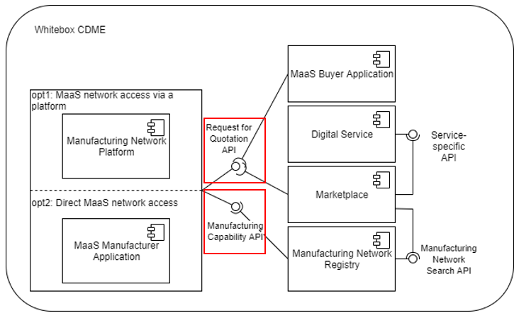

Manufacturing-as-a-Service (MaaS) scenarios focus on connecting buyers having a request for specific manufacturing process steps or products to be manufactured with the appropriate manufacturing supplier, who has the corresponding capabilities and resources. This connection depends on the capabilities that are offered on the supplier side and that are required on the buyer side.

The Manufacturing Capability API defines how to share the manufacturing capabilities, e.g. to onboard them to a Manufacturing Network Registry. Manufacturing Network Platforms and MaaS Manufacturer Application can use the Manufacturing Capability API to onboard their manufacturing capabilities in the Manufacturing Network Registry (see figure).

The Request for Quotation API defines detailed requirements, deadlines and evaluation criteria for obtaining quotations from potential manufacturers for specific products or services. The necessary capabilities can be derived from the defined RfQ, which can subsequently be used in the MaaS Manufacturer Application for feasibility analyses or calculations (see figure).

