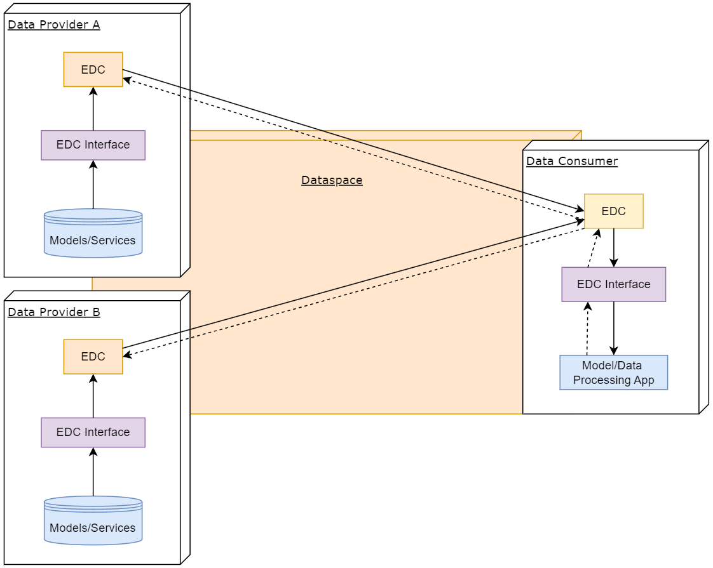
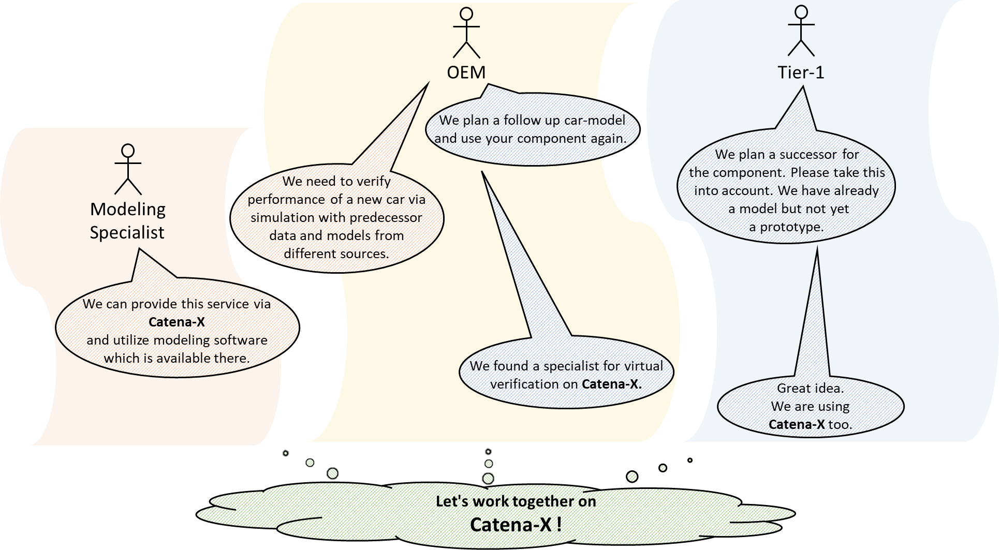
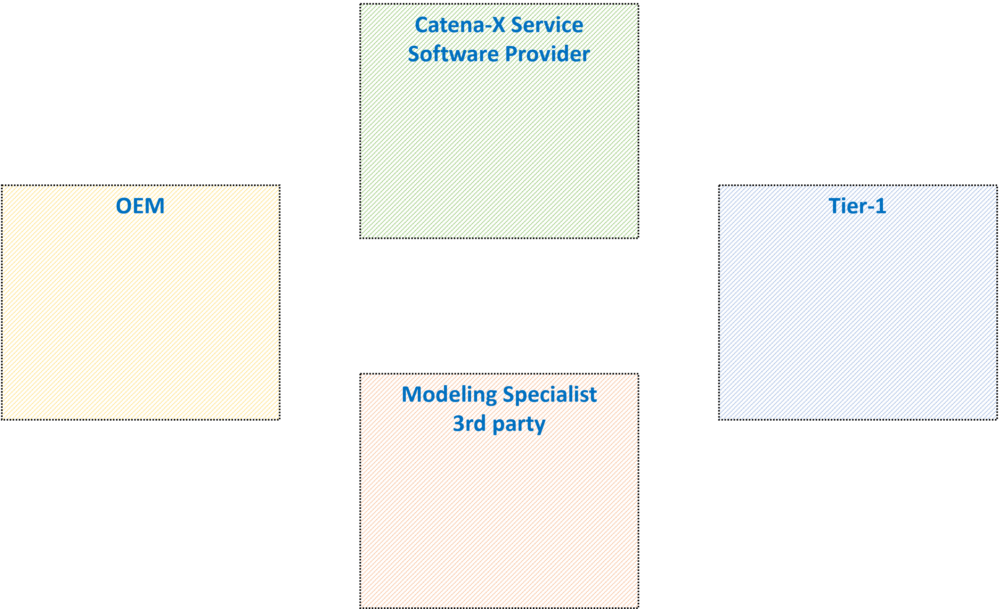
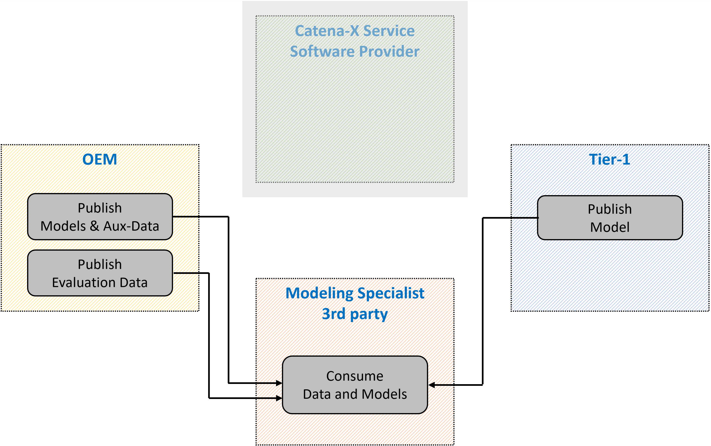
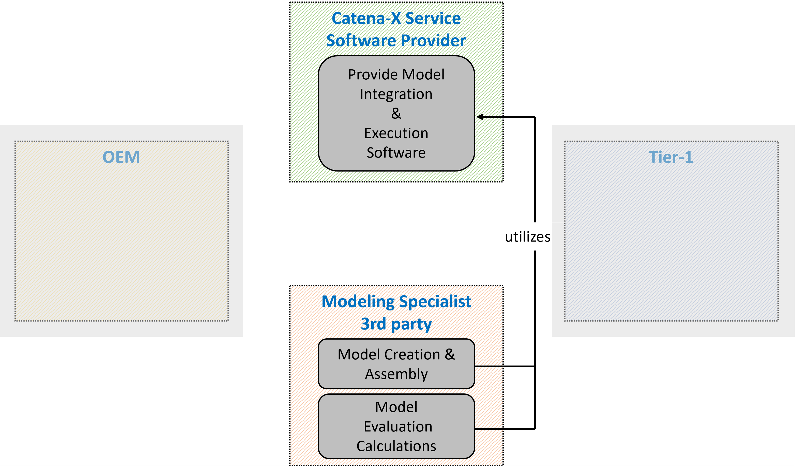
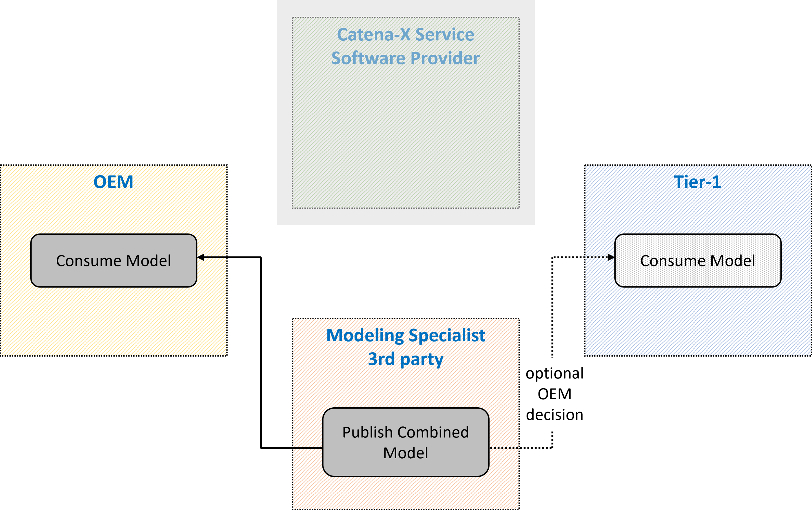
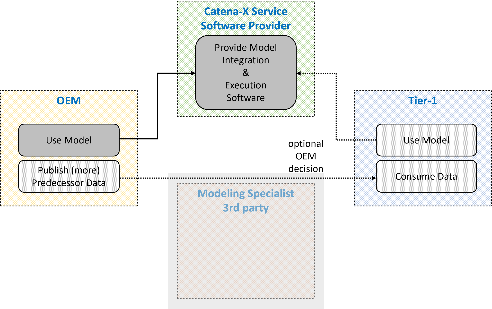

### Model Based Development and Data Processing Kit

## Vision & Mission

### Vision

Collaborative model based system development and massive engineering data analytics are both key to cope with challenges in the market of electric and autonomous vehicles.

The aim of the Model Based Development and Data Processing Kit (MDP) is to create a framework for the exchange and collaborative use of simulation models and data services across different players in the automotive industry.
The exchange of models allows the generation of physically precise overall models during the design phase without compromising the intellectual property of the model owner.
The exchange of data services (like scripts as well as simulation models) allows the post-processing of data in the operational phase.

### Mission

The Model Based Development and Data Processing Kit comes with the necessary Catena-X standard for model exchange. In addition, suggestions are given on how to create models that have a high-level of interoperability. These suggestions will be part of a new standard in the next version of the MDP Kit.
The Kit includes examples code on how to register your models and data services in Catena-X, how to assign metadata to them and how to use the metadata to retrieve what you need from the catalogue of a Catena-X partner. The solution is based on the existing Connector Kit (EDC).
Information on how to combine and connect simulation models to create an overall model are also provided as well as an example of how to combine services and models for enhanced post-processing of operational data.

### Customer Journey

With the *Model Based Development and Data Processing* Kit, we support the Catena-X customer journey for our adopters and solutions providers.

## Business Value

The Model Based Development and Data Processing Kit allows application software providers access to information:

- needed to build a Catena-X conform simulation model,
- to support simulation model integration,
- enable complex simulation studies,
- to support data processing exchange services,
- needed to combine basic data processing services to complex ones.

In addition, model and data processing providers can enter potential new markets in which simulation models are provided alongside the product and offer the possibility to build data processing services by combining basic services.

## Use Case

Use cases based on the MDP Kit are basically not limited to certain partners in the supply pyramid, however for a better understanding the following describes the collaboration based on the example between an OEM and a Tier-1.

- A Tier-1 shares a model of a component with an OEM. The OEM can perform a system simulation which includes both, its own components and the component from the Tier-1. Similarly, the OEM can use several models of components from several Tier-1s. Selected results from the integrated model can be sent from the OEM to the Tier-1s. (same with Tier-2 and Tier-1)
- An OEM shares a model and inputs for (virtually) testing of Tier-1s components under conditions of interests. The Tier-1 can build a system simulation with its own components and the models from the OEM and analyze the behaviour of the own component under the defined conditions. Selected results of the virtual test can be sent from the Tier-1 to the OEM. (same with Tier-1 and Tier-2)
- An OEM is starting the development of a follow-up vehicle model, including also new components from Tier-N suppliers. Virtual testing of new components in a new vehicle model will be realized based on real customer data from predecessor vehicles, which exists on OEM side and component digital twins (FMU) from Tier-N (if allowed by contract). The complex procedural integration of existing data and FMUs will be done by an engineering company, which then provides two result options:
  - virtual testing results
  - virtual testing workflow for OEM and Tier-N supplier

### Status Quo

Nowadays exchange of simulation models across company boundaries in the design phase is rare. Each player develops its components based on assumptions of how the partner components behave or builds approximate models of the partner components based on tables that describe their behaviour or other information from the producers.

Virtual testing of components (based on digital twins, e.g. FMUs) is already state of the art. However, the representativeness is often limited due to the availability of real customer data. In addition cross company testing procedures are also limited to interoperability and processing complexity boundaries.

### Today’s Challenge

Simulation models contain critical information about the intellectual properties of a company. This makes it difficult for companies to share their models with their suppliers or customers. In addition building simulation models compatible with those of suppliers or customers requires agreements on how the model should be built and the data format to use.

Provide representative (behavioural) digital twins of components or even vehicles. This includes on the one hand the digital twin as a virtual model, but also the behaviour and usage, i.e. the data which drives the model. The challenge is the combination of both while intellectual properties of all companies are kept protected.

### Benefits

The benefits for companies using models coming from suppliers or customers relies in the shortening of the development time. This is possible since the developed components are integrated with realistic models of the components they interact with or are (virtually) tested under realistic conditions. This setup provides the best scenarios for development and decreases the number of iterations needed to come to the final design.

In addition, the generation of simulation models based on the Catena-X standardization and the guidelines in this Kit considerably increases the compatibility of the models among different companies.

More realistic (in terms of representativeness) behavioural digital twins of vehicles and/or components can be provided. Data processing workflows are not limited by its complexity.

## Logic & Schema

### Building Block View

The architecture image describes the interaction between the model/data provider and the model/data consumer.

|Subsystem|Description|
|---------|-----------|
|Model/Data Processing App|This component is the App that is hosted at the Consumer and provides the framework to process the models (e.g. integrate and execute them) or the data (e.g. compose and execute workflows).|
|EDC interface| The EDC Interface is used for registering/retrieving assets using asset properties. Data Providers use metadata in the form of asset properties to classify their shared assets. Data Consumer filters the catalogue using the asset properties to retrieve the needed assets.|

### Catena-X Core Services

|Subsystem|Description|
|---------|-----------|
|Eclipse Dataspace Components (EDC)|The Connector of the Eclipse Dataspace Components provides a framework for sovereign, inter-organizational data exchange. It implements the International Data Spaces standard (IDS) as well as relevant protocols associated with GAIA-X. The connector is designed in an extensible way in order to support alternative protocols and integrate in various ecosystems.|

## Business Process

### Collaborative Model and Data Based System Development

A car manufacturer is starting the **development** of a follow-up car model.
Some parameters of the new car model are already fixed (mass, engine power) but no prototype yet exists.
A supplier is proposing to use the next generation of his component for the new car.
The manufacturer wants to make sure that the new component is performing well in the new vehicle.
So, a decision is made to use real **usage data** from the predecessor vehicle for the verification of the new component.
The usage of predecessor data is not straightforward and the car manufacturer decides to assign the task of setting up an appropriate process to a **modeling specialist**. The modeling specialist needs to **integrate** an **FMU** from the supplier to **simulate** the new **component** in the **process**. Finally, **both** the car manufacturer and the supplier want to be able to **execute** the **process** and do fine tuning on component parameters.

How can Catena-X help the parties to come to an efficient solution?

### The following sketches illustrate the Business Process

A maximum of 4 participants is involved in this scenario.
But instead of being 3rd party the Modeling Specialist could be alternatively:

- the OEM
- the Catena-X Service - Software Provider
- the Tier-1

The OEM publishes all required models and auxiliary information and some portion of predecessor data.
The Tier-1 publishes the model of his new component.
The Modeling specialist consumes all the information from the other parties.

The Modeling specialist creates processes to convert the predecessor data to virtual data of the new car-model.
He then combines and adapts the different models. Finally all together is evaluated.
All this is done utilizing the software provided by the Catena-X Service (a software providing service).

The Modeling Specialist publishes the combined model and the OEM consumes it.
Depending on the OEM’s instruction to the Modeling Specialist the Tier-1 may also consume the combined model or not.

By utilizing the Software provided via the Catena-X Service the OEM can evaluate all available predecessor data.
Optionally he publishes predecessor data so that the Tier-1 can evaluate too and improve his component's
performance with the new car-model.

### Access Policies

To decide which company has access to the data assets, access policies should be used. It is maybe possible to skip access policies, but this would make all data assets publicly available in the Catena-X network and is not recommended. Therefore, every asset should be protected and only be made available for specific companies, identified through their business partner number (BPN). This is possible using an existing extension for the EDC documented here. In the near future, other access policies will be introduced like a company role and attribute based policy.

### Usage Policies

Use case specific credentials exist and will be mandatory. Their documentation will be available after SSI release. A Behaviour Twin "Use Case Framework" which covers the business process of the app will be available after SSI release. This Framework document can be referenced in the usage policies, and therefore limit Data & Service access to Behaviour Twin participants.

<!-- !Mandatory! -->
<!-- ## Semantic Models & Standards -->
## Standards

Our relevant standard can be downloaded from the official [Catena-X Standard Library](https://catena-x.net/de/standard-library):

- [CX - 0102 Functional Mock-Up](https://catena-x.net/de/standard-library)

The Standard aims at using the existing FMI industry standard as a Catena-X standard.

The Functional Mock-up Interface (FMI) is a free standard that defines a container and an interface to exchange dynamic simulation models using a combination of XML files, binaries and C code, distributed as a ZIP file. It is supported by 170+ tools and maintained as a Modelica Association Project. The FMI implementation by a software modelling tool enables the creation of simulation models that can be interconnected. The file format of the FMI standard is called Functional Mock-up Unit (FMU)(source: [https://fmi-standard.org/](https://fmi-standard.org/)).

### Guidelines for Generating FMU

The FMU/FMI format allows a high degree of flexibility in generating an FMU model. On the one hand, this allows the format to be used for a large variety of use cases and of tools. On the other hand, interoperability between FMUs is not always guaranteed.

The list of guidelines below have the goal to guide the modeling expert in the creation of an FMU for the Model and Data Processing use cases.

### General Guideline

- generate a license-free FMU so that it can be imported in any software,
- generate a co-simulation FMU so that solver is included in the FMU and can be directly executed,
- assign units of measure to each port as far as physically meaningful. Depending on the software, the connection of two ports is only allowed if the unit of measure is the same or if the unit of measure is empty. The second case can lead to mismatching,
- embed all needed tables and files while creating the FMU,
- expose only numerical parameters to the user for changing.

### Guideline for Assigning Asset Properties to FMU and Services

To ensure an unity and to keep assets like FMU and/or services retrievable, a certain set of properties as FMU/service description is recommended.

The following list of potential properties along with some examples shall be seen as a guideline:

- Type (FMU, AMESIM model, Testlab process,...)
- Name/Title (NF_7B5_07.fmu, ...)
- Keywords (Leistungselektronik, ...)
- Description (...)
- Input data (Temperature of component XYZ,...)
- Output data (Pseudo damage of component XYZ,...)
- GenerationTool (Simulink 9.1, AMESIM,...)
- Producer/Publisher (ZF, Siemens,...)
- Version (1.4,...)
- Release date (2023-09-18,...)

Some properties could be selected from a pre-defined list (and not be free text) in order to ensure a certain standardization during asset registration.

It is recommended to use existing meta data models for the asset properties. The following list of meta data models provides a guideline:

- FMU Model Description (modelDescription.xml): Following a flat scheme, capable of providing the basic asset data. Supported by most of the FMU generation tools.
- Asset Administration Shell (AAS), Submodel "Provision of Simulation Models": Structured in many fields with deep hierarchies. Has been designed within the context of industrial applications and fits very well to usage in the automotive domain.
- Model Identity Card (MIC): Structured in many fields with deep hierarchies. Broader context than AAS, less focused on industrial applications/automotive industry.

Similarly to the FMU Model Description, for both AAS and MIC, it is recommended to use XML serialization for the FMU asset properties, since it is a simple format with easy access and usage. Furthermore, it is recommended to provide this XML file within the FMU package.

## NOTICE

This work is licensed under the [CC-BY-4.0](https://creativecommons.org/licenses/by/4.0/legalcode).

- SPDX-License-Identifier: CC-BY-4.0
- SPDX-FileCopyrightText: 2023,2023 Siemens AG
- SPDX-FileCopyrightText: 2023,2023 ZF Friedrichshafen AG
- SPDX-FileCopyrightText: 2023,2023 Bayerische Motoren Werke Aktiengesellschaft (BMW AG)
- SPDX-FileCopyrightText: 2023,2023 Contributors to the Eclipse Foundation
<!-- - Source URL: https://github.com/eclipse-tractusx/XXXXX -->
