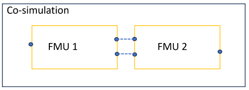
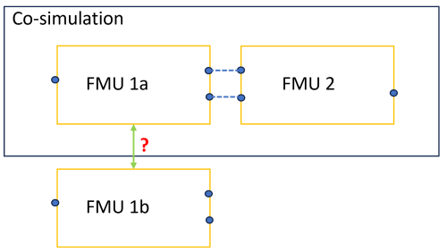

### Model Based Development and Data Processing Kit

The video included under Success Stories illustrates software application functionality realizing the MDP Use Cases based on practical implementation examples.

## Asset discovery

In the model and data processing use case, the users search for models and services (from now on called assets) in the Catena-X network and load them into a dedicated model and data processing application.

When a user connects to a partner EDC the catalogue will be displayed. The catalogue includes all assets that the user is allowed to see according to the associated policies.

In order to make assets discoverable by potential users, metadata should be associated to the assets at registration.

The code below shows an example on how to assign asset properties to my asset of type Asset and with ID equals 2.

The name of the asset properties should always start with “asset:”. The value of the property is interpreted as a string.

```json

"asset": {

        "@type": "Asset",

        "@id": "2",

        "properties": {

        "asset:prop:id": "2",

        "asset:prop:description": "FMU thermal model of powertrain ABXYZ",

        "asset:ToolVersion": "3.5"

        }

}

```

For retrieving an asset with a specific asset property the following filter expression should be used.

```json

"filterExpression": [

           {

                "operandLeft": "asset:ToolVersion",

                "operator": "=",

                "operandRight": "3.5"

            }

       ],

```

For having a broader search the “like” operator can be used coupled with the “%” symbol. In the example below, all assets with a description containing the word “powertrain” are returned.

```json

"filterExpression": [

            {

                "operandLeft": "asset:prop:description",

                "operator": "like",

                "operandRight": "%powertrain%"

            }

        ],

```

## Guideline for Implementing an FMU Interoperability Checker

Meta models for asset properties like AAS “Provision of Simulation Models” or MIC can be used to assess the interoperability of FMU. In the following, a guideline for implementing such an FMU Interoperability Checker is given.

### Use Cases

The FMU Interoperability Checker shall support the following two use cases.

- Use Case 1: Connection Use Case. Given two FMU, FMU1 and FMU2, the FMU Interoperability Checker shall check, based on the FMU asset properties, if the two FMU can be connected in a co-simulation as depicted in the following figure.



- Use Case 2: Replacement Use Case. Given a co-simulation of two FMU, FMU1a and FMU2, the FMU Interoperability Checker shall check based on the FMU asset properties, if FMU1a can be replaced by FMU1b as depicted in the following figure.



### Workflow

The FMU FMU Interoperability Checker shall implement the following workflow.

1. The Guideline “Guideline for Assigning Asset Properties to FMU and Services” (see above) has been provided to and accepted by the partners exchanging models .
2. The partners agree upon a meta data model for the FMU asset properties, preferably either MIC or AAS “Provision of Simulation Models”.
3. In the FMU Interoperability Checker, the user can select checking by using either of the following three options:
    - The FMI model description XML (default) for basic checks.
    - The AAS “Provision of Simulation Models” meta model.
    - The MIC meta model.

### Checks

The FMU Interoperability Checker shall implement three levels of checks with advancing complexity:

- Level 1: Visualization of the FMU asset properties.
- Level 2: Direct comparison of fields of the FMU asset properties.
- Level 3: Similarity checks of fields of the FMU asset properties.

In Level 1 “Visualization”, corresponding meta data fields of the different FMU shall be shown side by side such that a human reader is able to easily assess the interoperability by comparing the information provided in the different categories.

Level 2 “Direct Comparison” is suited for fields, where the content is not highly dependent on the provider of the meta data (no free text string fields). For instance, variable definitions (format type, causality, units, validity domains) are suited for such a check. Still, it is essential that these fields are provided using standards (which is neither the case in the FMU modelDescription.xml as often used today nor required by the specifications of AAS Submodel “Provision of Simulation Models” and MIC). For free text string fields that come with a basic choice of entries, Level 2 checks are possible as long as only entries from the basic choice are selected.

Level 3 “Similarity Check” is suited for fields, where the content can be extended by the user. Most of the fields falling into this category, are fields that can be used for model characterization, such as simulation purpose, type of model, etc. Often, the meta data models provide suggestions for field content (basic choice), but most of the fields are “open”, i.e., are in principle free text.

#### AAS “Provision of Simulation Models” meta model

*Open or closed FormChoices, means that the field can be extended by the user or not.

In the following table, all fields of the meta data model AAS “Provision of Simulation Models” are listed together with the proposed check level for an FMU Interoperability Checker integration. Container hierarchies do not have associated checks. All fields, that are not containers, are in principle suited for Level 1 “Visualization”.

| **FormTitle**| **FormChoices** | **FormChoices<br/>open or closed*** | **Level 1<br/>Visualization** | **Level 2<br/>Direct Comparison** | **Level 3<br/>Similarity Check** |
| --- | --- | --- | --- | --- | --- |
|Summary|||x|||
|SimPurpose||||||
|SimPurpose.<br/>PosSimPurpose|Concept evaluation;<br/>Sizing;<br/>Control design;<br/>Behaviour in fault condition;<br/>Validation and testing;<br/>Virtual commissioning;<br/>Condition monitoring;<br/>Predictive maintenance;<br/>Operator Training;<br/>Teaching|open|x|(x)|x|
|SimPurpose.<br/>NegSimPurpose|Concept evaluation;<br/>Sizing;<br/>Control design;<br/>Behaviour in fault condition;<br/>Validation and testing;<br/>Virtual commissioning;<br/>Condition monitoring;<br/>Predictive maintenance;<br/>Operator Training;<br/>Teaching|open|x|(x)|x|
|TypeOfModel|Linear model;<br/>Nonlinear model;<br/>Data-driven model;<br/>Lumped element model;<br/>Fixed causality model;<br/>Acausal model|open|x|(x)|x|
|ScopeOfModel|Logic and timing behaviour;<br/>Geometry;<br/>Kinematics;<br/>Dynamics;<br/>Distribution networks;<br/>Network communication;<br/>Visualization|open|x|(x)|x|
|LicenseModel|free;<br/>perpetual;<br/>subscription;<br/>volume-based|open|x|x|(x)|
|EngineeringDomain|Hydraulic Engineering;<br/>Electrical Engineering;<br/>Pneumatic Engineering;<br/>Mechanical Engineering;<br/>Material Flow;<br/>Robotics;<br/>Image Processing;<br/>Data Engineering;<br/>Process Engineering;<br/>Workflow Engineering;<br/>HMI Engineering;<br/>Control Engineering |open|x|(x)|x|
|Environment||||||
|Environment.<br/>OperatingSystem|||x|x||
|Environment.<br/>ToolEnvironment|||x|||
|Environment.<br/>DependencyEnvironment|||x|||
|Environment.<br/>VisualizationInformation|separately;<br/>integrated;<br/>none|closed|x|||
|Environment.<br/>SimulationTool||||||
|Environment.<br/>SimulationTool.<br/>SimToolName|||x|||
|Environment.<br/>SimulationTool.<br/>DependencySimTool|||x|||
|Environment.<br/>SimulationTool.<br/>Compiler|||x|||
|Environment.<br/>SimulationTool.<br/>SolverAndTolerances||||||
|Environment.<br/>SimulationTool.<br/>SolverAndTolerances.<br/>StepSizeControlNeeded|||x|||
|Environment.<br/>SimulationTool.<br/>SolverAndTolerances.<br/>FixedStepSize|||x|||
|Environment.<br/>SimulationTool.<br/>SolverAndTolerances.<br/>StiffSolverNeeded|||x|||
|Environment.<br/>SimulationTool.<br/>SolverAndTolerances.<br/>SolverIncluded|||x|x||
|Environment.<br/>SimulationTool.<br/>SolverAndTolerances.<br/>TestedToolSolverAlgorithm||||||
|Environment.<br/>SimulationTool.<br/>SolverAndTolerances.<br/>TestedToolSolverAlgorithm.<br/>SolverAlgorithm|||x|||
|Environment.<br/>SimulationTool.<br/>SolverAndTolerances.<br/>TestedToolSolverAlgorithm.<br/>ToolSolverFurtherDescription|||x|||
|Environment.<br/>SimulationTool.<br/>SolverAndTolerances.<br/>TestedToolSolverAlgorithm.<br/>Tolerance|||x|||
|RefSimDocumentation||||||
|ModelFile||||||
|ModelFile.<br/>ModelFileType|||x|x||
|ModelFile.<br/>ModelFileVersion||||||
|ModelFile.<br/>ModelFileVersion.<br/>ModelVersionId|||x|||
|ModelFile.<br/>ModelFileVersion.<br/>ModelPreviewImage||||||
|ModelFile.<br/>ModelFileVersion.<br/>DigitalFile||||||
|ModelFile.<br/>ModelFileVersion.<br/>ModelFileReleaseNotesTxt|||x|||
|ModelFile.<br/>ModelFileVersion.<br/>ModelFileReleaseNotesFile||||||
|ParamMethod|by using “technical data” of asset;<br/>by using “technical data” and user;<br/>by user interface;<br/>by setting file;<br/>not necessary;<br/>by documentation file;<br/>pre-parametrized|open|x|||
|ParamFile||||||
|InitStateMethod|not necessary;<br/>by user interface;<br/>by setting file;<br/>set states within simulation environment;<br/>integrated in model;<br/>by documentation file|open|x|||
|InitStateFile||||||
|DefaultSimTime|||x|||
|SimModManufacturingInformation||||||
|SimModManufacturingInformation.<br/>Company|||x|||
|SimModManufacturingInformation.<br/>Language|||x|||
|SimModManufacturingInformation.<br/>Email||||||
|SimModManufacturingInformation.<br/>Email.<br/>TypeOfEmailAddress|||x|||
|SimModManufacturingInformation.<br/>Email.<br/>EmailAddress|||x|||
|SimModManufacturingInformation.<br/>Email.<br/>TypeOfPublicKey|||x|||
|SimModManufacturingInformation.<br/>Email.<br/>PublicKey|||x|||
|SimModManufacturingInformation.<br/>Phone||||||
|SimModManufacturingInformation.<br/>Phone.<br/>TypeOfTelephone|||x|||
|SimModManufacturingInformation.<br/>Phone.<br/>TelephoneNumber||||||
|SimModManufacturingInformation.<br/>Phone.<br/>AvailableTime|||x|||
|Ports||||||
|Ports.<br/>PortsConnector||||||
|Ports.<br/>PortsConnector.<br/>PortsConnectorName|||x|||
|Ports.<br/>PortsConnector.<br/>PortsConDescription|||x|||
|Ports.<br/>PortsConnector.<br/>Variable||||||
|Ports.<br/>PortsConnector.<br/>Variable.<br/>VariableName|||x|x|(x)|
|Ports.<br/>PortsConnector.<br/>Variable.<br/>Range|||x|x||
|Ports.<br/>PortsConnector.<br/>Variable.<br/>VariableType|Real;<br/>Integer;<br/>Boolean;<br/>String;<br/>ENUM|open|x|x||
|Ports.<br/>PortsConnector.<br/>Variable.<br/>VariableDescription|||x||x|
|Ports.<br/>PortsConnector.<br/>Variable.<br/>UnitList|s;<br/>m;<br/>kg;<br/>N;<br/>m/s;<br/>m/s^2;<br/>V;<br/>A;<br/>K;<br/>none|open|x|x||
|Ports.<br/>PortsConnector.<br/>Variable.<br/>UnitDescription|||x|||
|Ports.<br/>PortsConnector.<br/>Variable.<br/>VariableCausality|input;<br/>output;<br/>acausal|closed|x|x||
|Ports.<br/>PortsConnector.<br/>Variable.<br/>VariablePrefix|Flow;<br/>Stream|closed<br/>(only for acausal variables)|x|x||
|Ports.<br/>BinaryConnector||||||
|Ports.<br/>BinaryConnector.<br/>BinaryConName|||x|||
|Ports.<br/>BinaryConnector.<br/>BinaryConDescription|||x|||

#### MIC meta model

*Open or closed FormChoices, means that the field can be extended by the user or not.

In the following table, all fields of the meta data model MIC are listed together with the proposed check level for an FMU Interoperability Checker integration. Container hierarchies do not have associated checks. All fields, that are not containers, are in principle suited for Level 1 “Visualization”.

| **Field**| **(Basic) Choices** | **Choices<br/>open or closed*** | **Level 1<br/>Visualization** | **Level 2<br/>Direct Comparison** | **Level 3<br/>Similarity Check** |
| --- | --- | --- | --- | --- | --- |
|general-information||||||
|general-information.name|||x|||
|general-information.description|||x|||
|general-information.owner|||x|||
|general-information.life-cycle-state|||x|||
|general-information.version|||x|||
|general-information.version-date|||x|||
|general-information.confidentiality|||x|x|(x)|
|general-information.license|||x|x|(x)|
|integration||||||
|integration.software||||||
|integration.software.language||||||
|integration.software.language.language-name|||x|||
|integration.software.language.language-version|||x|||
|integration.software.file-format||||||
|integration.software.file-format.file-format-name|||x|x||
|integration.software.file-format.file-format-version|||x|x||
|integration.software.required-simulation-tool||||||
|integration.software.required-simulation-tool.tool-name|||x|||
|integration.software.required-simulation-tool.tool-version|||x|||
|integration.software.required-simulation-tool.alternative-tool||||||
|integration.software.required-compiler||||||
|integration.software.required-compiler.compiler-name|||x|||
|integration.software.required-compiler.compiler-version|||x|||
|integration.software.required-compiler.alternative-compiler||||||
|integration.software.required-operating-system||||||
|integration.software.required-operating-system.operating-system-name|||x|x||
|integration.software.required-operating-system.operating-system-version|||x|x||
|integration.software.required-operating-system.alternative-operating-system||||||
|integration.software.other-software-requirement||||||
|integration.software.other-software-requirement.software-requirement|||x|||
|integration.software.other-software-requirement.alternative-software-requirement||||||
|integration.reference-hardware-and-performance||||||
|integration.reference-hardware-and-performance.name-of-the-refernce-hardware|||x|||
|integration.reference-hardware-and-performance.time-factor|||x|||
|integration.reference-hardware-and-performance.characteristics-ofthe-reference-hardware||||||
|integration.reference-hardware-and-performance.characteristics-ofthe-reference-hardware.CPU|||x|||
|integration.reference-hardware-and-performance.characteristics-ofthe-reference-hardware.RAM|||x|||
|integration.reference-hardware-and-performance.characteristics-ofthe-reference-hardware.data-storage|||x|||
|integration.reference-hardware-and-performance.characteristics-ofthe-reference-hardware.other-hardware-characteristics|||x|||
|content-and-computation||||||
|content-and-computation.modelling-choice||||||
|content-and-computation.modelling-choice.explicative-text|||x||x|
|content-and-computation.modelling-choice.formalization||||||
|content-and-computation.modelling-choice.formalization.modelling-field|“Solid mechanics”,<br/>“Mechanics of materials”,<br/>“Fluid mechanics”,<br/>“Acoustics and vibrations”,<br/>“Electromagnetics”,<br/>“Thermal”,<br/>“Chemistry”,<br/>“Optics”,<br/>“Biology”,<br/>“Sociology”<br/>|open|x|(x)|x|
|content-and-computation.modelling-choice.formalization.type-of-choice|“model”,<br/>“neglect”| closed|x|x||
|content-and-computation.modelling-choice.formalization.time-scale|||x||x|
|content-and-computation.behavior||||||
|content-and-computation.behavior.behavior-specification|||x||x|
|content-and-computation.behavior.model-type|“Discrete”,<br/>“Continuous”,<br/>“Deterministic”,<br/>“Stochastic”,<br/>“Static”,<br/>“Dynamic”,<br/>“Causal”,<br/>“Acausal”,<br/>“Bond graph”,<br/>“Block diagram”,<br/>“Transfer function”,<br/>“State Machine diagram”,<br/>“Neural network”,<br/>“Empirical data” |open|x|(x)|x|
|content-and-computation.default-solver||||||
|content-and-computation.default-solver.solver-name|||x|||
|content-and-computation.default-solver.step-size|||x|||
|content-and-computation.default-solver.embedded| “Yes”,<br/>“No”| closed|x|x||
|ports-internal-variables-and-parameters||||||
|ports-internal-variables-and-parameters.ports||||||
|ports-internal-variables-and-parameters.ports.variable||||||
|ports-internal-variables-and-parameters.ports.variable.name|||x|x|(x)|
|ports-internal-variables-and-parameters.ports.variable.description|||x||x|
|ports-internal-variables-and-parameters.ports.variable.type|Not provided by specification but using a standard should be agreed.||x|x||
|ports-internal-variables-and-parameters.ports.variable.unit|Not provided by specification but using a standard should be agreed.||x|x||
|ports-internal-variables-and-parameters.ports.variable.default-value|||x|||
|ports-internal-variables-and-parameters.ports.variable.in-out|“In”,<br/>“Out”|closed|x|x||
|ports-internal-variables-and-parameters.ports.variable.validity-domain|Not provided by specification but using a standard should be agreed. For outputs, this field should be used in the sense of a result range.||x|x||
|ports-internal-variables-and-parameters.ports.port||||||
|ports-internal-variables-and-parameters.ports.port.name||||||
|ports-internal-variables-and-parameters.ports.port.description||||||
|ports-internal-variables-and-parameters.ports.port.port||||||
|ports-internal-variables-and-parameters.internal-variables||||||
|ports-internal-variables-and-parameters.internal-variables.internal-variable||||||
|ports-internal-variables-and-parameters.internal-variables.internal-variable.name|||x|||
|ports-internal-variables-and-parameters.internal-variables.internal-variable.description||||||
|ports-internal-variables-and-parameters.internal-variables.internal-variable.type|||x|||
|ports-internal-variables-and-parameters.internal-variables.internal-variable.unit|||x|||
|ports-internal-variables-and-parameters.internal-variables.internal-variable.default-value|||x|||
|ports-internal-variables-and-parameters.internal-variables.internal-variable.validity-domain|||x|||
|ports-internal-variables-and-parameters.internal-variables.group-of-internal-variables||||||
|ports-internal-variables-and-parameters.internal-variables.group-of-internal-variables.name||||||
|ports-internal-variables-and-parameters.internal-variables.group-of-internal-variables.description||||||
|ports-internal-variables-and-parameters.internal-variables.group-of-internal-variables.group-of-internal-variables||||||
|ports-internal-variables-and-parameters.parameters||||||
|ports-internal-variables-and-parameters.parameters.parameter||||||
|ports-internal-variables-and-parameters.parameters.parameter.name|||x|||
|ports-internal-variables-and-parameters.parameters.parameter.description|||x|||
|ports-internal-variables-and-parameters.parameters.parameter.type|||x|||
|ports-internal-variables-and-parameters.parameters.parameter.unit|||x|||
|ports-internal-variables-and-parameters.parameters.parameter.default-value|||x|||
|ports-internal-variables-and-parameters.parameters.parameter.validity-domain|||x|||
|ports-internal-variables-and-parameters.parameters.group-of-parameters||||||
|ports-internal-variables-and-parameters.parameters.group-of-parameters.name||||||
|ports-internal-variables-and-parameters.parameters.group-of-parameters.description||||||
|ports-internal-variables-and-parameters.parameters.group-of-parameters.group-of-parameters||||||
|verification-and-validation||||||
|verification-and-validation.test||||||
|verification-and-validation.test.method|||x|||
|verification-and-validation.test.documentation|||x|||
|verification-and-validation.metric||||||
|verification-and-validation.metric.name|||x|||
|verification-and-validation.metric.score|||x|||

## NOTICE

This work is licensed under the [CC-BY-4.0](https://creativecommons.org/licenses/by/4.0/legalcode).
