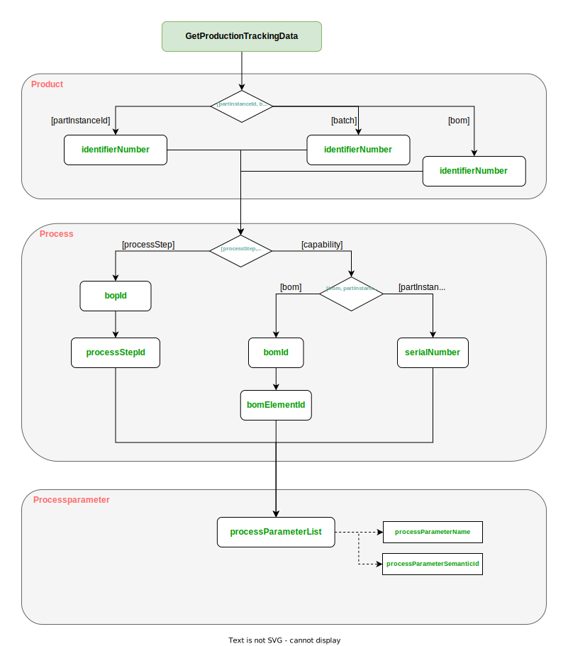

The following examples show the payload used for exchange. All examples are based on a simple product,
a box with a lid, that are screwed together with 3 screws.


## Bill of Process

Since the Bill of Process aspect is a shared model, it does not include a Catena-X header and thus, can not be exchange between partners individually.
Instead, it has to be included into other model, such as the Request for Quotation model.

```json
{
    "billOfProcessModel" : {
        "billOfProcessIdentification" : "box-with-lid-12345678-bill-of-process",
        "version" : "1.1.0",
        "productName" : "Box with Lid",
        "productVersion" : "box-with-lid-1.0.0",
        "process" : [
        {
            "processStepIdentifier" : [ "001_3D-print-parts" ],
            "processStepType" : "IsFirstElement",
            "capabilityId" : "urn:manufacturing-capability:capability:3d-printing",
            "precedenceRelation" : [ {
                "precedenceElements" : [ {
                    "successor" : [
                                    "Fuegen.Anpressen_Einpressen.Schrauben.Deckelverschrauben_01",
                                    "Fuegen.Anpressen_Einpressen.Schrauben.Deckelverschrauben_02",
                                    "Fuegen.Anpressen_Einpressen.Schrauben.Deckelverschrauben_03"
                                  ]
                } ]
            } ]
        },
        {
            "processStepIdentifier" : [ "Fuegen.Anpressen_Einpressen.Schrauben.Deckelverschrauben_01" ],
            "processStepType" : "IsLastElement",
            "capabilityId" : "Fuegen.Anpressen_Einpressen.Schrauben.Deckelverschrauben",
            "inputParameters" : [ {
                "name" : "Drehmoment_Max",
                "parameterKey" : "HasValue",
                "semanticReference" : [ "0173-1#02-ABK233#001" ],
                "value" : "10"
            } ],
            "outputParameters" : [ {
                "name": "Drehmoment_Max",
                    "parameterKey": "HasNoValue",
                    "semanticReference": [ "0173-1#02-ABK233#001" ]
            } ]
        },
        {
            "processStepIdentifier" : [ "Fuegen.Anpressen_Einpressen.Schrauben.Deckelverschrauben_02" ],
            "processStepType" : "IsLastElement",
            "capabilityId" : "Fuegen.Anpressen_Einpressen.Schrauben.Deckelverschrauben",
            "inputParameters" : [ {
                "name" : "Drehmoment_Max",
                "parameterKey" : "HasValue",
                "semanticReference" : [ "0173-1#02-ABK233#001" ],
                "value" : "10"
            } ],
            "outputParameters" : [ {
                "name": "Drehmoment_Max",
                    "parameterKey": "HasNoValue",
                    "semanticReference": [ "0173-1#02-ABK233#001" ]
            } ]
        },
        {
            "processStepIdentifier" : [ "Fuegen.Anpressen_Einpressen.Schrauben.Deckelverschrauben_03" ],
            "processStepType" : "IsLastElement",
            "capabilityId" : "Fuegen.Anpressen_Einpressen.Schrauben.Deckelverschrauben",
            "inputParameters" : [ {
                "name" : "Drehmoment_Max",
                "parameterKey" : "HasValue",
                "semanticReference" : [ "0173-1#02-ABK233#001" ],
                "value" : "10"
            } ],
            "outputParameters" : [ {
                "name": "Drehmoment_Max",
                "parameterKey": "HasNoValue",
                "semanticReference": [ "0173-1#02-ABK233#001" ]
            } ]
        }]
    }
}
```

## Production Forecast

### GetProductionForecast

```json
{
  "header": {
    "senderBpn": "BPNL1234567890SE",
    "expectedResponseBy": "2023-07-01T21:24:00+07:00",
    "context": "urn:samm:io.catenax.shopfloor_information.get_production_forecast:2.0.0",
    "messageId": "00000000-0000-0000-C000-000000000042",
    "recipientBpn": "BPNL7588787849VT",
    "sentDateTime": "2023-06-18T21:24:00+07:00",
    "version": "2.0.0"
  },
  "request": {
    "precisionOfForecast": {
      "timeUnit": "day",
      "value": 1
    },
    "offset": {
      "timeUnit": "day",
      "value": 0
    },
    "orderId": "box-with-lid-order-1234",
    "customerId": "BPNL7588787849VQ",
    "productionForecastForAll": true,
    "version": "2.0.0",
    "communicationMode": "notification"
  }
}
```

### ProvideProductionForecast

```json
{
  "header" : {
    "senderBpn" : "BPNL7588787849VT",
    "relatedMessageId" : "00000000-0000-0000-C000-000000000042",
    "expectedResponseBy" : "2023-07-02T21:24:00+07:00",
    "context" : "urn:samm:io.catenax.shopfloor_information.provide_production_forecast:2.0.0",
    "messageId" : "3b4edc05-e214-47a1-b0c2-1d831cdd9ba9",
    "receiverBpn" : "BPNL1234567890SE",
    "sentDateTime" : "2023-06-19T21:24:00+07:00",
    "version" : "2.0.0"
  },
  "productionForecastResponse" : {
    "listOfForecastItems" : [ {
      "returnCode" : "ok",
      "precisionOfForecast" : {
        "value" : 12,
        "timeUnit" : "unit:secondUnitOfTime"
      },
      "reasonsForDelay" : "supplyProblems",
      "positionId" : "box-12345678",
      "productionStatus" : "itemReceived",
      "productionForecast" : "2023-08-19T21:24:00+07:00",
      "forecastDate" : "2023-06-19T21:24:00+07:00"
    } ],
    "version" : "2.0.0",
    "communicationMode" : "notification",
    "iterationNumber" : 2
  }
}
```

## Production Tracking

### GetProductionTracking

Since the GetProductionTracking data model contains different possibilities to identify a product for which the
Production Tracking service is applied, two different request are provided, the first is based on a partInstanceId
and the second is based on a bill of process. However, since the model incorporates multiple optional fields that become mandatory for certain
requests, the following figure depicts the different cases and outlines the fields that become mandatory for each of the cases.



#### PartInstanceId based Request

```json
{
    "header": {
      "senderBpn": "BPNL1234567890SE",
      "expectedResponseBy": "2023-06-19T21:24:00+07:00",
      "context": "urn:samm:io.catenax.shopfloor_information.get_production_tracking:1.0.0",
      "messageId": "3b4edc05-e214-47a1-b0c2-1d831cdd9ba9",
      "receiverBpn": "BPNL7588787849VT",
      "sentDateTime": "2023-06-19T21:24:00+07:00",
      "version": "2.0.0"
    },
    "request": {
      "identifierNumber": "box-12345678",
      "stepIdentifierList": [
          {
            "processParameterList": [
                {
                  "processParameterSemanticId": "0173-1#02-ABK233#001",
                  "processParameterName": "Drehmoment_Max"
                }
            ],
            "capabilityId": "Fuegen.Anpressen_Einpressen.Schrauben.Deckelverschrauben",
            "partInstanceLevel": "partInstanceId",
            "partInstanceId": "Deckel-Serial-123"
          }
      ],
      "customerId": "550e8400-e29b-41d4-a716-446655440000",
      "identifierType": "partInstanceId",
      "version": "1.0.0",
      "processReferenceType": "capability"
    }
}
```

#### Bill of Process based Request

```json
{
    "header": {
      "senderBpn": "BPNL1234567890SE",
      "expectedResponseBy": "2023-06-19T21:24:00+07:00",
      "context": "urn:samm:io.catenax.shopfloor_information.get_production_tracking:1.0.0",
      "messageId": "3b4edc05-e214-47a1-b0c2-1d831cdd9ba9",
      "receiverBpn": "BPNL7588787849VT",
      "sentDateTime": "2023-06-19T21:24:00+07:00",
      "version": "2.0.0"
    },
    "request": {
      "identifierNumber": "box-12345678",
      "stepIdentifierList": [
          {
            "processStepId": "Fuegen.Anpressen_Einpressen.Schrauben.Deckelverschrauben_01",
            "processParameterList": [
                {
                  "processParameterSemanticId": "0173-1#02-ABK233#001",
                  "processParameterName": "Drehmoment_Max"
                }
            ]
          }
      ],
      "customerId": "550e8400-e29b-41d4-a716-446655440000",
      "identifierType": "partInstanceId",
      "billOfProcessId": "box-with-lid-12345678-bill-of-process",
      "version": "1.0.0",
      "processReferenceType": "processStep"
    }
}
```

### ProvideProductionTracking

Since the Bill of Process based Request enables a requester to receive the production tracking for a certain process step and the
partInstanceId based request only allows to request all process steps that execute a specified capability, the instance of the ProvideProductionForecast
data model contains different items in the processStepIdentifierList. The shown example contains the response for the partInstanceId based request. the response
for the Bill of Process based request is quite similar, however, the processStepIdentifierList contains only a single item, namely the item with the
processStepId Fuegen.Anpressen_Einpressen.Schrauben.Deckelverschrauben_01.

```json
{
    "header": {
      "senderBpn": "BPNL7588787849VT",
      "relatedMessageId": "3b4edc05-e214-47a1-b0c2-1d831cdd9ba9",
      "expectedResponseBy": "2023-06-19T21:24:00+07:00",
      "context": "urn:samm:io.catenax.shopfloor_information.provide_production_tracking:1.0.0",
      "messageId": "3b4edc05-e214-47a1-b0c2-1d831cdd9111",
      "receiverBpn": "BPNL1234567890SE",
      "sentDateTime": "2023-06-20T21:24:00+07:00",
      "version": "2.0.0"
    },
    "response": {
      "identifierNumber": "box-12345678",
      "identifierType": "partInstanceId",
      "version": "1.0.0",
      "processStepIdentifierList": [
          {
            "processStepId": "Fuegen.Anpressen_Einpressen.Schrauben.Deckelverschrauben_01",
            "processParameterValueList": [
                {
                  "processParameterName": "Drehmoment_Max",
                  "semanticId": "0173-1#02-ABK233#001",
                  "processParameterQuality": "ok",
                  "processParameterValue": "10"
                }
            ]
          },
          {
            "processStepId": "Fuegen.Anpressen_Einpressen.Schrauben.Deckelverschrauben_02",
            "processParameterValueList": [
                {
                  "processParameterName": "Drehmoment_Max",
                  "semanticId": "0173-1#02-ABK233#001",
                  "processParameterQuality": "ok",
                  "processParameterValue": "10"
                }
            ]
          },
          {
            "processStepId": "Fuegen.Anpressen_Einpressen.Schrauben.Deckelverschrauben_03",
            "processParameterValueList": [
                {
                  "processParameterName": "Drehmoment_Max",
                  "semanticId": "0173-1#02-ABK233#001",
                  "processParameterQuality": "ok",
                  "processParameterValue": "10"
                }
            ]
          }
      ]
    }
}
```
