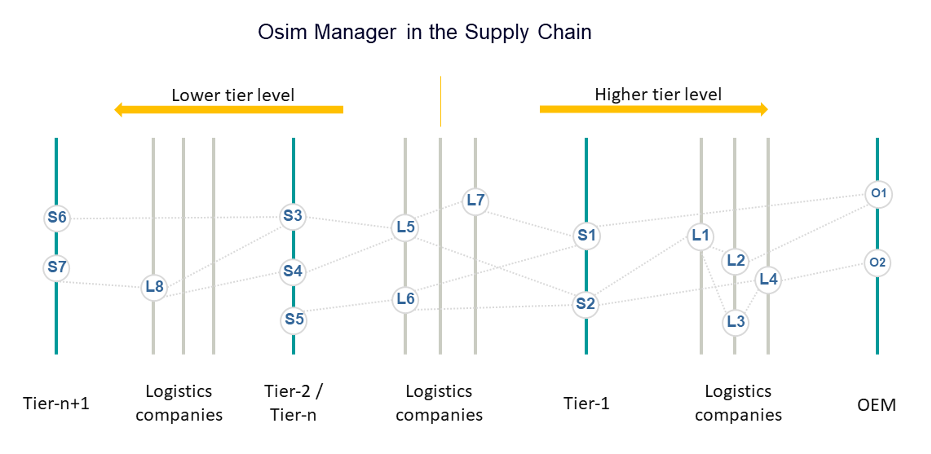

### OSim Kit

## Vision & Mission

<!--VISION of the Kit-->

**Gain increased supply chain transparency through collaborative simulation across all stakeholders**.

**Combine simulations of plants internally with simulations of external logistics over multiple tiers**.

Online control and simulation aims at linking production simulation with logistics simulation in order to identify delivery problems earlier, to operate with potentially changed situations in production and to react in response to changing customer requirements or external disturbances/events.
The online control and simulation (OSim) Kit defines the mechanisms and services needed to enable every Catena-X partner (producer as well as logisticians) to exchange simulation results in an open, interoperable and Catena-X compliant way.
An open architecture for integrating partners of all kinds together with standardized interfaces and semantics models are the fundamental basis of the OSim Kit.

**Integrate any supply chain partner**.

Even partners that do not use any simulation tool can contribute to the overall transparency through the well-defined information requirements.

**Integrate any simulation tool**.

Thanks to open architecture OSim is independent of the simulation tools that partners use.

## Business Value

Conventional planning and simulation tools use material flow simulations only on the plant level but they don't exchange simulation results with their respective partners in the supply chain. OSim goes beyond this by enabling every Catena-X partner (producers as well as logisticians) to integrate material flow simulation results of their partners into the simulation of their own processes. This is achieved by sharing the material flow simulation results on supply chain level.

The simulation results of the Catena-X partners on the supply chain's lower tier level and logistics, together with data of the company's own operations are fed into a simulation model as input. Considering both, plannable and unpredictable influencing factors, this simulation model is iterated as often as necessary until an optimal result has been found. Sharing of simulation results to the next tier level is the core capability of the collaborative simulation approach.
One specific case of this data exchange is so called “What-If” scenario. This capability provides validation respectively calibration of potentially changed manufacturing or transportation situations across the entire supply chain.

A central application takes over the tasks of monitoring and controlling the transmission of the simulation results, regardless of the level of digitalization of the partners. In addition, this application takes over control of the simulation tools used.


### Benefits for OEM, SME and Solution Provider

- Collaborative simulation over the supply chain (Basic flow)
- “What-If” triggered scenarios (Scenario flow)
- Early reaction to delivery problems
- Early response to changes in customer requirements
- Early consideration of external disturbances/events on the process
- Validation of potential changes in advance of implementation

## Business Process

The simulation results of the Catena-X partners on the lower tier level and logistics, together with data of the company's own operations are fed into the individual simulation model as input. Considering both, plannable and unforeseeable influencing factors, this simulation model is iterated through as often as necessary until an optimal production schedule is reached and a simulation result is created. Sharing of simulation results to the next tier level is the base of the collaborative simulation approach in a short-term horizon, across the complete supply chain.

This basic data exchange is based on a real production state and current planning. Additionally, a further functionality allows to operate with potentially changed situations in production or changed requirements. So called "What-If" scenarios" can be initiated and communicated to the supply chain partners confirming the feasibility.

The following picture shows the fundamental network structure, consisting of suppliers, logisticians and OEMs who exchange simulation results with each other, considering the one-up and one-down principles. Every material flow simulation result includes information about delivery readiness of packaged material goods, like material identifier, amount, delivery time and destination.



See also the following publications for more detailed description of the process and its components:

- [Catena-X – Online Steuerung und Simulation](https://www.degruyter.com/document/doi/10.1515/zwf-2023-1031/html) (Publication by De Gruyter 18. April 2023)
- [Kollaborative Materialflusssimulationen zur Steuerung der Verknüpfung von Supply Chain und Shopfloor – Ein Catena-X Use-Case](https://elibrary.vdi-verlag.de/10.51202/9783181024195/automation-2023?page=1) (Publication in the VDI-Report „Automation 2023“ by VDI Wissensforum GmbH Hrsg., see pages 73-88)

## Semantic Model

### Materialflow Simulation Result (MaterialFlowSimulationResult)

The Semantic Model MaterialFlowSimulationResult summarizes simulation results of the individual partners and is used for data exchange along the supply chain.

The _MaterialFlowSimulationResult_ object will be sent by OSim partner to another OSim partner on a higher tier level. OSim partner can be a producing company as well as a logistics company.

Every _MaterialFlowSimulationResult_ includes information about delivery readiness of packaged material goods, like material identifier, amount, delivery time and destination.

#### Structure of the Materialflow Simulation Result

The MaterialFlowSimulationResult semantic model contains 4 hierarchical entities:

- MaterialFlowSimulationResult
- Shipment
- HandlingUnit
- MaterialBatch

One _MaterialFlowSimulationResult_ refers to one or more Shipments.

**Shipment** describes a delivery approach with information about source, destination and delivery time. One Shipment refers to one or more HandlingUnits.

**HandlingUnit** describes the smallest shipment unit. One HandlingUnit refers to one or more MaterialBatches. The parameter Amount allows to define how many absolute identical (size and content) HandlingUnits are included in the shipment.

**MaterialBatch** describes the material and the quantity which the handling unit contains.

#### Aspect Model

Github Link to semantic data model: [https://github.com/eclipse-tractusx/sldt-semantic-models/tree/main/io.catenax.material_flow_simulation_result/3.0.0](https://github.com/eclipse-tractusx/sldt-semantic-models/tree/main/io.catenax.material_flow_simulation_result/3.0.0)

### Materialflow Scenario Request (MaterialFlowScenarioRequest)

The Semantic Model _MaterialFlowScenarioRequest_ includes scenario related information of the individual partners and is used for data exchange along the supply chain in regard to “What-If” scenarios.

The _MaterialFlowScenarioRequest_ object will be sent by OSim partner to another OSim partner (possible in both directions: up and down). OSim partner can be a producing company as well as a logistics company.

Every _MaterialFlowScenarioRequest_ includes information about the scenario description, scenario parameters (optional) and two simulation results analogues to the MaterialFlowSimulationResult (one with the unchanged and another one with the changed situation, allowing verification of scenario impact through comparison).

#### Structure of the Materialflow Scenario Request

The _MaterialFlowScenarioRequest_ semantic model contains 4 entities:

- Scenario Header
- Scenario Parameters (optional)
- Scenario Simulation Results Initial (optional)
- Scenario Simulation Results Updated (optional)

**Scenario Header** entity describes the scenario in general.

**Scenario Parameters** entity includes the delivery related parameters, if relevant.

**Scenario Simulation Results Initial** is a reference to the aspect model MaterialFlowSimulationResult and includes the simulation result of the unchanged situation.

**Scenario Simulation Results Updated** is a reference to the aspect model MaterialFlowSimulationResult and includes the simulation result of the scenario related change.

#### Aspect Model

Github Link to semantic data model: [https://github.com/eclipse-tractusx/sldt-semantic-models/blob/main/io.catenax.material_flow_scenario_request/2.0.0](https://github.com/eclipse-tractusx/sldt-semantic-models/blob/main/io.catenax.material_flow_scenario_request/2.0.0)

## Logic & Schema

### Architecture

#### Introduction

The OSim approach is based on a distributed simulation in which each participant simulates its role and additionally exchanges information with its suppliers and customers online via standardized interfaces. In the process, a strict 1-up / 1-down principle (i.e. data is only exchanged with the immediate predecessors and successors in the supply chain) guarantees compliance with antitrust regulations. The data exchange itself is carried out according to Gaia-X principles, which guarantee the data sovereignty of all partners involved.

All partners involved in the supply chain simulate their respective actions (production or logistical deliveries) on the basis of the latest information from the shop floor and its internal systems. They then pass this on to the successors in the supply chain according to the 1-up principle, where a new simulation is carried out on the basis of this possibly changed information. In OSim, a "horizontal" exchange of information across the supply chain is thus combined with a "vertical" exchange with the simulation tools and thus indirectly with the shop floor.

#### Components

The OSim solution is built of different components mixed by CATENA-X central services and specific OSim components. The main OSim-specific application is the OSim Manager, followed by Simulation tools for logistics and production.

The OSim Manager is a software application that exchanges all the information necessary for a local understanding of the supply chain with the partners and simulation tools, collects it and prepares it for the user.

The simulation tools are responsible for the processing of material flow simulations in both, production plants and logistics.

The following central services are needed for the communication along the supply chain:

- Business Partner Number (BPN) Registry = Management of business partner legal entities, sites and addresses used to identify the partners and their BPN-IDs for communication
- Identity and Access Management (IAM) = IdP used to login against Catena-X services
- Self Sovereign Identity (SSI) = Central service hosting the EDCs certificates (public keys). Used for mutual authentication between different EDC instances
- Discovery Service (DS) = as a central registry used to store/lookup the EDC endpoints for OSim requests/sending.
- Eclipse Data Connector (EDC) = Handling contract negotiation and initiates data transfer. The Eclipse Data Connector (EDC) interface enables data exchange between the OSim managers of the participating partners.

### Architecture and Dataflow


### Technical requirements for a CATENA-X compliant data transmission

The following appropriate configurations must be made in advance of the data exchange:

1. In the BPN registry, all partner instances (production sites) participating in the OSim use case must be listed with their respective site identification and address. The BPN IDs of the production sites (BPNS) are used for registration in the DS.
2. In the IAM, each OSim participating partner must apply for a "technical user", which is used for process communication with the central services.
3. Registration of OSim endpoints takes place in the Discovery Service.
4. The certificates required for SSI are issued on request.

At runtime the OSim Manager application must know the partner BPN-ID of the communication partner. With this BPN-ID, a look-up command is issued on the Discovery Service. The result is the endpoint link that the EDC connector needs to establish the connection.

## Policies

### Access Policies

To enable data sovereignty, access and usage policies are important to protect the data assets of a data provider in the EDC, described in the following. Further details are described in the [CX - 0018 Sovereign Data Exchange standard](https://catena-x.net/fileadmin/user_upload/Standard-Bibliothek/Update_PDF_Maerz/3_Sovereign_Data_Exchange/CX_-_0018_EDC_PlatformCapabilitySovereignDataExchange_v_1.0.1.pdf).

To decide which company has access to the data assets, access policy should be used. Note that without protecting data assets with access policies, they become publicly available in the Catena-X network which is not recommended. Therefore, every asset should be protected and only be made available for specific companies, identified through their business partner number (BPN).

#### BPN Access Policy

This policy allows limiting access to a data offer based on a list of specific BPNs. This translates to the following functionality:

- The data offer creator will be able to create a policy listing all the BPN that can access the data offer
- This means that only the connectors registered in the Catena-X network with the BPN listed in the policy can see the data offer and accept it (for the creation of data contracts and subsequent data exchange)

Examples including a JSON payload for single and multiple BPN are described on this page [in the Tractus-X EDC repository](https://github.com/eclipse-tractusx/tractusx-edc/tree/main/edc-extensions/bpn-validation) or in the [Business Partner Validation Extension part of the Connector Kit](https://eclipse-tractusx.github.io/docs-kits/kits/tractusx-edc/edc-extensions/business-partner-validation/).

### Usage Policies

To decide which company can use the data asset under specific conditions, usage policies (or contract policies) are used. Therefore, they are more specific than access policies and only used just after access is granted. Currently, the usage policies aren't technically enforced but based on a legal framework (keep this in mind when publishing data assets).
Policies are defined based on the W3C ODRL format. This allows a standardized way of formulating policy payloads. It further allows to stack different constraints with the odrl:and operator. Therefore, every data provider can decide on his or her own under which conditions their data assets are shared in the network. It is recommended to restrict the data usage for all traceability aspects. An example of one usage policy containing three different constraints is shown and described in the following:

**Sample-1**: The following example shows the payload used to create a usage policy with the restriction regarding Membership in CATENA-X network related to the consuming partner.

```json
{
  "@context": {
    "odrl": http://www.w3.org/ns/odrl/2/
  },
  "@type": "PolicyDefinitionRequestDto",
  "@id": "<POLICY-ID>", // Important for the contract definition
  "policy": {
    "@type": "Policy",
    "odrl:permission": [
      {
        "odrl:action": "USE",
        "odrl:constraint": {
          "@type": "LogicalConstraint",
          "odrl:and": [ // All of the following three constraints have to be fullfilled (and, not or)
            // First constraint to verify the the Catena-X membership
            {
              "@type": "Constraint",
              "odrl:leftOperand": "Membership",
              "odrl:operator": {
                "@id": "odrl:eq"
              },
              "odrl:rightOperand": "active"
            }
          ]
        }
      }
    ]
  }
}
```

#### Membership Policy

To verify the participants Catena-X membership, the Membership verifiable credential can be used. In case of a policy, the data can only be used from verified Catena-X members. The payload is shown in the first constraint-part of the example above and described in detail in the [EDC part of the SSI documentation](https://github.com/eclipse-tractusx/ssi-docu/blob/main/docs/architecture/cx-3-2/edc/policy.definitions.md#1-membership-constraint).

**Sample-2**: Membership Usage Policy example

```json
{
  "@type": "Constraint",
  "odrl:leftOperand": "Membership",
  "odrl:operator": {
    "@id": "odrl:eq"
  },
  "odrl:rightOperand": "active"
}
```

## Standards

Our relevant standards can be downloaded from the official [Catena-X Standard Library](https://catena-x.net/de/standard-library):

- [CX - 0133 Online Control and Simulation v2.0.0](https://catenax-ev.github.io/docs/next/standards/CX-0133-OnlineControlandSimulation)

## Product Documentation

A deeper understanding of the basic Online Control and Simulation use case can be gained from the following linked document. While in the OSIM-KIT only the standardized partner interface of OSim is considered, the OSim product documentation represents the complete technical specification of the use case.

- [OSim - Product Documentation_EN](./resources/OSim-Product-Documentation-EN.pdf)

## Notice

This work is licensed under the [CC-BY-4.0](https://creativecommons.org/licenses/by/4.0/legalcode).

- SPDX-License-Identifier: CC-BY-4.0
- SPDX-FileCopyrightText: 2024,Fraunhofer Institute for Manufacturing Engineering and Automation IPA
- SPDX-FileCopyrightText: 2024,Fraunhofer Institute for Factory Operation and Automation IFF
- SPDX-FileCopyrightText: 2024,German Edge Cloud GmbH & Co.KG
- SPDX-FileCopyrightText: 2024,Siemens AG
- Source URL: [https://github.com/eclipse-tractusx/eclipse-tractusx.github.io](https://github.com/eclipse-tractusx/eclipse-tractusx.github.io)
