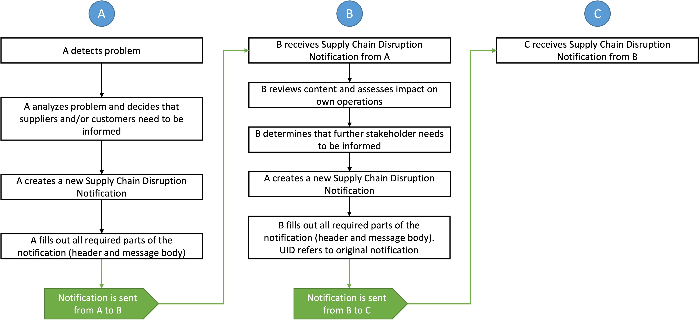
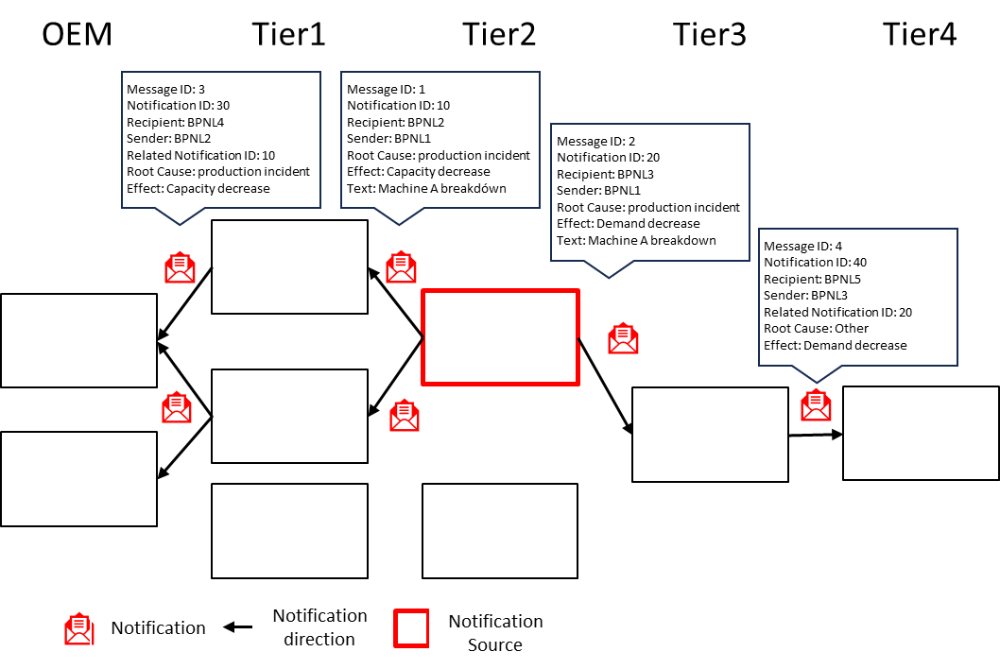

## Vision

**_Elevating Robustness and Flexibility in the Supply Chains through Disruption Notifications_**

The Supply Chain Disruption Notifications within the Catena-X framework embodies a transformative approach to fortify supply chains. This notification holds significant relevance beyond the automotive supply chain and can be effectively applied to other industries characterized by an n-tier supplier structure. By establishing a standardized, rapid communication for supply chain disruption notifications, this notification empowers stakeholders across the value chain to act swiftly and effectively in the face of challenges. Enhanced transparency and timely information exchange enable members to anticipate disruptions, streamline decision-making processes, and mitigate potential impacts. This proactive and collaborative framework not only elevates operational resilience but also drives cost efficiencies, reduces production downtime, and promotes a more sustainable and responsive supply chain ecosystem. By fostering rapid information flow, the Supply Chain Disruption Notifications is a significant step toward a more interconnected and resilient automotive industry.

## Mission

**_Enhancing Proactive Resilience in Supply Chains through Effective Disruption Notifications_**

The Supply Chain Disruption Notification marks an important step in advancing industries' capability to preemptively manage supply chain risks. By instituting a standardized, efficient communication for disruption notifications, this standard is transforming how stakeholders anticipate, communicate, and respond to supply chain disruptions. It's not merely about relaying information; it's about redefining the essence of collaborative supply chain management to be anticipatory and strategic rather than merely responsive.

Central to this mission is equipping stakeholders with a mechanism that delivers timely, actionable information, enabling them to make strategic decisions swiftly and effectively. Through the seamless integration of quick disruption notifications and information exchange, stakeholders gain a dynamic view of the supply chain, facilitating rapid adaptation to both imminent and potential disruptions.

**Key facets of this mission include:**

- Establishing a standardized framework for Supply Chain Disruption Notifications, ensuring consistency, accuracy, and speed in communication.
- Enhancing the industry's collective ability to respond to disruptions, thereby minimizing operational impact and maintaining continuity.
- Ensuring that all supply chain participants, no matter their size or role, have access to essential information, thereby promoting fairness across the industry.
- Promoting a culture of transparency and collaboration, enabling stakeholders to work together more effectively in the face of disruptions, thereby enhancing the overall resilience and agility of the automotive supply chain.

Through these principles, the Supply Chain Disruption Notifications is not only addressing the immediate needs for better disruption management but also laying the groundwork for a more resilient, adaptive, and interconnected supply chain ecosystems.

### Example Use Case

#### Streamlining Disruption Management in Automotive Manufacturing

The automotive industry, particularly in the context of increasing complexity and interconnectivity in supply chains, faces significant challenges in managing disruptions.

Consider a scenario where an unexpected disruption occurs in the supply of aluminum, a critical material for vehicle manufacturing. This disruption could arise from various factors such as natural disasters, geopolitical tensions, or logistical challenges, impacting multiple manufacturers and their production lines. The aluminum producer (sender) must evaluate the impact and identify which products and stakeholders are affected. If the impact is significant, the sender will communicate the current situation upstream in a notification, potentially informing its supplier as well. Another scenario would be that an OEM notifies their suppliers about a significant demand increase which then potentially goes down the supply chain.

For both scenarios, the recipient of this notification reviews the content and assesses the impact on their operations. Based on this assessment, the recipient determines whether further stakeholders need to be informed (either one level up or down the supply chain). If additional notifications are necessary, the recipient, now acting as the sender, drafts a new message (including a UID for the original message) to inform subsequent recipients. These recipients then evaluate the impact on their own operations and decide if further notifications are required.

In this context, the "Supply Chain Disruption Notifications" plays a significant role in addressing these challenges by facilitating swift and standardized communication of supply chain disruptions.

_Figure 1: Visualisation of example use case_

#### Implementation Example

1. **Disruption Notification Initiation:** When a primary supplier of aluminum faces a disruption, it utilizes the "Supply Chain Disruption Notification" to send out an alert. This notification includes detailed information about the nature of the disruption, expected impact, and the estimated duration of the disruption.
1. **Proactive Response Activation:** Based on the received notification, automotive manufacturers can quickly assess the impact on their production schedules. They can determine whether the disruption affects specific models or production lines and initiate contingency plans, such as activating alternative suppliers or adjusting production schedules to minimize the impact. The mentioned consequences and measures are not part of the "Supply Chain Disruption Notification" feature, but can be initiated significantly faster than without the feature.
1. **Collaborative Problem-Solving:** The standardized notification format allows for quick understanding and response from all impacted stakeholders (i.e. notification recipients). For instance, if a particular model is heavily affected, manufacturers can collaborate with suppliers to explore rapid procurement alternatives or adjust orders based on the real-time data provided in the notification.
1. **Feedback Loop:** As the situation evolves, the supplier continues to provide updates through the notification system, ensuring all impacted stakeholders have the latest information to make informed decisions. This ongoing communication fosters a collaborative environment where manufacturers and suppliers work together to mitigate the disruption's effects.
1. **Resolution**: As soon as the situation is finalized (e.g. solution found, crisis over, measures effective), the sender updates all impacted stakeholders through the notification system. This ensures, that all stakeholders have the latest status and can take corresponding decisions.

#### Impact & Benefits

This use case demonstrates the vital role of the "Supply Chain Disruption Notifications" standard in enhancing the agility and resilience of the automotive supply chain. By providing a structured and efficient way to communicate disruptions, the notification enables all involved stakeholders of the supply chain (both 1-up and 1-down) to:

- Quickly adapt to supply chain disruptions, reducing production downtime and maintaining production continuity.
- Enhance collaboration between customers and suppliers, fostering a more responsive and flexible supply chain network.
- Make informed decisions rapidly, minimizing the financial and operational impacts of disruptions.
- Maintain transparency with stakeholders, including customers, about potential delays or changes in production.

Ultimately, the adoption of this standard contributes to a more robust and adaptable automotive industry, capable of navigating the complexities of modern supply chains with enhanced efficiency and resilience.

## Business Value

Traditional supply chain management often struggles with rigidity and manual interventions, leading to inefficiencies and a reactive stance towards disruptions. The "Supply Chain Disruption Notifications" standard improves this by facilitating an integrated, real-time communication network within the Catena-X ecosystem, enabling stakeholders to swiftly respond to and manage supply chain disruptions.

The adoption of this standard brings several advantages to all stakeholders within the supply chain:

- **Enhanced Proactive Management:** The standard provides a mechanism for immediate notification and detailed insights into disruptions, allowing stakeholders to transition from a reactive to a proactive management approach. This enables faster decision-making and implementation of contingency plans, minimizing downtime and operational disruptions.
- **Improved Supply Chain Visibility:** By standardizing the disruption notification process, all parties gain a clearer understanding of the supply chain's current state. This visibility helps in identifying potential bottlenecks and vulnerabilities, facilitating a more robust supply chain design and operational strategy.
- **Increased Collaboration and Trust:** The standardized communication fosters a culture of transparency and collaboration among supply chain partners. Enhanced trust leads to more effective joint problem-solving and innovation, driving collective resilience against future disruptions.
- **Strategic Decision Support:** Access to real-time, actionable data allows organizations to make informed strategic decisions. This capability supports better resource allocation, investment in mitigation strategies, and overall supply chain optimization.
- **Market Competitiveness:** Organizations that rapidly adapt to disruptions can maintain or even improve their market position. The ability to sustain operations during adverse events translates to reliable service delivery, maintaining customer satisfaction and loyalty.
- **Sustainability:** Effective disruption management contributes to sustainability by reducing waste associated with overproduction or expedited shipping to compensate for delays.

In sum, integrating the "Supply Chain Disruption Notifications" standard into the Catena-X data space equips stakeholders with advanced tools to navigate the complexities of modern supply chains. This adoption underscores a commitment to operational excellence, resilience, and strategic foresight, paving the way for a more interconnected and resilient automotive industry.

## Use Case / Domain explanation

In the context of the automotive industry's evolving needs, particularly with the integration of the "Supply Chain Disruption Notifications" within the Catena-X network, we explore a pertinent domain: Enhancing Disruption Management in Automotive Supply Chains. This domain aims to tackle the challenges posed by disruptions in the automotive supply chain, focusing on improving resilience and response strategies.

### Today's Challenge

The automotive supply chain is characterized by a high degree of complexity and interdependence, where disruptions can ripple through the network, impacting production, lead times, and market competitiveness. Key challenges include:

- **Disruption Readiness:** The ability to rapidly identify, communicate, and respond to disruptions is often hampered by a lack of current data and standardized communication.
- **Interconnectedness:** The intricate web of suppliers, manufacturers, and logistic partners in the automotive industry necessitates a cohesive approach to manage and mitigate disruptions effectively.
- **Response Agility:** The speed at which an organization can adapt to and recover from supply chain disruptions directly affects its operational continuity and market position.

**Opportunities**:

1. **Enhanced Communication:** Establishing a standardized communication for disruption notifications enables swift and accurate information sharing, fostering a proactive response mechanism.
1. **Operational Resilience:** Empowering stakeholders with real-time data and insights into supply chain disruptions strengthens the industry's ability to maintain continuity amidst volatility.
1. **Strategic Collaboration:** Facilitating a collaborative environment where stakeholders can coordinate responses to disruptions enhances the supply chain's overall robustness.

### Benefits for involved n-tier suppliers and OEMs

Within the n-tier value chain there are customer-supplier relationships. As a participant in the value chain, a company commonly acts as a customer and a supplier:

- **Customers (incl. OEM):** Immediate access to Disruption Notifications allows for quicker adjustment of production plans, inventory management, and customer communications, reducing the impact on operations.
- **Supplier:** Enhanced visibility into potential disruptions enables suppliers to adjust their production and delivery schedules proactively, maintaining service levels and customer relationships.

### Use case conclusion

Addressing the challenges of disruption management in the automotive supply chain through the "Supply Chain Disruption Notifications" within the Catena-X network offers significant advantages. By enhancing the flow of critical information and fostering a collaborative response to disruptions, stakeholders can achieve greater operational resilience, maintain supply chain continuity, and uphold competitive advantage. This collaborative framework not only mitigates the immediate effects of disruptions but also paves the way for a more agile and responsive automotive industry.

## Semantic Models

Currently the standard _Supply Chain Disruption Notifications_ provides one semantic model _Demand and Capacity Notification._

| Semantic Model                                   | Version | Link to GitHub Repository                                                                                        |
| ------------------------------------------------ | ------- | ---------------------------------------------------------------------------------------------------------------- |
| Demand and Capacity Notification (Release 24.05) | v2.0.0  | [https://github.com/eclipse-tractusx/sldt-semantic-models/blob/main/io.catenax.demand_and_capacity_notification](https://github.com/eclipse-tractusx/sldt-semantic-models/blob/main/io.catenax.demand_and_capacity_notification) |

## Business Process

The Supply Chain Disruption Notifications standard orchestrates significant business processes within the Catena-X network, aiming to enhance the industries' resilience to supply chain disruptions. These processes facilitate timely and efficient communication among stakeholders, ensuring a coordinated response to disruptions. Here's an overview of the roles and processes involved:

**Actors and Roles:**

- **Notification Senders:** Entities that detect and report disruptions within the supply chain, acting as the primary source of real-time disruption information.
- **Notification Recipient:** Stakeholders who receive the disruption notifications, needing to adjust their operations or decision-making in response to the reported disruptions.

**Potential Triggers:**

Supply Chain Disruption Notifications are recommended for exceptional circumstances and are not intended for routine communication regarding changes in demands or capacities. For the latter the usage of the DCM and the PURIS KIT/Apps is recommended. As outlined, these notifications are specifically deployed in response to extraordinary events that significantly impact the supply chain. The determination of what constitutes an "extraordinary" event is at the discretion of the sender. Below is a list of potential triggers for issuing a Supply Chain Disruption Notification:

- **Affected Period:** An assessment indicating that the issue or situation will have a long-term impact that cannot be resolved within a defined period of weeks or persists over an extended duration.
- **Duration:** Duration of capacity reduction or change in demand, such as whether capacity is diminished over a specified period.
- **Degree of Deviation:** The degree of capacity loss or demand change is typically addressed in the normal failure batch by setting user capacity to zero. However, if significant changes occur, an alert may be triggered.
- **Affected number of business partners:** Assessment indicates that the problem or situation will impact additional business partners beyond the direct 1:1 business relationship and cannot be resolved solely within that relationship.

**Data Exchange and Notification Transmission:**

- **Disruption Information:** Detailed notifications about the nature, scope, and expected impact of the disruption, including estimated duration and affected materials or components if already known/identified.
- **Impact Assessment:** Recipients evaluate the potential impact of the disruption on their operations, considering factors like inventory levels, production schedules, and delivery commitments. Further, they evaluate if they need to inform their partners via a new notification.
- **Response Coordination:** Facilitates a collaborative approach among impacted stakeholders to develop and implement mitigation strategies, ensuring a unified response to the disruption.

**Key Processes:**

- **Direct Notification:** Immediate dissemination of disruption information from the sender to all relevant recipients (limited to 1-up/1-down) within the network.
- **Collaborative Resolution:** Stakeholders work together to address the disruption, sharing insights and potential solutions to mitigate the impact across the supply chain.
- **Update and Feedback Loop:** Continuous updates on the evolving status of the disruption and its resolution, enabling stakeholders to adapt their strategies in real-time.

**Operational Adaptation:**

- **Proactive Adjustment:** Stakeholders use the received information to proactively adjust production plans, inventory management, and logistical arrangements.
- **Strategic Planning:** Incorporation of disruption data into strategic planning, enhancing the supply chain's agility and preparedness for future disruptions.

**Notification Identifiers:**

To differentiate messages and maintain chronological and dependance tracking, distinct IDs are included in the notifications sent:

- **Notification ID:** Unique ID identifying the notification.
- **Related Notification ID:** Unique ID identifying a previously received notification triggering the exchange of the current notification.
- **Source Notification ID:** Unique ID identifying a source notification related to the current one.

The business process underpinned by the "Supply Chain Disruption Notifications" standard empowers partners within the Catena-X network to respond effectively to unexpected disruptions. This system enhances the industry's ability to maintain operational continuity, mitigate risks, and uphold service levels, contributing to a more resilient and responsive automotive supply chain.

## Business Architecture

### Introduction

The "Supply Chain Disruption Notifications" standard within the Catena-X framework facilitates a structured and efficient communication process for disruption notifications across the automotive supply chain. This system is integral for enabling rapid dissemination and reception of critical disruption information among stakeholders. The architecture of this system is designed to:

- Provide operative capabilities for stakeholders to exchange supply chain disruption notifications with immediate upstream and downstream partners, ensuring a direct and efficient communication pathway.
- Define data models that are essential for the interoperable and standardized exchange of supply chain disruption information.
- Offer guidance on how stakeholders should disseminate and react to supply chain disruption notifications, supporting scenarios that involve complex supply chain structures such as multi-sourcing or multi-customer frameworks.
- Propose methodologies for leveraging supply chain disruption data to enhance decision-making and supply chain resilience (referencing the provided use case example).

### Components

The "Supply Chain Disruption Notifications" framework consists of several components that work in unison to ensure a robust and responsive system:

- **Notification Exchange Application:** A software component that enables stakeholders to send and receive supply chain disruption notifications. It integrates with existing systems to extract and input relevant data, ensuring the timeliness and accuracy of the information exchanged.
- **Connector:** This component manages the secure and compliant exchange of data, acting as a bridge between business partners within the Catena-X network. It ensures that data flow adheres to standardized communication and security measures.
- **Data Provisioning & Transformation:** This aspect involves transforming internal data into the standardized format required for the notification system and vice versa, allowing seamless integration with internal systems and processes.
- **Identity and Access Management (IAM):** Ensures secure access to the system, managing authentication and authorization across the Catena-X network. It includes mechanisms to verify the identity and credentials of participating entities, ensuring that data exchange occurs within a trusted environment.

By adopting this business architecture, stakeholders in the automotive supply chain can significantly enhance their ability to manage and mitigate the impacts of disruptions, fostering a more resilient and agile supply chain ecosystem within the Catena-X framework.

## Logic & Schema

To send and receive Supply Chain Disruption Notifications, an internal process for evaluating incoming notifications as well as sending new notifications needs to be implemented. The following figure visualises the process in the supply chain, in which a tier 2 company sends a notification to its customers and a supplier.

_Figure 2: Visualisation of the notifications process_

## Standards

The relevant standards can be found in the [Catena-X Association Standard Library](https://catenax-ev.github.io/docs/next/standards/overview):

- [CX-0146 Supply Chain Disruption Notifications 1.0.0](https://catenax-ev.github.io/docs/next/standards/CX-0146-SupplyChainDisruptionNotifications)

### Normative References

| Standard | Standard Name                       |
| -------- | ----------------------------------- |
| CX-0001  | EDC Discovery API                   |
| CX-0003  | SAMM Aspect Meta Model              |
| CX-0006  | Registration and initial onboarding |
| CX-0010  | Business Partner Number (BPN)       |
| CX-0015  | IAM & Access Control Paradigm       |
| CX-0018  | Dataspace Connectivity              |
| CX-0126  | Industry Core: Part Type            |
| CX-0149  | Verified Company Identity           |

### Non-Normative References

| Context   | Link                                         |
| --------- | -------------------------------------------- |
| CX - 0118 | Delivery Information                         |
| CX - 0120 | Short-Term Material Demand                   |
| CX - 0121 | Planned Production Output                    |
| CX - 0122 | Item Stock                                   |
| CX - 0128 | Demand and Capacity Management Data Exchange |
| CX - 0145 | Days of Supply                               |

## Notice

This work is licensed under the [CC-BY-4.0](https://creativecommons.org/licenses/by/4.0/legalcode)

- SPDX-License-Identifier: CC-BY-4.0
- SPDX-FileCopyrightText: 2024 ZF Friedrichshafen AG
- SPDX-FileCopyrightText: 2024 Bayerische Motoren Werke Aktiengesellschaft (BMW AG)
- SPDX-FileCopyrightText: 2024 SAP SE
- SPDX-FileCopyrightText: 2024 Mercedes Benz Group AG
- SPDX-FileCopyrightText: 2024 BASF SE
- SPDX-FileCopyrightText: 2024 SupplyOn AG
- SPDX-FileCopyrightText: 2024 Henkel AG & Co.KGaA
- SPDX-FileCopyrightText: 2024 Contributors of the Eclipse Foundation
- SPDX-FileCopyrightText: 2024 ISTOS GmbH (a member of the DMG Mori Group)
- SPDX-FileCopyrightText: 2024 Fraunhofer-Gesellschaft zur Foerderung der angewandten Forschung e.V. (represented by Fraunhofer ISST)
- SPDX-FileCopyrightText: 2024 TRUMPF Werkzeugmaschinen SE + Co. KG
- SPDX-FileCopyrightText: 2024 Volkswagen AG
- SPDX-FileCopyrightText: 2024 Contributors to the Eclipse Foundation
