## TABLE OF CONTENTS

- [Business Roles and Functions](#business-roles-and-functions)
- [Material Demand](#material-demand)
- [Capacity Group](#capacity-group)
- [Match and Comparison of Demand and Capacity](#match-and-comparison-of-demand-and-capacity)
- [Collaboration](#collaboration)
- [User Journey](#user-journey)

## Business Roles and Functions

The core DCM business process is executed by two roles and uses two APIs as well as two aspect models. The customer is responsible for `WeekBasedMaterialDemand`, the supplier for `WeekBasedCapacityGroup`. Within `WeekBasedCapacityGroup` the supplier has to link material demands.

|Function / Role|Customer|Supplier|
|-|-|-|
|Manage demand data|X||
|Inform supplier about demand|X||
|Manage capacity data||X|
|Link demand and capacity||X|
|Inform customer about capacity||X|
|Compare demand to capacity|X|X|
|Collaborate to resolve bottlenecks|X|X|

## User Journey

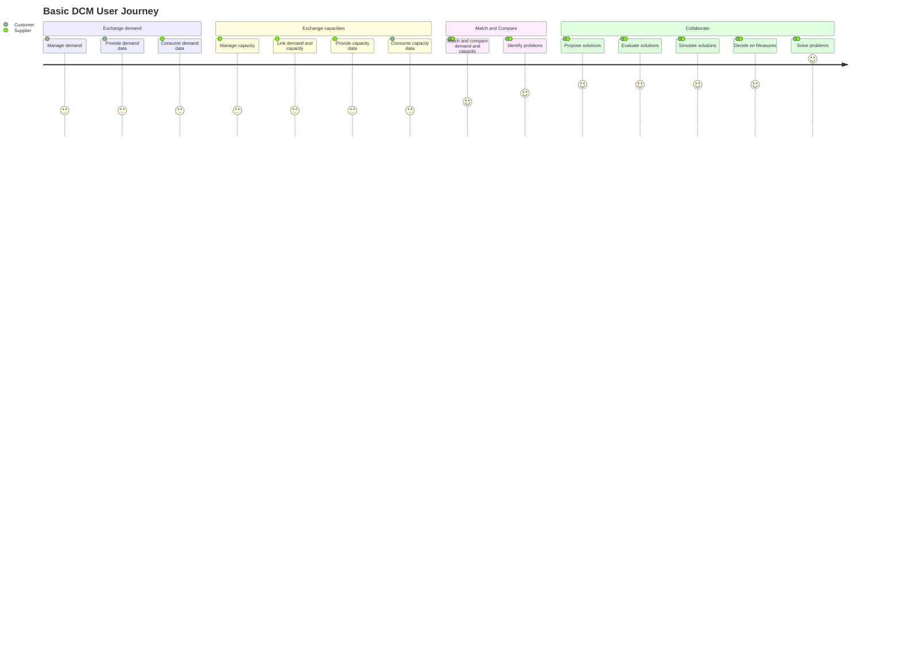

Figure: *Basic DCM user journey*

### Personas

The basic DCM user journey encompasses two key personas, each with distinct roles and responsibilities that highlight their value within the supply chain.

#### Customer

 Individuals that act as this persona may hold various titles within their organization, but share the common responsibility of managing material demand and ensuring that supply aligns with their forecasted needs. The value of DCM for the customer lies in the capability to provide clear visibility into future demand and to facilitate efficient communication and alignment with suppliers.

The responsibilities of the customer include:

- safeguarding sufficient capacity of his suppliers for required materials and prevent bottleneck situations
- allocation of production capacity on customer side
- production rough cut capacity planning
- material allocation

#### Supplier

Individuals that act as this persona may hold various titles within their organization, but share the common responsibility of providing capacity data in response to the customer's material demand. The value of DCM for the supplier lies in the capability to receive material demand data, which enables them to plan and allocate resources effectively, ensuring they can meet the customer's demands.

The responsibilities of the supplier include:

- allocation of production capacity
- production rough cut capacity planning
- material allocation
- communication to a Customer business partner regarding capacity figures in a mid to - long term horizon
- resolving bottleneck situations

### User Journey Description

The starting point within the DCM user journey is the exchange of demand data, which is provided by the Customer and consumed by the supplier as WeekBasedMaterialDemand. For an effective demand and capacity management the data needs to be of a certain quality. This includes sorting the demand into weekly buckets, extending the demand data 24 months into the future and subsequently keeping it up to date. Whether the Customer has to manually prepare the demand data or it gets automatically generated and updated from existing systems, is not restricted by the Catena-X standards.

The exchange of demand data is followed by the exchange of capacity data, which is provided by the supplier und consumed by the customer. For an effective demand and capacity management the data needs to be of a certain quality. This included linking material demands to the capacity group, providing a capacity quantity for every calendar week the customer provided demand quantities for, matching unit of measures correctly and utilizing advanced features like load factors and delta production in order to model demand and capacity management as closely to real life as possible. Whether the supplier has to manually prepare the capacity data or it gets automatically generated and updated from existing systems, is not restricted by the Catena-X standards. However matching material numbers and linking material demands to capacity groups will most likely required human intervention at some point.

After exchanging demand and capacity data both, customer and supplier, do have the same view of the current situation and can begin matching and comparing the data. This is something that usually happens locally within the respective DCM application. Ideally the whole process of finding problems (bottleneck or surplus) is automated.

If either customer or supplier identify a problem they can collaborate by exchanging comments as described by the DCM standard or by communicating outside the Catena-X dataspace using email or online-meetings. Regardless of how communication is initiated and maintained solving an identified problem is always the result of proposing, evaluating and simulating potential solutions. Customers and supplier discuss potential measures, modify their demand and capacity respectively and exchange the modified data until a solution that works for both sides has been found.

Tools available to the Customer for solving problems are fairly limited. They can increase or decrease demand quantities.

The supplier on the other hand has more options to solve problems. They can not only increase and decrease capacity quantities, but also use flexible capacity, load factors and delta production.

## Material Demand

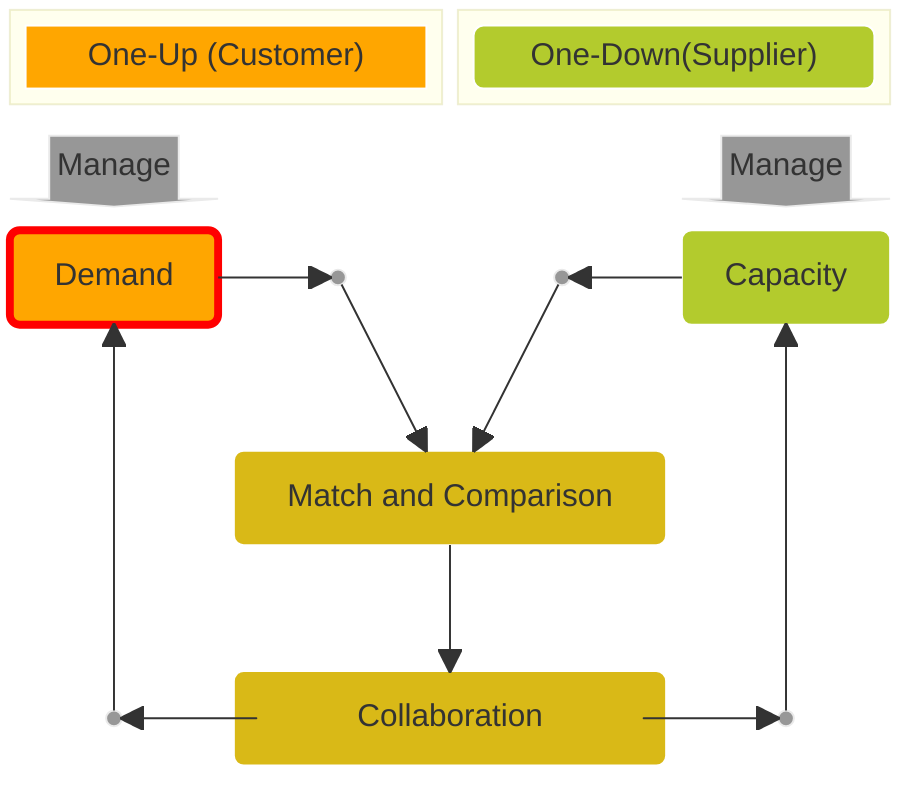

Figure: *Basic DCM process with demand part highlighted*

A material demand represents the need for a particular product, part, component or material over a certain time period in a specified quantity. Demand quantities must refer to a time period of one calendar week (weekly buckets).

The customer is responsible for publishing material demand to their supplier for upcoming time periods and it is strongly recommended to:

- Minimize any data gaps to the greatest extent possible by maintaining continuity and establishing consistency.
- Provide material demand data for at least nine months into the future to ensure that DCM participants have sufficient information to work with.
- Implement a rolling demand plan by continuously updating the planning horizon with recent data.
- Refresh the data at a minimum of once every four weeks.
- Align, ideally within a contract, the unit of measure for demand quantities (e.g., pieces, kilograms, metric tons) with the supplier before providing the demand.

The supplier must have the capability to consume the material demand data from the customer.

### Material Demand Structure

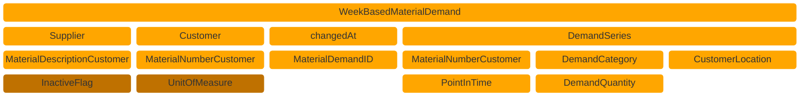


Figure: *Material demand structure*

### Visualization Example

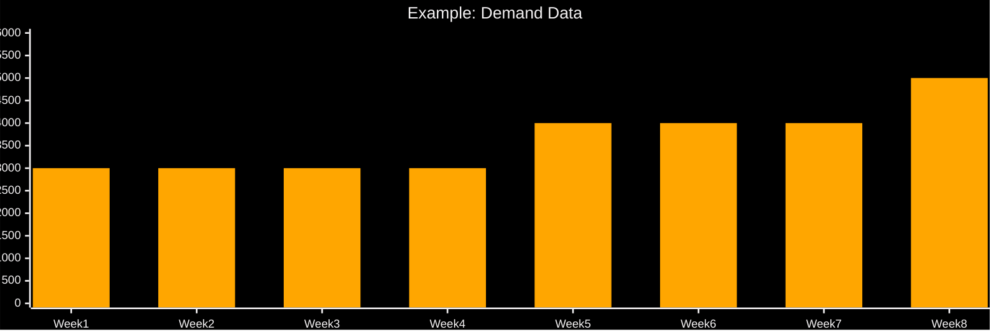

Figure: *Visualizing demand quantities as bars*

## Capacity Group

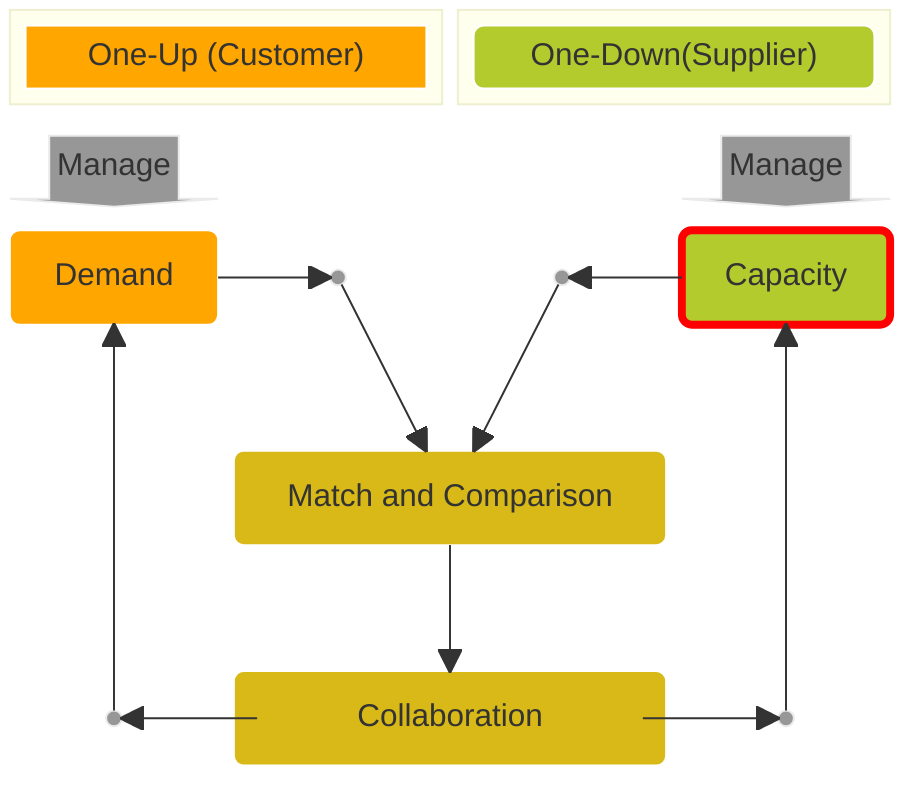

Figure: *Basic DCM process with capacity part highlighted*

A capacity group represents the answer to one or more material demands. It contains the information on how a supplier intends to fulfill customer needs, by contrasting demands with capacities over a certain time period in a specified quantity. Capacity quantities must refer to a time period of one calendar week (weekly buckets).

The customer is responsible for publishing capacity groups to their customer and it is strongly recommended to:

- Minimize any data gaps to the greatest extent possible by maintaining continuity and establishing consistency.
- Provide capacity data for every calendar week that has associated demand data.
- Refresh the data at a minimum of once every four weeks.
- Align, ideally within a contract, the unit of measure for capacity quantities (e.g., pieces, kilograms, metric tons) with the Customer and utilize lead factors as conversion factors, if applicable.

The supplier must provide capacity data to the customer, corresponding to the material demand data previously shared. Thereby, the supplier is acting as a data provider and the customer as a data consumer of the exchanged capacity group.  

The customer must have the capability to consume the capacity group data from the supplier.

### Capacity Group Structure

The capacity group is the entity where material demand and capacity information are matched and compared for the purpose of a collaborative DCM. Thereby, the capacity group builds the common view on the data exchanged between a customer and a supplier.

The entity capacity group may be used, i.e. to combine capacities related to one or more machines, facilities or plants.

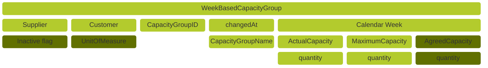


Figure: *Capacity group structure*

### Visualization Example

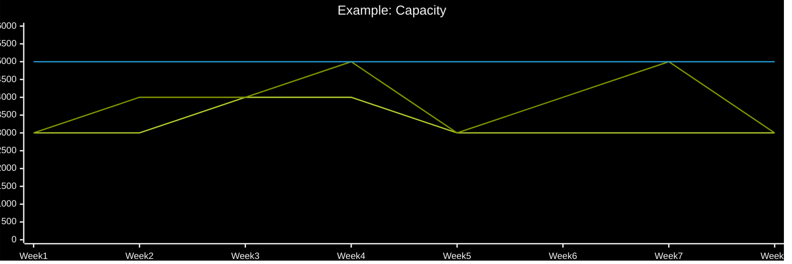


Figure: *Visualizing capacity quantities as lines*

### Capacity Types

Embedded into the WeekBasedCapacityGroup are

- **Actual Capacity** as the planned available capacity of a supplier
- **Maximum Capacity** as the maximum releasable capacity of a supplier
- **Agreed Capacity** as the understanding between Customer and supplier, regardless of contractual obligations. It is optional.

In addition the difference between actual capacity and maximum capacity is commonly understood as flexible capacity.

The following examples illustrate how to use the "capacity" properties.

#### Example 1: Simple Case

```mermaid
---
config:
 xyChart:
        width: 1200
        height: 400
        titlePadding: 10
        titleFontSize: 20
        showTitle: true
        plotReservedSpacePercent: 50
 themeVariables:
        xyChart:
            backgroundColor: "#000000"
            titleColor: "#F4F2F3"
            xAxisLabelColor: "#F4F2F3"
            xAxisTitleColor: "#F4F2F3"
            xAxisTickColor: "#F4F2F3"
            xAxisLineColor: "#F4F2F3"
            yAxisLabelColor: "#F4F2F3"
            yAxisTitleColor: "#F4F2F3"
            yAxisTickColor: "#F4F2F3"
            yAxisLineColor: "#F4F2F3"
            plotColorPalette: "#FFA600,#d91e18,#809500,#ffffff,#00ffff"
---   
    xychart-beta
    title "Example 1"
    x-axis [Week14, Week15, Week16, Week17, Week18, Week19, Week20, Week21, Week22, Week23]
    y-axis "." 0 --> 2000
    bar demand over actual but within actual capacity Orange [0,0,0,0,0,0,0,0,0,0]
    bar demand over actual capacity Red [0,0,0,0,0,0,0,0,0,0]
    bar demand within actual capacity Green [870, 900, 980, 905, 950, 912, 940, 1150, 1390, 1478]
    line actual capacity [1000, 1000, 1000, 1000, 1000, 1000, 1000, 1250, 1500,1500]
    line maximum capacity [1800, 1800,1800,1800,1800,1800,1800,1800,1800,1800]
```


Figure: *Visualizing capacity and demand on a simple case with sufficient capacity*

We are in Week01, and we focus on a mid-term horizon starting in Week14, for a certain capacity group.
The current capacity plan at the supplier for this horizon is

- 1000 units per week from Week14 (10 shifts per week) to Week20
- 1500 units per week from Week22 onwards (15 shifts per week), with a ramp up step in Week21

This plan is reflected in the actual capacity of DCM.

When matching demand to capacity, one will see that

- Actual capacity is sufficient to cover demand.
- Maximum capacity can be available to cover potential increase of the demand up until 1800

#### Example 2: Imbalance

```mermaid
---
config:
 xyChart:
        width: 1200
        height: 400
        titlePadding: 10
        titleFontSize: 20
        showTitle: true
        plotReservedSpacePercent: 50
 themeVariables:
        xyChart:
            backgroundColor: "#000000"
            titleColor: "#F4F2F3"
            xAxisLabelColor: "#F4F2F3"
            xAxisTitleColor: "#F4F2F3"
            xAxisTickColor: "#F4F2F3"
            xAxisLineColor: "#F4F2F3"
            yAxisLabelColor: "#F4F2F3"
            yAxisTitleColor: "#F4F2F3"
            yAxisTickColor: "#F4F2F3"
            yAxisLineColor: "#F4F2F3"
            plotColorPalette: "#FFA600,#d91e18,#809500,#ffffff,#00ffff"
---   
    xychart-beta
    title "Example 2"
    x-axis [Week14, Week15, Week16, Week17, Week18, Week19, Week20, Week21, Week22, Week23]
    y-axis "." 0 --> 2000
    bar Demand Over Actual but within Actual Capacity Orange [0,1100,1200,1318,1150,1254,1110,0,0,0]
    bar Demand Over Actual Capacity Red [0,0,0,0,0,0,0,0,0,0]
    bar Demand within Actual Capacity Green [1000, 0, 0, 0, 0, 0, 0, 1150, 1390, 1478]
    line Actual Capacity [1000, 1000, 1000, 1000, 1000, 1000, 1000, 1250, 1500,1500]
    line Maximum Capacity [1800, 1800,1800,1800,1800,1800,1800,1800,1800,1800]
```

Figure: *Visualizing capacity and demand in a case of imbalance*

We are, here again, in Week01, considering the horizon from Week14 onwards.
Demand has increased in the period between Week15 and Week20, and now exceeds actual capacity.

On supplier side: Supplier should detect that actual capacity is insufficient, using its DCM software, and conclude that measures should be activated to cover demand. As demand is below maximum capacity, supplier knows that it is feasible. Eventually, supplier should update its actual capacity to reflect those measures.

On customer side: when validating its own production plan, customer may consider utilizing the supplier’s flexibility up to the maximum capacity and conclude that feasibility is given.

#### Example 3: No Flexible Capacity

```mermaid
---
config:
 xyChart:
        width: 1200
        height: 400
        titlePadding: 10
        titleFontSize: 20
        showTitle: true
        plotReservedSpacePercent: 50
 themeVariables:
        xyChart:
            backgroundColor: "#000000"
            titleColor: "#F4F2F3"
            xAxisLabelColor: "#F4F2F3"
            xAxisTitleColor: "#F4F2F3"
            xAxisTickColor: "#F4F2F3"
            xAxisLineColor: "#F4F2F3"
            yAxisLabelColor: "#F4F2F3"
            yAxisTitleColor: "#F4F2F3"
            yAxisTickColor: "#F4F2F3"
            yAxisLineColor: "#F4F2F3"
            plotColorPalette: "#FFA600,#d91e18,#809500,#ffffff,#046b99"
---   
    xychart-beta
    title "Example 3: Capacity Group with little Flexible Capacity"
    x-axis [Week14, Week15, Week16, Week17, Week18, Week19, Week20, Week21, Week22, Week23]
    y-axis "." 0 --> 2000
    bar Demand Over Actual but within Actual Capacity Orange [0,0,0,0,0,0,0,0,0,0]
    bar Demand Over Actual Capacity Red [0,0,0,0,0,0,0,0,0,0]
    bar Demand within Actual Capacity Green [1788, 1786, 1770, 1767, 1788, 1780, 1770, 1760, 1750, 1789]
    line Actual Capacity [1790, 1790,1790,1790, 1790,1790,1790, 1790,1790,1790]
    line Maximum Capacity [1800, 1800,1800,1800,1800,1800,1800,1800,1800,1800]
```

Figure: *Visualizing capacity and demand in case without flexible capacity*

Actual capacity is equal to maximum capacity, and demand is very close.
Though no proper imbalance is detected, even a slight increase of demand could not be managed. Both, supplier and customer, can conclude, that it may be relevant to collaborate to identify measures to mitigate risk.

#### Example 4: Solving a Capacity Bottleneck

```mermaid
---
config:
 xyChart:
        width: 1200
        height: 420
        titlePadding: 10
        titleFontSize: 20
        showTitle: true
        plotReservedSpacePercent: 50
 themeVariables:
        xyChart:
            backgroundColor: "#000000"
            titleColor: "#F4F2F3"
            xAxisLabelColor: "#F4F2F3"
            xAxisTitleColor: "#F4F2F3"
            xAxisTickColor: "#F4F2F3"
            xAxisLineColor: "#F4F2F3"
            yAxisLabelColor: "#F4F2F3"
            yAxisTitleColor: "#F4F2F3"
            yAxisTickColor: "#F4F2F3"
            yAxisLineColor: "#F4F2F3"
            plotColorPalette: "#FFA600,#d91e18,#809500,#ffffff,#00ffff"
---  
    xychart-beta
    title "Example 4a"
    x-axis [Week14, Week15, Week16, Week17, Week18, Week19, Week20, Week21, Week22, Week23]
    y-axis "." 0 --> 2200
    bar Demand Over Actual but within Actual Capacity Orange [0,0,0,0,0,0,0,0,0,0]
    bar Demand Over Actual Capacity Red [0,0,0,0,0,1950,1950,1950,0,0]
    bar Demand within Actual Capacity Green [1780, 1775, 1775, 1775, 1770, 0, 0, 0, 1770, 1770]
    line Actual Capacity [1785, 1785,1785, 1785, 1785, 1785,1785, 1785,1785, 1785]
    line Maximum Capacity [1800, 1800,1800,1800,1800,1800,1800,1800,1800,1800]
```

Figure: *Visualizing capacity and demand in a case of bottleneck*

Imbalance is detected in Week19 to Week21: Demand exceeds maximum capacity.
Supplier and customer collaborate and agree on a measure to solve imbalance, e.g. increasing production capacity from Week19 to Week21
If so, Actual and Maximum Capacity must be updated to reflect the result of the collaboration. As a result, the bottleneck disappears, as exemplified in example 4b below.

```mermaid
---
config:
 xyChart:
        width: 1200
        height: 420
        titlePadding: 10
        titleFontSize: 20
        showTitle: true
        plotReservedSpacePercent: 50
 themeVariables:
        xyChart:
            backgroundColor: "#000000"
            titleColor: "#F4F2F3"
            xAxisLabelColor: "#F4F2F3"
            xAxisTitleColor: "#F4F2F3"
            xAxisTickColor: "#F4F2F3"
            xAxisLineColor: "#F4F2F3"
            yAxisLabelColor: "#F4F2F3"
            yAxisTitleColor: "#F4F2F3"
            yAxisTickColor: "#F4F2F3"
            yAxisLineColor: "#F4F2F3"
            plotColorPalette: "#FFA600,#d91e18,#809500,#ffffff,#00ffff"
---   
    xychart-beta
    title "Example 4b"
    x-axis [Week14, Week15, Week16, Week17, Week18, Week19, Week20, Week21, Week22, Week23]
    y-axis "." 0 --> 2200
    bar Demand Over Actual but within Actual Capacity Orange [0,0,0,0,0,0,0,0,0,0]
    bar Demand Over Actual Capacity Red [0,0,0,0,0,0,0,0,0,0]
    bar Demand within Actual Capacity Green [1780, 1775, 1775, 1775, 1770, 1930, 1930, 1930, 1770, 1770]
    line Actual Capacity [1785, 1785,1785, 1785, 1785, 1935, 1935, 1935,1785, 1785]
    line Maximum Capacity [1800, 1800,1800,1800,1800,1950, 1950, 1950,1800,1800]
```

Figure: *Visualizing capacity and demand*

### WeekBasedCapacityGroup Properties

A capacity group dataset comprises the following basic components:

| Main Parameters | Required? | Description |
|-|-|-|
| Supplier | Yes |The Business Partner Number Legal (BPNL) of the party providing materials to a customer|
| Customer | Yes |The Business Partner Number Legal (BPNL) of the party requesting material from a supplier|
| Capacity Group ID | Yes |The capacity group ID uniquely identifies the capacity group within the business relationship between a supplier and its customer|
| Changed At | Yes |Point in time when the content (any property according to the data model) of the capacity group was changed, at the supplier, either by a human user or an automated process|
| Capacity Group Name | Yes |Name of the capacity group|
| Capacity Group is Inactive | Yes |Indicates that this capacity Group is currently not in use/maintained by the Supplier|
| Unit of Measure | No |Unit of Measurement (UoM) for capacity quantities|
| Linked Demand Series | No |Set of demand series assigned to this capacity group|
| Capacities | No |A time series with week-based granularity along a given time period containing the capacity values|
| Unit of Measure is Omitted | Yes |Explicit indicator of whether the unit of measure is left out of the payload intentionally. If “true” it means the sending application sends the demand values without unit of measure intentionally and the unit of measure must not be contained in the payload. If “false” a unit of measure must be supplied|

Further properties are added at lower level below the “Capacities” property. A capacity time series contains the following components.

| Main Parameters | Required? | Description |
|-|-|-|
| Actual Capacity | Yes |The actual capacity is the realistically planned output per calendar week and material for a specific customer in a specific unit of measure, considering all positive or negative impacts on this capacity|
| Agreed Capacity | No |The agreed capacity of a supplier for a specific customer material(s) within a capacity group. The agreed capacity must not constitute a legal obligation to deliver.|
| Maximum Capacity | Yes |The supplier's maximum capacity is the maximal available output per calendar week and material for a specific customer in a specific unit of measure. The maximum capacity thereby restricts the flexible capacity, as the flexible capacity is obtained from the difference of a suppliers maximum capacity minus actual capacity|
| Point in Time | Yes |ISO calendar week of the given time series entry. It must be given as a date of the Monday in the week.|

### Linking Capacity Groups to Material Demands

For a functional capacity group, the supplier must link it directly or indirectly to a material demand:

- **Direct linking** means that the capacity group links at least one material demand.
- **Indirect linking** means that the capacity group links to another capacity group which links at least one material demand. This is also referred to as **nesting**.

#### Direct Linking

```mermaid
block-beta
columns 10
A1("WeekBasedCapacityGroup"):10
B1("Supplier")
B2("Customer")
B3("CapacityGroupID")
B4("changedAt")
B5("Calendar Week"):3
B8("DemandSeries"):3
C1("Inactive flag")
C2("UnitOfMeasure")
space
C4("CapacityGroupName")
C5("ActualCapacity")
C6("MaximumCapacity")
C7("AgreedCapacity")
C8("MaterialNumberCustomer")
C9("DemandCategory")
C10("CustomerLocation")
space:4
D5("quantity")
D6("quantity")
D7("quantity")
D8("PointInTime")
D9("quantity")

classDef Demand_must fill:#FFA600,stroke:#FFFFFF,color:#000000
classDef Capacity_must fill:#B3CB2D,stroke:#FFFFFF,color:#000000
classDef Demand_optional fill:#BF7100,stroke:#FFFFFF,color:#000000
classDef Capacity_optional fill:#617000,stroke:#FFFFFF,color:#000000
class A1,B1,B2,B3,B4,B5,C4,C5,C6,C7,D5,D6,D7 Capacity_must
class B8,C8,C9,C10,D8,D9 Demand_must
class Capacity_optional
class C1,C2,C7,D7 Capacity_optional
```


Figure: *Capacity group structure with linked material demand*

For the technical representation of a capacity group the aspect model WeekBasedCapacityGroup is utilized.

The aspect model WeekBasedCapacityGroup must be used by a supplier to provide capacity information to the Customer.

For further details refer to the semantic model in Chapter 3.2 and to the APIs in Chapter 4.2.

A partner acting as a supplier sends a capacity group to its customer. In order to link demand series in the capacity group between customer and supplier, the following properties must be filled-in:

- Supplier
- Customer
- materialNumberCustomer
- CustomerLocation
- demandCategory

If there’s no complete match between supplier and customer data, it’s recommended to initiate collaboration (i.e. see chapter “Comments”)

The supplier has the option to mark a WeekBasedCapacityGroup as inactive (i.e. the capacity is obsolete), in this case the capacity will not be considered in the demand-capacity matching. However, the WeekBasedCapacityGroup can be reactivated again.

### Building N-Tier Chains via Capacity Groups

Building supply chain via capacity groups is crucial to improve resiliency, transparency and efficiency along the value chain. Using the individual one-to-one capacity groups between one-ups and one-downs step by step builds the whole supply network. This enables all partners to collaborate along the whole value chain and navigate through complex and dynamic market conditions.

The following figure illustrates how plastic granulate ends up being used in the housing of a control unit and how this would be viewed from a birds eye perspective.

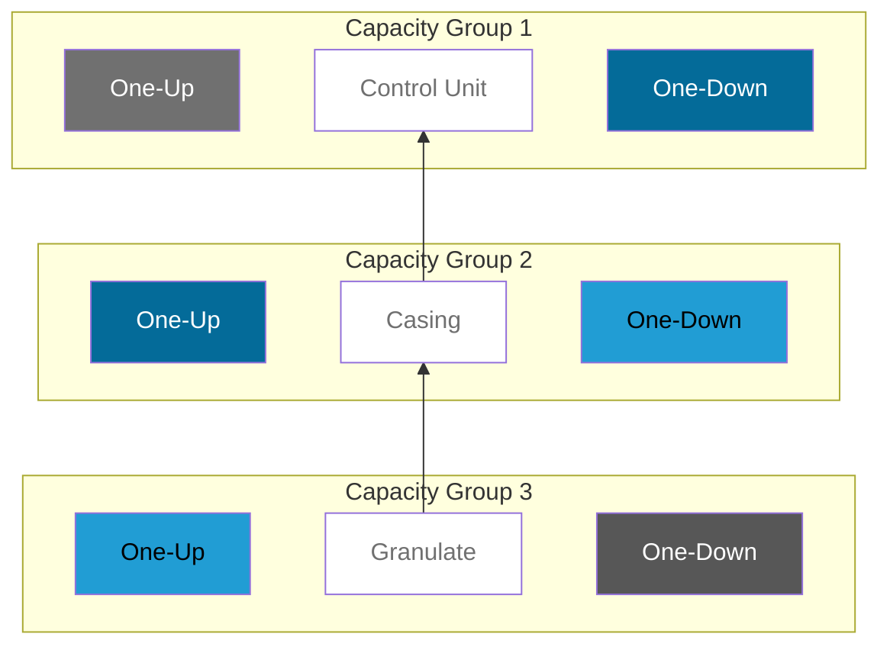

Figure: *A small supply chain built by three capacity groups*

The following figure illustrates the flow of demand and capacity data through the supply network. Capacity and demand blocks are placed according to responsibility. Data exchange that is happening within the Catena-X dataspace is denoted by arrows with "Provide" written on them.

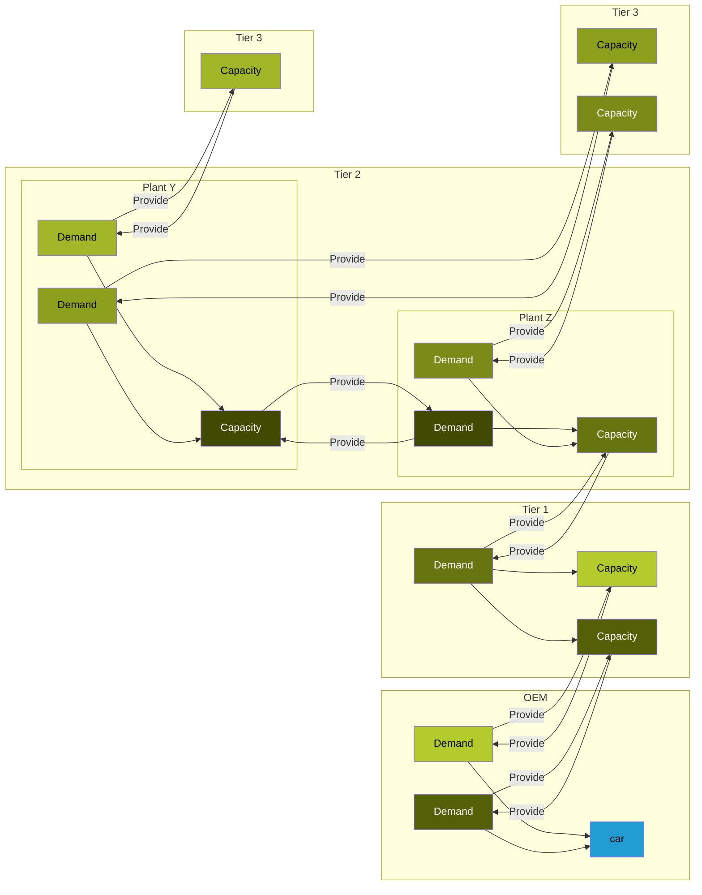

```mermaid
block-beta
1["CapacityGroup 1"] style 1 fill:#B3CB2D,color:#000000
2["CapacityGroup 2"] style 2 fill:#a0b626,color:#000000
3["CapacityGroup 3"] style 3 fill:#8da01e,color:#000000
4["CapacityGroup 4"] style 4 fill:#7a8b17,color:#FFFFFF
5["CapacityGroup 5"] style 5 fill:#66750f,color:#F4F2F3
6["CapacityGroup 6"] style 6 fill:#536008,color:#F4F2F3
7["CapacityGroup 7"] style 7 fill:#404a00,color:#F4F2F3
```

Figure: *A small supply network built by seven capacity groups*

## Match and Comparison of Demand and Capacity

```mermaid
block-beta
columns 4
block:Customer:2
A1[["One-Up (Customer)")
end
block:Supplier:2
A3("One-Down(Supplier)")
end
B1<["Manage"]>(down)
space:2
B4<["Manage"]>(down)
C1("Demand"):1
C2((" ")):1
C3((" ")):1
C4("Capacity"):1
space:4
space:1
E2("Match and Comparison"):2
space:1
space:4
G1((" "))
G2("Collaboration"):2
G4((" "))

C1-->C2
C2-->E2
C3-->E2
C4-->C3
E2-->G2
G1-->C1
G2-->G1
G2-->G4
G4-->C4

classDef Demand fill:#FFA600,stroke:#FFFFFF,color:#000000
classDef Capacity fill:#B3CB2D,stroke:#FFFFFF,color:#000000
classDef DemCap fill:#D9B917,stroke:#FFFFFF,color:#000000
classDef Frame fill:#979797,stroke:#EAEAEA,color:#000000
classDef Highlite stroke:#FF0000,stroke-width:4px
class A1,C1 Demand
class A3,C4 Capacity
class E2,G2 DemCap
class B1,B4,C2,C3,G1,G4 Frame
class E2 Highlite
```

Figure: *Basic DCM process with match and comparison part highlighted*

Both, customer and supplier, need to apply the same logic when comparing demand and capacity data in order to get the same results and come to identical conclusions.

The standard describes exactly which scenario leads to the three possible matching results:

- Zero deviation
- Surplus
- Bottleneck

Within a DCM application those three matching results are commonly represented as a traffic light status, with zero deviation and surplus being green and bottleneck being orange or red, depending on whether demand is higher than maximum capacity or just actual capacity.

While customers might not feel impacted by a surplus, because the demand is matched, it still represents capacity that the supplier could better utilize.

For ease of use demand and capacity data should be shown on the same graph and colored in appropriately, within a DCM application.

```mermaid
---
   config:
    xyChart:
        width: 1200
        height: 400
        titlePadding: 10
        titleFontSize: 20
        showTitle: true
        plotReservedSpacePercent: 50
    themeVariables:
        xyChart:
            backgroundColor: "#000000"
            titleColor: "#F4F2F3"
            xAxisLabelColor: "#F4F2F3"
            xAxisTitleColor: "#F4F2F3"
            xAxisTickColor: "#F4F2F3"
            xAxisLineColor: "#F4F2F3"
            yAxisLabelColor: "#F4F2F3"
            yAxisTitleColor: "#F4F2F3"
            yAxisTickColor: "#F4F2F3"
            yAxisLineColor: "#F4F2F3"
            plotColorPalette: "#FFA600,#d91e18,#809500,#ffffff,#046b99,#219dd4"
---
    xychart-beta
    title "Example: Demand and Capacity Data Matching and Comparison within Capacity Group"
    x-axis [Week 1, Week 2, Week 3, Week 4, Week 5, Week 6, Week 7, Week 8]
    y-axis "." 0 --> 6000
    bar [3000, 3000, 3000, 3000, 4000, 4000, 4000, 5000]
    bar [0,0,0,0,4000,0,0,5000]
    bar [3000,3000,3000,3000,0,0,0,0]
    line Actual Capacity [3000, 3000, 4000, 4000, 3000, 3000, 3000, 3000]
    line Maximum Capacity [3000, 4000, 4000, 5000, 3000, 4000, 5000, 3000]
    line Agreed Capacity [5000, 5000, 5000, 5000, 5000, 5000, 5000, 5000]

```

```mermaid
block-beta
columns 3
A["Demand over Actual Capacity"] style A fill:#d91e18,color:#F4F2F3
B["Demand over Actual but within Maximum Capacity"] style B fill:#FFA600,color:#F4F2F3
C["Demand within Actual Capacity"] style C fill:#809500,color:#F4F2F3
D["Actual Capacity"] style D fill:#FFFFFF,color:#000000
E["Maximum Capacity"] style E fill:#046b99,color:#000000
F["Agreed Capacity"] style F fill:#219dd4,color:#000000
```

Figure: *Visualizing the comparison of demand and capacity quantities*

## Collaboration

```mermaid
block-beta
columns 4
block:Customer:2
A1[["One-Up (Customer)")
end
block:Supplier:2
A3("One-Down(Supplier)")
end
B1<["Manage"]>(down)
space:2
B4<["Manage"]>(down)
C1("Demand"):1
C2((" ")):1
C3((" ")):1
C4("Capacity"):1
space:4
space:1
E2("Match and Comparison"):2
space:1
space:4
G1((" "))
G2("Collaboration"):2
G4((" "))

C1-->C2
C2-->E2
C3-->E2
C4-->C3
E2-->G2
G1-->C1
G2-->G1
G2-->G4
G4-->C4

classDef Demand fill:#FFA600,stroke:#FFFFFF,color:#000000
classDef Capacity fill:#B3CB2D,stroke:#FFFFFF,color:#000000
classDef DemCap fill:#D9B917,stroke:#FFFFFF,color:#000000
classDef Frame fill:#979797,stroke:#EAEAEA,color:#000000
classDef Highlite stroke:#FF0000,stroke-width:4px
class A1,C1 Demand
class A3,C4 Capacity
class E2,G2 DemCap
class B1,B4,C2,C3,G1,G4 Frame
class G2 Highlite
```

Figure: *Basic DCM process with collaboration part highlighted*

Collaboration is key within the DCM process. It is the final part of the DCM user journey, where actual solutions for problems (surplus and bottlenecks) are proposed, discussed and finally deployed.

In order to facilitate collaboration with the Catena-X dataspace the DCM standards describes the exchange of comments, using an own aspect model and API. Communication features outside the Catena-X dataspace, such as eMail, phone calls, online meetings, etc. are not prohibited and should be used as the individual customers and suppliers see fit.

For further details, please refer to [CX-0128 Demand and Capacity Management Data Exchange][StandardLibrary].

## Notice

This work is licensed under the [CC-BY-4.0](https://creativecommons.org/licenses/by/4.0/legalcode)

- SPDX-License-Identifier: CC-BY-4.0
- SPDX-FileCopyrightText: 2023 BASF SE
- SPDX-FileCopyrightText: 2023 Bayerische Motoren Werke Aktiengesellschaft (BMW AG)
- SPDX-FileCopyrightText: 2024 BearingPoint Holding B.V
- SPDX-FileCopyrightText: 2024 Capgemini SE
- SPDX-FileCopyrightText: 2023 Fraunhofer-Gesellschaft zur Förderung der angewandten Forschung e.V (Fraunhofer)
- SPDX-FileCopyrightText: 2023 Henkel AG & Co.KGaA
- SPDX-FileCopyrightText: 2023 Mercedes Benz Group AG
- SPDX-FileCopyrightText: 2024 Renault SA
- SPDX-FileCopyrightText: 2023 SAP SE
- SPDX-FileCopyrightText: 2023 SupplyOn AG
- SPDX-FileCopyrightText: 2023 Volkswagen AG
- SPDX-FileCopyrightText: 2024 Volvo Car Corporation
- SPDX-FileCopyrightText: 2023 ZF Friedrichshafen AG
- SPDX-FileCopyrightText: 2023 Contributors to the Eclipse Foundation

[StandardLibrary]: https://catenax-ev.github.io/docs/next/standards/CX-0128-andCapacityManagementDataExchange
