## Business Roles and Functions

Comments use their own aspect model and API. Comments are provided and consumed by both customer and supplier.

|Function / Role|Customer|Supplier|
|-|-|-|
|Comment on demand or capacity data|X|X|
|Inform business partner about comment|X|X|

## Sequence Diagram

```mermaid

sequenceDiagram
autonumber
Participant c as Customer
Participant s as Supplier
rect rgb(4,107,153)
s->>c: The demand in weeks 23 and 24 seems extraordinarily high. Can you please have a look at it. 
end
rect rgb(4,107,153) 
c->>s: This is not an error. My demand actually is that high.
end
rect rgb(4,107,153) 
c->>s: Could you try meeting my demand by going into pre-production for week 10 to 20? 
end
rect rgb(64,74,0) 
s->>c: Provide WeekBasedCapacityGroup containing pre production for weeks 10 to 20 
end
rect rgb(4,107,153) 
s->>c: I updated the capacity data to include pre production, lets discuss this in an online meeting. 
end
```

Figure: *Utilizing comments to solve a production problem*

## Details

Collaboration is a critical element in Demand and Capacity Management. It enables alignment and cooperation between customers and suppliers within their respective business relationships. This interaction is facilitated by the exchange of comments, which are messages or texts related to data objects – either Material Demand or Capacity Group. These objects are identified by an "ObjectID," which matches the UUID of either a WeekBasedMaterialDemand or a WeekBasedCapacityGroup.

Each comment, formally known as an IdBasedComment, within the business relationship is uniquely identified by a CommentID.

This functionality allows users to integrate all data, including communications with their business partners, into the core process. This integration fosters a unified source of truth within the DCM process and enhances efficient decision-making. Comments can also be directed toward specific periods within the exchanged time series data to improve the precision of collaboration.

Comments consist solely of text exchanges, without the transfer of documents or attachments.

Comments must be formatted according to the Catena-X data standards and processed through the specified API.

Both customers and suppliers must be able to send and receive comments regarding a capacity group object. Similarly, exchanging comments on a material demand object is strongly advised to enhance collaborative efforts in Demand and Capacity Management.

To aid in the interpretation of received comments, a comment type must be specified during its creation. Each comment must align with one of the defined types in the standard. The consumer of the comment is responsible for determining the appropriate actions in response to the comment type.

The provider of a comment can freely write their message in a designated text field, as described in the corresponding data model. Any editing of comments, such as changes to content, date, or time, does not alter the CommentID.

Additionally, comments may include references to specific calendar weeks of the time series data for clarity.

### Enriching comments

Every comment should have the following data embedded into it:

- The identity of the comment creator, which could be their first and last name, email address, or the Business Partner Number of their company (BPNL).
  - Adherence to the General Data Protection Regulation (GDPR) must be ensured, especially regarding the treatment of comments and user data following the withdrawal of the individual or their company. This includes compliance with decisions agreed upon by partner companies.
  - The comment creator should have the option to remain anonymous if desired, utilizing only the BPNL.
- The data and time when the comment was created.

As a general guideline, the ability to modify an existing comment should be restricted solely to the individual who originally authored the comment. This ensures that the integrity of the comment is maintained and that any changes reflect the creator's current views or corrections.

### Linking comments

It should be possible to create comments in the following manner:

- Pertaining to a specific capacity group
  - General comments, detached from specific calendar weeks
  - Comments attached to one or multiple calendar weeks
- Pertaining to a specific material demand
  - General comments, detached from specific calendar weeks
  - Comments attached to one or multiple calendar weeks

Since users will typically interact with a graphical user interface (UI) that displays an aggregation of a specific capacity group along with all its associated material demands and other capacity groups, it is logical to aggregate comments in a corresponding manner. This approach would allow users to view comments in the context of the specific data they are associated with, streamlining the user experience and enhancing the relevance of the comments in relation to the aggregated data being reviewed.

For further details, please refer to [CX-0128 Demand and Capacity Management Data Exchange][StandardLibrary].

## Notice

This work is licensed under the [CC-BY-4.0](https://creativecommons.org/licenses/by/4.0/legalcode)

- SPDX-License-Identifier: CC-BY-4.0
- SPDX-FileCopyrightText: 2023 BASF SE
- SPDX-FileCopyrightText: 2023 Bayerische Motoren Werke Aktiengesellschaft (BMW AG)
- SPDX-FileCopyrightText: 2023 Fraunhofer-Gesellschaft zur Förderung der angewandten Forschung e.V (Fraunhofer)
- SPDX-FileCopyrightText: 2023 Henkel AG & Co.KGaA
- SPDX-FileCopyrightText: 2023 Mercedes Benz Group AG
- SPDX-FileCopyrightText: 2023 SAP SE
- SPDX-FileCopyrightText: 2023 SupplyOn AG
- SPDX-FileCopyrightText: 2023 Volkswagen AG
- SPDX-FileCopyrightText: 2023 ZF Friedrichshafen AG
- SPDX-FileCopyrightText: 2023 Contributors to the Eclipse Foundation

[StandardLibrary]: https://catenax-ev.github.io/docs/next/standards/CX-0128-DemandandCapacityManagementDataExchange
