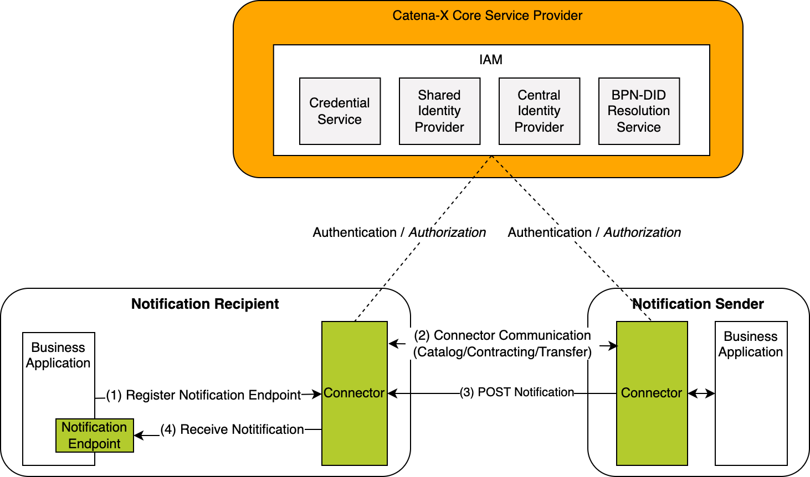

## Introduction

The Development View provides information and resources for implementing Supply Chain Disruption Notifications (further: notifications) standards. The architecture chapter describes the interactions of all components in the notifications context. The policies chapter describes the access policies, usage policies and contract definitions. The protocol chapter gives examples how the data asset is registered in the connector. In the chapter sample data the semantic data model of the Supply Chain Disruption Notifications are defined with a reference to the turtle file and an example JSON payload. For quick installation guides and reference to a ready implementation of notifications, please see Operation View.

## Architecture

Figure 1 shows the high-level architecture of the notification exchange in the Catena-X dataspace and the services that are involved. Both the notification sender and the notification recipient must be members of the Catena-X network in order to communicate with each other. With the help of the Identity Access Management (IAM) each participant can authenticate itself, verify the identity of the requesting party and decide whether to authorize the request.

_Figure 1: High-level architecture of the notification exchange in the Catena-X dataspace_

From conceptual point of view the system consists of different building blocks. These building blocks in the following diagram show which participant deploys which components. Identification and Access Management is omitted for simplicity reasons.

_Figure 2: Whitebox view on a PURIS system_

## Notice

This work is licensed under the [CC-BY-4.0](https://creativecommons.org/licenses/by/4.0/legalcode)

- SPDX-License-Identifier: CC-BY-4.0
- SPDX-FileCopyrightText: 2024 ZF Friedrichshafen AG
- SPDX-FileCopyrightText: 2024 Bayerische Motoren Werke Aktiengesellschaft (BMW AG)
- SPDX-FileCopyrightText: 2024 SAP SE
- SPDX-FileCopyrightText: 2024 Mercedes Benz Group AG
- SPDX-FileCopyrightText: 2024 BASF SE
- SPDX-FileCopyrightText: 2024 SupplyOn AG
- SPDX-FileCopyrightText: 2024 Henkel AG & Co.KGaA
- SPDX-FileCopyrightText: 2024 Contributors of the Eclipse Foundation
- SPDX-FileCopyrightText: 2024 ISTOS GmbH (a member of the DMG Mori Group)
- SPDX-FileCopyrightText: 2024 Fraunhofer-Gesellschaft zur Foerderung der angewandten Forschung e.V. (represented by Fraunhofer ISST)
- SPDX-FileCopyrightText: 2024 TRUMPF Werkzeugmaschinen SE + Co. KG
- SPDX-FileCopyrightText: 2024 Volkswagen AG
- SPDX-FileCopyrightText: 2025 WITTE Automotive GmbH
- SPDX-FileCopyrightText: 2025 Ford Werke GmbH
- SPDX-FileCopyrightText: 2025 Robert Bosch Manufacturing Solutions GmbH
- SPDX-FileCopyrightText: 2025 IBM Deutschland GmbH
- SPDX-FileCopyrightText: 2024 Contributors to the Eclipse Foundation
