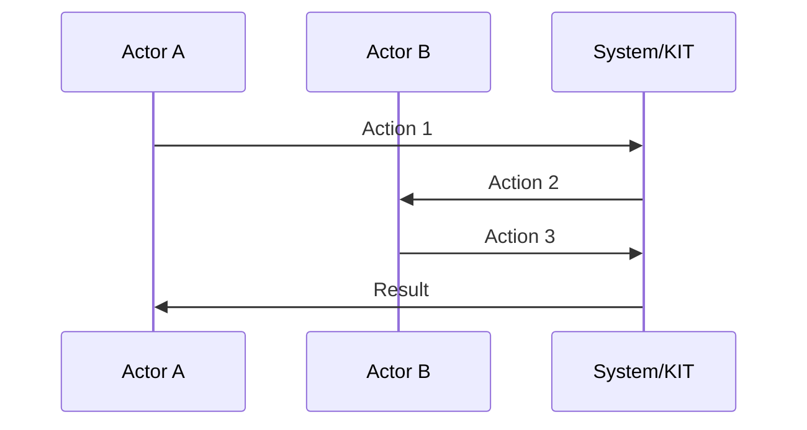

<!--
 ********************************************************************************* 
 * Copyright (c) 2025 Contributors to the Eclipse Foundation
 * 
 * See the NOTICE file(s) distributed with this work for additional
 * information regarding copyright ownership.
 * 
 * This program and the accompanying materials are made available under the
 * terms of the Apache License, Version 2.0 which is available at
 * https://www.apache.org/licenses/LICENSE-2.0.
 * 
 * Unless required by applicable law or agreed to in writing, software
 * distributed under the License is distributed on an "AS IS" BASIS, WITHOUT
 * WARRANTIES OR CONDITIONS OF ANY KIND, either express or implied. See the
 * License for the specific language governing permissions and limitations
 * under the License.
 * 
 * SPDX-License-Identifier: Apache-2.0
 ********************************************************************************/
-->

## Adoption View


Welcome to the **[KIT_NAME] KIT Adoption View**. This view provides business value, strategic benefits, and use cases for business stakeholders and decision-makers.

:::info Target Audience
Business Managers, Product Owners, Solution Architects, Industry Experts, and Decision Makers.
:::

---

## Vision & Mission

### Vision

> [Insert your KIT's vision statement]

[Brief explanation of the vision and strategic objectives]

### Mission

> [Insert your KIT's mission statement]

[Brief explanation of the problem being solved]

---

## Business Value

### Value Proposition #1: [Title]

**Benefit**: [Primary benefit description]

**Target Stakeholders**: [OEMs | SMEs | Solution Providers | etc.]

**Measurable Outcomes**: [Key metrics]

### Value Proposition #2: [Title]

**Benefit**: [Second benefit description]

**Target Stakeholders**: [Target audience]

**Measurable Outcomes**: [Key metrics]

### Value Proposition #3: [Title]

**Benefit**: [Third benefit description]

**Target Stakeholders**: [Target audience]

**Measurable Outcomes**: [Key metrics]

---

### Summary of Business Benefits

| Stakeholder Type | Key Benefits | Time to Value |
|------------------|--------------|---------------|
| **OEMs** | [List 2-3 benefits for large enterprises] | [e.g., "6 months"] |
| **SMEs** | [List 2-3 benefits for small-medium enterprises] | [e.g., "3 months"] |
| **Solution Providers** | [List 2-3 benefits for tech vendors] | [e.g., "90 days"] |
| **Data Providers** | [List 2-3 benefits for data providers] | [e.g., "4 weeks"] |

---

## Use Case Context

### Industry Challenge

[Describe current industry problems and pain points]

**Current Challenges:**

- **Challenge 1**: [Problem description and impact]
- **Challenge 2**: [Problem description and impact]
- **Challenge 3**: [Problem description and impact]

### The Solution

[Explain how this KIT addresses the challenges]

**Solution Components:**

1. **[Component 1]**: [Description]
2. **[Component 2]**: [Description]
3. **[Component 3]**: [Description]

---

## Use Cases

### Primary Use Case: [Use Case Name]

**Description**: [Use case description]

**Actors**: [Actor 1], [Actor 2], [Actor 3]

**Process Flow**:

1. [Step 1 description]
2. [Step 2 description]
3. [Step 3 description]

**Business Outcomes**: [Key outcomes]

**Success Metrics**: [Key metrics]

### Secondary Use Case: [Use Case Name]

[Same structure as primary use case]

### Additional Use Cases

1. **[Use Case 3]**: [Brief description]
2. **[Use Case 4]**: [Brief description]

---

## Business Processes

:::tip
For industry-specific business processes, see the [Industry Extensions](https://github.com/eclipse-tractusx/eclipse-tractusx.github.io/tree/main/docs-kits/kit-template/industry-extensions) documentation.
:::

### Core Business Process: [Process Name]

**Purpose**: [Business goal]

**Stakeholders**: [List key stakeholders]

**Process Steps**:



**Process Description**: [Brief description of key steps]


### Access & Usage Policies

:::warning Industry-Specific Policies
For industry-specific policy requirements, refer to the [Industry Extensions](https://github.com/eclipse-tractusx/eclipse-tractusx.github.io/tree/main/docs-kits/kit-template/industry-extensions) section.
:::

#### Example Access Policy

```json
{
  "policy": {
    "permission": {
      "action": "use",
      "constraint": {
        "leftOperand": "UsagePurpose",
        "operator": "isAnyOf",
        "rightOperand": [
            "mx.core.digitalTwinRegistry:1"
        ]
      }
    }
  }
}
```

[Brief policy explanation]

---

## Semantic Models

[Brief explanation of semantic models used in this KIT]

### Core Semantic Models

| Model Name | Version | Purpose | Link |
|------------|---------|---------|------|
| [Model 1] | X.Y.Z | [Model purpose] | [Link] |
| [Model 2] | X.Y.Z | [Model purpose] | [Link] |

### Model Example: [Model Name]

**Description**: [Brief description]

**Key Attributes**: [List key attributes]

**Example**:

```json
{
  "attribute1": "example-value",
  "attribute2": 12345
}
```

---

## Standards

:::warning Industry-Specific Standards
For industry-specific standards, refer to the [Industry Extensions](https://github.com/eclipse-tractusx/eclipse-tractusx.github.io/tree/main/docs-kits/kit-template/industry-extensions) section.
:::

### Supported Standards

| Standard | Version | Description | Compliance Level | Link |
|----------|---------|-------------|------------------|------|
| [Standard 1] | X.Y | [Description] | Mandatory/Optional | [Link] |
| [Standard 2] | X.Y | [Description] | Mandatory/Optional | [Link] |

---

## Tutorials & Resources

### Getting Started Tutorial

[Link to tutorial or brief description]

### Video Resources

| Title | Duration | Link |
|-------|----------|------|
| [Video 1] | [X min] | [Link] |

### Whitepaper

[Link to whitepaper if available]

## NOTICE

This work is licensed under the [CC-BY-4.0](https://creativecommons.org/licenses/by/4.0/legalcode).

- SPDX-License-Identifier: CC-BY-4.0
- SPDX-FileCopyrightText: [YYYY] [YOUR_COMPANY]
- SPDX-FileCopyrightText: [YYYY] Contributors to the Eclipse Foundation
- Source URL: [https://github.com/eclipse-tractusx/eclipse-tractusx.github.io](https://github.com/eclipse-tractusx/eclipse-tractusx.github.io)
