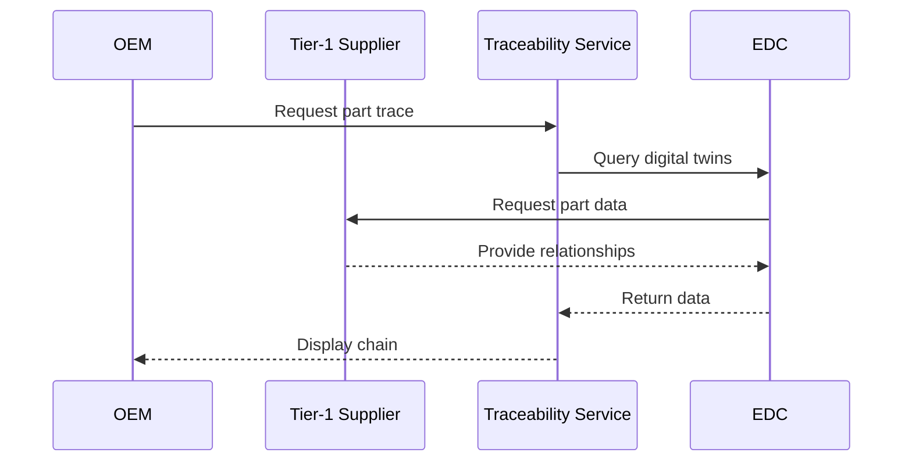

<!--
 ********************************************************************************* 
 * Copyright (c) 2025 Contributors to the Eclipse Foundation
 * 
 * See the NOTICE file(s) distributed with this work for additional
 * information regarding copyright ownership.
 * 
 * This program and the accompanying materials are made available under the
 * terms of the Apache License, Version 2.0 which is available at
 * https://www.apache.org/licenses/LICENSE-2.0.
 * 
 * Unless required by applicable law or agreed to in writing, software
 * distributed under the License is distributed on an "AS IS" BASIS, WITHOUT
 * WARRANTIES OR CONDITIONS OF ANY KIND, either express or implied. See the
 * License for the specific language governing permissions and limitations
 * under the License.
 * 
 * SPDX-License-Identifier: Apache-2.0
 ********************************************************************************/
-->

## Automotive Industry Extension


This extension adapts the **[KIT_NAME] KIT** for the automotive industry with Catena-X standards compliance.

:::info Extension Purpose
Adds: Catena-X standards, automotive semantic models, business processes, and policies.
:::

---

## Catena-X Standards

| Standard | Version | Description | Compliance |
|----------|---------|-------------|------------|
| CX-0001 | 2.0.0 | EDC Discovery API | Mandatory |
| CX-0002 | 2.0.0 | Digital Twins | Mandatory |
| CX-0018 | 3.0.0 | Dataspace Connectivity | Mandatory |

[Link to Catena-X Standard Library](https://catena-x.net/en/standard-library)

---

## Semantic Models

### Serial Part (CX-0002)

**Version**: 3.0.0

**Aspect Model**: `urn:samm:io.catenax.serial_part:3.0.0#SerialPart`

**Key Attributes**: `catenaXId`, `localIdentifiers`, `manufacturingInformation`, `partTypeInformation`

**Example**:

```json
{
  "catenaXId": "urn:uuid:ed2ace5b-b25d-4e64-9b54-c2fb13c35a5c",
  "localIdentifiers": [
    {
      "key": "manufacturerPartId",
      "value": "95657362-83"
    }
  ],
  "manufacturingInformation": {
    "date": "2023-02-04T14:48:54",
    "country": "DEU"
  },
  "partTypeInformation": {
    "manufacturerPartId": "95657362-83",
    "nameAtManufacturer": "High Voltage Battery"
  }
}
```

[Semantic Hub](https://semantics.catena-x.net/)

---

## Business Processes

### Supply Chain Traceability

**Purpose**: End-to-end traceability of automotive parts

**Actors**: OEM, Tier-1/Tier-N Suppliers, Traceability Service Provider

**Process Flow**:



---

## Access & Usage Policies

### Catena-X Framework Policy

```json
{
  "@context": {"odrl": "http://www.w3.org/ns/odrl/2/"},
  "@type": "PolicyDefinitionRequestDto",
  "@id": "cx-policy",
  "policy": {
    "@type": "Policy",
    "odrl:permission": [{
      "odrl:action": "USE",
      "odrl:constraint": {
        "odrl:leftOperand": "BusinessPartnerNumber",
        "odrl:operator": {"@id": "odrl:eq"},
        "odrl:rightOperand": "BPNL00000003CRHK"
      }
    }]
  }
}
```

---

## Use Cases

### Quality Alert Distribution

**Description**: Rapidly distribute quality alerts across supply chain

**Actors**: Alert Issuer, Supply Chain Partners, Catena-X Services

**Process**: Issue detection → Alert creation → Digital twin query → Distribution → Acknowledgment

**Benefits**: Faster response, reduced costs, improved safety

---

## Compliance

| Regulation | Region | Relevance |
|------------|--------|----------|
| GDPR | EU | Data protection |
| Battery Regulation | EU | Battery passport |
| Supply Chain Due Diligence | DE | ESG reporting |

**Certifications**: ISO/TS 16949, VDA 6.3, TISAX

---

## Getting Started

1. Review [Core KIT Adoption View](../../adoption-view/adoption-view.md)
2. Study [Catena-X Standards](https://catena-x.net/en/standard-library)
3. Implement semantic models from [Semantic Hub](https://semantics.catena-x.net/)
4. Follow [Operations View](../../operations-view/operations-view.md)
5. Join [Catena-X Community](https://catena-x.net/en/community)

---

## Resources

- [Catena-X Standard Library](https://catena-x.net/en/standard-library)
- [Tractus-X Open Source](https://eclipse-tractusx.github.io/)

## NOTICE

This work is licensed under the [CC-BY-4.0](https://creativecommons.org/licenses/by/4.0/legalcode).

- SPDX-License-Identifier: CC-BY-4.0
- SPDX-FileCopyrightText: [YYYY] [YOUR_COMPANY]
- SPDX-FileCopyrightText: [YYYY] Contributors to the Eclipse Foundation
- Source URL: [https://github.com/eclipse-tractusx/eclipse-tractusx.github.io](https://github.com/eclipse-tractusx/eclipse-tractusx.github.io)
