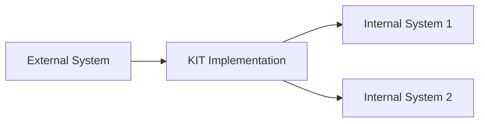

<!--
 ********************************************************************************* 
 * Copyright (c) 2025 Contributors to the Eclipse Foundation
 * 
 * See the NOTICE file(s) distributed with this work for additional
 * information regarding copyright ownership.
 * 
 * This program and the accompanying materials are made available under the
 * terms of the Apache License, Version 2.0 which is available at
 * https://www.apache.org/licenses/LICENSE-2.0.
 * 
 * Unless required by applicable law or agreed to in writing, software
 * distributed under the License is distributed on an "AS IS" BASIS, WITHOUT
 * WARRANTIES OR CONDITIONS OF ANY KIND, either express or implied. See the
 * License for the specific language governing permissions and limitations
 * under the License.
 * 
 * SPDX-License-Identifier: Apache-2.0
 ********************************************************************************/
-->

## [Your Application Name] - Success Story

 or [Application Logo]

**Organization**: [Company/Organization Name]

**Industry**: [Industry Sector]

**Implementation Type**: COTS / Open Source / Custom

**Go-Live Date**: [Month Year]

**KIT Version**: [e.g., 1.2.0]

**Link to Repo**: [if exists]

---

## Executive Summary

[2-3 sentences summarizing the implementation, key challenges addressed, and main outcomes]

---

## The Challenge

### Business Problem

[Describe the business problem or opportunity that led to implementing this KIT]

**Key Pain Points**:

- [Pain point 1]
- [Pain point 2]
- [Pain point 3]

### Technical Requirements

- [Technical requirement 1]
- [Technical requirement 2]
- [Technical requirement 3]

---

## The Solution

[Feel free to add demos and images]

### Implementation Approach

**Timeline**: [X weeks/months]

**Team Size**: [X people]

**Key Technologies**:

- [Technology 1]
- [Technology 2]
- [Technology 3]

### Architecture Overview

[Brief description of how the KIT was implemented in their architecture]

### Key Features Implemented

1. **[Feature 1]**: [Brief description]
2. **[Feature 2]**: [Brief description]
3. **[Feature 3]**: [Brief description]

---

## Demos

[Include here demo videos]

## Results & Impact

### Business Outcomes

| Metric | Before | After | Improvement |
|--------|--------|-------|-------------|
| [Metric 1] | [Value] | [Value] | [X%] |
| [Metric 2] | [Value] | [Value] | [X%] |
| [Metric 3] | [Value] | [Value] | [X%] |

### Quantified Benefits

- **Cost Savings**: [e.g., "Reduced operational costs by 25%"]
- **Time Savings**: [e.g., "Decreased processing time from 2 hours to 15 minutes"]
- **Quality Improvement**: [e.g., "Reduced error rate by 40%"]
- **Revenue Impact**: [e.g., "Enabled new revenue stream worth €X million"]

### Qualitative Benefits

- [Benefit 1 - e.g., "Improved customer satisfaction"]
- [Benefit 2 - e.g., "Enhanced data transparency"]
- [Benefit 3 - e.g., "Better compliance management"]

---

## Key Learnings

### What Worked Well

- **[Success Factor 1]**: [Description]
- **[Success Factor 2]**: [Description]
- **[Success Factor 3]**: [Description]

### Challenges Overcome

- **[Challenge 1]**: [Description and how it was resolved]
- **[Challenge 2]**: [Description and how it was resolved]

### Recommendations for Others

1. [Recommendation 1]
2. [Recommendation 2]
3. [Recommendation 3]

---

## Testimonial

> "[Quote from project sponsor or key stakeholder about the implementation and its impact]"
>
> — **[Name]**, [Title], [Company]

---

## Technical Details

### Integration Points

- **System 1**: [Integration method and protocol]
- **System 2**: [Integration method and protocol]
- **System 3**: [Integration method and protocol]

### Scalability

- **Current Load**: [e.g., "Processing 10,000 transactions per day"]
- **Peak Capacity**: [e.g., "Tested up to 50,000 transactions per day"]
- **Growth Readiness**: [e.g., "Architecture supports 10x growth"]

### Security & Compliance

- [Security measure 1]
- [Compliance requirement 1]
- [Audit capability]

---

## Future Plans

- [ ] [Planned enhancement 1]
- [ ] [Planned enhancement 2]
- [ ] [Planned expansion to other business units/regions]

---

**More Information**: [Link to case study, blog post, or additional resources]

---

## Related Resources

- [Link to implementation guide]
- [Link to technical documentation]
- [Link to presentation or webinar]

## NOTICE

This work is licensed under the [CC-BY-4.0](https://creativecommons.org/licenses/by/4.0/legalcode).

- SPDX-License-Identifier: CC-BY-4.0
- SPDX-FileCopyrightText: [YYYY] [YOUR_COMPANY]
- SPDX-FileCopyrightText: [YYYY] Contributors to the Eclipse Foundation
- Source URL: [https://github.com/eclipse-tractusx/eclipse-tractusx.github.io](https://github.com/eclipse-tractusx/eclipse-tractusx.github.io)
