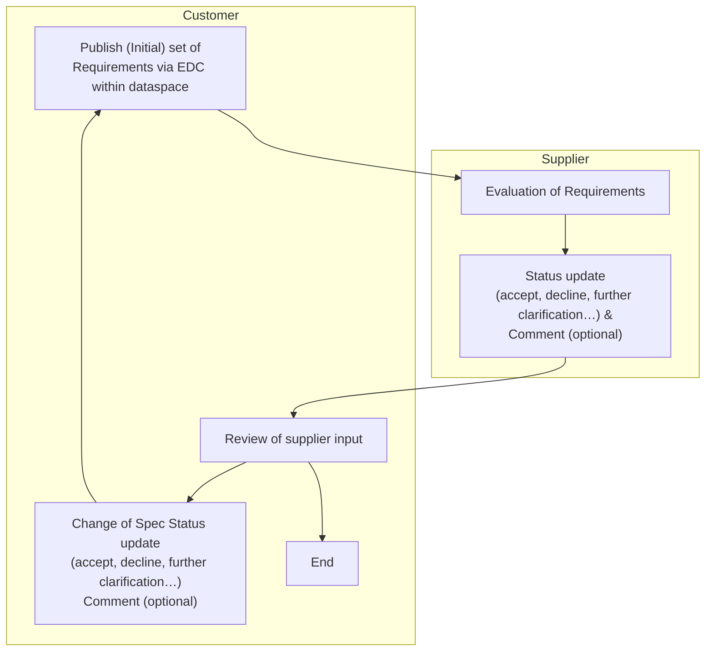

## Vision & Mission

### Vision

Our vision is to establish a seamless, secure, and efficient engineering platform within the Catena-X ecosystem. In a first step a collaborative platform for cross company requirements management that enables quick information access and multiple company collaboration via a standardized solution in the Catena-X dataspace, inspired by ReqIF (Requirements Interchange Format). By leveraging ReqIF, we aim to optimize the information flow and collaboration between OEMs and their suppliers, fostering a deep understanding and clear communication of requirements across company boundaries, while reducing time for exchanging requirements from point to point using common data exchange tools.

At the heart of this commitment is the guarantee of data sovereignty any time. Each partner should be able to share their data securely while retaining full control over their own information. This enables transparent and trustworthy collaboration in product development by providing all stakeholders access to relevant requirement sets and documents without compromising proprietary or confidential information.

This vision opens the way for innovative and collaborative product development by providing a structured and standardized method for managing, exchanging, and validating requirements across supply chains. This new approach promises significant advantages such as:

1. Enhanced Connectivity and Collaboration: We envision a digital landscape where all stakeholders can quickly access and share requirements data, fostering innovation and reducing time-to-market for new products.
2. Standardization and Interoperability: Efficiently manage the diversity of requirements and specifications, ensuring that different systems can seamlessly communicate with each other.
3. Data Sovereignty and Security: By employing the secure infrastructure of Catena-X, partners can maintain full control over their data while ensuring it is protected during exchanges, thereby building trust and transparency across the network.
4. Real-time Integration and Agility: Through Catena-X, changes and updates to requirements can be synchronized in realtime, allowing teams to respond swiftly to evolving project needs and external challenges.
5. Improved Quality and Compliance: This unified platform will not only enhance the accuracy and consistency of requirements data but also streamline compliance with industry standards and regulations, ultimately elevating product quality.

### Mission

The Requirements Kit aims to meticulously outline requirements by incorporating essential standards, aspect models and business logics. Its approach is designed to facilitate the exchange of requirements information between OEMs and Tier-N suppliers, ensuring that all relevant data is gathered and enabling authorized stakeholders to collaborate effectively. The data exchange process adheres to the Catena-X network's principles of data sovereignty, ensuring secure and compliant interactions. By following a standardized pipeline and utilizing data models within a data ecosystem, each partner is empowered to use their preferred applications, fostering a flexible and efficient collaboration environment.

## Business Value & Benefits

### Business Value

The "Requirements-KIT" provides guidelines and standards, such as semantic models and data exchange processes, which help companies create a reliable and sovereign data exchange system with their partners.

This reduces cost and effort needed to integrate data-driven engineering processes into their operations and IT systems.

Since this KIT is built on the Industry Core KIT and will be closely connected to upcoming other KITSs within the Engineering Domain, investment and implementation costs to integrate requirement services are reduced.

### Todays Challenge

As product development becomes more and more cross-company, the requirements that are necessary for the specification of the product to be developed must also be exchanged and harmonized across companies. This exchange for coordination between the customer and the development partner takes place in an iterative process that results in various documentation and changes to the specifications.

Nowadays, the exchange of requirements is largely file-based, with the files being provided or exchanged via company portals (B2B platforms), for example. In most cases, the requirements are first managed by the client in special requirements management software. As a starting point for collaboration in the product development process, one or more files for the product to be developed are extracted from the requirements management software with the requirements and possibly other information and made available to the development partner. In order for the development partner to view and evaluate the requirements, they must import the file into their requirements management tool (which may or may not be the same as the customer's). Once the requirements have been evaluated by the development partner, the partner exports another file from its requirements management tool and makes it available to the client. The client then imports this file back into its system and evaluates the development partner's scores, comments, etc.

This involves the circular processing of requests between partners, which can result in multiple file exports and imports to and from the respective systems. Each import/export results in a break in the data. Changes within each version of the files must be tracked and displayed by the requirements management tools. This method of working with requirements is very time consuming and requires a lot of manual effort that has nothing to do with the actual evaluation of the requirements.

In addition to the challenges mentioned above, there is also the issue that the files can be designed in a variety of content forms and the formats of the files can also vary. The formats can be divided into structured and unstructured files. Unstructured files are texts, tables etc. that are not organized into individual requirements without prior processing. These increase the effort required to organize the document into individual requirements. This also makes the exchange with the partner more difficult, as the partner does not know the newly created structure. With structured files, the aforementioned circumstances no longer exist, as the requirements are already organized. In the best case, a standardized form, such as the ReqIF format, is used. However, even when using standardized formats such as ReqIF, it is still necessary to agree on a common data model for exporting and importing in advance so that data exchange via the various requirements management tools works as smoothly as possible.

### Benefits for OEM, SME and Solution Provider

#### OEM and large automotive suppliers

The Requirements Kit presents a transformative solution for OEMs and large automotive suppliers, fundamentally optimizing their requirements management processes. A core advantage is the capability for real-time publication, which dramatically increases the speed at which requirements can be shared, reviewed, and approved. This real-time capability facilitates rapid evaluation and alignment of requirements across diverse teams and organizational silos, ultimately accelerating product development cycles.

Crucially, the kit moves beyond the limitations of traditional file-based exchanges, transitioning to a seamless information exchange. This shift eliminates disruptive "data breaks" that often occur when information is repeatedly exported, imported, and manually reconciled across different systems. The result is a continuous and consistent flow of requirements data, reducing errors and saving significant manual effort.

Furthermore, the solution inherently builds in enhanced transparency and traceability. Every requirement, change, and approval can be tracked and attributed, providing a clear audit trail and improving overall accountability. This granular level of visibility is vital for complex product development in the automotive industry, where adherence to specifications and regulatory compliance are paramount.

The standardization inherent in the Requirements Kit offers substantial benefits, particularly in achieving greater data sovereignty and interoperability. Data sovereignty ensures that each participant maintains full control over their own information, even when shared within the collaborative environment. Interoperability, on the other hand, guarantees that different systems and tools can seamlessly communicate and exchange requirements data, fostering a more integrated and efficient engineering ecosystem. This standardization also paves the way for a higher degree of automation within the entire engineering toolchain, automating routine tasks and freeing up engineers to focus on higher-value activities. Finally, the kit's design allows for seamless connections to other engineering use cases within the broader Catena-X ecosystem, enabling a holistic approach to product development that extends beyond just requirements management. Ultimately, the Requirements Kit empowers OEMs and large suppliers with more efficient, secure, and agile requirements management, directly addressing the complex demands of modern automotive innovation.

#### SME

The Requirements Kit offers significant advantages for Small and Medium-sized Enterprises (SMEs), streamlining what can often be a complex and resource-intensive aspect of their operations. One of the most impactful benefits is the simplification of the requirements management process. By providing a standardized and intuitive framework, the kit reduces the learning curve and operational complexity associated with managing requirements, making it more accessible for SMEs with limited specialized resources.

A key economic advantage is the ability to replace proprietary B2B interfaces. Historically, SMEs have often had to manage multiple, bespoke interfaces to interact with various OEM and Tier-N customers, leading to significant IT overheads, maintenance costs, and integration challenges. With Catena-X acting as a single, standardized interface for all customers, SMEs can drastically reduce these expenses, freeing up valuable IT resources and time that can be reallocated to core business activities. This centralized approach fosters greater efficiency and reduces the burden of managing disparate systems.

Furthermore, the kit facilitates higher speed in requirements exchange. The real-time publication capabilities mean that SMEs can receive, review, and respond to requirements much faster than with traditional, file-based methods. This accelerated communication not only improves responsiveness but also helps to reduce overall project timelines. Lastly, the emphasis on reusability within the Requirements Kit is a considerable benefit. SMEs can leverage standardized requirement sets and data models, reducing the need to recreate information from scratch for each new project or customer. This not only saves time but also promotes consistency and accuracy across their operations, enabling them to compete more effectively in the automotive supply chain.

#### Solution Provider

Catena-X offers solution providers a variety of strategic advantages to leverage their innovation capabilities and strengthen their market position beyond the automotive industry. Here are some examples of how solution providers can benefit from Catena-X technology:

1. Expanded business and market opportunities: Catena-X brings together numerous participants from the automotive industry and now from other sectors like aviation, including manufacturers, suppliers, and service providers. Solution providers can showcase their solutions to a broad network and gain access to potential new customers.
2. Long-term partnerships: Solution providers can establish long-term partnerships with leading companies in the automotive industry worldwide, providing strategic advantages and access to future projects.
3. Increased visibility and reputation: By participating in the Catena-X network, solution providers can enhance their brand presence and reputation in a significant industrial area, which is particularly valuable for new or smaller providers.
4. Compliance with regulatory requirements: Catena-X already offers a framework to better meet regulatory requirements in data management and exchange, which can be crucial for solution providers to ensure compliance with significantly less effort in development of the solutions provided.
5. Standardized interfaces: Catena-X promotes the use of uniform and open standards for data and information ex-change as well as tool interoperability, facilitating product integration and accelerating market introduction for solution providers.
6. Interoperability and integration: Especially for solution providers relying on interoperability, Catena-X provides a framework to seamlessly integrate their solutions across various platforms and systems, particularly important for providers offering cloud services or API-based products.
7. Scalability of solutions: With a standardized approach, Catena-X enables solution providers to scale their solutions more easily and deploy them across different business areas of the automotive industry and beyond.
8. Innovation platform: The network offers solution providers the opportunity to collaborate with other stakeholders and develop innovative technologies, especially in areas such as data analytics, artificial intelligence, IoT, and block-chain.
9. Access to data and analysis: With access to valuable industrial data, solution providers can develop and enhance their analytics and optimization solutions to boost operational efficiency and decision-making processes for customers.
10. Accelerated digital transformation: Catena-X allows solution providers to position their transformation strategies directly within the context of the automotive industry, a sector that is continually moving towards digital technologies.

## Customer Journey

## User Journey

## Notice

This work is licensed under the [CC-BY-4.0](https://creativecommons.org/licenses/by/4.0/legalcode).

- SPDX-License-Identifier: CC-BY-4.0
- SPDX-FileCopyrightText: 2025 Dräxlmaier GmbH & Co. KG
- SPDX-FileCopyrightText: 2025 Schaeffler AG
- SPDX-FileCopyrightText: 2025 Mercedes Benz Group AG
- SPDX-FileCopyrightText: 2025 ZF Friedrichshafen AG
- SPDX-FileCopyrightText: 2025 Contributors to the Eclipse Foundation
