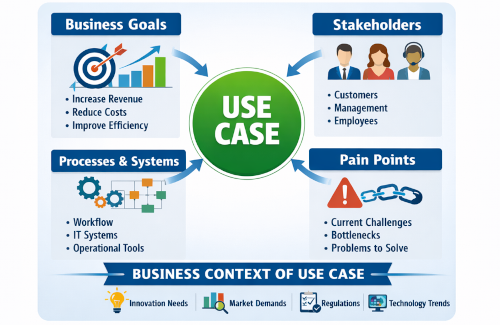

<!--
Copyright(c) 2026 Contributors to the Eclipse Foundation

See the NOTICE file(s) distributed with this work for additional
information regarding copyright ownership.

This work is made available under the terms of the
Creative Commons Attribution 4.0 International (CC-BY-4.0) license,
which is available at
https://creativecommons.org/licenses/by/4.0/legalcode.

SPDX-License-Identifier: CC-BY-4.0
-->

<!-- 
KIT LOGO START - Generated automatically from the configuration done in Kit Master Data
Replace <kit-id> with the id from your kit referenced in `data/kitsData.js`.
Do not remove!
This logo is only visible when compiled with Docusarus (final version of the hosted KIT)
-->

import Kit3DLogo from '@site/src/components/2.0/Kit3DLogo';

<Kit3DLogo kitId="<kit-id>" />

<!--
KIT LOGO END
-->

## Introduction

<!-- Describe what problem this KIT solves and who benefits from it. -->

> TODO: Provide a short description of the KIT's purpose and scope.

## Vision and Mission

<!-- What is the long-term goal? What does the KIT deliver today? Problem statatement -->

## Vision

> TODO: Describe the vision of this KIT. Problem statement

## Mission

> TODO: Describe the mission of this KIT. Solution statement

## Business Context

<!-- Describe the business process or domain this KIT addresses. If a use case describe the use case. -->

> TODO: Describe the relevant business context and stakeholders.
> We recommend diagrams in drawio (need to be stored in SVG), or you can use mermaid or plant uml
> As described in TRG 1.04: https://eclipse-tractusx.github.io/docs/release/trg-1/trg-1-04
> You can also include infografics/ images (which are not diagrams, like above)

## Business Value

<!-- Describe why this KIT is attractive for service providers to be implemented -->

> TODO: Describe the business value of this KIT and why it should be implemented

## Standards

<!-- Provide a list of standards this KIT. -->

> TODO: Add the standards or external documetantion

| Name | Description | Link to standard |
| ---- | ----------- | ---------------------- |
| `CX-XXXX` | This protocol is important when doing the data exchange | [example-link](https://cx-example.com) |
| `FX-XXXX` | This protocol is important when doing a vertical integration with shop floor machinery | [example-link](https://fx-example.com) |
| `ISO XXXX:XXXX` | This protocol is used as | [example-link](https://iso-example.com) |

## NOTICE

This work is licensed under the [CC-BY-4.0](https://creativecommons.org/licenses/by/4.0/legalcode).

- SPDX-License-Identifier: CC-BY-4.0
- SPDX-FileCopyrightText: [YYYY] [YOUR_COMPANY]
- SPDX-FileCopyrightText: [YYYY] [ANOTHER_COMPANY]
- SPDX-FileCopyrightText: [YYYY] Contributors to the Eclipse Foundation
- Source URL: [https://github.com/eclipse-tractusx/eclipse-tractusx.github.io](https://github.com/eclipse-tractusx/eclipse-tractusx.github.io)
