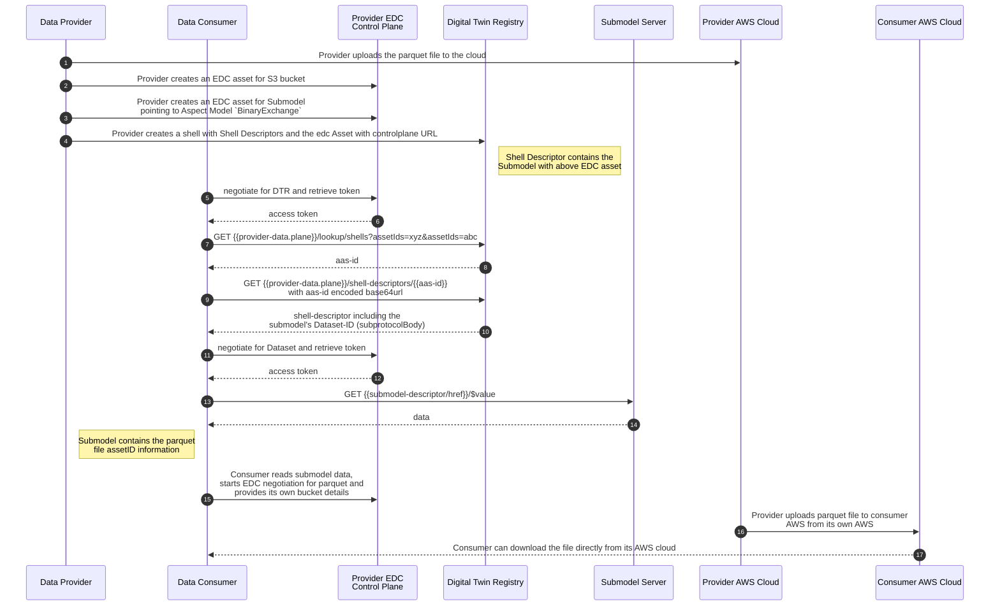

import UniqueIDPush from './parts/uniqueidpush.mdx'


Industry Core uses digital twins to make a company's data available to other Catena-X partners. Basics about digital twins with which you should be familiar to understand this section are described in the [Digital Twin KIT](../../../../../docs-kits/category/digital-twin-kit).

### Register Digital Twins

In Industry Core, different types of parts, e. g. serialized parts, batches, JIS parts or catalog part, are registered in a company's DTR as digital twins.

#### Regulatory Compliance and Security

To enforce a strict need-to-know principle (and to prevent data from being exposed to non-authorized partners in the Catena-X network), the visibility of digital twins and the content of the attribute `specificAssetIds` of digital twins must be restricted to authorized partners only. The actual implementation depends on the DTR product used by the Catena-X partner. More details can be found in the [Digital Twin KIT](../../../../../docs-kits/category/digital-twin-kit).

#### Handling of Digital Twins at Contract Manufacturing

Contract manufacturing refers to the practice of outsourcing the production of vehicles or components to external manufacturers through formal agreements. This is a common business model and process in the automotive industry and therefore needs to be considered within Catena-X.

- The creation of a DT has to be agreed first between the contracting authority and the contracting manufacturer. Regardless of who of the two parties creates the digital twin, it must always be created in the contracting authority's DTR. This in turn means that the contracting authority is always the owner of the digital twin of a part that is manufactured by a contract manufacturer.
- The contract manufacturer does not necessarily need to be a member of Catena-X, as it is often intended to remain confidential if a part is produced by a contract manufacturer. The contracting authority bears responsibility for the externally manufactured parts towards their customers, and therefore all communication, such as Quality Notifications, takes place via the contracting authority.
- If the contract manufacturer is not part of Catena-X, the required data are provided by the contractor outside of Catena-X, and the contracting authority creates the digital twin and performs the Look-up of the child parts to ensure traceability.

#### Unique ID for Parts

In the Industry Core, a Unique ID uniquely identifies a particular real-world asset. Currently, these are: serialized parts (including vehicles), batches, JIS parts (Just-in-Sequence) and also catalog parts.

A Unique ID is a URN and has the following format: `urn:uuid:<UUIDv4>`, i.e., the NID is "uuid" and the NSS is a UUID Version 4 (as described here: https://en.wikipedia.org/wiki/Universally_unique_identifier).

The Unique ID mus be created by the manufacturer of the part. At the latest, it must be created when the digital twin for this part is created as the Unique ID is part of the digital twin information.

Unique IDs are used in several places in the Industry Core, e.g., as `globalAssetId` for digital twins or as `catenaXId` in aspect models.

#### Conventions for Creating Digital Twins

The following general conventions apply for all digital twins:

- id: The AAS ID must be a UUIDv4 in URN format: `urn:uuid:<UUIDv4>`;
- globalAssetId: the Unique ID of the real-world part for which a digital twin is created.

> :warning: AAS ID and Unique ID are different identifiers, although they share the same format (UUID) and therefore look the same. A Unique ID identifies real-world assets, whereas a AAS ID identifies a digital twin of such an asset. Do not use the same value for Unique ID and AAS ID for a digital twin.

> :raised_hand: **Unique ID Push:** Once a digital twin was registered (initially created), optionally a Unique ID Push notification can be send from the manufacturer (creator of the digital twin) to the customer of the part to inform it that a new digital twin is available.

### Property specificAssetIds

Specific asset IDs are used to identify digital twins when looking up or searching for these digital twins. This is a required step by a customer of a part to connect the digital twins of their parts with the digital twins of the suppliers' child parts. To a customer, only the information printed on a real-world part is available and can be used for the lookup. Mandatory specific asset IDs ensure that at least this information is available for the digital twin.

The following conventions for specific asset IDs apply to all digital twins:

| Key | Availability | Description | Type |
| --- | --- | --- | --- |
| manufacturerId | Mandatory | The Business Partner Number (BPNL) of the manufacturer of the part. | BPNL |
| manufacturerPartId | Mandatory | The ID of the type/catalog part from the _manufacturer_. | String |
| customerPartId | Optional | The ID of the type/catalog part from the _customer_.  <br />The main reason why this property is optional is that it cannot be guaranteed that every manufacturer knows the customerPartId for their parts. In case the manufacturer knows the customer and the corresponding CustomerPartID of its part though, it is _required_ to add this information for easier lookup and to enable further processes. | String |
| digitalTwinType | Mandatory | The type of the digital twin:<br /><br />*   "PartInstance" for serialized parts, batches, and JIS parts<br />*   "PartType" for catalog parts<br /><br />digitalTwinType was added to allow data consumers to search for all digital twins of a particular type, e.g, only for catalog parts by using `digitalTwinType="PartType"` as filter. Without this filter, a search for a particular manufacturer part ID would not only return the digital twin of the catalog part, but also all digital twins of instances of this catalog part, i.e., of the corresponding serial parts. | String |

**For serialized parts, additionally the following conventions apply:**

| Key            | Availability | Description                                                                                  | Type   |
| :------------- | :----------- | :------------------------------------------------------------------------------------------- | :----- |
| partInstanceId | Mandatory    | The serial number of a part, as specified by the manufacturer, is the number that is applied to the part (e.g., as a barcode or DMC). The recipient (e.g., a customer) of the part will use this serial number information to look up the digital twin of the part in the manufacturer's Digital Twin Registry.<br/>A manufacturer might create more than one serial number for a part. For example, if customers require the serial number to have a customer-specific format, the manufacturer might create two serial numbers for every part: an internal one with a standard format for ease of use in the manufacturer's internal systems, and a customer-specific one that is actually applied to the part. In this case, the customer-specific serial number should be used as partInstanceId. | String |
| intrinsicId    | Mandatory    | This the unified technical key for searching a digital twin of a part. In this case the<br/> partInstanceId is used as the intrinsicId.                                         | String |
| van            | Optional     | **Only for vehicles:** The pseudonymized vehicle identification number (VIN) of the vehicle. | String |

**For batches, additionally the following conventions apply:**

| Key            | Availability | Description                                                                                                                                                                                                                                                                                                                                                                                                                                                                                      | Type   |
| :------------- | :----------- | :----------------------------------------------------------------------------------------------------------------------------------------------------------------------------------------------------------------------------------------------------------------------------------------------------------------------------------------------------------------------------------------------------------------------------------------------------------------------------------------------- | :----- |
| batchId        | Mandatory    | The number of the batch from the manufacturer.                                                                                                                                                                                                                                                                                                                                                                                                                                                   | String |
| intrinsicId    | Mandatory    | This the unified technical key for searching a digital twin of a batch. In this case the<br/> batchId is used as the intrinsicId. | String |

**For just-in-sequence (JIS) parts, additionally the following conventions apply:**

| Key               | Availability | Description                                                                                                                                                                                                                             | Type   |
| :---------------- | :----------- | :-------------------------------------------------------------------------------------------------------------------------------------------------------------------------------------------------------------------------------------- | :----- |
| parentOrderNumber | Optional     | A number identifying the just-in-sequence- part's destination parent part. The parent part is typically known upfront to the supplier for just-in-sequence parts.                                                                       | String |
| jisNumber         | Mandatory    | A number that is used to identify the call-off that can be assumed unique within the specific just-in-sequence process. This is typically not the sequence number, but the call-off number.                                             | String |
| jisCallDate       | Optional     | The date of the just-in-sequence call-off as stated on the call-off document itself. <br/>The value must be compliant to ISO 8601: `YYYY-MM-DD` or `YYYY-MM-DDThh:mm:ss` or `YYYY-MM-DDThh:mm:ss±hh:mm`                                 | Date   |
| intrinsicId       | Mandatory    | This the unified technical key for searching a digital twin of a just-in-sequence (JIS) part. In this case a composition of `jisNumber`, `parentOrderNumber` (if available), `jisCallDate` (if available) is used as the intrinsicId. This information is typically known upfront to the supplier `jisNumber`, `partOrderNumber` and `jisCallDate` for just-in-sequence parts. | String |

> :raised_hand: **Lookup of Digital Twins**
> The lookup for parts can use the customerPartId or the manufacturerPartId. Both, manufacturer and customer must agree upon what part ID will be used for the lookup. Otherwise, when the customer would use the customerPartId for the lookup, but the manufacturer would only provide the manufacturerPartId in its digital twins, the lookup would fail every time. **This is decision that a customer must agree upon with each of their suppliers individually.**
> In order to provide a standardised way to look-up digital twins, the specificAssetIDs are extended by a unified technical key, the intrinsicId. This ensures a correct semantic filling of all other existing attributes in the specificAssetIDs, as the partInstanceId was previously used as an overarching search field, which resulted in the partInstanceId being filled with a batch number for a batch, for example.
Nevertheless, a search for digital twins can still be used via the corresponding the primary fields from a business point of view, such as partInstanceId or batchId.

#### Submodel Descriptors

To enforce a strict need-to-know (and prevent data from being exposed to non-authorized parties), the visibility of entries in the attribute `specificAssetIds` must be protected, i.e.,their visibility must be restricted to authorized parties only. For that, the attribute `externalSubjectId` must be used. Detailed information about this can be found in the [Digital Twin KIT](../../digital-twin-kit/software-development-view).

##### Submodel Descriptors

Submodel descriptors must be compliant with the guidelines from the [Digital Twin KIT](../../../../../docs-kits/category/digital-twin-kit) as well as the following additional conventions:

- `id`: The submodel ID must be a UUIDv4 in URN format: "urn:uuid:&lt;UUIDv4&gt;";
- `idShort`: the name of the aspect model in camel case, e.g. for aspect SerialPart: "serialPart".

The actual access information for the Connector is part of the endpoint attribute in the submodel descriptor.

```json
{
    "interface": "SUBMODEL-3.0",
    "protocolInformation": {
        "href": "https://connector.data.plane/{publicContextPath}/{providerPath}/submodel",
        "endpointProtocol": "HTTP",
        "endpointProtocolVersion": ["1.1"],
        "subprotocol": "DSP",
        "subprotocolBody": "dspEndpoint=https://connector.control.plane/{catalogPath};id=123",
        "subprotocolBodyEncoding": "plain",
        "securityAttributes": [
          { "type": "NONE", "key": "NONE", "value": "NONE" }
        ]
    }
}
```

The following conventions apply for the endpoint:

- `interface`, `endpointProtocol`, `endpointProtocolVersion`, `subprotocol`, `subprotocolBodyEncoding`, and `securityAttributes` are set as defined in the CX-0002 standard.
- `href`: The endpoint address for the logical operation GetSubmodel that is invoked by a data consumer to get the submodel. It must have the following format:
  - `https://connector.data.plane/{publicContextPath}`: Address of the Connector data plane that is providing the submodel. `{publicContextPath}` is configured in the Connector settings and defaults to `/api/public`.
  - `{providerPath}`: This string is forwarded to the backend data service by the Connector data plane. Together with the Connector asset information (see below) it must contain all information for the backend data service to return the requested submodel. The actual path depends on the type of backend data service that the data provider uses to handle the request. More details follow below.
  - `submodel`: This `submodel` string is also forwarded to the backend data service. As AAS Profile SSP-003 of the Submodel Service Specification is mandatory for this release, `href` must have the suffix `/submodel` representing the invocation of the GetSubmodel operation.
- `subprotocolBody`: a semicolon-separated list of parameters used to negotiate the required contract agreement.
  - `dspEndpoint`: Base URL of the [catalog service](https://docs.internationaldataspaces.org/ids-knowledgebase/v/dataspace-protocol/catalog/catalog.binding.https#id-2.1-prerequisites) endpoint of a DSP Connector. The consumer Connector can use:
     - `catalog/request` to fetch the full catalog and search for the dataset in the catalog or
     - `catalog/datasets/{id}` to only fetch offers for the dataset with a particular dataset ID.
  - `id`: The ID of the Connector asset for which a contract negotiation should be initiated. This ID is also called dataset ID as it is stored as `https://www.w3.org/ns/dcat/dataset.@id` in a catalog entry. This ID must be set by the data provider when creating the asset. Do not confuse this Connector asset ID (dataset ID) with other IDs that might be defined additionally for a Connector asset, e.g., `https://w3id.org/edc/v0.0.1/ns/id` (often referred to as `edc:id`).

With this approach, the Connector asset structure must no longer follow the "one asset per submodel" rule (as in Release 3.1 and before), but gives data providers more flexibility how to create assets for their digital twins and submodels based on how they use `{providerPath}`.

##### Option 1: Same Connector Asset Structure as in Release 3.1

Submodels of digital twins are registered in the Connector the same way as for release 3.1: One asset is created for every submodel of a digital twin.

- `href` must have the following format: `https://connector.data.plane/{publicContextPath}/submodel`
- `subprotocolBody` must have the following format: `dspEndpoint=https://connector.control.plane/{catalogPath};id={datasetId}` with `{datasetId}` the ID of the Connector asset for the submodel.

Here's an example how such a submodel descriptor could look like:

```json
{
  "submodelDescriptors": [
    {
      "idShort": "serialPart",
      "id": "urn:uuid:7effd7f4-6353-4401-9547-c54b420a22a0",
      "semanticId": {
        "type": "ExternalReference",
        "keys": [
          {
            "type": "GlobalReference",
            "value": "urn:samm:io.catenax.serial_part:3.0.0#SerialPart"
          }
        ]
      },
      "endpoints": [
        {
          "interface": "SUBMODEL-VALUE-3.1",
          "protocolInformation": {
            "href": "https://connector.data.plane/api/public/submodel/$value",
            "endpointProtocol": "HTTP",
            "endpointProtocolVersion": [
              "1.1"
            ],
            "subprotocol": "DSP",
            "subprotocolBody": "dspEndpoint=https://connector.control.plane/api/v1/dsp;id=urn:uuid:7effd7f4-6353-4401-9547-c54b420a22a0",
            "subprotocolBodyEncoding": "plain",
            "securityAttributes": [
              {
                "type": "NONE",
                "key": "NONE",
                "value": "NONE"
              }
            ]
          }
        }
      ]
    }
  ]
}
```

In this example, the `{providerPath}` part in the `href` is empty, as the Connector asset referenced in `subprotocolBody` directly points to a service returning the correct submodel (set up correctly with its dataAddress in the data provider's Connector).

Note that the submodel interface value is 'SUBMODEL-VALUE-3.1', providing the submodel in the ValueOnly serisalisation. For Backward compatibility, if interface value 'SUBMODEL-3.1' is used, then '$value' is not required with endpointAddress given in href. For more information, refer to [IDTA interfaces payload](https://industrialdigitaltwin.io/aas-specifications/IDTA-01002/v3.1.1/specification/interfaces-payload.html#_endpoint)

##### Option 2: Connector Asset Structure on Catalog Part Level

A data provider can link several submodel endpoints to the same Connector asset (referenced by its ID). This allows to create only one asset (per aspect model) for a catalog part and link all submodels (of the same aspect model) for serialized parts of the catalog part to the same asset. The data provider would still need to create separate assets per aspect model as in most cases different usage policies are used for aspect models.

If a data provider no longer creates assets on the level of submodels, the Connector can no longer authorize a request on a submodel-level. For example: If assets are created per catalog part, the Connector can only authorize if the requestor is allowed to see parts of these type in general; if the requestor is allowed to see a actual serialized part, must be authorized by the backend data service executing the request.

Here's an example how such a submodel descriptor could look like:

```json
{
  "submodelDescriptors": [
    {
      "idShort": "serialPart",
      "id": "urn:uuid:7effd7f4-6353-4401-9547-c54b420a22a0",
      "semanticId": {
        "type": "ExternalReference",
        "keys": [
          {
            "type": "GlobalReference",
            "value": "urn:samm:io.catenax.serial_part:3.0.0#SerialPart"
          }
        ]
      },
      "endpoints": [
        {
          "interface": "SUBMODEL-VALUE-3.1",
          "protocolInformation": {
            "href": "https://connector.data.plane/api/public/urn%3Auuid%3A7effd7f4-6353-4401-9547-c54b420a22a0/submodel/$value",
            "endpointProtocol": "HTTP",
            "endpointProtocolVersion": [
              "1.1"
            ],
            "subprotocol": "DSP",
            "subprotocolBody": "dspEndpoint=https://connector.control.plane/api/v1/dsp;id=urn:uuid:1475f313-0a83-4e2b-b705-a100eebcb7d7",
            "subprotocolBodyEncoding": "plain",
            "securityAttributes": [
              {
                "type": "NONE",
                "key": "NONE",
                "value": "NONE"
              }
            ]
          }
        }
      ]
    }
  ]
}
```

The `{providerPath}` part of the `href` property contains the information for the backend data service which digital twin's submodel to return while the asset ID is used for several endpoints. The path part here is just an example as it depends on the type of backend data service the data provider uses.

The above options are only two examples how a submodel's endpoint can be created. As long as it's compliant with the above conventions (including CX-0002) a data provider can also use any other asset structure.

#### Performance Test Digital Twin Registry

The purpose of performance test was to analyze how much data can be retrieved from the Digital Twin Registry and Submodel Server within a specific period of time.
All available shellIds were exported in a CSV file because the API lookup/shells is called once to load all matched shellIds from the DTR. The entire workflow was considered to perform realistic load tests using Apache JMeter.

**Datasets**

| Type                  | Component                 | Quantity | Description                                                        |
|:----------------------|:--------------------------|:---------|:-------------------------------------------------------------------|
| Digital Twin Registry | Shells Descriptors        | 1000     | Each Shell Descriptor contains 4 Submodel Descriptors              |
|                       | Submodel Descriptors      | 4000     | Each Submodel Descriptor points to a dataset in the Submodel Server|
| SubmodelServer        | Submodel Server Datasets  | 4000     | Entries corresponding to the Submodel Descriptors                  |

**Workflow:**

The tested workflow includes the following steps:
1.	Randomly select a `shellId` from the given CSV File
2.	GET DTR EDR Token from EDC controlplane (execute every 4 minutes)
a.	Retrieve EDC Catalog to determine which EDC Asset is responsible for the DTR.
b.	Fetch EDR token for the DTR.
3.	Call DTR API `shell-descriptors/id` via EDC dataplane to load the Shell Descriptor.
4.	Randomly select a Submodel Descriptor.
5.	GET SUBMODEL EDR Token FROM EDC controlplane (execute every 4 minutes)
a.	Query the EDC Catalog to find the EDC Asset for the Submodel.
b.	Fetch EDR token for the Submodel Server.
6.	Retrieve the dataset from the Submodel Server via EDC dataplane, as defined in the `href` of the Submodel Descriptor.

**Result**

Test was performed using 20 threads in parallel. The average number of transactions per second was 30-35.

> :raised_hand: If the performance is still not satisfactory for the user, then next given approach can be used, where the big parquet file can be transfer using EDC.

#### Mass Data Consumption with AAS Submodel Descriptor for Referencing Large Files (e.g., Parquet or other Binary Files)

A data consumer must first identify the correct submodel descriptor for a Catena-X data transfer. For Catena-X submodel descriptors, the `subprotocol` attribute must have the value "DSP". Then, the data consumer must use the information in the `subprotocolBody` to perform a contract negotiation for the asset referenced by `id` with the Connector of the data provider specified by `dspEndpoint` and afterwards initiate the data transfer.

Further information about the data transfer of submodels can be found in the [Digital Twin KIT](../../../../../docs-kits/category/digital-twin-kit).

#### Cloud-to-Cloud Parquet File Transfer with EDC Cloud Extension



1. `Provider` uploads the parquet file to the cloud (S3 bucket in our case)
2. `Provider` creates an EDC asset for S3 bucket. The `dataAddress` includes information about the S3 bucket and the file name:

```json
 {
   "edc:dataAddress": {
     "edc-type": "Cloud type e.g. AmazonS3",
     "edc:bucket": "<provider-bucket>",
     "edc:keyName": "<file-name>"
   }
 }
```

See also full example here: [edc-asset for file transfer](https://eclipse-tractusx.github.io/docs-kits/kits/data-driven-quality-management-kit/software-operation-view#quality-data-offers-at-edc)

3. `Provider` creates another EDC asset for Submodel pointing to Aspect Model `BinaryExchange`. This aspect model will contain the information (dspAssetId, dataplane URL and controlplane URl) for AmazonS3 EDC asset created by provider in step 3.
4. `Provider` creates a shell with Shell Descriptors and the edc Asset with controlplane URL. This Shell Descriptor contains the Submodel Descriptor which refers to EDC asset created in step 4.
5. `Consumer` calls the DTR via EDC dataplane and reads the Submodel Descriptor for `BinaryExchange` aspect model from the Shell Descriptor.
6. `Consumer` calls Submodel Server using dataplane URL, which is setup by the provider and in response receives the information (dspAssetId, dataplane URl (resource value) and controlplane URL) for AmazonS3 EDC asset created by provider in step 3.
7. `Consumer` starts negotiation/transfer process and provides its own bucket information:

```json
 {
   "edc:dataDestination": {
     "edc-type": "Cloud type e.g. AmazonS3",
     "edc:bucket": "<consumer-bucket>",
     "edc:keyName": "<file-name>",
     "edc:accessKeyId":"<access-key-id>",
     "edc:secretAccessKey":"<secretAccessKey>"
   }
 }
```

8. `Provider` retrieve the request and download the requested Parquet file from bucket and upload it to the consumer bucket.
9. `Consumer` can download the file from their own bucket.

#### Submodel Descriptor for Parquet File Retrieval and Transfer

A Submodel Descriptor for Parquet File Information may be structured as:

```json
{
  "submodelDescriptors": [
    {
      "idShort": "qualityData",
      "id": "<uuid>",
      "endpoints": [
        {
          "interface": "SUBMODEL-VALUE-3.1",
          "protocolInformation": {
             "href": "https://connector.data.plane/api/public/parquet/urn%3Auuid%3A7effd7f4-6353-4401-9547-c54b420a22a0/$value",
            "endpointProtocol": "HTTP",
            "endpointProtocolVersion": [
              "1.1"
            ],
            "subprotocol": "DSP",
            "subprotocolBody": "id=<dsp-asset-id>;dspEndpoint=<controlplane-url>",
            "subprotocolBodyEncoding": "plain",
            "securityAttributes": [
             {"type": "NONE","key": "NONE","value": "NONE"}
             ]
          }
        }
      ],
      "semanticId": {
        "type": "ExternalReference",
        "keys": [
           {
              "type": "GlobalReference",
              "value": "urn:samm:io.catenax.binary_exchange:1.0.0#BinaryExchange"
           }
        ]
      },
        "description": [
        {
          "language": "en",
          "text": "submodel-descriptor for quality usecase which provides data for parquet file to be transferred via EDC."
        }
      ]
    }
  ]
}
```

| Parameter               | Value                                                                                                   | Description                                                                                                       |
|-------------------------|---------------------------------------------------------------------------------------------------------|-------------------------------------------------------------------------------------------------------------------|
| href                    | dataplane URL                                                                                           | This dataplane URl returns aspect model BinaryExchange                                                            |
| subprotocolBody         | id=dsp-asset-id;dspEndpoint=controlplane-url                                                            | Includes Information about Provider DSP Control Plane and DSP-Asset ID                                            |
| subprotocolBodyEncoding | plain                                                                                                   | Encoding type for Submodel response                                                                               |
| semanticId.keys[].value | urn:samm:io.catenax.binary_exchange:1.0.0#BinaryExchange                                                | Aspect Model Providing DSP Metadata for Binary File Exchange.                                                     |
| description[].text      | Submodel descriptor for quality use case, supporting parquet file exchange through DSP.                 | Further description for the consumer.                                                                             |

**Aspect model BinaryExchange is part of Industry Core standard [CX-0151-IndustryCoreBasics](https://catenax-ev.github.io/docs/next/standards/CX-0151-IndustryCoreBasics#1222-additional-recommendations-and-comments) and can be found in Semantic Modeling repository [Github](https://github.com/eclipse-tractusx/sldt-semantic-models/)**

A sample payload for BinaryExchange aspect model is described below:
  ```json
{
  "mappingRuleId": "CX-0123",
  "binaryFile": {
    "value": "https://edc.dataplane.url/api/public/urn:uuid:a377ff49-6bde-4215-8d38-b8f02c991a35",
    "contentType": "application/octet-stream"
  },
  "dspInformation": {
    "controlPlaneUrl": "https://semantics-edc-provider-controlplane.catenax.net/api/v1/dsp",
    "dspAssetId": "d99cfe94-bfa0-4eba-9e31-d30c4f31831b"
  },
  "fileContentDescriptionId": "urn:samm:io.catenax.fleet.diagnostic_data:3.0.0"
}
  ```

### Lookup in the Digital Twin Registry

For a data provider the following steps are currently required when they have to lookup digital twins of other partners in the Catena-X network.

- The data provider must use the local IDs for a serialized part or batch (manufacturer, part number, serial or batch number) and for a just-in-sequence part (manufacturer, parentOrderNumber, jisNumber, jisCallDate) to lookup the AAS ID of the digital twin of this serialized part, batch or just-in-sequence part. The AAS descriptor with this ID contains the Unique ID of the serialized part, batch or just-in-sequence (as globalAssetId) that is used to create SingleLevelBomAsBuilt submodel.

- The data provider must use the local IDs for a catalog part (manufacturer, part number) to lookup the AAS ID of the digital twin of this catalog part. The AAS descriptor with this ID contains the Unique ID of the catalog part (as globalAssetId) that is used to create the SingleLevelBoMAsPlanned submodel.

For a data consumer, there are currently the following steps where they have to lookup digital twins of other partners in the Catena-X network.

- The data consumer in the Traceability use case in most cases will use the Unique ID of a part to lookup the digital twin (more precisely, its AAS ID) of this part.
- The data consumer from another use case (e.g., Circular Economy), might either use the Unique ID of a part (if known) or the local IDs of a part to lookup the part's digital twin (AAS ID) depending on what is available in the use case.

#### Lookup up a Digital Twin with Local IDs

The local IDs of a serialized part (manufacturer, part number, serial number) are stored as specific asset IDs in the AAS descriptor of the digital twin. From the Digital Twin Registry API, the following function can be used for this lookup `GET /lookup/shells`.

All Asset identifier key-value-pairs used as parameter to this lookup function are passed to the API separately via the parameter `assetIds` in Base64 format. An example query would look like this: `/lookup/shells?assetIds=ewogICJuYW1lIjogIm1hbnVmYWN0dXJlcklkIiwKICAidmFsdWUiOiAiQlBOTDc1ODg3ODc4NDlWUSIKfQ==&assetIds=ewogICJuYW1lIjogIm1hbnVmYWN0dXJlclBhcnRJZCIsCiAgInZhbHVlIjogIjk1NjU3MzYyLTgzIgp9&assetIds=ewogICJuYW1lIjogInBhcnRJbnN0YW5jZUlkIiwKICAidmFsdWUiOiAiTk8tNTc0ODY4NjM5NDI5NTUyNTM1NzY4NTI2Igp9`

**The assetIds value looks like this unencoded (but with additional spaces and linebreaks):**

- First `assetIds` parameter:
  ```json
  {
    "name": "manufacturerId",
    "value": "BPNL7588787849VQ"
  }
  ```
- Second `assetIds` parameter:
  ```json
  {
    "name": "manufacturerPartId",
    "value": "95657362-83"
  }
  ```
- Third `assetIds` parameter:
  ```json
  {
    "name": "partInstanceId",
    "value": "NO-574868639429552535768526"
  }
  ```

The lookup (for serialized parts/batches as well as catalog parts) can use the customer or the manufacturer part ID (manufacturerPartId or manufacturerPartId).

- For a digital twin, adding the customer part ID to the specific asset IDs is optional. The main reason for this is that it cannot be guaranteed that every manufacturer knows the customer part ID for their parts. But, if they know it, it is recommended to always add the customer part ID to the specific AssetId property for easier lookup (by customers).
- A customer that wants to do a lookup for a supplier's digital twin, must first decide what ID they want to use for the lookup. This depends on the information that is available to them.
  - If the customer knows the manufacturer part id, they should use the manufacturer part ID for the lookup as the manufacturer part ID is guaranteed to be available in the digital twin (as the manufacturer part ID is a mandatory property).
  - If the customer does not know the manufacturer part id, they must use the customer part ID (i.e., their own part id). In that case they must make sure that their suppliers register their digital twins with this information (as the customer part ID is optional) as part of the specific asset IDs. This is decision that a customer must agree upon with each of their suppliers individually.

As a result, the AAS ID of the digital twin with this local IDs is returned. The AAS ID can then be used to retrieve details about the digital twin, i.e. the digital twin's AAS descriptor including submodel descriptors.

**Example result for looking up a digital twin with local IDs:**

```json
["urn:uuid:c227a880-b82b-40f7-846c-3942ddf26c29"]
```

Note that this query can return more than one AAS ID depending on the local IDs uniquely identifying a digital twin or not.

Currently, even if more than one digital twin is returned in a lookup, these digital twins should have different submodels assigned to them. These submodels should be disjunct and not overlap. This means that you can use the submodel to filter out the correct digital twin.

- If there are returned more than one digital twin with the same submodel (based on their semanticId), this is considered an error. Processing should be canceled and an error message should be reported.

The next section describes to modify the lookup to additionally restrict the results to digital twins with a specific submodel type based on it's semanticId.

#### Implicit Connection Between a Part Type Twin and the Corresponding Part Instance Twins

To find the corresponding part instance twins to a given part type twin, it is possible to use the lookup functionality. Searching for the specific asset IDs `manufacturerId` and `manufacturerPartId` and `digitalTwinType = "PartInstance"` of the given part type twin will find all corresponding part instance twins.

To find the corresponding part type twin to a given part instance twin, it is possible to search for the specific asset IDs `manufacturerId`, `manufacturerPartId` and `digitalTwinType = "PartType"` of the given part instance twin.

To find the corresponding part instance twins to a given part instance twin, it is possible to search for the specific asset IDs `manufacturerId`, `manufacturerPartId` and `digitalTwinType = "PartInstance"` of the given part instance twin.

### Unique ID Push

Once the digital twin was created, optionally a Unique ID Push notification can be send by the manufacturer of the part to the customer of the serialized part of batch to inform the customer that information about a serialized part or batch is available as a digital twin. This is an optional process and both, the manufacturer of a part as well as the customer of the part must support Unique ID Push notifications.

For more information, see Unique ID Push Notifications

#### Query a Digital Twin Registry to find the digital twin for this built-in part

- Querying digital twins is described in [Lookup in the Digital Twin Registry](#lookup-in-the-digital-twin-registry)
  - Note that the query parameters differ depending on what type of digital twin is looked up.
    - Regardless of whether you want to search for serialised parts, batches or just-in-sequence (JIS) parts, you can currently use the intrinsicId as a standardised technical key to look up digital twins. You can find the corresponding filling of this attribute in the tables above, depending on which specification is involved.
    - However, if you already know the specification of the digital twin you are looking for before the look up, you can also carry out a search using the corresponding key attributes, like partInstanceId, batchId or a composition of `jisNumber`, `parentOrderNumber` (if available), `jisCallDate` (if available). The partInstanceId with search parameter value serial number should be used for serialised parts, the batchId with search parameter value batch number for batches and a composition of `jisNumber`, `parentOrderNumber` (if available), `jisCallDate` (if available) with their corresponding search parameter values for JIS parts.
  - To understand why, take a look at how these digital twins are created, especially their [specific asset IDs](#property-specificassetids).
  - The result of this query will be the AAS ID of the digital twin.
- Use this AAS ID to get the AAS Descriptor including all Submodel Descriptors of this digital twin. The AAS Descriptor contains the Submodel Descriptor SerialPart or Batch (depending on the digital twin type).
- Fetch the submodel SerialPart or Batch (depending on the digital twin type) from the Connector that is referenced in the corresponding Submodel Descriptor.
- The submodel then contains the Unique ID of the built-in part in its catenaXId attribute.

These steps have to be repeated for all built-in parts by the manufacturer. After that, the manufacturer has all information to create the SingleLevelBomAsBuilt.

#### Publish Traceability Data Offers in the Connector

With the flexible approach described above, the actual asset structure for submodels in the Connector is no longer restricted by use case conventions and can be decided by the data provider.

#### Data Provider Tasks

Basically, as a data provider you have to do the following

- Implement a Backend Data Service (BDS) for every asset that is provided via the Connector. It does not have to be a different BDS for each asset - you can use the same BDS for several assets (to be verified).
- The BDS must support the Asset Administration Shell Profile SSP-003 of the Submodel Service Specification (see standard CX-0002 for more details).
- The BDS must use the REST API data plan for data transmission.
- The BDS must verify that it only returns data to the data consumer that is compliant to the asset and data offer for which data is queried and authorize the request accordingly.

<UniqueIDPush components={props.components} />

## NOTICE

This work is licensed under the [CC-BY-4.0](https://creativecommons.org/licenses/by/4.0/legalcode).

- SPDX-License-Identifier: CC-BY-4.0
- SPDX-FileCopyrightText: 2023 BASF SE
- SPDX-FileCopyrightText: 2023 Bayerische Motoren Werke Aktiengesellschaft (BMW AG)
- SPDX-FileCopyrightText: 2023 Fraunhofer-Gesellschaft zur Foerderung der angewandten Forschung e.V. (represented by Fraunhofer ISST & Fraunhofer IML)
- SPDX-FileCopyrightText: 2023 German Edge Cloud GmbH & Co. KG
- SPDX-FileCopyrightText: 2023 Mercedes Benz AG
- SPDX-FileCopyrightText: 2023 Robert Bosch Manufacturing Solutions GmbH
- SPDX-FileCopyrightText: 2023 SAP SE
- SPDX-FileCopyrightText: 2023 Siemens AG
- SPDX-FileCopyrightText: 2023 T-Systems International GmbH
- SPDX-FileCopyrightText: 2023 ZF Friedrichshafen AG
- SPDX-FileCopyrightText: 2023 Contributors to the Eclipse Foundation
- Source URL: https://github.com/eclipse-tractusx/eclipse-tractusx.github.io/tree/main/docs-kits/kits/industry-core-kit (latest version)
