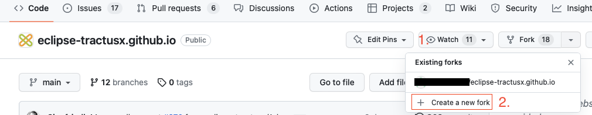
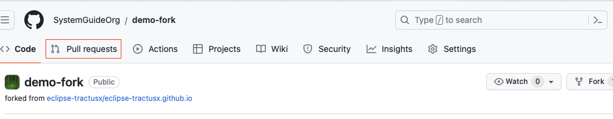
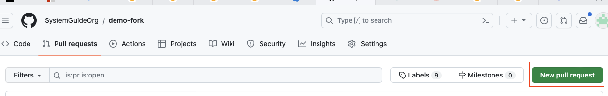
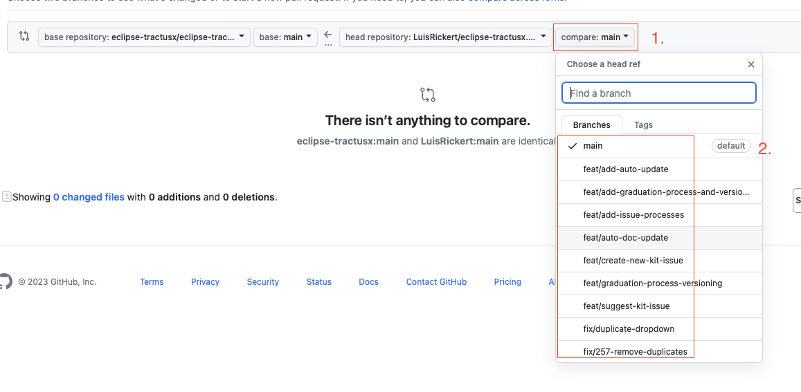
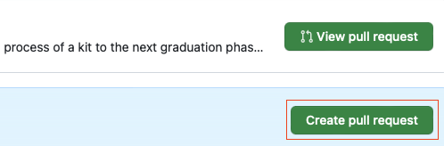
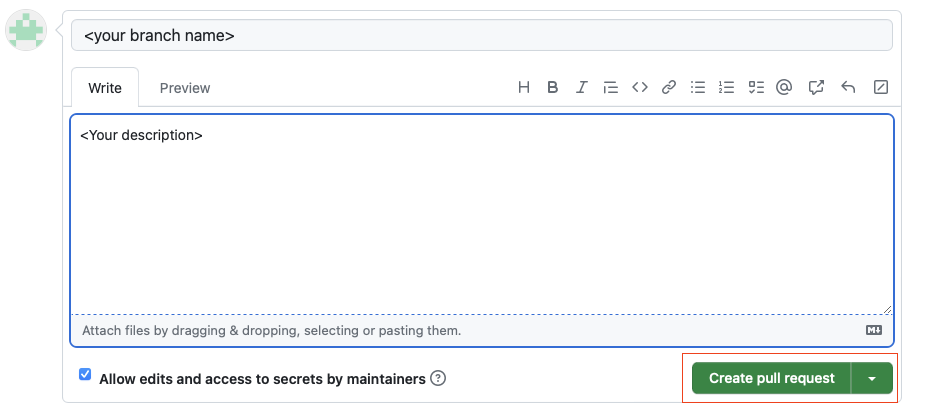

```md
    **********************************************
    ** DISCLAIMER                               **
    ** THIS PROCESS IS STILL UNDER DEVELOPMENT  **
    ** FEEDBACK IS APPRECIATED                  **
    **********************************************
```

On this page you find a description on how to create/update your KITs documentation.

## Process

Currently the documentation has to be manually maintained by the process described below. This is only a temporary solution as we are still in process on finding the perfect fitting process.

### Overview

1. Create a fork of the [Tractus-X website repository]("https://github.com/eclipse-tractusx/eclipse-tractusx.github.io") by clicking on the "fork" button on the top right
   

2. Edit your documentation with regard to the schema. Note that you **only** apply changes to the content within the `docs-kits` directory! If you modify your or other content outside of this directory your changes will be rejected!
3. create a pull request

   1. click on "Pull Requests"

      

   2. click on "New Pull Request"

      

   3. Select Branch which should be merge into the base repository

      

   4. Click on Create Pull request

      

   5. Add Description, what you add/change/improve. If available link an Issue with "#\<Issue Number\>. Then click on "Create Pull request"

      

4. The Tractus-X Team will review your pull request

The pull request will be approved if it meets our schema and liniting requirements.

### Schema

In order to have a uniform apperance we expect the documentation to be in a similar structure. You find the template in the template folder, a structural overview is below:

```md
    .
    └── <KIT Name>
        ├── changelog.md
        ├── page-adoption-view.md
        ├── page-software-development-view.md
        ├── page-documentation.md
        ├── page-software-operation-view.md
        └── sidebar.js
```

The sections within these files are the aligned with the artefacts described [here](https://eclipse-tractusx.github.io/docs/artefacts/).

Additionaly we apply linter for to the submitted code which will atomatically reject your pull request if these fail.

## Notes

- The documentation is only a copy thus it will not be automatically updated!
- you find our linters [here]("https://github.com/eclipse-tractusx/eclipse-tractusx.github.io")
