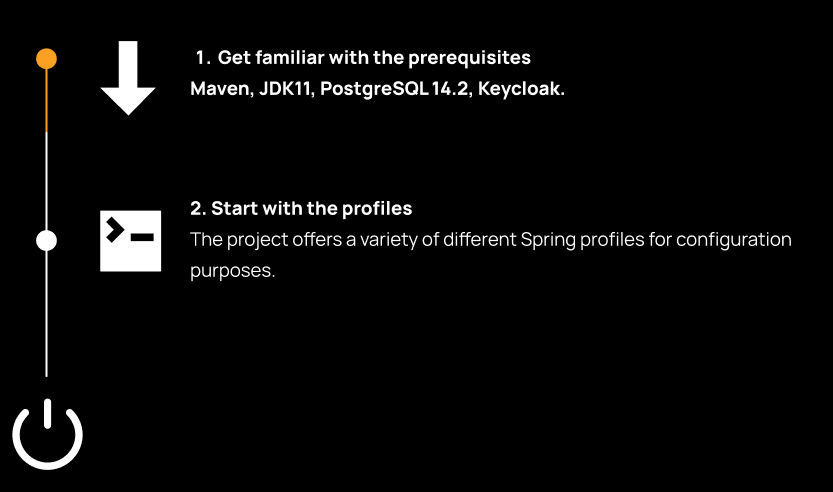

## How to Run

BPDM is a SpringBoot Kotlin software project managed by Maven.

Detailed description on how to run this service can be found here:
[https://github.com/eclipse-tractusx/bpdm/blob/main/README.adoc](https://github.com/eclipse-tractusx/bpdm/blob/main/README.adoc)
