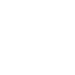

The Catena-X-Standards for Demand- and Capacity-Management enable participants of the automotive supply chain to become more resilient and to increase the degree of collaboration aimed at avoiding or solving production bottlenecks as well as surplus situations in a tactical horizon of 1-2 years.

Thereby the standards empower participants to share data in a secure and sovereign way while ensuring the interoperability of the different applications involved in the process. 
 
## Status Quo

**Today's challenge for automotive companies**
Resilience has become imperative within Supply Chain Management, especially over the past years. With the growing complexity of supply chains and a rising number of global and local crises, small and medium enterprises (SMEs) as well as large enterprises (LEs) are facing an increased risk of serios disruptions in their supply chains, bullwhip effects and in the worst case even temporary production shutdowns with a high effort and costs of replanning.
 
Inside the volatile and highly complex surroundings of the automotive industry nowadays, mostly tailor-made, proprietary and often fully manual IT solutions support the demand and capacity management processes along the value chain. One the one hand side there is no common understanding of these processes among the participants. On the other hand, different data formats as well as application programming interfaces are used, which is increasing the complexity in the data exchange and which is leading to transfer problems, inconsistencies, or even loss of data.

## Why DCM KIT?

The purpose and focus of Demand and Capacity Management (DCM) KIT is twofold: 
- Define a common understanding of the DCM process thus paving the way for more proactive and efficient collaboration.
- Establish process and application interoperability with the help of common semantics and unified interfaces for data exchange while ensuring the data sovereignty of data providers.
 
Implementing the DCM standards will add the following core capabilities to business applications:
- Provisioning and consumption of material demands data in a sovereign manner.
- Provisioning and consumption of capacity data in a sovereign manner.
- Discovery of bottlenecks and surplus capacity situations by employing a unified calculation logic.
 
(Coming soon) The DCM standard comprises three main elements: 
- **Core Business logic** – to focus on a **common understanding** of the **DCM processes** among the participants.
- **APIs** – to make sure that data are transmitted and consumed properly as well as are identically interpreted across companies. 
- **Data model** – to align the structure of the shared data and enable the adoption of the core business logic without misinterpretation.
 

## POWER of STANDARD

Standards create trust. Customer and Supplier can form new partnerships confidently. Knowing that integration in the network will be dramatically simplified. Standardization can help reduce costs by eliminating redundancies and streamlining processes. By adopting a common set of practices and technologies, businesses can avoid the need to develop their own proprietary systems, which can be expensive and time-consuming.

## DATA SOVEREIGNTY in FOCUS

DCM KIT keeps up with Catena X commitment to data sovereignty. This KIT has the goal to always comply with the data sovereignty principle set through implemented by the Eclipse Dataspace Connector. That enables all participants in the supply chain  to always stay in full control of their own data.  

This is how sharing data is fun.

## INTEROPERABILITY at its BEST

Application and Service Provider can reduce investments to integrate DCM data models/API specification from DCM KIT.

The Kit enables the offering of value-add services and innovation based on process description of the core business logic and how a collaborative approach is a win-win-situation for customer and supplier.

## COLLABORATION is KEY

The DCM KIT enables better and faster issue resolution. We believe that collaboration is the key to creating and maintaining strong partnerships between customers and suppliers and, at the same time, enhancing problem solving to reach a more balanced and efficient supply and demand management.
 
Of course, by realizing efficiency through improved collaboration all involved partners will gain competitive advantage over those that do not collaborate.
