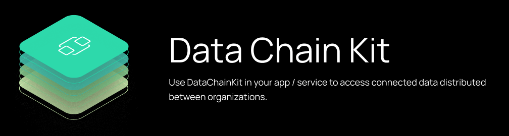
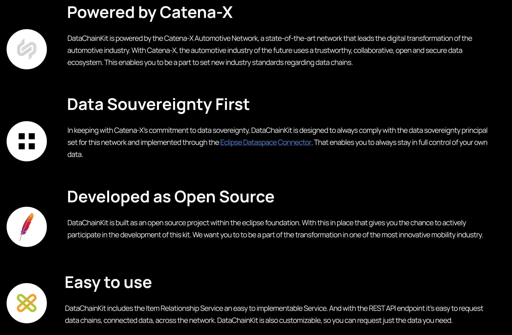
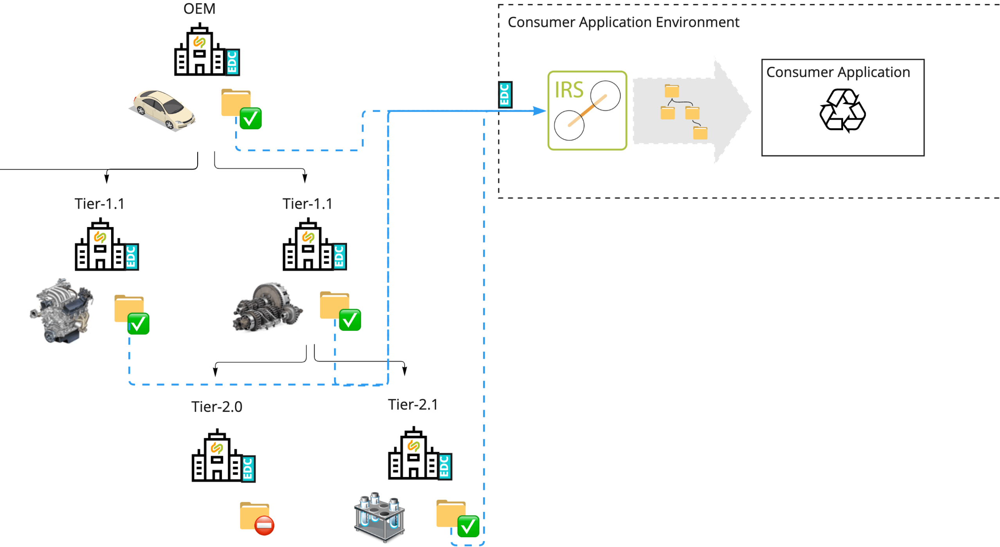

DataChainKit brings valuable data chain information to your use-cases and services through connected data that can help Business Owner and Catena-X participants to be up to date and prepared. It's easy to use the DataChainKit with an Open Source Software package, which can easily deployed via HELM or docker-compose. The DataChainKit enables to apply business logic along a distributed data chains, for example aggregation of certificates along the value chain. Also ad-hoc provisioning of continuous data chains across company boundaries for empowerment of use cases Circular Economy, Traceability, Quality and the European supply chain act.

[#GreenIT] [#DataSovereignty] [#Interoperability] [#ConnectedData]

## Why Data Chain Kit

What is in for you to use the Data Chain Kit. On what is it built on.

## IRS Iterative

The IRS iterative iterates through the different digital twin aspects, which are representing a relationship. For Release 1 this is the AssemblyPartRelationship aspect, which connects serialized parts. This service can access the digital twins for which a EDC policy and and data contract exists. In this case the consumer needs a contract which each participant of the data chain.

The following general conditions apply:
-access control through policies and contracts is done by the EDC
-direct data exchange between supply-chain partners
-Catena-X partners of the accessible value chain are known to the data-consumer
