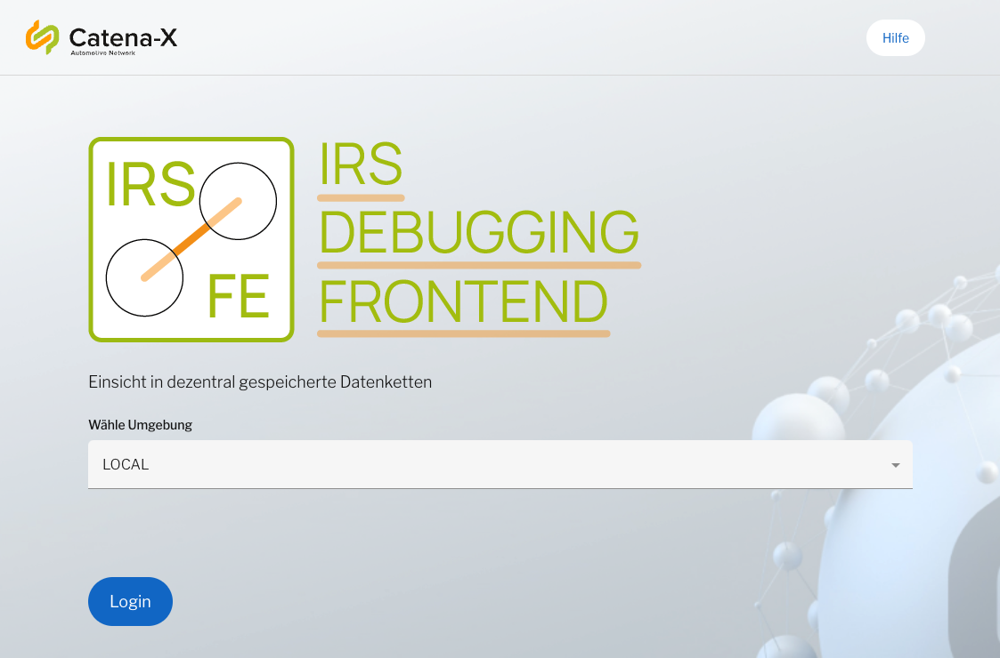
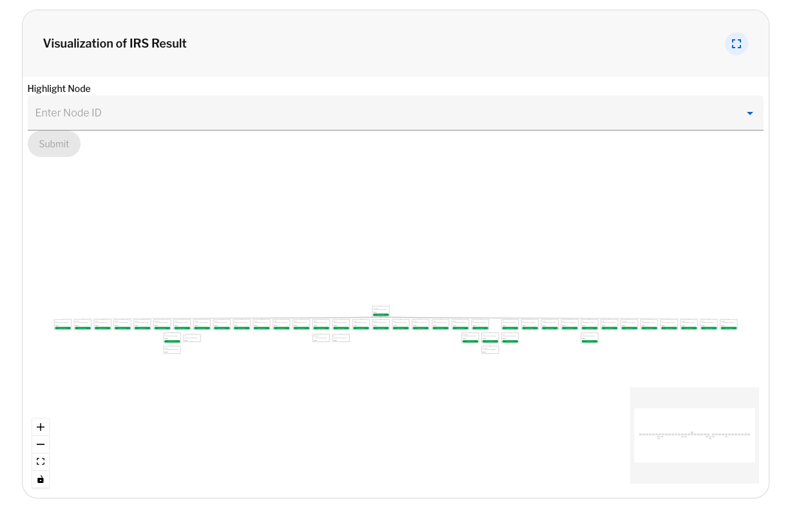
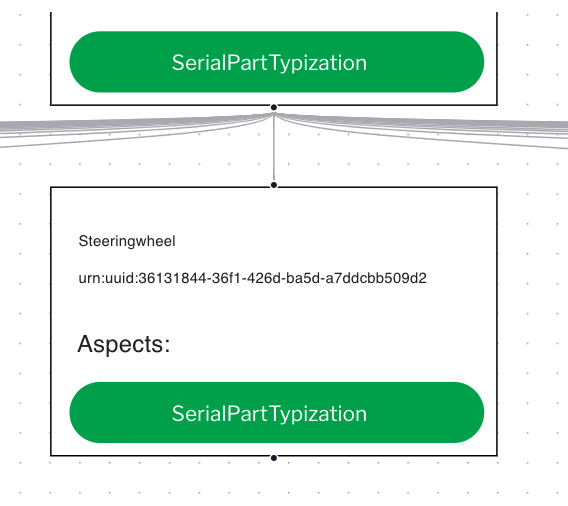

## Local Deployment

Run a working demo scenario of the Item Relationship Service with a mocked Catena-X network to retrieve data chains:

* Item Relationship Service
* Eclipse Dataspace Connector for accessing data
* Eclipse Dataspace Connector for data provisioning
* a Submodelserver and Testdata for provisioning test digital twins
* Authentication Mock
* Registry Service to register test digital twins
* Item Relationship Service Debugging View to visualize the Results of the Item Relationship Service

This emulates the communication over EDC, retrieving assets via a registry and building one continous data chain with data from different companies.

This local deployment is an easy installation with helm. This setup is built to run on a kuberneetes cluster.

| Step                                                                             | Action                              | Description                                                             |
|----------------------------------------------------------------------------------|-------------------------------------|-------------------------------------------------------------------------|
|| **[Install the prerequisites](#step-1-install-the-prerequisites)**| Install all necessary tools for this setup                                     |
|    | **[Get Helm Chart](#step-2-get-helm-chart)**               | Get all necessary code to deploy the service and dependencies to the kuberneetes cluster|
|     | **[Start demo environment](#step-3-start-demo-environment)**|Start cluster and interact with the Item Relationship Service|

### Step 1: install the prerequisites

The following prerequisties need to be installed, so that the local helm deployment can be of success.

* [Install helm](https://helm.sh/docs/intro/install/)
* [Install kubectl](https://kubernetes.io/docs/tasks/tools/)
* [Install minikube](https://kubernetes.io/de/docs/tasks/tools/install-minikube/#minikube-installieren)
* [Install rancher](https://ranchermanager.docs.rancher.com/getting-started/quick-start-guides/deploy-rancher-manager/helm-cli#install-rancher-with-helm)

### Step 2: get Helm Chart

Check out the project [Item Relationship Service](https://github.com/eclipse-tractusx/item-relationship-service) or download a [released version](https://github.com/eclipse-tractusx/item-relationship-service/releases) of the Item Relationship Service

### Step 3: start demo environment

in the xxx folder you will find a start.sh file. With this script you will load all dependencies and start the setup.

```bash
./charts/localdeployment/start.sh
```

Wait until all pods and services are up and running.

### Step 4: access Debbugging View

open [http://localhost:3000/](http://localhost:3000/) and you should see the Item Relationship Service login screen.

**IMPORTANT:** select **local** in the dropdown!


*Item Relationship Service login screen*

## Testing the Item Relationship Service

| Step                                                                             | Action                          | Description                                                              |
|----------------------------------------------------------------------------------|---------------------------------|--------------------------------------------------------------------------|
|    | **1. [Start Data Chain process](#step-1-configure-a-data-chain)** |GET /IRS/Job with job parameters.                                         |
|     | **2. [Verify  Results](#step-2-verify-results)**          |After retrieval of the Data Chain, you can check it in the Debugging View. |

### Step 1: Configure a Data Chain

use the [API documentation](./Software%20Development%20View/page_software-development-view.md) to get more details on how to interact with the API Endpoint.

<!-- TODO: ADD Info about Testdata -->
Item Relationship Service POST /irs/jobs example body:

```json
{
  "aspects": [
    "AddressAspect"
  ],
  "bomLifecycle": "asBuilt",
  "callbackUrl": "https://hostname.com/callback?jobId={jobId}&jobState={jobState}",
  "collectAspects": true,
  "depth": 100,
  "direction": "downward",
  "globalAssetId": "urn:uuid:6c311d29-5753-46d4-b32c-19b918ea93b0",
  "lookupBPNs": true
}
```

For test purposes an already working setting has been added as you can see in the example below. So for your first try you just need to press on the button **build data chain**.
After this you will this job in the Item Relationship Job Store list. Just click on the row and you will get more information on the current running data chain building process.

*Item Relationship Service Job overview*

### Step 2: Verify Results

The following example shows a visual overview of all retrieved data assets and digital twins of a data chain.

*Item Relationship Service visualization overview*

With the following snippet all clickable objects will be explained:

* **Digital Twin:** the box itself is clickable and will open an overlay to show more information on this object.
* **Aspect:** the green button is clickable and represents an Aspect or Submodel of the twin.
* **Relationship Aspect:** the line between Digital Twins is clickable and will give detailed Information about the relationship between the twins.


*Item Relationship Service clicable objects*

### Item Relationship Service POST request examples

#### successful BomAsBuilt Data Chain

```json
{
  "aspects": [
    "SerialPartTypization",
    "AssemblyPartRelationship"
  ],
  "bomLifecycle": "asBuilt",
  "collectAspects": true,
  "depth": 10,
  "direction": "downward",
  "globalAssetId": "urn:uuid:6c311d29-5753-46d4-b32c-19b918ea93b0",
}
```

#### failing BomAsBuilt Data Chain

```json
{
  "aspects": [
    "SerialPartTypization",
  ],
  "bomLifecycle": "asBuilt",
  "collectAspects": true,
  "depth": 10,
  "direction": "upward",
  "globalAssetId": "urn:uuid:6c311d29-5753-46d4-b32c-19b918ea93b0",
}
```
