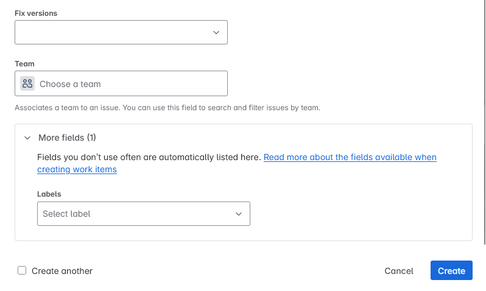
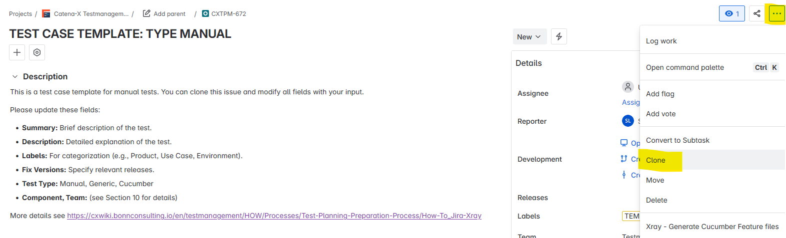
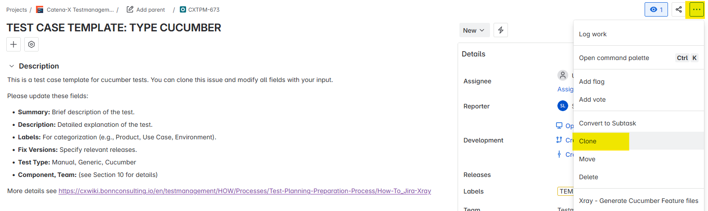
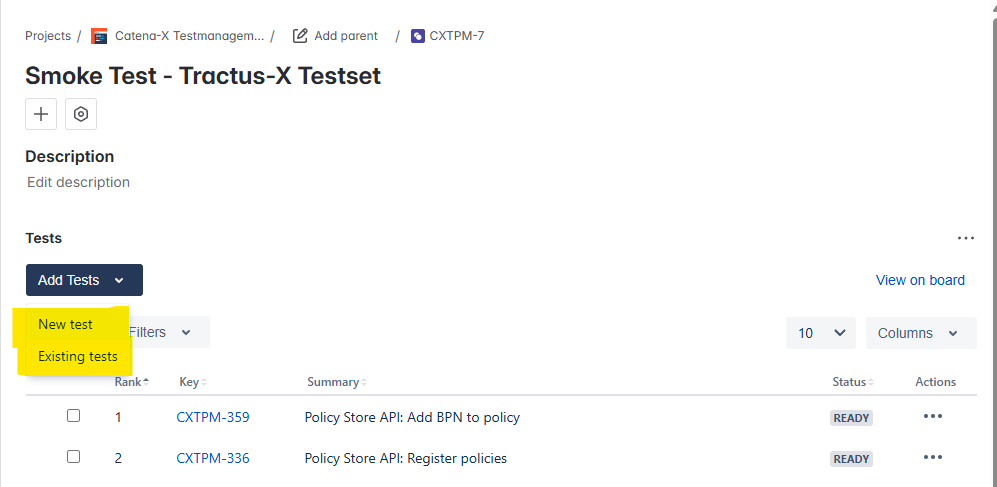

# How To: Create and Structure Test Cases, Test Sets, and Test Plans in Jira Xray (Catena-X)


## 1. Prerequisites

- Access to the [Catena-X Testmanagment Jira](https://catena-x.atlassian.net/browse/CXTPM/) with the [necessary permissions](https://cxwiki.bonnconsulting.io/en/testmanagement/WHO/testmanagement-jira-roles-and-rights). To work with Xray test management in Jira, [create a Jira account](https://id.atlassian.com/signup?application=jira&continue=https%3A%2F%2Fcatena-x.atlassian.net) or log in and contact Catena-X e.V. Test Manager [Monika Jacobsen](mailto:monika.jacobsen@catena-x.net) to get added as a Jira project member.
- Understanding of your test requirements and objectives.
  <br>

---
## 2. Accessing the Xray Testing Board and Create Button

1. **Navigate to [Catena-X Testmanagment Jira project](https://catena-x.atlassian.net/browse/CXTPM/)**.
2. **Open the Xray Testing Board** from the left sidebar under "Apps" → "Xray" → "Testing Board".
3. **Locate the "Create" button**:
  - Use the global "Create" button at the top of the page, or
  - The context-specific "Create" button on the right side within the Testing Board.


*Screenshot: The "Create" buttons are highlighted in the Jira Xray interface for easy access to create new test artifacts.*

<br>

---
## 3. Creating Test Cases

Jira Xray supports multiple test types, each suited for different testing approaches.
<br>

### 3.1 Basic Test Case Creation
For all kind of test types, you need to fill out these basic information.

1. Click the **Create** button.
2. In the creation dialog, select **Test** as the Work type.
3. Fill in fields, marked with an asterisk are mandatory:

- #### Summary*: Brief description of the test.
A good JIRA test case summary should clearly indicate the system and use case it belongs to. This should be done by including the system in square brackets followed by a short, descriptive title of what the test does.

Examples:
- [Portal Frontend] User can reset password via email
- [BPDM] Validate mandatory field error handling


<br>

- #### **Description*:** Detailed explanation of the test.
A good JIRA test case description should briefly explain the purpose and context of the test. It should include:
- What is being tested (feature, functionality, behavior)
- Why it’s important (business or technical relevance)
- Any setup or dependencies required (e.g., test data, user roles)

Example:

- This test verifies that a user can successfully reset their password via the Portal Frontend using the "Forgot Password" function.

  The test ensures that a valid reset link is sent via email and that the new password can be used for login.

  Precondition: User account with valid email must exist.

<br>

- #### **Labels:** For categorization
The labels field in a JIRA test case should be used to support filtering, grouping, and reporting by product, use case or environment. Labels should be:
- Consistent and lowercase
- Focused on system/module, test type, or team/responsibility
- Avoid spaces (use dashes or underscores)

Examples:
- portal-frontend
- regression
- stable-environment


*Screenshot: Setting the right labels helps to find, group, and associate this issue to Policy Store API of the IRS on the Integration Environment.*

<br>

- #### Fix Versions: Specify relevant releases
The Fix Versions field should be used to indicate the release or version for which the test case was created or is valid. This helps in:
- Tracking test coverage per release
- Filtering test cases relevant to a specific version
- Reporting test readiness and execution progress for releases

You can find all available fix versions in the [Release versions overview](https://catena-x.atlassian.net/projects/CXTPM?selectedItem=com.atlassian.jira.jira-projects-plugin%3Arelease-page)

<br>

- #### Component, Team: (see Section 10 for details)
**The Component field** should indicate the technical module or system the test case belongs to. It helps with:
- Grouping tests by functionality or architecture
- Assigning ownership (component leads)
- Filtering and reporting by system areas

Examples:
- Portal Frontend
- BPDM

<br>

**The Team field** should indicate the team responsible for creating, maintaining, or executing the test case. It ensures:
- Clear ownership
- Easier assignment and collaboration
- Efficient filtering, reporting, and test planning per team

Examples:
- Testmanagement
- SLDT
- PURIS


<br>




In the second screen, please add the test type:
- **Test Type*:** Manual, Cucumber, or Generic.

Depending on your choice, Jira will change the layout and offer you different options to describe your test case.

<br>

### 3.2 Manual Test Type

- **Purpose:** For test cases executed manually by testers
- **Use Case:** UI testing, exploratory testing, user acceptance testing
- **Structure:** Sequential test steps with actions, test data, and expected results
- **Example Scenario:** Testing user login functionality
  <br>

#### Creating Manual Test

1. Select **Test Type = Manual**
2. Add structured test steps with:
  - Clear, actionable instructions
  - Specific test data
  - Precise expected results
3. Include attachments (screenshots, test data files)

**Manual Test Steps Example:**

```
Step 1:
Action: Navigate to the login page
Test Data: URL: https://app.catena-x.net/login
Expected Result: Login page is displayed with username and password fields

Step 2:
Action: Enter valid credentials
Test Data: Username: test.user@catena-x.net, Password: SecurePass123
Expected Result: Credentials are accepted without validation errors

Step 3:
Action: Click the "Login" button
Test Data: N/A
Expected Result: User is redirected to the dashboard page
```
<br>

#### Template
You can follow these instructions or clone from the template test case.
For manual test cases please open https://catena-x.atlassian.net/browse/CXTPM-672. From the three-dots-menu, choose *Clone* and adapt the fields accordingly.


*Screenshot: Clone from the template for a manual test case*
<br>

### 3.3 Cucumber Test Type

- **Purpose:** For Behavior-Driven Development (BDD) tests
- **Use Case:** Automated testing with business-readable scenarios
- **Structure:** Gherkin syntax (Given, When, Then)
- **Example Scenario:** API endpoint validation

<br>

#### Creating Cucumber Test

1. Select **Test Type = Cucumber**
2. Write scenarios using proper Gherkin syntax
3. Ensure scenarios are executable by automation framework
4. Include data tables and scenario outlines for data-driven tests

**Cucumber/Gherkin Syntax Example:**

```gherkin
Feature: Asset Creation in Trace-X
  As a supply chain manager
  I want to create new assets in the system
  So that I can track components through the supply chain

  Background:
    Given the user is authenticated with valid credentials
    And the user has "Asset Creator" permissions
    And the system is connected to the asset registry

  Scenario: Create a valid asset with all required fields
    Given the user is on the asset creation page
    When the user enters the following asset details:
      | Field          | Value                    |
      | Asset ID       | ASSET-2025-001          |
      | Asset Name     | Transmission Component   |
      | Manufacturer   | BMW Group               |
      | Serial Number  | TX-BMW-789456           |
      | Category       | Automotive Part         |
    And the user clicks the "Create Asset" button
    Then the asset should be successfully created
    And the system should display confirmation message "Asset created successfully"
    And the asset should appear in the asset registry
    And the asset should have status "Active"

  Scenario: Attempt to create asset with missing required fields
    Given the user is on the asset creation page
    When the user enters the following incomplete asset details:
      | Field          | Value                    |
      | Asset Name     | Incomplete Component     |
      | Manufacturer   | BMW Group               |
    And the user clicks the "Create Asset" button
    Then the system should display validation error "Asset ID is required"
    And the asset should not be created
    And the user should remain on the creation page

  Scenario Outline: Create assets with different categories
    Given the user is on the asset creation page
    When the user creates an asset with category "<category>"
    And all other required fields are filled with valid data
    Then the asset should be created successfully
    And the asset category should be set to "<category>"

    Examples:
      | category           |
      | Automotive Part    |
      | Electronic Module  |
      | Raw Material       |
      | Finished Product   |
```

**Gherkin Syntax Explanation:**

- **Feature:** High-level description of the functionality being tested
- **Background:** Common setup steps that apply to all scenarios in the feature
- **Scenario:** Individual test case with specific conditions and expectations
- **Given:** Preconditions and setup (arranges the test environment)
- **When:** Actions performed by the user or system (acts on the system)
- **Then:** Expected outcomes and verifications (asserts the results)
- **And/But:** Additional steps that follow the same context as the previous Given/When/Then
- **Scenario Outline:** Template for multiple similar scenarios with different data
- **Examples:** Data table providing values for scenario outline placeholders

<br>

#### Template
You can follow these instructions or clone from the Cucumber template test case.
For manual test cases please open https://catena-x.atlassian.net/browse/CXTPM-673. From the three-dots-menu, choose *Clone* and adapt the fields accordingly.


*Screenshot: Clone from the template for a Cucumber test case*
<br>

<br>

#### 3.4 Generic Test Type

- **Purpose:** For reusable test cases that don't fit specific patterns. Results may come from tools which ar enot natively supported by Xray.
- **Use Case:** Configuration tests, environment setup, general validation
- **Structure:** Flexible format, can be structured or unstructured
- **Example Scenario:** System configuration validation

<br>

#### Creating Generic Test Cases:

1. Select **Test Type = Generic**
2. Provide a clear description of what needs to be tested
3. Include any specific conditions or configurations


**Generic Test Example:**

```
Summary:
[DTR] Performance Validation of /lookupById API

Description:
This test validates that the /lookupById endpoint of the Digital Twin Registry responds within acceptable performance thresholds under load. Executed via Apache JMeter in a CI pipeline.

Preconditions:
* Endpoint is deployed and reachable
* JMeter script available in CI repository
* Required test data exists in the registry

Expected Result:
* 95% of responses complete within 500ms
* No 5xx status codes returned
* Error rate < 1%

Test Execution:
* Test is executed externally via GitHub Actions
* Results (JMeter .xml or .json) are uploaded via the Xray REST API to the corresponding Test Execution
```


<br>

---
## 4. Test Sets
The Xray Test Set is used to group related tests for better organization and reuse.
<br>

### 4.1 Purpose Of Test Sets

- Logical grouping of Test issues (e.g., by feature, module, or type).

- Reuse the same set of tests across different Test Plans or Executions.

- Simplifies bulk operations like assigning, executing, or reporting on tests.
  <br>

### 4.2 Creating Test Sets

1. Click the **Create** button.
2. In the creation dialog, open the **Work type** dropdown and select **Test Set**.


*Screenshot: The "Work type" dropdown is highlighted, showing "Test Set" selected in the creation dialog.*

3. Fill in the fields, marked with an asterisk are mandatory:
  - **Summary:*** Name of the Test Set.
  - **Description:*** Brief description of the Test Set.
  - **Labels, Fix Versions, Component, Team:** For categorization and traceability.
    For a detailed explanation of these fields see [chapter 3.1](#3.1-Basic-Test-Case-Creation)

4. Click **Create** to finalize the Test Set.
   

<br>


### 4.3 Adding Test Cases to Test Sets

1. Open the created Test Set.
2. Use the **Add Tests** option to include existing test cases, or create new test cases directly within the Test Set.
   
   *Screenshot: add new or exisiting tests to a test set*
   <br>
   
   *Screenshot: add exisiting test from the list or use the more sophisticated search*
   <br>

3. Assign priorities and link the Test Set to requirements or defects for traceability.


<br>

---
## 5. Test Plans
The purpose of an Xray Test Plan is to organize and manage the execution of a set of tests for a specific goal, like a release, sprint, or feature validation.
<br>

### 5.1 Purpose of Test Plans

- Organize and manage a collection of Test Executions targeting a common objective (e.g., a release or sprint).

- Track overall testing progress, status, and coverage in one centralized view.

- Define the scope of testing by associating relevant Test issues.

- Allow for multiple executions of the same test set within the same plan (e.g., different environments or iterations).

- Enable reporting and metrics like pass/fail rates, execution history, and requirement traceability.
  <br>

### 5.2 Creating Test Plans

1. Click the **Create** button.
2. In the creation dialog, open the **Work type** dropdown and select **Test Plan**.


*Screenshot: The "Work type" dropdown is highlighted, showing both "Test Set" and "Test Plan" as selectable options.*
<br>

3. Fill in the fields, marked with an asterisk are mandatory:
  - **Summary:*** Name of the Test Plan.
  - **Description:*** Brief description of the Test Plan.
  - **Labels, Fix Versions, Component, Team:** For categorization and traceability.
    For a detailed explanation of these fields see [chapter 3.1](#3.1-Basic-Test-Case-Creation)
4. Click **Create** to finalize the Test Plan.
   <br>

### 5.3 Integrating Test Sets into Test Plans

1. Open the created Test Plan.
2. Use the **Add Test Sets** or **Add Tests** option to include relevant Test Sets or individual Test Cases.
3. Organize and track the execution of your tests for a release or feature.
   <br>
