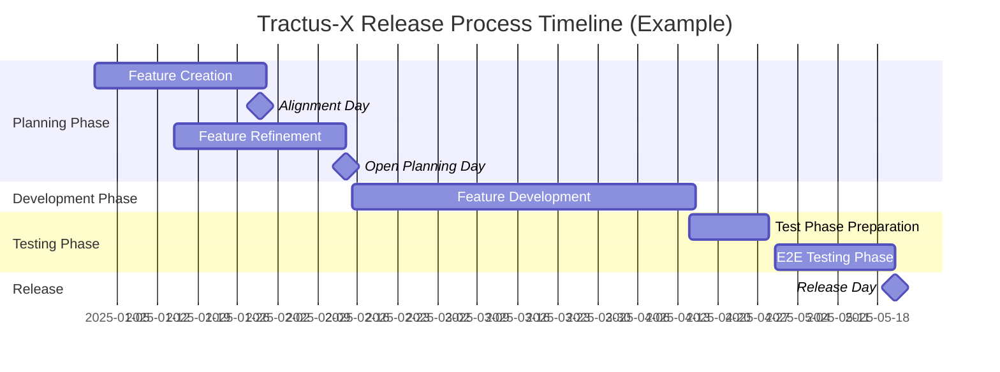

The Eclipse Tractus-X Release Process is a structured, transparent, and collaborative approach to planning and delivering high-quality releases. This process ensures that all contributors, committers, and stakeholders are aligned on deliverables, timelines, and expectations for each release cycle.

:::info Release Cadence

Eclipse Tractus-X follows a quarterly release cycle with releases typically occurring in March, June, September, and December. Release naming follows the pattern `R{YY}.{MM}` (e.g., R24.03 for March 2024).

:::

## Release Timeline Overview

The release process consists of several key phases that span approximately 3-4 months:

:::note Timeline Example

The timeline shown above is illustrative. Actual dates vary by release. Check the [Timeline View](https://github.com/orgs/eclipse-tractusx/projects/26/views/35) for specific release schedules.

:::

## Key Milestones

The release process includes two critical milestone days that bring the community together to align on features and plan the upcoming release.

### Alignment Day

The **Alignment Day** is a collaborative session focused on addressing open questions and resolving dependencies between features planned for the upcoming release.

:::tip Purpose

This is not a planning or refinement session — it's a dedicated space to clarify uncertainties, discuss dependencies, and ensure all teams understand what's expected from each feature.

:::

**What to Expect:**

- **Duration**: Typically 2-4 hours
- **Focus**: Features labeled with `open question`
- **Participants**: Feature owners, component developers, committers, and stakeholders
- **Activities**:
  - Overview of features with open questions
  - Group discussions and breakout sessions as needed
  - Documentation of decisions and clarifications

**Prerequisites for Features:**

- Features must be labeled `open question` at least **3 days prior** to the Alignment Day
- Feature owners should be prepared to describe their needs or concerns
- Component developers should be ready to clarify what is expected from them

**Key Focus Areas:**

- Cross-component dependencies
- Technical constraints and architectural decisions
- Unclear requirements or acceptance criteria
- Resource availability and capacity planning

### Open Planning Day

The **Open Planning Day** is the main planning session where the community finalizes the roadmap for the upcoming release, prioritizes features, and assigns milestones.

:::note Who Should Attend

- Contributors and Committers from the open-source community
- Experts
- Feature requesters and stakeholders

Your participation is crucial to ensure the success of release planning!

:::

**What to Expect:**

- **Duration**: Typically 3-5 hours
- **Focus**: Feature prioritization and milestone assignment
- **Structure**: Sessions organized by Topic/Product areas (e.g., Portal, BPDM, EDC, etc.)
- **Activities**:
  - Vision and introduction to the release
  - Topic-by-topic planning sessions
  - Feature discussion and milestone assignment
  - Feedback and wrap-up

**Agenda Structure (Example):**

| Time | Topic | Description |
|------|-------|-------------|
| 09:05 - 09:20 | Open Planning - Vision & Introduction | Overview of release goals and process |
| 09:20 - 11:50 | Joint Open Planning | Topic-by-topic feature planning sessions |
| 11:50 - 12:15 | Feedback Retro / Wrap-up | Summary, next steps, and retrospective |

**Prerequisites for Features:**

For a feature to be considered during Open Planning, it must meet the following criteria:

- **Status**: Must be set to `Backlog` (set by Committers and experts, requester after refinement)
- **Milestone**: Must **NOT** be set (will be assigned during the session)
- **Assignees**: Both Contributor and Committer must be assigned
- **Topic/Product**: Must be set to categorize the feature
- **Template Completeness**: All sections of the feature template must be filled (do not delete any sections)

:::warning Special Case - KITs

For KIT features, only the Contributor, Committer, and Description fields need to be filled. **There is also a seperate issue template for KITs**

:::

## Release Planning Board

The Release Planning is managed through the [Release Planning Board](https://github.com/orgs/eclipse-tractusx/projects/26) on GitHub.

**Key Views:**

- **Timeline View**: Visualize the release timeline and feature deadlines
- **Topic/Product View**: Features organized by their product or topic area
- **Status View**: Track features by their current status (Backlog, In Progress, Done, etc.)

## Issue Labels and Attributes

Understanding and using the correct labels and attributes is essential for effective release planning.

### Important Labels

| Label | Purpose | When to Use |
|-------|---------|-------------|
| `Prep-R{YY.MM}` | Identifies features for a specific release | Add when creating a feature for an upcoming release (e.g., `Prep-R26.03`) |
| `open question` | Marks features with unresolved questions | Add at least 3 days before Alignment Day |
| `edc`, `portal` and more | Marks other topic groups which might be needed to fullfill the requirements of the feature | Used for dependencies |

### Required Attributes

When creating a feature issue, ensure the following attributes are set:

| Attribute | Description | Required For |
|-----------|-------------|--------------|
| **Status** | Current state of the feature (Backlog, In Progress, Done, etc.) | All features |
| **Milestone** | Target release (set during Open Planning) | After Open Planning |
| **Assignees** | Contributor and Committer assigned to the feature | Before Open Planning |
| **Topic/Product** | Product or topic area (e.g., Portal, BPDM, EDC) | Before Open Planning |
| **Labels** | Includes preparation label (e.g., `Prep-R26.03`) | All features |

## Issue Templates

### Feature Template

When creating a new feature for a release, use the feature template which includes:

- **Description**: Clear description of the feature and its value
- **Acceptance Criteria**: Specific, measurable criteria for completion
- **Dependencies**: List of other features or components this feature depends on
- **Technical Details**: Architecture, implementation approach, and technical considerations
- **Testing Approach**: How the feature will be tested
- **Documentation**: Required documentation updates

:::tip Best Practices

- Don't delete any sections from the template (except for KITs as noted above)
- Fill out all sections completely before the Open Planning session
- Update the issue regularly during development
- Link related issues and pull requests

:::

## Development and Testing Phases

### Feature Development Phase

After Open Planning, the development phase begins:

- Features with assigned milestones move to "In Progress"
- Regular product meetings track development progress
- Committers review pull requests and ensure quality standards
- Features must follow all [Tractus-X Release Guidelines (TRGs)](/docs/release)

### Test Phase Preparation

Before the E2E testing phase:

- **Release Check Issues**: Creation of Release Check Issues to be part of the Release and Test Phase
- **Briefing Session**: Preparation meeting to review the release checklist and deployment process
- **Kick-Off Session**: Launch meeting for the test phase with latest updates
- Features must be deployed to the integration environment

### E2E Testing Phase

The End-to-End testing phase validates the entire release:

- **Duration**: Typically 3 weeks
- **Daily Sync**: Daily standup meetings to track progress and blockers
- **Focus**: Deployment status, defect/blocker updates, test status for all products
- **Environment**: Integration (INT) environment

## Open Meetings

The release process is supported by various open meetings where the community collaborates:

### Release-Related Meetings

- **Community Office Hour**: Weekly meeting (Fridays) for general updates and discussions
  - [Meeting details and links](/community/open-meetings#general-office-hours)
- **Committer Meeting**: Bi-weekly meeting for committer-specific topics
  - [Meeting details and links](/community/open-meetings#general-office-hours)
- **Alignment Day**: One-time meeting per release for dependency discussions
  - [Current and upcoming sessions](/community/open-meetings#one-time-meetings)
- **Open Planning Day**: One-time meeting per release for feature planning
  - [Current and upcoming sessions](/community/open-meetings#one-time-meetings)

### Product-Specific Meetings

Individual products have their own regular sync meetings:

- Portal Open Meeting
- EDC Weekly
- BPDM Open Meeting
- Industry Core Hub & Tractus-X SDK Weekly
- And more...

See the full list on the [Open Meetings page](/community/open-meetings).

## Communication Channels

Stay connected and informed throughout the release process:

- **Matrix Chat**:
  - [Release Planning](https://matrix.to/#/#tractusx-release-planning:matrix.eclipse.org)
  - [Test Management](https://matrix.to/#/#tractusx-test-management:matrix.eclipse.org)
- **Mailing List**: [Tractus-X Dev Mailing List](https://accounts.eclipse.org/mailing-list/tractusx-dev)
- **Blog**: [Release planning announcements](/blog) are posted before each release
- **GitHub Discussions**: For asynchronous communication and Q&A

## Tips for Success

:::tip For Feature Requesters

1. **Start Early**: Create your feature issues well before the Alignment Day
2. **Be Complete**: Fill out all template sections thoroughly
3. **Attend Meetings**: Participate in Alignment Day and Open Planning
4. **Stay Engaged**: Monitor your feature's progress and respond to questions promptly

:::

:::tip For Committers and Contributors

1. **Review Early**: Look at features before Open Planning to assess feasibility
2. **Be Realistic**: Don't over-commit; consider capacity and dependencies
3. **Communicate**: Use labels like `open question` when you need clarity
4. **Follow TRGs**: Ensure all contributions meet the [Release Guidelines](/docs/release)

:::

:::tip For Everyone

- Keep the Release Planning Board clean and up-to-date
- Use the provided templates and don't delete sections
- Join the Matrix chat rooms for real-time discussions
- Subscribe to the mailing list for important announcements

:::

## Additional Resources

- [Release Planning Board](https://github.com/orgs/eclipse-tractusx/projects/26)
- [Tractus-X Release Guidelines (TRGs)](/docs/release)
- [Open Meetings Schedule](/community/open-meetings)
- [How to Contribute](/docs/oss/how-to-contribute)
- [Latest Release Planning Blog Posts](/blog)
- [Timeline View](https://github.com/orgs/eclipse-tractusx/projects/26/views/35)

---

For questions or further information, reach out via the [mailing list](https://accounts.eclipse.org/mailing-list/tractusx-dev) or join the [Tractus-X Matrix channel](https://matrix.to/#/#automotive.tractusx:matrix.eclipse.org).
