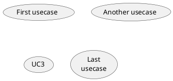

| Status | Created      | Post-History                                             |
|--------|--------------|----------------------------------------------------------|
| Draft  | 20-Sept-2023 | created initial Draft                                    |
| Edited | 24-Okt-2023  | add draw.io as possible solution for static `.svg`-files |

## Why

To have an easier approach to update current diagram files and have a better overview of the changes within the diagrams.

This helps people to understand our workflows within our products and make it easier to understand the product itself.
Also updating the static files will be easier and faster to do for every committer or maintainer of our repositories.

## Description

All diagram files **must** be either created with code languages or stored as `.svg` file within our repositories. If your using Draw.io please also describe how and with which version you created the used diagram in your `README.md` documentation file.
After a committers [decision](https://github.com/eclipse-tractusx/sig-infra/discussions/19) there are 2 languages accepted, either [PUML](https://plantuml.com/en/) or [Mermaid](https://mermaid.js.org/).
These diagram code files (`.puml`,`.mmd`,`.mermaid`) and / or static diagram `.svg` files **must** be stored within the `docs/` folder as described in [TRG 2.03](https://eclipse-tractusx.github.io/docs/release/trg-2/trg-2-3#docs).
In addition to this you can integrate mermaid diagrams also directly into your markdown files as code snippets.

This includes:

- diagrams
- flowcharts
- sequence diagrams
- state diagrams
- gantt charts
- etc.

## PlantUML / Mermaid / Markdown snippets

### PlantUML example




### Mermaid example

```markdown
flowchart TD
    A[Committer] -->|Get money| B(Go shopping)
    B --> C{Let me think}
    C -->|One| D[Laptop]
    C -->|Two| E[Mobile Phone]
    C -->|Three| F[fa:fa-car Car]
```

[](https://mermaid.live/edit#pako:eNpVkEFug0AMRa9iedVK4QIsKiXQZpOokZodsHDBMKMwYzQxiiLg7h3KpvXK8n_fX_aEtTSMKba9PGpDQeGalx5i7YtMnLOqHCpIkrf5yApOPD9nOLwcBe5GhsH67nXjDysE2XRaMQY11t-WTcp-_Z-eZ8iLEw0qQ_VXuT5khvfiLN-2Z7iYGPJfN4Gj96NoKW0pqSlARqHCHToOjmwTD5hWQ4lq2HGJaWwbCrcSS79EjkaVr6evMdUw8g7HoSHl3FIXyGFc2t_jlBurEs7bR2rxre1w-QHjzV4u)

### Example Mermaid into Markdown

````markdown

````


### Draw.io Example

This image was generated with [draw.io](https://app.diagrams.net/) + `version` and stored as `.svg` file within the repository.

```markdown

```


## Technical requirements

- diagrams as code with [PlantUML](https://plantuml.com/en/) or [Mermaid](https://mermaid.js.org/)
- static `.svg` diagram files, draw.io can be used
- Live [Mermaid Live Editor](https://mermaid.live/edit)
- Live [PlantUML Live Editor](https://www.planttext.com/)
- Live [Draw.io](https://app.diagrams.net/)

## GitHub workflows

Reusable workflows for each language can be found here:

- [Generate static Mermaid Files](https://github.com/eclipse-tractusx/sig-infra#generate-static-mermaid-files)
- [Generate static PlantUML Files](https://github.com/eclipse-tractusx/sig-infra#generate-static-plantuml-files)
