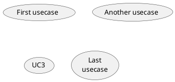
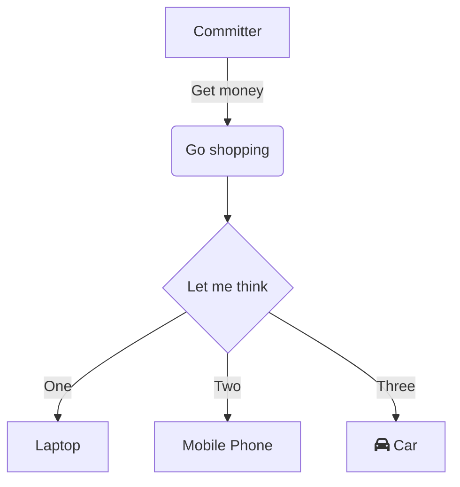
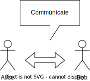

| Status | Created      | Post-History                                             |
|--------|--------------|----------------------------------------------------------|
| Active | 12-Dez-2023  | move from Draft section to Active TRG's                  |
| Draft  | 20-Sept-2023 | created initial Draft                                    |
| Edited | 24-Okt-2023  | add draw.io as possible solution for static `.svg`-files |

## Why

To have an easier approach to update current diagram files and have a better overview of the changes within the diagrams, and we can ensure that all diagrams follow the same standards.
This helps people to understand our workflows within our products and make it easier to understand the product itself.
Also updating the static files will be easier and faster to do for every committer or maintainer of our repositories.

This includes:

- diagrams
- flowcharts
- sequence diagrams
- state diagrams
- gantt charts
- etc.

## Description

All diagram files **must** be either using code to generate diagrams, or stored as `.svg` file within our repositories.
After a committers [decision](https://github.com/eclipse-tractusx/sig-infra/discussions/19) there are 2 languages accepted, either [PUML](https://plantuml.com/en/) or [Mermaid](https://mermaid.js.org/).
If you're using a specific tool like Draw.io, describe how you created it and document the creation or modification process in your documentation files.

Goal of this TRG is to have a better overview of the changes within the diagrams, and we can ensure that all diagrams follow the same standards:

- we need to contribute editable source files for diagrams
- we need to describe the used tools that need to be usable by anyone without the need of a licence (prefer open source tools)
- used tools for diagrams should be OS independent
- we need to describe the used tools and the version of the tool and the creation process of the diagrams

These diagram code files (`.puml`,`.mmd`,`.mermaid`) and / or static diagram `.svg` files **must** be stored within the `docs/` folder as described in [TRG 2.03](https://eclipse-tractusx.github.io/docs/release/trg-2/trg-2-3#docs).

In addition to this you can integrate mermaid diagrams also directly into your markdown files as code snippets.

## PlantUML / Mermaid / Markdown snippets

### PlantUML example




### Mermaid example

```markdown
flowchart TD
    A[Committer] -->|Get money| B(Go shopping)
    B --> C{Let me think}
    C -->|One| D[Laptop]
    C -->|Two| E[Mobile Phone]
    C -->|Three| F[fa:fa-car Car]
```

[](https://mermaid.live/edit#pako:eNpVkEFug0AMRa9iedVK4QIsKiXQZpOokZodsHDBMKMwYzQxiiLg7h3KpvXK8n_fX_aEtTSMKba9PGpDQeGalx5i7YtMnLOqHCpIkrf5yApOPD9nOLwcBe5GhsH67nXjDysE2XRaMQY11t-WTcp-_Z-eZ8iLEw0qQ_VXuT5khvfiLN-2Z7iYGPJfN4Gj96NoKW0pqSlARqHCHToOjmwTD5hWQ4lq2HGJaWwbCrcSS79EjkaVr6evMdUw8g7HoSHl3FIXyGFc2t_jlBurEs7bR2rxre1w-QHjzV4u)

### Example Mermaid into Markdown

````markdown

````


### Draw.io Example



This image was generated with [draw.io](https://app.diagrams.net/) and stored as `.svg` file within the `/docs` folder in our repository.
A description how to modify and update our diagrams is provided in our documentation in the `/docs` folder.

Example explanation how the diagram was modified:

- checkout the repository
- open the `docs/alice-bob-drawio.svg` file with [draw.io](https://app.diagrams.net/)
- modify the diagram
- save the diagram as `.svg` file
- ... pr process ...

```markdown

```

## Technical requirements

- diagrams as code with [PlantUML](https://plantuml.com/en/) or [Mermaid](https://mermaid.js.org/)
- static `.svg` diagram files, draw.io can be used
- Live [Mermaid Live Editor](https://mermaid.live/edit)
- Live [PlantUML Live Editor](https://www.planttext.com/)
- Live [Draw.io](https://app.diagrams.net/)

## GitHub workflows

Reusable workflows for each language can be found here:

- [Generate static Mermaid Files](https://github.com/eclipse-tractusx/sig-infra#generate-static-mermaid-files)
- [Generate static PlantUML Files](https://github.com/eclipse-tractusx/sig-infra#generate-static-plantuml-files)
