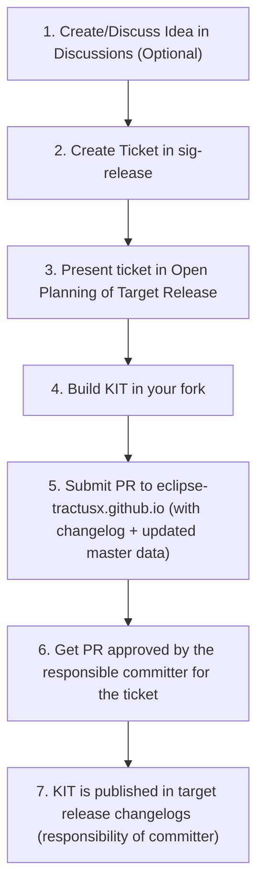

import KitStructureTable from '@site/src/components/2.0/KitComponents/KitStructureTable';
import GradientButton from '@site/src/components/2.0/GradientButton';
import HowToRegIcon from '@mui/icons-material/HowToReg';
import MenuBookIcon from '@mui/icons-material/MenuBook';

| Status     | Created      | Post-History                           |
|------------|--------------|----------------------------------------|
| Draft      | 12-Apr-2024  | Initial contribution                   |
| Active     | 20-Nov-2025  | Splitted 09.01 Draft into 10.01, 10.02, 10.03 adding the new KIT 2.0 Content Structure |

## Why

This TRG serves to maintain a **consistent structure** and ensure **content quality** for the KIT developers, including details for KIT content structure and KIT content owners/maintainers.

**KIT**, short for **Keep It Together**, is an open-source toolbox with comprehensive documentation that enables multiple stakeholders **(Business, Solution Providers, Developers)** to build interoperable applications compatible with the Eclipse Tractus-X dataspace technologies, and support the compliance with industrial standards from standarization organizations (Catena-X e.V., IDTA, ISO/DIN, EDWG, Manufacturing-X, etc.) and in some cases enable regulatory compliance.

A detailed explanation can be found here:
[KIT Framework](../../../documentation/kit-framework)

## Mandatory TRGs

For the KIT Content this two TRGs must be followed:

- [TRG 7.07 - Legal notice for non-code](/docs/release/trg-7/trg-7-07) - Image and media licensing requirements
- [TRG 7.08 - Legal notice for KIT documentation (CC-BY-4.0)](/docs/release/trg-7/trg-7-08) - Documentation licensing

## General Requirements

- A KIT must have a <code>changelog.md</code> following semantic versioning + the release date of Tractus-X - see [TRG 1.03 - CHANGELOG.md](/docs/release/trg-1/trg-1-03)
- A KIT must have, at minimum, an adoption view (Sandbox stage) - see [KIT Lifecycle Levels](https://eclipse-tractusx.github.io/documentation/kit-lifecycle)
- KIT artifacts must be structured according to the respective views (i.e. adoption, development, operations) - see [KIT Artifacts](https://eclipse-tractusx.github.io/documentation/kit-framework)
- Linked documents (e.g., Catena-X standards, Whitepapers) must include the current valid version (e.g. Business Partner Number (Version 2.0.0))
- Each KIT view (business, development, ..) must include a license notice and adhere to the CY BB 4.0 license - see [TRG 7.08 - Legal notice for KIT documentation (CC-BY-4.0)](/docs/release/trg-7/trg-7-08)
- Images must be neutral without any branding, and displayed on a. Images need to follow a the legal notice TRG - see [Legal notice for non-code](/docs/release/trg-7/trg-7-07)
- A KIT must have a defined code owner for each industry extension - see [Industry Extensions](#industry-extensions)

## KIT Logo

- A KIT must have defined code owners for kit maintenance - see [KIT Maintainers & Code Owners](#kit-maintainers--code-owners)
- A KIT must have a SVG icon as described the [TRG 10.01](trg-10-01.mdx) and be stored in the `/static/img/kits/<kit-id>/<kit-id>-raw.svg` folder and be correctly licenses following the [TRG 7.07](https://eclipse-tractusx.github.io/docs/release/trg-7/trg-7-07).
- A KIT logo must be included in every file in the following way (under the page title):

```markdown
## Adoption View


...
```

## Images Storage & Licensing

- Any image or diagram used in the KIT documentation must be stored in a folders `/resources` folder.


## KIT Creation Process

The following process must be followed to create a new KIT:


<details>
<summary><strong>Detailed Step by Step Process</strong> (click to expand)</summary>



</details>

The detailed steps for the KIT creation are defined in the [KIT Getting Started Guide](../../../documentation/kit-getting-started#how-to-create-a-kit).

## KIT Content Sections/Artifacts

:::info Generic Requirements for All KITs
In addition to the view-specific content below, every KIT must include:
- **Copyright Notice** - Mandatory CC-BY-4.0 licensing information and contributor copyright statements at every file
- **Changelog** - Version history file following [semantic versioning](https://semver.org/)

The views below are organized in "folders" so that its sections are harmonized and the content from each view remains flexible.
:::
<KitStructureTable />

A deep dive explanation of each section can be found at the [KIT Framework Documentation](../../../documentation/kit-framework) guideline.

### Sections File/Folder Structure

The following folder structure represents a complete KIT template with all required sections and views (example of a KIT folder structures):

```plaintext
docs-kits/kits/
  <kit-name>/
    ├── README.md                          # Main KIT overview and quick start guide
    ├── CHANGELOG.md                       # Version history following semantic versioning
    ├── CODEOWNERS                         # GitHub code ownership definitions
    ├── adoption-view/
    │   ├── _category_.json
    │   └── adoption-view.md               # Business value, use cases, policies, standards
    ├── development-view/
    │   ├── _category_.json
    │   └── development-view.md            # Architecture, API specs, semantic models, tutorials
    ├── operations-view/
    │   ├── _category_.json
    │   └── operations-view.md             # Deployment guides, monitoring, security, troubleshooting
    ├── industry-extensions/
    │   ├── _category_.json
    │   ├── README.md                      # Industry extensions framework overview
    │   ├── automotive/
    │   │   ├── _category_.json
    │   │   └── overview.md                # Catena-X automotive-specific content
    │   └── shop-floor/
    │       ├── _category_.json
    │       └── overview.md                # Manufacturing-X shop-floor-specific content
    ├── success-stories/
    │   ├── _category_.json
    │   └── my-app.md                      # Template for implementation success stories
    ├── documentation/
    │   ├── _category_.json
    │   ├── github-repository.md           # Link to GitHub repository
    │   ├── api-documentation.md           # Link to API documentation
    │   ├── community-support.md           # Link to community support channels
    │   └── related-standards.md           # Links to related standards
    └── resources/
        └── images/                        # KIT-specific images and diagrams
```

:::tip Template Available
A complete KIT template with all required files and structure is available at:
`/docs-kits/kit-template/`

This template includes detailed guidelines and examples for each section.
:::

<div style={{ display: 'flex', gap: '12px', justifyContent: 'left', marginTop: '20px', marginBottom: '20px', flexWrap: 'wrap' }}>
  <GradientButton 
    href="https://github.com/eclipse-tractusx/eclipse-tractusx.github.io/tree/main/docs-kits/kit-template"
    text="View KIT Template"
    icon={MenuBookIcon}
    gradient="linear-gradient(135deg, #667eea 0%, #764ba2 100%)"
    shadowColor="rgba(102, 126, 234, 0.3)"
    shadowColorHover="rgba(102, 126, 234, 0.4)"
    external={true}
  />
</div>

#### Only per view

In case a VIEW has only one file it shall be described in this way as a `md` or `mdx` file insice of its respective folder (using the same name of the view):

```plaintext
/docs-kits/kits/
  <kit-name>/
    adoption-view/
        adoption-view.md
```

#### Multiple files per view

In case a VIEW has multiple files it shall be described in this way as a folder with multiple `md` or `mdx` files (main views have the same name as the folder):

```plaintext
/docs-kits/kits/
  <kit-name>/
    development-view/
        architecture.md
        deployment-view.mdx
    operation-view/
        operation-view.md
        monitoring.md
    ...
```

## KIT Maintainers & Code Owners

- A code owner must be set by adding to the `CODEOWNERS` at the folder path, the file is located here [`.github/CODEOWNERS`](https://github.com/eclipse-tractusx/eclipse-tractusx.github.io/blob/main/.github/CODEOWNERS).
- As stated in the [Eclipse Foundation Projects Governance (Handbook)](https://www.eclipse.org/projects/handbook/#roles-cm) and in [Eclipse Foundation Development Process/Rules of Engagement](https://www.eclipse.org/projects/handbook/#edp), that **only [Committers](https://eclipse-tractusx.github.io/docs/oss/contributor-committer#committer)** can approve and merge PRs to repositories under the eclipse rule, therefore is responsability from the Committers in Eclipse Tractus-X to approve and check for this TRGs at every KIT PR. And in case the committer is unsurem or has not necessary knowlage to approve the content from the PR it is recommended to get Expert Review and approval, via the [Alignment Mechanisms](#alignment-mechanisms).

<div style={{ display: 'flex', gap: '12px', justifyContent: 'center', marginTop: '20px', marginBottom: '20px', flexWrap: 'wrap' }}>
  <GradientButton 
    href="https://www.eclipse.org/projects/handbook/#elections-committer"
    text="How to become a Committer?"
    icon={HowToRegIcon}
    gradient="linear-gradient(135deg, #4CAF50 0%, #45a049 100%)"
    shadowColor="rgba(76, 175, 80, 0.3)"
    shadowColorHover="rgba(76, 175, 80, 0.4)"
  />
  
  <GradientButton 
    href="https://eclipse-tractusx.github.io/docs/oss/contributor-committer"
    text="Contributor & Committer Guide"
    icon={MenuBookIcon}
    gradient="linear-gradient(135deg, #2563eb 0%, #1d4ed8 100%)"
    shadowColor="rgba(37, 99, 235, 0.3)"
    shadowColorHover="rgba(37, 99, 235, 0.4)"
  />
</div>


:::warning Expert Review
In case the content needs expert review, is **recommended** for the code owner/committer to request reviews from the relevant experts in the community before merging the PR. This applies for any KIT Lifeclycle status.
:::


The `CODEOWNERS` file must follow the structure described at the [GitHub documentation](https://docs.github.com/en/repositories/managing-your-repositorys-settings-and-features/customizing-your-repository/about-code-owners).

No company/organization can be added as a code owner, only a contributor with a GitHub account. Ownership and Copyright for organizations are described in the following [TRG 7.08 - Legal notice for KIT documentation (CC-BY-4.0)](/docs/release/trg-7/trg-7-08)

Example:


```plaintext
# In this example, @doctocat owns any file in the `/docs-kits/kits/connector-kit/`
# directory, it will be notified of any changes to files in that directory, if he is a committer.
# subdirectories.
/docs-kits/kits/connector-kit/ @doctocat
```

:::tip Code Owner Responsibilities

If the committer is the one contributing the KIT content, when merging the PRs they shall ensure that:
- All required documentation sections are complete and follow the KIT structure described in the [KIT 10.xx TRGs](https://eclipse-tractusx.github.io/docs/category/trg-10---keep-it-together-kits)
- Copyright notices and licensing information are properly included
- The changelog is updated with accurate version information
- All linked resources and references are valid and up-to-date
:::

### Industry Extensions

The following rules apply for the industry extension section:

- Only releavant/updated content for the specific industry extension should be included, in case legacy content is needed, the content can be kept previous versions of the KIT or archived at the [large-files repository](https://github.com/eclipse-tractusx/eclipse-tractusx.github.io.largefiles).
- A code owner must be set by adding to the `CODEOWNERS` at the specific industry extension folder path, the file is located here [`.github/CODEOWNERS`](https://github.com/eclipse-tractusx/eclipse-tractusx.github.io/blob/main/.github/CODEOWNERS).

The `CODEOWNERS` file must follow the structure described at the [GitHub documentation](https://docs.github.com/en/repositories/managing-your-repositorys-settings-and-features/customizing-your-repository/about-code-owners).

No company/organization can be added as a code owner, only a contributor with a GitHub account. Ownership and Copyright for organizations are described in the following [TRG 7.08 - Legal notice for KIT documentation (CC-BY-4.0)](/docs/release/trg-7/trg-7-08)


Example:


```plaintext
# In this example, @doctocat owns any file in the `/docs-kits/kits/connector-kit/industry-extensions/automotive`
# directory, it will be notified of any changes to files in that directory, if he is a committer.
# subdirectories.
/docs-kits/kits/connector-kit/industry-extensions/automotive/ @doctocat
```

When a change is done to the industry extension folder, please contact the code owner via the available channels (Matrix Chat, Mailing List, etc.) to inform them about the change.

## Alignment Mechanisms

To ensure the quality and consistency of KITs, the following alignment mechanisms are in place, not all channels need to be activated:

### Main KIT Alignment Channels

| Channel | Purpose | Link |
|---------|---------|------|
| Alignment Day | Quarterly refinement sessions | [Alignment Days Docs](https://eclipse-tractusx.github.io/docs/oss/release-process#alignment-day) |
| Open Planning Day | Quarterly open planning sessions | [Open Planning Days Docs](https://eclipse-tractusx.github.io/docs/oss/release-process#open-planning-day) |
| Matrix Chat | Daily discussions & support | [#tractusx-kits:matrix.eclipse.org](https://chat.eclipse.org/#/room/#tractusx-kits:matrix.eclipse.org) |
| KIT Community Office Hours | Weekly alignment meetings | [Join Meeting](https://eclipse-tractusx.github.io/community/open-meetings#Eclipse%20Tractus-X%20KITs%20Community%20Office%20Hour) |

### Support KIT Alignment Channels

| Channel | Purpose | Link |
|---------|---------|------|
| KIT Office Hour Kanban | Development items tracking | [Github Project](https://github.com/orgs/eclipse-tractusx/projects/92) |
| Matrix Chat | Daily discussions & support | [#tractusx-kits:matrix.eclipse.org](https://chat.eclipse.org/#/room/#tractusx-kits:matrix.eclipse.org) |
| GitHub Issues | Technical issues & bugs | [Create Issue](https://github.com/eclipse-tractusx/eclipse-tractusx.github.io/issues) |
| SIG-Release | Official KIT Release Tracking | [eclipse-tractusx/sig-release](https://github.com/eclipse-tractusx/sig-release) |
| KIT Discussions | Offical KIT Proposal and Discussion Location | [KIT Discussions](https://github.com/eclipse-tractusx/eclipse-tractusx.github.io/discussions/categories/kits) |

In case a change to a existing KIT is planned, it is recommended to use the KIT Discussions or GitHub Issues to discuss the change with the community before starting the implementation. This will help to gather feedback and ensure alignment with other KIT developers.