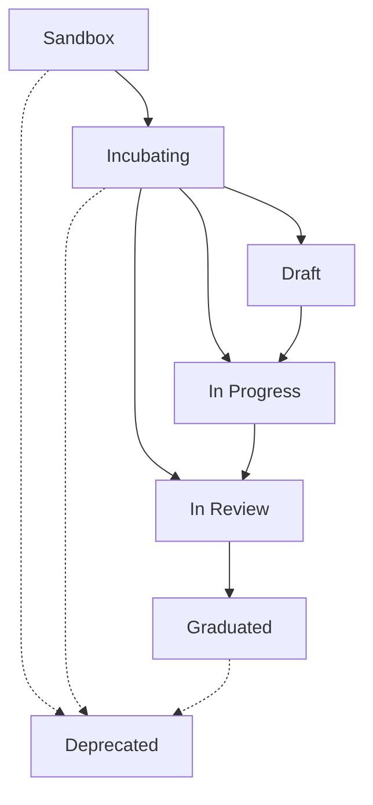

import SchoolIcon from '@mui/icons-material/School';
import ScienceIcon from '@mui/icons-material/Science';
import DeveloperModeIcon from '@mui/icons-material/DeveloperMode';
import AssignmentIcon from '@mui/icons-material/Assignment';
import RateReviewIcon from '@mui/icons-material/RateReview';
import VerifiedIcon from '@mui/icons-material/Verified';
import TrendingUpIcon from '@mui/icons-material/TrendingUp';
import CheckCircleIcon from '@mui/icons-material/CheckCircle';
import EditIcon from '@mui/icons-material/Edit';
import VisibilityIcon from '@mui/icons-material/Visibility';
import ArtifactRequirementsTable from '@site/src/components/2.0/ArtifactRequirementsTable';
import { artifactRequirementsData } from '@site/data/kitArtifactRequirementsData';

| Status     | Created      | Post-History                           |
|------------|--------------|----------------------------------------|
| Draft      | 12-Apr-2024  | Initial contribution                   |
| Active     | 20-Nov-2025  | Splitted 09.01 Draft into 10.01, 10.02, 10.03 adding the new KIT 2.0 Content Structure |

## Why

This TRG serves to maintain a **consistent structure** and ensure **content quality** for the KIT developers. And keep the quality of the KITs along their lifecycle.

Here is a detailed explanation of the KIT Framework:
[KIT Framework](../../../documentation/kit-framework) and the [KIT Lifecycle](../../../documentation/kit-lifecycle) documentation.

In this TRG we describe the different maturity levels a KIT can have, the required artifacts for each level, and the graduation process.

## General Requirements

- A KIT must indicate its maturity level (sandbox, incubating, graduated) - see [KIT Lifecycle](../../../documentation/kit-lifecycle)
- A KIT must have a clear version history following semantic versioning - see [TRG 1.03 - CHANGELOG.md](/docs/release/trg-1/trg-1-03)
- A KIT lifecycle level must only change via a release - see [KIT Release Process](../../../docs/oss/release-process) describing it in the [KIT Release Checks Ticket](https://github.com/eclipse-tractusx/sig-release/issues/new?template=4_KIT_release_checks.md)
- A KIT must contain a `Creation Date` and `Last Updated Date` documented at the KIT Master Data - see [KIT Master Data Overview](../../../documentation/kit-master-data-overview)
- A KIT can achieve graduation if it fulfills the required artifacts and passes the graduation process - see [Graduation Process](./trg-10-04.mdx)
- If a KIT is no longer maintained or relevant, it must follow the deprecation process - see [TRG 10.05 - KIT Deprecation Process](./trg-10-05.mdx)

### Maturity Level Overview

## Artifacts and Deliverables

This section provides an overview of required artifacts for each maturity level and incubating sub-state. For detailed examples and specifications, please refer to [TRG 10.02 - KIT Content Structure](./trg-10-02.mdx).

### Artifact Requirements by Maturity Level

<ArtifactRequirementsTable data={artifactRequirementsData} />

## Further Specifications

- The KIT graduation process is detailed in the [TRG 10.04 - KIT Graduation Process](./trg-10-04.mdx) document.
- The KIT deprecation process is detailed in the [TRG 10.05 - KIT Deprecation Process](./trg-10-05.mdx) document.