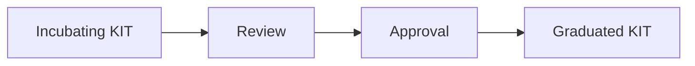

| Status     | Created      | Post-History                           |
|------------|--------------|----------------------------------------|
| Draft      | 20-Nov-2025  | Added KIT graduation guidelines       |

## Why

This TRG serves to maintain a **consistent structure** and ensure **content quality** for the KIT developers.

Here is described the graduation process for KITs that have met the required criteria and are ready to move from incubating to graduated status. For more information about the complete KIT lifecycle, please see the [TRG 10.03 - KIT Lifecycle](./trg-10-03.mdx) documentation.

## Graduation Requirements

- A KIT can achieve graduation if it fulfills the required artifacts and passes the graduation process - see [TRG 10.03 - KIT Lifecycle](./trg-10-03.mdx)
- A KIT in order to achieve graduation must a KIT must be at `INCUBATING - REVIEW` state.
- A KIT in order to be graduated must have at least one contributior listed in `CODEOWNERS` (must be a Eclipse Committer) assigned for maintenance and support, more details about code owners can be found at [TRG 10.02 - KIT Content Structure](./trg-10-02.mdx)

## Graduation Process

## Apply for Graduation

- During a release procedures, the KIT maintainer can apply for graduation if he fullfills the graduation requirements.
- The pull request or the release ticket review is reponsible for determining the merge after checking the graduation requirements.

## Graduation Approval

- The PR is merged and in the release notes is stated that the ticket got graduated.
- The Graduation data is added to the [KIT master data](./kit-master-data.md) at the `graduationDate` field in the `maturity` section.
- The KIT shall remain in the graduated state unless a deprecation process is started - see [TRG 10.05 - KIT Deprecation Process](./trg-10-05.mdx)
