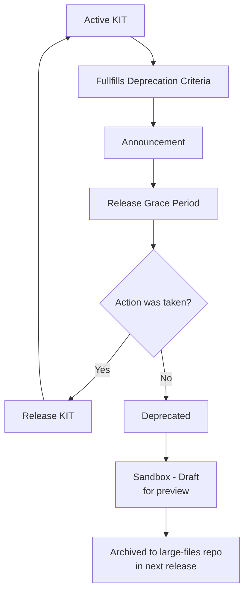

| Status     | Created      | Post-History                           |
|------------|--------------|----------------------------------------|
| Draft      | 20-Nov-2025  | Added KIT deprecation guidelines       |


## Why

This TRG serves to maintain a **consistent structure** and ensure **content quality** for the KIT developers.

This TRG describes the deprecation process for KITs that are no longer maintained or relevant. For more information about the complete KIT lifecycle, please see the [TRG 10.03 - KIT Lifecycle](./trg-10-03.mdx) documentation.

### Deprecation Process



### Deprecation Criteria:

- A KIT can only be considered for deprecation if it fullfills one or more of the following criteria:
  - **Criteria 1**: It has not had any significant updates or maintenance activity in the last 12 months and its content is obsolete or no longer relevant.
  - **Criteria 2**: The maintainers have formally requested deprecation because they can no longer support or maintain the KIT.
  - **Criteria 3**: There are alternative solutions or KITs available that fulfill the same purpose (duplicate).
  - **Criteria 4**: The KIT poses security risks or compliance issues that cannot be resolved.
  - **Criteria 5**: If the KIT is GRADUATED and not has a clear CODEOWNERS for a 2 releases (~6 months) period.

- Deprecation must take place during a release cycle to ensure proper communication and documentation updates.

#### Step 1: Announcement 

KIT deprecation announcements are done at the beginning from the release cycle previous to the release planning.

1. Create deprecation issue in [sig-release](https://github.com/eclipse-tractusx/sig-release)
2. If depreceation criteria are fullfilled, announcements must be done at the open planning and informed via mailing list:
3. SIG-RELEASE ticket is presented at open planning
4. Additionally is encourage to announce through mailing list folowing this template:

```markdown


Dear Eclipse Tractus-X Community,

Following KITs are proposed to be subject to deprecation with the upcoming release following [TRG 10.05](/docs/release/trg-10/trg-10-05).

**KIT Name**: [Insert KIT Name]
**Criteria for Deprecation**: [Insert Reason]
**SIG-RELEASE Issue**: [Link to Issue]

**Call to Action**: Please discuss within your company e.g., with your Catena-X, Dataspace responsibles, whether you run into an issue. Further actions can be taken within the next release cycle, until the end of the release.

```


5. Additional Channels can be used (KIT Matrix chat, or office hours)


#### Step 2: Grace Period (During the proposed target release)

- During this period the community can mobilize itself to take over maintenance or provide feedback on the deprecation decision.
- If sufficient interest is shown, the KIT can be maintained by new code owners and continue to be an active KIT.
- In order for the KIT to not be deprecated, it must be released in the target release.
- If a KIT is `GRADUATED` it will be set to `INCUBATING - IN REVIEW` status and the code owners must be changed to the new maintainers before the release.

#### Step 3: Deprecated/End of Life (No Action Taken)

- Mark KIT as deprecated in the [KIT Master Data](../../../documentation/kit-master-data-overview) in the file `/docs/kitData.js`
- KIT Maturity Level is changed to `Sandbox - Draft` in order to indicate its deprecated status.
- A deprecation date is also added at the KIT Master Data.

#### Step 4: Sandbox - Draft (Preview)
- In this case the KIT lost its status, and is kept only for preview purposes, it is not considered an active KIT anymore.
- In this period, the KIT documentation remains accessible for reference, if there is still interest the community can update the KIT and bring it back to an incubating state.

#### Step 5: Archived (in next release)
- In the next release cycle, the KIT is archived and removed from the KIT Master Data if no action was taken to maintain it.
- Archive documentation in [large-files repo](https://github.com/eclipse-tractusx/eclipse-tractusx.github.io.largefiles)
- It will be archived in a ZIP, and must contain all the KIT contents as it was before deprecation (images, whitepapers, etc).
- No external copyrighted content is allowed to be included in the archived KIT.