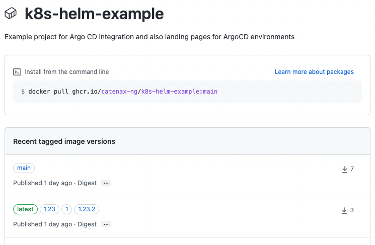

| Status | Created     | Post-History                                       |
|--------|-------------|----------------------------------------------------|
| Active | 20-Mar-2024 | update example workflow for TRG 4.08               |
| Active | 11-May-2023 | update example workflow to match TRG 4.05          |
|        | 24-Nov-2022 | more precise process description                   |
|        | 10-Nov-2022 | Initial release                                    |

## Why

Using non-specific image tags like `:latest` would require everyone to find and check long hashes instead of a version number.

This also breaks control of selecting specific versions and upgrading as `:latest` would pull in new images on restart of a pod.

Container image tagging also helps you to match [TRG 5.05 - Chart Values](../trg-5/trg-5-05.md#container-images).

## Description

The build process for container images **must** ensure proper image tagging. All images **must** be tagged
following [semantic versioning](https://semver.org/), e.g. `:0.1.2` as well as the latest image must be tagged in
addition with `:latest`.

### Process example description

If you follow our recommendation how to create container images and tag them, the following list describes the process
steps:

1. Create/edit your `Dockerfile` and merge Changes via PullRequest to `main` branch, if changes where made in a feature
   branch, or similar.
2. Create/push a Git tag to `main` branch, e.g.:

   ```shell
   > git pull
   remote: Enumerating objects: 129, done.
   remote: Counting objects: 100% (84/84), done.
   remote: Compressing objects: 100% (65/65), done.
   remote: Total 129 (delta 29), reused 11 (delta 10), pack-reused 45
   ...
   > git tag -a v1.2.3 -m "annotation text goes here"
   > git push origin v1.2.3
   ```

   :::caution

   Git CLI will create tag on the latest (local) commit. Ensure to be up-to-date with the remote after,
   otherwise [use commit ID](https://git-scm.com/book/en/v2/Git-Basics-Tagging#_tagging_later) while creating the
   tag.

   :::
   :::tip
   Prefer annotated tags over lightweight tags. Refer
   to [Git documentation](https://git-scm.com/book/en/v2/Git-Basics-Tagging#_creating_tags) about tags.

   :::
3. Pushing the tag will trigger the GH workflow to build your Docker image
4. After the finishing the build workflow, your repository will contain proper versioned Docker images, e.g.:

   

### Implementation

Create a GitHub Workflow file with following content:

```yaml
name: Build - Docker image (SemVer)

on:
  push:
    branches:
      - main
    # trigger events for SemVer like tags
    tags:
      - 'v*.*.*'
      - 'v*.*.*-*'
  pull_request:
    branches:
      - main

env:
  IMAGE_NAMESPACE: "tractusx"
  IMAGE_NAME: "YourApplicationName"

jobs:
  docker:
    runs-on: ubuntu-latest
    permissions:
      packages: write

    steps:
      - name: Checkout
        uses: actions/checkout@v3

      # Needed to create multi-platfrom image
      - name: Set up Docker Buildx
        uses: docker/setup-buildx-action@v2

      # Needed to create multi-platfrom image
      - name: Set up QEMU
        uses: docker/setup-qemu-action@v3

      # Create SemVer or ref tags dependent of trigger event
      - name: Docker meta
        id: meta
        uses: docker/metadata-action@v4
        with:
          images: |
            ${{ env.IMAGE_NAMESPACE }}/${{ env.IMAGE_NAME }}
          # Automatically prepare image tags; See action docs for more examples. 
          # semver patter will generate tags like these for example :1 :1.2 :1.2.3
          tags: |
            type=ref,event=branch
            type=ref,event=pr
            type=semver,pattern={{version}}
            type=semver,pattern={{major}}
            type=semver,pattern={{major}}.{{minor}}

      - name: DockerHub login
        if: github.event_name != 'pull_request'
        uses: docker/login-action@v2
        with:
          # Use existing DockerHub credentials present as secrets
          username: ${{ secrets.DOCKER_HUB_USER }}
          password: ${{ secrets.DOCKER_HUB_TOKEN }}

      - name: Build and push
        uses: docker/build-push-action@v3
        with:
          context: .
          # Needed to create multi-platfrom image
          platforms: linux/amd64, linux/arm64
          # Build image for verification purposes on every trigger event. Only push if event is not a PR
          push: ${{ github.event_name != 'pull_request' }}
          tags: ${{ steps.meta.outputs.tags }}
          labels: ${{ steps.meta.outputs.labels }}

      # https://github.com/peter-evans/dockerhub-description
      # Important step to push image description to DockerHub 
      - name: Update Docker Hub description
        if: github.event_name != 'pull_request'
        uses: peter-evans/dockerhub-description@v3
        with:
          # readme-filepath defaults to toplevel README.md, Only necessary if you have a dedicated file with your 'Notice for docker images'   
          # readme-filepath: path/to/dedicated/notice-for-docker-image.md 
          username: ${{ secrets.DOCKER_HUB_USER }}
          password: ${{ secrets.DOCKER_HUB_TOKEN }}
          repository: ${{ env.IMAGE_NAMESPACE }}/${{ env.IMAGE_NAME }}
```
