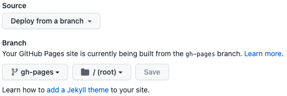
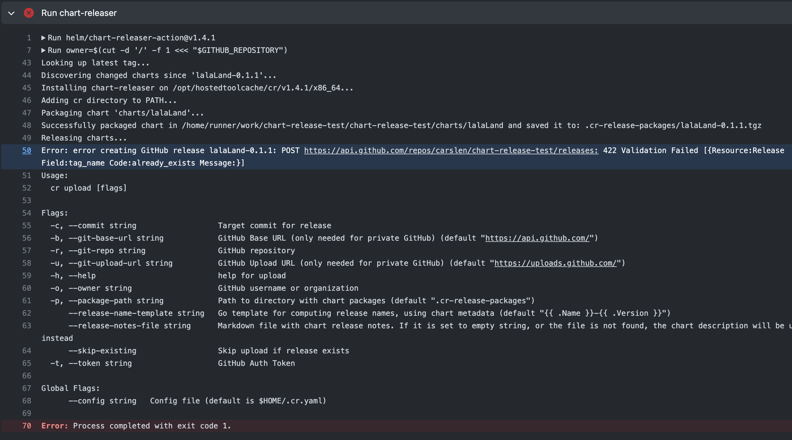

| Author                | Status | Created     | Post-History    |
|-----------------------|--------|-------------|-----------------|
| Catena-X System Team  | Active | 30-Nov-2022 | Initial release |

## Description

A released Helm chart for each Tractus-X sub-product is expected to be available in corresponding GitHub repository.

## Why

Tractus-X components can only be used and bundled with other components of Tractus-X if there is a version of the
component with reliable content. This can only be achieved by creating a release of your Helm chart. We recommend to use
GitHub Chart Releaser Action.

### Process description

If you follow our recommendation to use GitHub Chart Releaser Action to provide a released Helm Chart for your Tractus-X
sub-product, the process will provide the following for you:

1. A GiHub Release is created with
    - Release name _Chartname-Semver_ (e.g. _productABC-0.1.1_)
    - A Git tag _Chartname-Semver_
2. A local Helm repository is created (file `index.yaml` in branch _gh-pages_)

:::caution

Only if your follow this TRG to publish your Helm Chart, your released Helm chart will be automatically added to
the [central Tractus-X Helm repository](https://eclipse-tractusx.github.io/charts/).

:::

### Prerequisites

To get the GitHub Chart Releaser Action working, the following prerequisites must be met:

- GitHub Pages must be enabled for the GitHub repository
- Helm charts must be located in folder `/charts`
- An appropriate GitHub Actions Workflow (see next section)

:::info

In Eclipse-Tractusx GitHub organization GitHub Pages are not enabled by default. To enable GH Pages, you have to open a
support request in the [Eclipse Helpdesk](https://gitlab.eclipse.org/eclipsefdn/helpdesk/-/issues). GH Pages setup
should point to branch _gh-pages_.


:::

:::tip

If you do not have an Eclipse Committer yet in your Dev-Team, mention a Committer in your Ticket to give a Thumbs up
for legitimation, or ask System-Team for help.

:::

### Implementation

Create a GitHub Workflow file with following content:

```yaml
name: Release - Helm Charts

on:
  push:
    paths:
      - 'charts/**'
    branches:
      - main
jobs:
  release:
    # depending on default permission settings for your org (contents being read-only or read-write for workloads), you will have to add permissions
    # see: https://docs.github.com/en/actions/security-guides/automatic-token-authentication#modifying-the-permissions-for-the-github_token
    permissions:
      contents: write
    runs-on: ubuntu-latest

    steps:
      # fetch-depth: 0 is required to determine differences in chart(s)
      - name: Checkout
        uses: actions/checkout@v3
        with:
          fetch-depth: 0

      - name: Configure Git
        run: |
          git config user.name "$GITHUB_ACTOR"
          git config user.email "$GITHUB_ACTOR@users.noreply.github.com"

      - name: Install Helm
        uses: azure/setup-helm@v3
        with:
          token: ${{ secrets.GITHUB_TOKEN }}

      - name: Run chart-releaser
        uses: helm/chart-releaser-action@v1.4.1
        env:
          CR_TOKEN: "${{ secrets.GITHUB_TOKEN }}"
```

Each time a changed Helm Chart is pushed (e.g. merge a PR) to _main_ branch, the workflow will be triggered.

### Don'ts

:::caution

- Changing the `appVersion` requires also changing the `version` in `Chart.yaml`
- Chart `version` itself can be increased without changing the `appVersion`

:::

If you increase the `appVersion` you have to increase also the `version` in `Chart.yaml`, otherwise the workflow will
fail:



The Helm chart name and version is used for creating the Git Tag. As the Helm chart version did not increase, the
workflow tries to create a Git tag which already exists.
