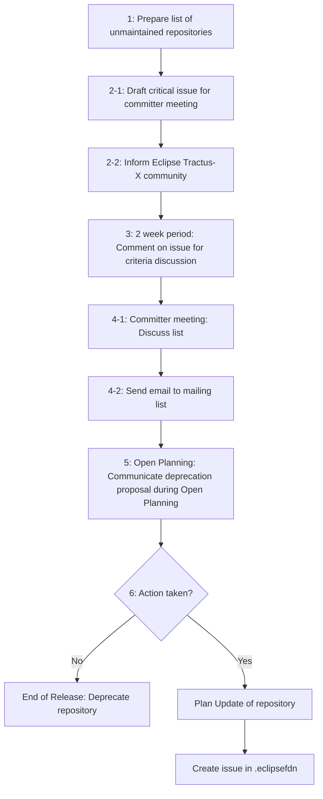
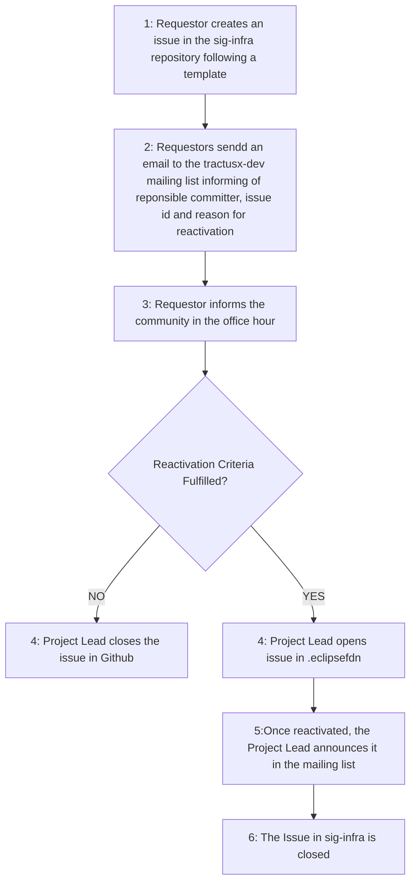

| Status | Created     | Post-History                          |
|--------|-------------|---------------------------------------|
| Draft  | 02-Oct-2024 | Initial draft                         |

## Why

Eclipse Tractus-X is an open source project governed by the Eclipse Foundation and its Committers. Besides the role participating in maintaining the code base, committers are responsible for its security and adherence to the Tractus-X Releases Guideslines (TRG's) as well as the guidelines set by the Eclipse Foundation. As this group of committers is responsible for the whole project and has limited resources, repositories that are not maintained for a given time period will be deprecated.

## Description

Deprecation applies to repositories of type `product`. This information is maintained in the repository metafile (see [TRG 2.05](../trg-2/trg-2-5.md)). Deprecation of a repository means that **the repository is being archived**, i.e. set to status "Public Archive" on Github. It's still accessible from within the project, so that it could be revived. Please refer to [this list for examples of archived repositories within Eclipse Tractus-X](https://github.com/eclipse-tractusx/?q=&type=archived&language=&sort=).

Additionally the helm charts and container images are still available and no information about the deprecation is passed to the user.

### Criteria for Deprecation

Committers consider the following criteria to propose deprecation of a repository:

1. The repository does not comply with the Tractus-X Releases Guidelines (TRG's) and/or the guidelines set by the Eclipse Foundation (i.e. Security, Intellectual Property, etc.)

In case of repositories belonging to a [Product](https://eclipse-tractusx.github.io/community/products):
2. The product of the repository has not been released within the *past year's major release cycle* **\***.
3. The standards used by the product have been changed in a major version within the *past year's major release cycle* **\***.

**\*** The *past year's major release cycle* is the time span between the breaking change releases YY.06 e.g., 24.05 till 24.05.

### Deprecation Process

To ensure the communities awareness the following process is used at least per major release planning:



1. The committers prepare a list of unmaintained product repositories (**criteria 1**).
2. The committers inform the Eclipse Tractus-X community via the [mailing list](https://eclipse-tractusx.github.io/docs/oss/how-to-contribute/#dev-mailinglist). This is done by an issue with checkboxes listing all these repositories (find the issue template [below](#issue-template-for-deprecation-list)). Additionally a critical issue is drafted on the [board for the committer meeting](https://github.com/orgs/eclipse-tractusx/projects/61/views/6) in at least 2 full weeks.
3. 2 weeks period: The committers comment the issue regarding which repositories are subject to **criteria 1** and **criteria 2**. Also if **Criteria 2** does not apply, deprecation may still be possible due to security concerns.
4. Committer meeting: The committers discuss the list and check the boxes in the issue. A Mail is sent out to the Eclipse Tractus-X mailing list. This list is splitted into platform products (e.g. Tractus-X EDC) and use case products (e.g. PURIS). See a template below.
5. During the [Open Planning](https://catenax-ev.github.io/docs/next/working-model/release-management/planning/tx-release-planning-days) the deprecation proposal is communicated again.
6. If no action is taken, during the Release of the major version, the project leads will decide for the deprecation of the given repository and communicate accordingly with the Catena-X Association's release management or the specific organization responsible for the repository.
7. In case the repository got deprecated, and there is again maintainace or develop capacity, the following procedure **MUST** be followed [Repository Reactivation Process] by a committer.

### Issue Template for Deprecation List

``` markdown
# Deprecation List

The following repositories fulfill at least **criteria 1** so that deprectation has been proposed with this issue following [TRG 7.09](https://eclipse-tractusx.github.io/docs/release/trg-7/trg-7-09).

Dear @eclipse-tractusx/automotive-tractusx-committers walk through the following list and comment which of the repositories shall be checked. The list will be walked through as a critical topic in the committer meeting in two weeks.

- [ ] sample repo link 1
- [ ] sample repo link 2
```

### Mail Template for Deprecation

``` markdown
Dear Tractus-X Community,

Following repositories are proposed to be subject to deprecation with the upcoming release following [TRG 7.09](https://eclipse-tractusx.github.io/docs/release/trg-7/trg-7-09).

**Platform Products (CRITICAL)**:
- link to repository 1

**Use Case Products**:
- link to repository 2

**Call to Action**: Please discuss within your company e.g., with your central Catena-X responsibles, whether you run into an issue. We highly encourage the companies to at least find resources for the **Platform Products** to maintain an open-source data space.
```

## Reactivation Guidelines

Your repository got deprecated? No worries, follow the following steps to get it back on its feet:

### Repository Reactivation Criteria

In case a repository you are maintaining or want to maintain got deprecated after all the [Criteria for Deprecation](#criteria-for-deprecation) are fulfilled, and the [Deprecation Process](#deprecation-process) finalized, the following criteria **MUST** be fulfilled to reactivate your repository:

1. The committer and requestor has capacity to resolve the security vulnerabilities and assure that the repository will comply to the latest TRGs.
2. Capacity to maintain the repository is available.
3. A solid reason is provided to reactivate the repository.

### Repository Reactivation Process



1. The requestor **MUST** create an issue in the [sig-infra](https://github.com/eclipse-tractusx/sig-infra) repository following the template [below](#issue-template-for-reactivation).
2. The requestor **MUST** announce the repository reactivation proposal via an email to the [tractusx-dev](https://accounts.eclipse.org/mailing-list/tractusx-dev) mailing list mentioning the `issueId`, the `reason/motivation`. A`responsible committer` **MUST** be announced.
3. The requestor **MUST** inform the community within the Office Hour about the petition.
4. A project lead will open a issue at the [.eclipsefdn](https://github.com/eclipse-tractusx/.eclipsefdn) requesting the reactivation of the repository.
5. Once the respository is reactivated, the project lead sends a mail to the [tractusx-dev](https://accounts.eclipse.org/mailing-list/tractusx-dev) mailing list announcing the reactivation.
6. The project lead closes the issue in [sig-infra](https://github.com/eclipse-tractusx/sig-infra).

### Issue Template for Reactivation

```markdown
Title: Request for repository [<REPOSITORY_NAME>] reactivation 
Content:
## Context

**Requester**: @a-contributor-or-committer-github-user
**Responsible Committer**: @a-committer-github-user

**Respository to reactivate**: <repository_link>

### Reason
<!-- Add here your reason, please include the motivation and details to ease the project leads/committer review -->


## Acknowledgments

- [ ] I have checked and verified that the repository fulfills the [Reactivation Guidelines](https://eclipse-tractusx.github.io/docs/release/trg-7/trg-7-09)

- [ ] I have emailed the mailing list announcing the committer assigned to the repository, providing a reasonable reason for the repository reactivation.

- [ ] I have the consent of the committer, which will be responsible for making sure the latest [TRGs](https://eclipse-tractusx.github.io/docs/release) are followed.

- [ ] The committer will monitor and take care that the open security issues of the reactivated repository. Following the [Security TRGs](https://eclipse-tractusx.github.io/docs/release/trg-8/trg-8-01)

```
