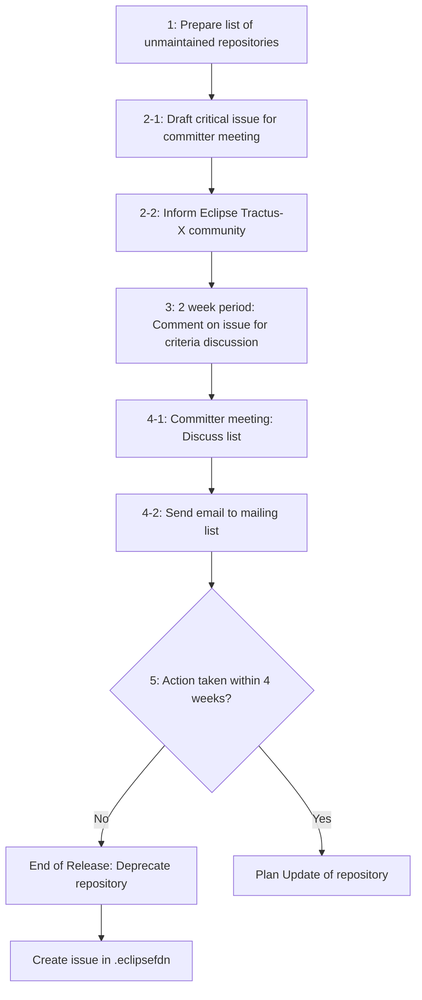
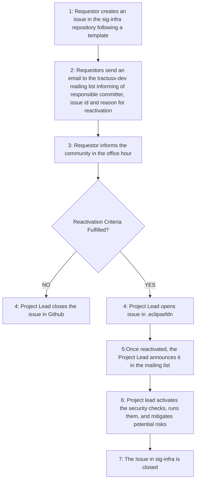

| Status  | Created     | Post-History                          |
|---------|-------------|---------------------------------------|
| Active  | 20-Mar-2025 | Updates security checks               |
| Active  | 12-Nov-2024 | Initial draft                         |

## Why

Eclipse Tractus-X is an open source project governed by the Eclipse Foundation and its Committers. Besides the role participating in maintaining the code base, committers are responsible for its security and adherence to the [Eclipse Tractus-X Releases Guidelines](https://eclipse-tractusx.github.io/docs/release) (TRG's) as well as the guidelines set by the Eclipse Foundation. As this group of committers is responsible for the whole project and has limited resources, repositories that are not maintained for a given time period will be deprecated.

## Description

Deprecation of a repository means that **the repository is being archived**, i.e. set to status "Public Archive" on Github. It's still accessible from within the project, so that it could be revived. Please refer to [this list for examples of archived repositories within Eclipse Tractus-X](https://github.com/eclipse-tractusx/?q=&type=archived&language=&sort=).

Additionally the helm charts and container images are still available and no information about the deprecation is passed to the user.

### Criteria for Deprecation

Committers consider the following criteria to propose deprecation of a repository:

1. The repository does not comply with the Eclipse Tractus-X Releases Guidelines (TRG's) and/or the guidelines set by the Eclipse Foundation (i.e. Security, Intellectual Property, etc.)

In case of repositories belonging to a [Product](https://eclipse-tractusx.github.io/community/products):

<!-- markdownlint-disable MD029  because it should start with 2.-->
2. The product of the repository has not been released within the _past year's major release cycle_**\***.
3. The standards used by the product have been changed in a major version within the _past year's major release cycle_**\***.
<!-- markdownlint-enable MD029 -->

**\*** The _past year's major release cycle_ is the time span between the breaking change releases YY.06 e.g., 24.05 till 24.05.

### Deprecation Process

To ensure the communities awareness the following process is used at least per major release planning:



1. The committers prepare a list of unmaintained repositories.
2. The committers inform the Eclipse Tractus-X community via the [dev mailing list](https://eclipse-tractusx.github.io/docs/oss/how-to-contribute/#dev-mailinglist). This is done by an issue with checkboxes listing all these repositories (find the issue template [below](#issue-template-for-deprecation-list)). Additionally a critical issue is drafted on the [board for the committer meeting](https://github.com/orgs/eclipse-tractusx/projects/61/views/6) in at least 2 full weeks.
3. 2 weeks period: The committers comment the issue regarding which repositories are confronted with the [deprecation criteria](#criteria-for-deprecation).
4. Committer meeting: The committers discuss the list and check the boxes in the issue. As a result, a mail is sent out to the Eclipse Tractus-X mailing list. This list is split into network service products (e.g. Eclipse Tractus-X EDC), use case products (e.g. PURIS) and supporting repositories (e.g. API Hub). See a template below.
5. If no action is taken within additional **4 weeks** the project leads will proceed with the deprecation of the given repositories and communicate accordingly on the dev mailing list.
6. In case the repository got deprecated, and there is again maintenance or develop capacity, the following procedure **MUST** be followed [Repository Reactivation Process](#repository-reactivation-process) by a committer.

### Issue Template for Deprecation List

``` markdown
# Deprecation List

The following repositories fulfill at least **criteria 1** so that deprecation has been proposed with this issue following [TRG 7.09](https://eclipse-tractusx.github.io/docs/release/trg-7/trg-7-09).

Dear @eclipse-tractusx/automotive-tractusx-committers please check the following list and comment which of the repositories shall be marked for deprecation. The list will be discussed as a critical topic in the committer meeting in two weeks.

- [ ] sample repo link 1
- [ ] sample repo link 2
```

### Mail Template for Deprecation

``` markdown
Dear Eclipse Tractus-X Community,

Following repositories are proposed to be subject to deprecation with the upcoming release following [TRG 7.09](https://eclipse-tractusx.github.io/docs/release/trg-7/trg-7-09).

**Network Service Products (CRITICAL)**:
- link to repository 1

**Use Case Products**:
- link to repository 2


**Supporting repository**:
- link to repository 3

**Call to Action**: Please discuss within your company e.g., with your  Catena-X responsibles, whether you run into an issue. We highly encourage the companies to at least find resources for the **Network Service Products** to maintain an open source data space.
```

## Reactivation Guidelines

Your repository got deprecated? No worries, follow the following steps to get it back on its feet:

### Repository Reactivation Criteria

In case a repository you are maintaining or want to maintain got deprecated after all the [Criteria for Deprecation](#criteria-for-deprecation) are fulfilled, and the [Deprecation Process](#deprecation-process) finalized, the following criteria **MUST** be fulfilled to reactivate your repository:

1. The committer and requestor has capacity to resolve the security vulnerabilities and assure that the repository will comply and keep up to date with the TRGs.
2. Capacity to maintain the repository is available.
3. A solid reason is provided to reactivate the repository.

### Repository Reactivation Process



1. The requestor **MUST** create an issue in the [sig-infra](https://github.com/eclipse-tractusx/sig-infra) repository following the template [below](#issue-template-for-reactivation).
2. The requestor **MUST** announce the repository reactivation proposal on the [tractusx-dev](https://accounts.eclipse.org/mailing-list/tractusx-dev) mailing list mentioning the `issue id`, the `reason/motivation`. A `responsible committer` **MUST** be announced.
3. The requestor **MUST** inform the community within the Office Hour about the petition.
4. A project lead will open a issue at the [.eclipsefdn](https://github.com/eclipse-tractusx/.eclipsefdn) requesting the reactivation of the repository.
5. Once the repository is reactivated, the project lead sends a mail to the [tractusx-dev](https://accounts.eclipse.org/mailing-list/tractusx-dev) mailing list announcing the reactivation.
6. The project lead activates the security checks, runs them, and mitigates potential risks.
7. The project lead closes the issue in [sig-infra](https://github.com/eclipse-tractusx/sig-infra).

### Issue Template for Reactivation

```markdown
Title: Request for repository [<REPOSITORY_NAME>] reactivation 
Content:
## Context

**Requester**: @a-contributor-or-committer-github-user
**Responsible Committer**: @a-committer-github-user

**Respository to reactivate**: <repository_link>

### Reason
<!-- Add here your reason, please include the motivation and details to ease the project leads/committer review -->


## Acknowledgments

- [ ] I have checked and verified that the repository fulfills the [Reactivation Guidelines](https://eclipse-tractusx.github.io/docs/release/trg-7/trg-7-09)

- [ ] I have emailed the mailing list announcing the committer assigned to the repository, providing a reasonable motivation for the repository reactivation.

- [ ] I have the consent of the committer, which will be responsible for making sure the latest [TRGs](https://eclipse-tractusx.github.io/docs/release) are followed.

- [ ] The committer will monitor and take care that the open security issues of the reactivated repository. Following the [Security TRGs](https://eclipse-tractusx.github.io/docs/release/trg-8/trg-8-01)

```
