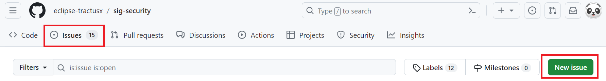
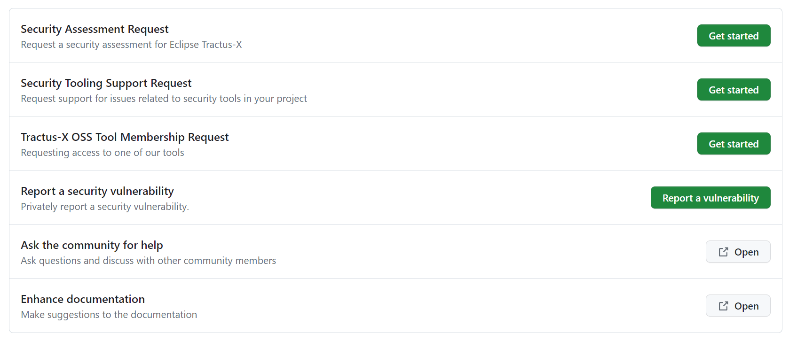

| Status | Created     | Post-History                         |
|--------|-------------|--------------------------------------|
| Active | 14-Feb-2024 | Initial release                      |

## Why

Reporting security issue is essential for enhancing security, mitigating risks and safeguarding users. It ensures prompt identification and resolution, fostering continuous improvement and maintaining trust in systems.

## Description

This page contains information on initiating requests for Security Assessment, Security Tooling Support, Tractus-X OSS Tool Membership and report a security vulnerability. It also addresses procedures related to Ask the community for help and Enhance documentation.

## How to Create an Issue

**Step 1:** Go to the "sig-security" repository [GitHub](https://github.com/eclipse-tractusx/sig-security).

**Step 2:** Click Issues tab and then click New issue.

**Step 3:** Click on either "Get Started" or "Report a Vulnerability" or "Open"  as per the specific request shown below.

**Step 4:** Fill out the form with necessary information and attach the required documents.

**Step 5:** You can click on "Preview" to see how the description looks like and When you're done, click "Submit new issue".

:::info

If you're a project maintainer, you can assign the issue to someone, add it to a project, associate it with a milestone, or apply a label.

:::