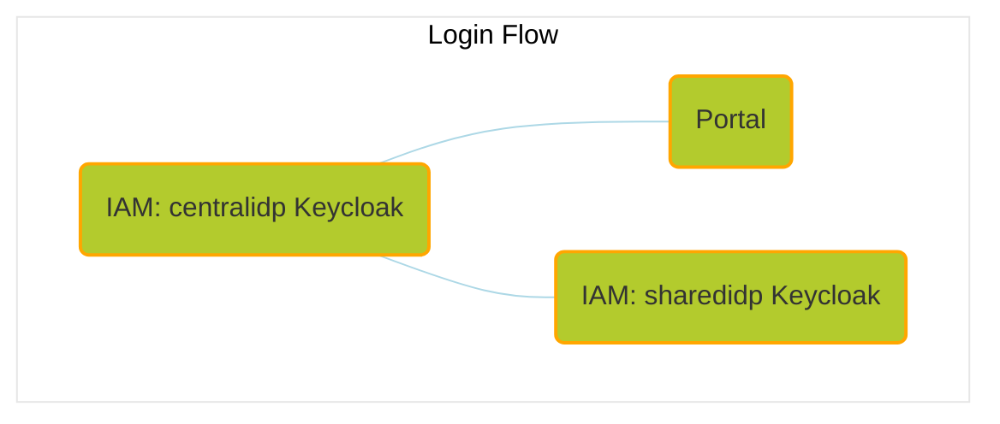

## Preconditions

:::info

Make sure that you have understood and carried out all the steps in the `Prerequisites chapter` before you start deploying the components.

:::

### Mandatory

- Local Kubernetes runtime ready
- `Kubectl`, `helm` and `minikube` installed
- A POSIX-compliant shell, e.g. `bash` or `zsh` unless stated otherwise. The tutorial conatins examples for `bash`.

### Optional

- CLI tool to easily print logs of a K8S deployment, such as [`stern`](https://github.com/stern/stern)
- Graphical tool to inspect your Kubernetes environment, such as [Lens](https://k8slens.dev/).
- Graphical tool to inspect Postgres databases, such as [PgAdmin](https://www.pgadmin.org/). Screenshots in
  this guide are created off of PgAdmin.
- Graphical tool to send REST requests, such as [insomnia] ( <https://insomnia.rest/>) or [Postman](https://www.postman.com/).

## The Deployment

### Using Umbrella Helm Charts

The components (listed in the table in the `Connect chapter`) are deployed using an umbrella chart. It consists of Tractus-X OSS components and provides a basis for running end-to-end tests or creating a sandbox environment of the Catena-X automotive dataspace network. The Chart aims for a completely automated setup of a fully functional network that requires no manual setup steps, as long as only one instance (minikube cluster) is running (see warning above). If several clusters are running, you will need to adjust so configuration files.

:::note

This chapter aligns with the README for the Tractus-X umbrella charts following the link:
<https://github.com/eclipse-tractusx/tractus-x-umbrella/blob/main/charts/umbrella/README.md>

:::

### Overview

Perform the following steps to begin deploying the TXD:

- Get the source
- Start `minikube` bringing up the cluster (profile)
- Enable `Ingress` for local access using the addon for Minikube
- Adjust the configuration files for the Umbrella Helm Chart (this is not required, if you are the only user on a system)
- Use the certifacation manager
- Use helm to deploy the ecosystem
- Check their liveness

### Get the source from the Tractus-X Github

For the most bare-bones installation of the dataspace, execute the following commands in a shell:

```bash
# get the tutorial including the config file for the cluster by cloning the repository locally
git clone https://github.com/eclipse-tractusx/tractus-x-umbrella.git
```

Now we will find the directory [tractus-x-umbrella] under your current working directory. Change into this directory:

```bash
cd tractus-x-umbrella
```

### Start the minikube cluster (profile)

To start the cluster we just call **minikube start**. If we have more than one instance, we use -p option to set the profile name minikube-$USER. We use the other options to request the appropiate resources.

```bash
minikube start --cpus=4 --memory 6gb
# Start the cluster, if -p option is used with the profile name minikube-$USER
```

You can check your minikube cluster any time by starting the Minikube dashboard:

```bash
minikube dashboard
```

### Setting up the local internal netwok

In order to enable the local access via ingress, use the according addon for Minikube:

```bash
minikube addons enable ingress
```

Now add these hostnames to your /etc/hosts. You should ensure that you have access and the /etc/hosts file group entry should be assigend to the group **docker**. Check this with the following commands:

```bash
ls -al /etc/hosts
# Output should be like: "-rw-r--r-- 1 root docker 414 Jun 16 14:34 /etc/hosts"
```

Alternatively configure the DNS Service to be enabled for Ingress.

:::note

 This requires that you have a DNS on your system running and that you have **root accees** via **sudo**

:::

```bash
minikube addons enable ingress-dns
```

Find out the IP  Address of your minikube cluster by entering:

```bash
minikube ip
```

In the following steps, replace `192.168.49.2` with your `minikube ip` if it differs.

#### Linux & Mac

Create a file in /etc/resolver/minikube-test with the following contents.

```properties
domain tx.test
nameserver 192.168.49.2
search_order 1
timeout 5
```

If you still face DNS issues, add the hosts to your /etc/hosts file:

```properties
192.168.49.2    centralidp.tx.test
192.168.49.2    sharedidp.tx.test
192.168.49.2    portal.tx.test
192.168.49.2    portal-backend.tx.test
192.168.49.2    semantics.tx.test
192.168.49.2    sdfactory.tx.test
192.168.49.2    ssi-credential-issuer.tx.test
192.168.49.2    dataconsumer-1-dataplane.tx.test
192.168.49.2    dataconsumer-1-controlplane.tx.test
192.168.49.2    dataprovider-dataplane.tx.test
192.168.49.2    dataprovider-controlplane.tx.test
192.168.49.2    dataconsumer-2-dataplane.tx.test
192.168.49.2    dataconsumer-2-controlplane.tx.test
192.168.49.2    bdrs-server.tx.test
192.168.49.2    iatpmock.tx.test
192.168.49.2    business-partners.tx.test
192.168.49.2    pgadmin4.tx.test
192.168.49.2    ssi-dim-wallet-stub.tx.test
192.168.49.2    dataprovider-submodelserver.tx.test
```

Additional network setup for Mac:

- Install and start [Docker Mac Net Connect](https://github.com/chipmk/docker-mac-net-connect#installation).

We also recommend to execute the usage example after install to check proper setup.

#### Windows

For Windows edit the hosts file under `C:\Windows\System32\drivers\etc\hosts`:

```properties
192.168.49.2    centralidp.tx.test
192.168.49.2    sharedidp.tx.test
192.168.49.2    portal.tx.test
192.168.49.2    portal-backend.tx.test
192.168.49.2    semantics.tx.test
192.168.49.2    sdfactory.tx.test
192.168.49.2    ssi-credential-issuer.tx.test
192.168.49.2    dataconsumer-1-dataplane.tx.test
192.168.49.2    dataconsumer-1-controlplane.tx.test
192.168.49.2    dataprovider-dataplane.tx.test
192.168.49.2    dataprovider-controlplane.tx.test
192.168.49.2    dataconsumer-2-dataplane.tx.test
192.168.49.2    dataconsumer-2-controlplane.tx.test
192.168.49.2    bdrs-server.tx.test
192.168.49.2    iatpmock.tx.test
192.168.49.2    business-partners.tx.test
192.168.49.2    pgadmin4.tx.test
192.168.49.2    ssi-dim-wallet-stub.tx.test
192.168.49.2    dataprovider-submodelserver.tx.test
```

### Install Helm Charts

:::warning

- Due to resource restrictions, it's **not recommended** to install the helm chart with all components enabled.

- It is to be expected that some pods - which run as post-install hooks, like for instance the **portal-migrations job - will run into errors until another component**, like for instance a database, is ready to take connections.
Those jobs will recreate pods until one run is successful.
- **Persistance is disabled by default** but can be configured in a custom values file.

:::

#### Use local repository

Make sure you cloned the [tractus-x-umbrella](https://github.com/eclipse-tractusx/tractus-x-umbrella) repository beforehand.

Then navigate to the chart directory:

```bash
cd charts/umbrella/
```

Download the chart dependencies:

```bash
helm dependency update ../tx-data-provider
helm dependency update
```

##### grey_question: Command explanation

> `helm install` is used to install a Helm chart.
> > `-f your-values.yaml` | `-f values-*.yaml` specifies the values file to use for configuration.
> ---
> > `umbrella` is the release name for the Helm chart.
> ---
> > `.` specifies the path to the chart directory.
> ---
> > `--namespace umbrella` specifies the namespace in which to install the chart.
> ---
> > `--create-namespace` create a namespace with the name `umbrella`.

##### Option 1

Choose to install one of the predefined subsets (currently in focus of the **E2E Adopter Journey**):

:::note 

This will take a while. So please be patient.

:::

###### Data Exchange Subset

```bash
helm install -f values-adopter-data-exchange.yaml umbrella . --namespace umbrella --create-namespace
```

**Optional:**

Enable `dataconsumerTwo` by setting it true in `values-adopter-data-exchange.yaml` and then executing an upgrade:

```bash
dataconsumerTwo:
  enabled: true
```

```bash
helm upgrade -f values-adopter-data-exchange.yaml umbrella . --namespace umbrella
```

###### Portal Subset

```bash
helm install -f values-adopter-portal.yaml umbrella . --namespace umbrella --create-namespace
```

##### Option 2

Install your chosen components by having them enabled in a `your-values.yaml` file:

```bash
helm install -f your-values.yaml umbrella . --namespace umbrella --create-namespace
```

> In general, all your specific configuration and secret values should be set by installing with an own values file.


#### Get to know the Portal

Perform first login and send out an invitation to a company to join the network (SMTP account required to be configured in custom values.yaml file).

Proceed with the login to the <http://portal.arena.test> to verify that everything is setup as expected.

Credentials to log into the initial example realm (CX-Operator):

```sh
cx-operator@arena.test
```

```sh
tractusx-umbr3lla!
```



The relevant hosts are the following:

- <http://centralidp.tx.test/auth/>
- <http://sharedidp.tx.test/auth/>
- <http://portal-backend.tx.test>
- <http://portal.tx.test>

In case that you have TLS enabled (see [Self-signed TLS setup (Optional)](#self-signed-tls-setup-optional)), make sure to accept the risk of the self-signed certificates for all the hosts before performing the first login:

- <https://centralidp.tx.test/auth/>
- <https://sharedidp.tx.test/auth/>
- <https://portal-backend.tx.test>
- <https://portal.tx.test>

### Uninstall Helm Charts

To teardown your setup, run:

```shell
helm delete umbrella --namespace umbrella
```

:::warning

If persistance for one or more components is enabled, the persistent volume claims (PVCs) and connected persistent volumes (PVs) need to be removed manually even if you deleted the release from the cluster.

:::

### Ingresses

Currently enabled ingresses:

- http://centralidp.tx.test/auth/
- http://sharedidp.tx.test/auth/
- http://portal-backend.tx.test
  - http://portal-backend.tx.test/api/administration/swagger/index.html
  - http://portal-backend.tx.test/api/registration/swagger/index.html
  - http://portal-backend.tx.test/api/apps/swagger/index.html
  - http://portal-backend.tx.test/api/services/swagger/index.html
  - http://portal-backend.tx.test/api/notification/swagger/index.html
- http://portal.tx.test
- http://semantics.tx.test/discoveryfinder/swagger-ui/index.html
- http://ssi-credential-issuer.tx.test/api/issuer/swagger/index.html
- http://dataconsumer-1-controlplane.tx.test
- http://dataconsumer-1-dataplane.tx.test
- http://dataprovider-dataplane.tx.test
- http://dataconsumer-2-controlplane.tx.test
- http://dataconsumer-2-dataplane.tx.test
- http://business-partners.tx.test/pool
- http://business-partners.tx.test/orchestrator
- http://bdrs-server.tx.test
- http://iatpmock.tx.test
- http://pgadmin4.tx.test
- http://ssi-dim-wallet-stub.tx.test
- http://dataprovider-submodelserver.tx.test

### Database Access

This chart also contains a pgadmin4 instance for easy access to the deployed Postgres databases which are only available from within the Kubernetes cluster.

pgadmin4 is by default enabled with in the predefined subsets for data exchange and portal.

Address: [pgadmin4.tx.test](http://pgadmin4.tx.test)

Credentials to login into pgadmin4:

```sh
pgadmin4@txtest.org
```

```sh
tractusxpgdamin4
```

:::info

The database server connections need to be added manually to pgadmin4.

:::

Default username for all connections:

```sh
postgres
```

Default user for all connections:

```sh
5432
```

In the following some of the available connections:

- portal

Host:

```sh
portal-backend-postgresql
```

Password:

```sh
dbpasswordportal
```

- centralidp

Host:

```sh
umbrella-centralidp-postgresql
```

Password:

```sh
dbpasswordcentralidp
```

- sharedidp

Host:

```sh
umbrella-sharedidp-postgresql
```

Password:

```sh
dbpasswordsharedidp
```

- miw

Host:

```sh
umbrella-miw-postgres
```

Password:

```sh
dbpasswordmiw
```

- dataprovider

Host:

```sh
umbrella-dataprovider-db
```

Password:

```sh
dbpasswordtxdataprovider
```

- dataconsumer-1

Host:

```sh
umbrella-dataconsumer-1-db
```

Password:

```sh
dbpassworddataconsumerone
```

- dataconsumer-2

Host:

```sh
umbrella-dataconsumer-2-db
```

Password:

```sh
dbpassworddataconsumertwo
```

### Keycloak Admin Console

Access to admin consoles:

- [http://centralidp.tx.test/auth/](http://sharedidp.tx.test/auth/)
- [http://sharedidp.tx.test/auth/](http://sharedidp.tx.test/auth/)

Default username for centralidp and sharedidp:

```sh
admin
```

Password centralidp:

```sh
adminconsolepwcentralidp
```

Password sharedidp:

```sh
adminconsolepwsharedidp
```

### Seeding

See [Overall Seeding](https://github.com/eclipse-tractusx/tractus-x-umbrella/blob/main/concept/seeds-overall-data.md).

### Self-signed TLS setup (Optional)

Some of the components are prepared to be configured with TLS enabled (see "uncomment the following line for tls" comments in [values.yaml](./values.yaml)).

If you'd like to make use of that, make sure to to execute this step beforehand.

Install cert-manager chart in the same namespace where the umbrella chart will be located.

```bash
helm repo add jetstack https://charts.jetstack.io
helm repo update
```

```bash
helm install \
  cert-manager jetstack/cert-manager \
  --namespace umbrella \
  --create-namespace \
  --version v1.14.4 \
  --set installCRDs=true
```

Configure the self-signed certificate and issuer to be used by the ingress resources.

If you have the repository checked out you can run:

```bash
kubectl apply -f ./charts/umbrella/cluster-issuer.yaml
```

or otherwise you can run:

```bash
kubectl apply -f - <<EOF
apiVersion: cert-manager.io/v1
kind: ClusterIssuer
metadata:
  name: selfsigned-issuer
spec:
  selfSigned: {}
---
apiVersion: cert-manager.io/v1
kind: Certificate
metadata:
  name: my-selfsigned-ca
  namespace: umbrella
spec:
  isCA: true
  commonName: arena.test
  secretName: root-secret
  privateKey:
    algorithm: RSA
    size: 2048
  issuerRef:
    name: selfsigned-issuer
    kind: ClusterIssuer
    group: cert-manager.io
  subject:
    organizations:
      - CX
    countries:
      - DE
    provinces:
      - Some-State
---
apiVersion: cert-manager.io/v1
kind: ClusterIssuer
metadata:
  name: my-ca-issuer
spec:
  ca:
    secretName: root-secret
EOF
```

See [cert-manager self-signed](https://cert-manager.io/docs/configuration/selfsigned) for reference.

### Precondition for Semantic Hub

In case of enabling `semantic-hub` the fuseki docker image must be built.
Build fuseki docker image by following the below steps:

- Download [jena-fuseki-docker-4.7.0.zip](https://repo1.maven.org/maven2/org/apache/jena/jena-fuseki-docker/4.7.0/jena-fuseki-docker-4.7.0.zip)
- Unzip the jena-fuseki-docker-4.7.0.zip.
- Build the docker image by running the command - `docker build --build-arg JENA_VERSION=4.7.0 -t jena-fuseki-docker:4.7.0 --platform linux/amd64 .`

## Notice

This work is licensed under the [CC-BY-4.0](https://creativecommons.org/licenses/by/4.0/legalcode).

- SPDX-License-Identifier: CC-BY-4.0
- SPDX-FileCopyrightText: 2024 ARENA2036 e.V.
- SPDX-FileCopyrightText: 2024 sovity GmbH
- SPDX-FileCopyrightText: 2024 SAP SE
- SPDX-FileCopyrightText: 2024 msg systems AG
- Source URL: [https://github.com/eclipse-tractusx/eclipse-tractusx.github.io](https://github.com/eclipse-tractusx/eclipse-tractusx.github.io)
