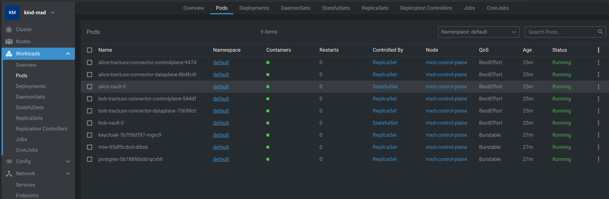
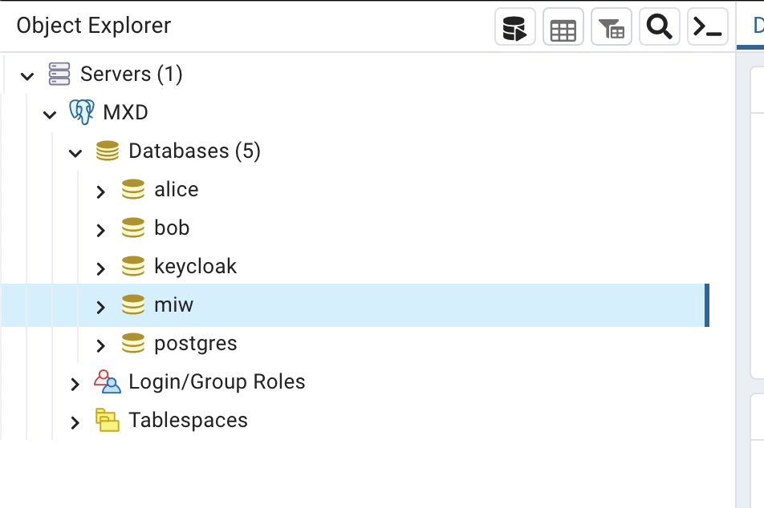

The "MXD" dataspace initially consists of several components: `Alice` and `Bob` (two Tractus-X EDC connectors),
a Vault instance each, a Postgres database, a Managed Identity Wallet app, a Keycloak instance. `Alice` and `Bob` will
be our dataspace participants. Each of them stores their secrets in their respective vault instances, and there is a
shared Postgres server, where each of them has a database. MIW and Keycloak are central components, they only exist
once and are accessible by all participants.

:::warning

Since this documentation is based on a MXD version where tractusx-edc version `0.5.1` is used, there is a need to adapt the `values.yaml` inside the cloned repository **tutorial-resources**. The file is located in `tutorial-resources/mxd/modules/connector/values.yaml`

Instead of the `latest` tag for the **controlplane** and **dataplane** image, please use `0.5.1`.

```yaml
# As an example for the controlplane
controlplane:
  debug:
    enabled: true
    port: 1044
  service:
    type: NodePort
  endpoints:
    management:
      authKey: password
  image:
    pullPolicy: Never
    #tag: "latest"
    tag: "0.5.1"
```

:::

For the most bare-bones installation of the dataspace, execute the following commands in a shell:

```shell
# get the tutorial including the config file for the cluster by cloning the repository locally
git clone  https://github.com/eclipse-tractusx/tutorial-resources.git
# will install the mxd directory under <current working directory>/tutorial-resources/mxd
# the directory should contain the config file for kind: kind.config.yaml
cd <path/of/mxd>
kind create cluster -n mxd --config kind.config.yaml
# 
# Now we activate ingress for the later port forwarding ?
# the next step is specific to KinD and will be different for other Kubernetes runtimes!
kubectl apply -f  \
https://raw.githubusercontent.com/kubernetes/ingress-nginx/main/deploy/static/provider/kind/deploy.yaml
# wait until the ingress controller is ready
kubectl wait --namespace ingress-nginx \
  --for=condition=ready pod \
  --selector=app.kubernetes.io/component=controller \
  --timeout=90s
terraform init
terraform apply
# type "yes" and press enter when prompted to do so 
```

Notice that the `kubectl apply` command deploys a Kubernetes Ingress Controller to the cluster and is required to reach
our applications from outside the cluster. Specifically, it deploys an NGINX ingress controller. Notice also, that the
command is *specific to KinD* and will likely not work on other Kubernetes runtimes (minikube, ...) or with other
ingress controllers!

Wait. Then wait some more. It will take a couple of minutes until all services are booted up. If your machine is a
potato, it'll take even longer. Just get a coffee. Eventually, it should look similar to this:



## Inspect terraform output

After the `terraform` command has successfully completed, it will output a few configuration and setup values
that we will need in later steps. Please note that some values will be different on your local system.

```shell
Outputs:

alice-urls = {
  "health" = "http://localhost/alice/health"
  "management" = "http://localhost/alice/management/v2"
}
bob-node-ip = "10.96.248.22"
bob-urls = {
  "health" = "http://localhost/bob/health"
  "management" = "http://localhost/bob/management/v2"
}
connector1-aeskey = "R3BDWGF4SWFYZigmVj0oIQ=="
connector1-client-secret = "W3s1OikqRkxCbltfNDBmRg=="
connector2-aeskey = "JHJISjZAS0tSKlNYajJTZA=="
connector2-client-secret = "enFFUlkwQyZiJSRLQSohYg=="
keycloak-database-credentials = {
  "database" = "miw"
  "password" = "Tn*iwPEuCgO@d==R"
  "user" = "miw_user"
}
keycloak-ip = "10.96.103.80"
miw-database-pwd = {
  "database" = "keycloak"
  "password" = "W:z)*mnHdy(DTV?+"
  "user" = "keycloak_user"
}
postgres-url = "jdbc:postgresql://10.96.195.240:5432/"
```

## Inspect the databases

Please be aware, that all services and applications that were deployed in the previous step, are **not** accessible from
outside the Kubernetes cluster. That means, for example, the Postgres database cannot be reached out-of-the-box.

Naturally there are several ways to enable access to those services (Load balancers, Ingresses, etc.) but for the sake
of simplicity we will use a plain Kubernetes port-forwarding:

```shell
# find out about the names of your pods
kubectl get pods
# you should see a list like:
NAME                                                     READY   STATUS    RESTARTS   AGE
alice-tractusx-connector-controlplane-6f7555bcb7-mhxh6   1/1     Running   0          4m
alice-tractusx-connector-dataplane-6db78d69c5-sw87d      1/1     Running   0          4m
alice-vault-0                                            1/1     Running   0          4m
bob-tractusx-connector-controlplane-76ccd79946-84zjw     1/1     Running   0          4m
bob-tractusx-connector-dataplane-85554c7dcd-6pzzs        1/1     Running   0          4m
bob-vault-0                                              1/1     Running   0          4m
keycloak-6bdf4d7689-8mwfd                                1/1     Running   0          4m58s
miw-574bf87bc-c4n6c                                      1/1     Running   0          4m58s
postgres-66677b8665-lxxp2                                1/1     Running   0          5m14s
#
# We will use the last entry for ingress for our port-forwarding, the name of the postgres pod will be slightly differnt in your local cluster.
# now we activtae the kuberntes port-forwarding:
kubectl port-forward postgres-66677b8665-lxxp2  5432:5423
```

> Note that the actual pod name will be slightly different in your local cluster.

Then, using PgAdmin, connect to the Postgres server at `jdbc:postgresql://localhost:5432/` using `user=postgres`
and `password=postgres`:



Every service in the cluster has their own database, but for the sake of simplicity, they are hosted in one Postgres
server. We will show in later sections, how the databases can be segregated out. Feel free to
inspect all the databases and tables, but there is not much data in there yet. There is just a few automatically seeded
assets, policies and contract definitions.

## Verify your local installation

In order to check that the connectors were deployed successfully, please execute the following commands in a shell:

```shell
curl -X GET http://localhost/bob/health/api/check/liveness
curl -X GET http://localhost/alice/health/api/check/liveness
```

which should return something similar to this, the important part being the `isSystemHealthy: true` bit:

```json
{
  "componentResults": [
    {
      "failure": null,
      "component": "Observability API",
      "isHealthy": true
    },
    {
      "failure": null,
      "component": null,
      "isHealthy": true
    }
  ],
  "isSystemHealthy": true
}
```

Once we've established the basic readiness of our connectors, we can move on to inspect a few data items:

```shell
curl -X POST http://localhost/bob/management/v3/assets/request -H "x-api-key: password" -H "content-type: application/json"
```

This queries the `/assets` endpoint returning the entire list of assets that `bob` currently maintains. You should see
something like

```json
[
    {
        "@id": "1",
        "@type": "edc:Asset",
        "edc:properties": {
            "edc:description": "Product EDC Demo Asset 1",
            "edc:id": "1"
        },
        "edc:dataAddress": {
            "@type": "edc:DataAddress",
            "edc:proxyPath": "true",
            "edc:type": "HttpData",
            "edc:proxyQueryParams": "true",
            "edc:baseUrl": "https://jsonplaceholder.typicode.com/todos"
        },
        "@context": {
            "dct": "https://purl.org/dc/terms/",
            "tx": "https://w3id.org/tractusx/v0.0.1/ns/",
            "edc": "https://w3id.org/edc/v0.0.1/ns/",
            "dcat": "https://www.w3.org/ns/dcat/",
            "odrl": "http://www.w3.org/ns/odrl/2/",
            "dspace": "https://w3id.org/dspace/v0.8/"
        }
    },
    {
        "@id": "2",
        "@type": "edc:Asset",
        "edc:properties": {
            "edc:description": "Product EDC Demo Asset 2",
            "edc:id": "2"
        },
        "edc:dataAddress": {
            "@type": "edc:DataAddress",
            "edc:proxyPath": "true",
            "edc:type": "HttpData",
            "edc:proxyQueryParams": "true",
            "edc:baseUrl": "https://jsonplaceholder.typicode.com/todos"
        },
        "@context": {
            "dct": "https://purl.org/dc/terms/",
            "tx": "https://w3id.org/tractusx/v0.0.1/ns/",
            "edc": "https://w3id.org/edc/v0.0.1/ns/",
            "dcat": "https://www.w3.org/ns/dcat/",
            "odrl": "http://www.w3.org/ns/odrl/2/",
            "dspace": "https://w3id.org/dspace/v0.8/"
        }
    }
]
```

Note: the same thing can be done to inspect policies and contract definitions. The respective `curl` commands are:

```shell
# policies:
curl -X POST http://localhost/bob/management/v2/policydefinitions/request -H "x-api-key: password" -H "content-type: application/json"
# contract defs:
curl -X POST http://localhost/bob/management/v2/contractdefinitions/request -H "x-api-key: password" -H "content-type: application/json"
```

Alternatively, please check out the [Postman collections here](./postman)

## Notice

This work is licensed under the [CC-BY-4.0](https://creativecommons.org/licenses/by/4.0/legalcode).

- SPDX-License-Identifier: CC-BY-4.0
- SPDX-FileCopyrightText: 2023 sovity GmbH
- SPDX-FileCopyrightText: 2023 SAP SE
- SPDX-FileCopyrightText: 2023 msg systems AG
- Source URL: [https://github.com/eclipse-tractusx/eclipse-tractusx.github.io](https://github.com/eclipse-tractusx/eclipse-tractusx.github.io)
