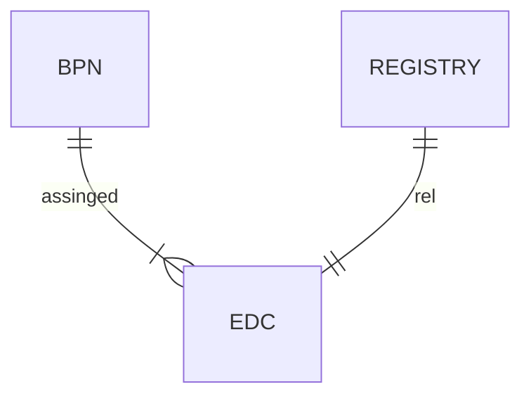

---
**NOTE:**
This chapter is still work in progress. Check back layer!

---

If you are interested more in buying services, please get in contact with a operating company.
This section is for the makerr, which are intereste in deploying the services in their own it landscape.

**Where does the journey begin? / It Starts all with the BPN**

The first thing you need is a BPN because this is used within the Network to identify yourself against another paricipant. This tells the network in a trusted mannor who are you. [How to get your BPN?](https://eclipse-tractusx.github.io)

[//]: # (Felix: Für das Tutorial gilt das vermutlich nicht. Das Konzept der BPN ist wichtig, aber das lokale deployment sollte ohne funktionieren - wir "mocken" oder deaktivieren ja den DAPS/SSI, oder?)

[//]: # (Felix: Als Erklärung, was eine BPN ist und wofür wir die brauchen - Access Policies im EDC - reicht das noch nicht aus, oder?) 

The next component to share data to another participant is the [Eclipse Data Space Connector](https://eclipse-tractusx.github.io) (EDC). With that component you are always in control of your data and it enables to be data sovereign. You are using the BPN's to also make sure, that you know who to share your data with. This must also be configured into your EDC.

[//]: # (Felix: Wenn wir von "No preliminary knowledge" ausgehen, brauchen wir auch hier noch 1-2 Sätze, was der EDC macht - P2P Datenaustausch, Control & Data Plane)

Now the minimal Setup for data exchange is in place. Now you are able to setup data offers and exchange data.

[//]: # (Felix: Noch wurde im Rahmen des Tutorials ja nichts gemacht. Ich würde vielleicht sowas sagen wie "In principle, an EDC and an Identity - das ist es ja was die BPN wiedergibt - are enough to share data in the Catena-X data space. However, for an interoperable and scalable data space we also need technologies for data description/semantic as well as data discovery and access)

**What language does Catena-X speak? / Asset Administration Shell with Aspect Models define the language in Catena-X**

Since Catena-X is more than just a data exchange the next level of ... is to exchange data in a structured and defined way. This helps to speak the same language, same syntax to enhance business value ... .
(Same language == greater value)
This is realized with [Asset Administration Shell](https://eclipse-tractusx.github.io) (Digital Twins) and Aspect models. The AAS is the vehicle to transport the semantic, which is modeled in Aspect Models.

With that you are able to speak Catena-X.

[//]: # (Felix: Ist das nicht eher BAMM? AAS beschäftigt sich ja mit dem strukturierten Auffinden und Zugreifen von Daten. Die "Sprache" von Catena-X wären dann die semantischen Modelle?)

**Now the question is how can you find the Assets,the Data? / Wanna find Data? Digital Twin Registry is your Service of Choice**

The answer to that question is the so called digital twin registry. This is a service which enables the participants to ask the question, where is the information to for example some part and some specific data belonging to that part.
To enable this, the Data Offers of a Catena-X participants shall be registered in their respective [Digital Twin Registry](https://eclipse-tractusx.github.io). There fore each participant with a registry can provide the functionality to tell a data requestor where the data can be found.

**How to elaborate,"vergrößern" value along the Data Chain? / Build Value with the Network**

The [Item Relationship Service](https://eclipse-tractusx.github.io) (IRS) is one tool which can be used, to very easy access distributed linked Data within the Network. To enable Business Logic along the Data Chain. If you want to be the rocket within the network, the IRS is your Service to use!

[//]: # (Felix: Fehlen hier nicht noch der EDC Discovery Service und die beiden Registry Discovery Services für ein vollständiges Bild? Ich habe im Kopf, dass wir einmal alle Komponenten erklären, mit denen ein adopter interagieren muss - da fehlt dann noch das registrieren von EDCs, der Registry und eine Erklärung der Rolle des Backends)

[//]: # (Felix: @Johannes: Hast du dir schon überlegt, wie/wo wir den IRS plazieren wollen? Eher als "Advanced Concept" unter Chapter 4, oder als "Basic Concept" in Chapter 3? )

@Jens

- highlevel Architecture chart - building block view
  - EDC
  - BPN
  - AAS & Aspectmodelle (Digital Twins)
  - Registry
  - (IRS)

- Architecture principles in Scope of the Journey or Catena-X
  - Data Sovereignty
  - Interoperability
