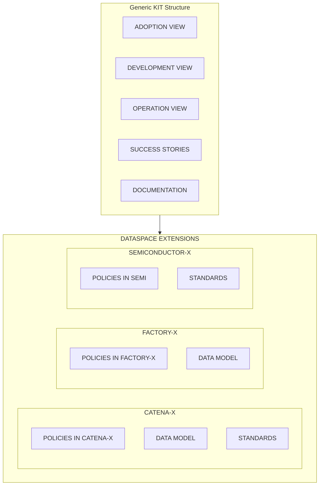

{/********************************************************************************* 
 * Copyright (c) 2025 Contributors to the Eclipse Foundation
 * 
 * See the NOTICE file(s) distributed with this work for additional
 * information regarding copyright ownership.
 * 
 * This program and the accompanying materials are made available under the
 * terms of the Apache License, Version 2.0 which is available at
 * https://www.apache.org/licenses/LICENSE-2.0.
 * 
 * Unless required by applicable law or agreed to in writing, software
 * distributed under the License is distributed on an "AS IS" BASIS, WITHOUT
 * WARRANTIES OR CONDITIONS OF ANY KIND, either express or implied. See the
 * License for the specific language governing permissions and limitations
 * under the License.
 * 
 * SPDX-License-Identifier: Apache-2.0
 ********************************************************************************/
 }

import { KitStructureTable } from '@site/src/components/2.0/KitComponents';

| Status     | Created      | Post-History                           |
|------------|--------------|----------------------------------------|
| Draft      | 04-Apr-2024  | Initial contribution                   |
| Active     | 07-Nov-2025  | Added Dataspace Extensions section and Structure     |

This explains each artifact a KIT can or must follow - depending on the graduation stage [TRG 9.01](/docs/release/trg-0/trg-9-01). An artifact is textual content or a technical component that is part of a KIT (e.g. a Vision statement).

## The KIT Framework & Structure

KITs are structured around different views, each targeting specific stakeholders with relevant content:

<KitStructureTable />

## COPYRIGHT NOTICE

Mandatory for every KIT, It **MUST** be included in every file (not just on the adoption view!).
KIT documentation works under the CC-BY-4.0 license. Therefore you need to add the "notice" part to make transparent which companies worked on this KIT.
It **MUST** always include the `- SPDX-FileCopyrightText: 2025 Contributors to the Eclipse Foundation` copyright statement.

`Example:`

```
## NOTICE

This work is licensed under the [CC-BY-4.0](https://creativecommons.org/licenses/by/4.0/legalcode).

- SPDX-License-Identifier: CC-BY-4.0
- SPDX-FileCopyrightText: 2025 <Your Company FullName>
- SPDX-FileCopyrightText: 2023, 2025 ZF Friedrichshafen AG
- SPDX-FileCopyrightText: 2023, 2025 Bayerische Motoren Werke Aktiengesellschaft (BMW AG)
- SPDX-FileCopyrightText: 2023, 2025 SAP SE
- SPDX-FileCopyrightText: 2023, 2025 Volkswagen AG
- SPDX-FileCopyrightText: 2023, 2025 Robert Bosch GmbH
- SPDX-FileCopyrightText: 2023, 2025 Mercedes Benz Group
- SPDX-FileCopyrightText: 2023, 2025 BASF SE
- SPDX-FileCopyrightText: 2023, 2025 Schaeffler AG
- SPDX-FileCopyrightText: 2023, 2025 Contributors to the Eclipse Foundation
- Source URL: [Source Code](https://github.com/eclipse-tractusx/eclipse-tractusx.github.io/)
```

In case its a new KIT the year can be referenced like that:

`Example:`
```
## NOTICE

This work is licensed under the [CC-BY-4.0](https://creativecommons.org/licenses/by/4.0/legalcode).

- SPDX-License-Identifier: CC-BY-4.0
- SPDX-FileCopyrightText: 2025 <Your Company FullName>
- SPDX-FileCopyrightText: 2025 Bayerische Motoren Werke Aktiengesellschaft (BMW AG)
- SPDX-FileCopyrightText: 2025 Contributors to the Eclipse Foundation
- Source URL: [Source Code](https://github.com/eclipse-tractusx/eclipse-tractusx.github.io/)
```

## CHANGELOG

To achieve uniformity, we use [semantic versioning](https://semver.org/). Concrete examples in our already published [KITs](https://eclipse-tractusx.github.io/Kits).
For a KIT we distinguish between three phases sandbox, incubating and graduated.

## Adoption View

The adoption view gives a general introduction to the KIT. It aims to provide insights to industry problems, the KIT is addressing.
Mandatory for every KIT and all graduation stages
The vision describes the strategic objectives of a KIT and how it aims to inspire solution providers.
Deliverables:

- Vision catch phrase + context
- Mission catch phrase
- Context to the use case
Starting with the **vision of the KIT** (one or two catching phrases)
`Example from BPDM:`
Unique business partner data sets for the whole data space. Basis for integration value-adding services in the area of business partner data management.

### The missions of the KIT

Mandatory for every KIT and all graduation stages
The mission explains why we are providing the KIT describing a concrete industry problem.
`Example from BPDM:` “The KIT provides a homogenous semantic with an open data model, high data quality and one access point to the business partner data sets.”

#### Giving more context with explaining the connection to the use case

`Example from BPDM:`
The BusinessPartner KIT provides high-quality data records of business partners called golden record, including a unique identifier, the business partner number (BPN).
…

### Business Value

Mandatory for every KIT that is related to a use case and all graduation stages
The business value describes the benefits for an service provider by using a KIT in order to create a commercial or non-profit solution for the Catena-X marketplaces.
Deliverable:
About 3 to 5 top business values (title + description)
`Example from BPDM:`
One open data model: Application and Service provider can reduce investments to integrate due to one data model / API specification and open interface. The pool API enables the integration and offering of value-added services and innovation based on high-quality master data.
Access to new market potentials: Potential to scale customer group and access new market potentials via Catena-X marketplace and shared service network. The BP KIT enables an interoperable foundation for value-added services.
The unique identifier: BPN is the unique number to identify and find partners in the Catena-X network. It will also provide high quality data sets from business partners, their legal unit, sites and addresses.

### Use Case / Domain explanation

Mandatory for every KIT that is related to a use case and all graduation stages
This gives more insights into the use case or domain itself.

- Todays challenge
- Values for taking the challenge
- Benefits for OEM, SME, Solution Provider
Deliverable: Status quo, challenge and the benefits from different perspectives
`Example from BPDM:`
Business Partner KIT comes from the use case Business Partner Data Management.
Status Quo / Todays challenge:
Most of today’s automotive companies have to invest a significant amount to keep their individual partner master data updated and correct, since outdated or incorrect data records result in federal fines and wrong claims / billing processes. The industry spends a vast amount into an area that is non differentiating, regulated and executed redundantly across the partners.
For this, cutting individual company costs by offering the golden master data record as a shared service and proactively reduce Business Partner risk via collaborative value-add services.
This will become the industry’s largest golden record collection as a shared and cost-optimized service (quality tested by the biggest players).
OEMs and small-medium enterprises can:
- Reduce today’s individual investments in master data mgt.
- Re-allocate freed-up resources to differentiating / critical tasks
- Time to value within 6 months, due to standard interfaces and mapping tools (e.g. SAP)
- Increase data quality and use industry collective wisdom to act pro-actively (e.g. fraud alerts)
Solution Provider:
- Reduce investments to integrate due to one Data Model and open interface.
- The KIT enables the offering of value-add services and innovation based on golden record and collective wisdom.
- Potential to scale customer group and access new market potentials via marketplace and shared service network.

### Tutorials

Mandatory for the 'Graduated' stage. Optional for 'sandbox' and 'incubating'
A tutorial provides educational resources that provides step-by-step guidance on how to use a KIT. Tutorials can be delivered in various formats, such as videos or written text. It may also provide additional resources for further exploration of the topic.
Deliverables:

- Description
- Tutorial video or screenshot documentation

### Whitepaper

Optional
A whitepaper outlines the overall objectives of a KIT regarding a specific business problem. It provides readers with background information on the topic, identifies key challenges and solutions to those challenges, evaluates alternative approaches to solving the business problem at hand, and offers recommendations for action.
Deliverable:

- Description
- Link to the whitepaper

### Semantic Models

Mandatory for every KIT that is related to a use case + for the 'incubating' stage
The semantic data models are a method of structuring data that includes semantic information that adds a basic meaning to the data and the relationships that lie between them to enable interoperability.
Deliverables:

- Description
- Link to the semantic data models (GitHub)
`Example from Traceability:`
[Traceability Semantic Models](https://eclipse-tractusx.github.io/docs-kits/kits/traceability-kit/adoption-view#semantic-models)

> [!WARNING]
> If there is a dataspace specific semantic model, please include it on the Dataspace Extensions Tab of from your Dataspace.

### Logic / Schema

Mandatory for every KIT that is related to a use case + for the 'incubating' stage
Logic / schemas provides a definition of the minimum viable business process that must be implemented to enable interoperability.
Deliverables: Description

### Business Process

Mandatory for every KIT that is related to a use case + for the 'incubating' stage
Data sovereignty is one of the main principles of Catena-X and a major topic for the participants in the data space. This part should help to understand how the business process works and provides a blue print on how access & usage policies **could** look like.

- Business Architecture
- Access & Usage Policies


## Development View

The development view provides developers with resources to accelerate the development of apps and services.

### Architecture View

The architecture view is an optional chapter. It offers an architecture perspective including the main building blocks and the runtime view. It can be extended with more architecture documentation like an ARC42.
[`Example for an Architecture View:`](https://eclipse-tractusx.github.io/docs-kits/kits/traceability-kit/Architecture%20View%20Traceability%20Kit#scope-and-context).

### API Specifications

Mandatory for every KIT that wants to go to the 'incubating' stage
Deliverables:

- Introduction to the API / specification of the API
- Whats the main focus of the API
- Integration of the OpenAPI file
- Use case examples for the API endpoints and how to use them
`Example from DataChain KIT:` The API of the Item Relationship Service (IRS) for retrieving item graphs along the value chain of Catena-X partners.
[`Example for OpenAPI integration:`](/docs-kits/kits/business-partner-kit/software-development-view)

### Sample Data

Deliverable:

- Description on how to use the sample data
- File with sample data

### Reference Implementation

Deliverable:

- Description
- Link to repository

### Documentation in the context of development

Deliverable:

- Arch42
- Usage examples
- More explanation on how to use the API in different scenarios

## Operations View

... provides resources to deploy and operate centralized & decentralized Catena-X offerings in your IT environment (e.g., on-prem, cloud).
Deliverables:
**Quick Setup Guide / Installation Instructions**

- Prerequisites (if they exist)
- Authorization information
- Deployment
  **Deployment Scripts**

## Documentation

The Documentation view provides extra documentation and links that may be relevant for any stakeholder. This section serves as a central repository for additional resources that don't fit into the specific views above but are valuable for understanding or working with the KIT.

### Purpose

This view is designed to be flexible and accommodate various types of supplementary information that stakeholders might need, including:

- Links to external resources and related projects
- External documentation that complements the KIT
- Additional technical papers or research documents
- Community resources and discussion forums
- Video presentations and webinars
- Case studies and implementation examples
- Related standards and specifications hosted elsewhere
- Training materials and certification programs

### Deliverables

**Additional Resources:**

- **External Links**: Relevant websites, repositories, and resources
- **Related Documentation**: Links to complementary KITs or standards
- **Community Resources**: Forums, chat channels, and discussion boards
- **Media Resources**: Videos, podcasts, or presentations about the KIT
- **Publications**: Research papers, blog posts, or articles
- **Training Materials**: Courses, workshops, or certification programs

### Examples

- In [Data Trust & Security KIT](/docs-kits/kits/data-trust-and-security-kit/documentation/rulebook-template) the documentation section is used to reference a rulebook template.

- In the category documentation you can include links like this:

```js

{
    type: 'category',
    label: 'Documentation',
    items: [
        // Add your links here:
        {
            type: 'link',
            label: 'Your Link Label',  // Change this to your link text
            href: 'https://example.com/your-url'  // Change this to your URL
        }
    ]
}
```

You can update that in ['/sidebarsDocsKits.js'](../sidebarsDocsKits.js) file at the root folder.


## Dataspace Extensions

The Dataspace Extensions view represents a specialized extension mechanism that allows KITs to be adapted and customized for specific dataspace implementations while maintaining their core structure and functionality. This approach ensures interoperability across different dataspaces while allowing for dataspace-specific requirements, policies, and standards.

### Purpose and Scope

Dataspace Extensions enable KITs to support multiple dataspace ecosystems (such as Catena-X, Factory-X, Semiconductor-X, etc.) without duplicating the core KIT content. Each dataspace extension contains:

- **Dataspace-specific policies** that govern data usage and access within that particular ecosystem
- **Custom data models** tailored to the specific industry or domain requirements
- **Dataspace standards** that may differ from generic implementations
- **Compliance requirements** specific to regulatory or industry standards

### Standards

Mandatory for every KIT that wants to go to the 'incubating' stage
Links to the relevant standards (Association Library). Add the relevant number of the standard, the name and version of the standard.
`Example:`
CX - 001 Standardname (Version 2.0)

### Structure and Implementation

The following diagram illustrates how generic KIT components relate to dataspace-specific extensions:



This modular approach enables KITs to serve as universal building blocks that can be specialized for different dataspace ecosystems while maintaining their core value proposition and functionality.
