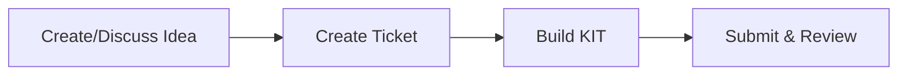
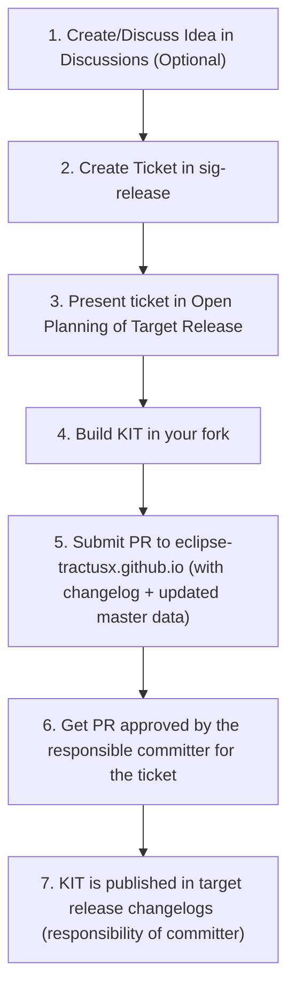

{/********************************************************************************* 
 * Copyright (c) 2025 Contributors to the Eclipse Foundation
 * 
 * See the NOTICE file(s) distributed with this work for additional
 * information regarding copyright ownership.
 * 
 * This program and the accompanying materials are made available under the
 * terms of the Apache License, Version 2.0 which is available at
 * https://www.apache.org/licenses/LICENSE-2.0.
 * 
 * Unless required by applicable law or agreed to in writing, software
 * distributed under the License is distributed on an "AS IS" BASIS, WITHOUT
 * WARRANTIES OR CONDITIONS OF ANY KIND, either express or implied. See the
 * License for the specific language governing permissions and limitations
 * under the License.
 * 
 * SPDX-License-Identifier: Apache-2.0
 ********************************************************************************/
 }

import { KitStructureTable } from '@site/src/components/2.0/KitComponents';
import AssignmentIcon from '@mui/icons-material/Assignment';
import MenuBookIcon from '@mui/icons-material/MenuBook';
import OpenInNewIcon from '@mui/icons-material/OpenInNew';
import EmailIcon from '@mui/icons-material/Email';
import GitHubIcon from '@mui/icons-material/GitHub';
import ChatIcon from '@mui/icons-material/Chat';
import DatasetIcon from '@mui/icons-material/Dataset';

| Status     | Created      | Post-History                           |
|------------|--------------|----------------------------------------|
| Draft      | 04-Apr-2024  | Initial contribution                   |
| Active     | 07-Nov-2025  | Extended Contribution to KITs 2.0     |

export const ProcessReference = ({ stepNumber, detailedSteps, description }) => (
  

    

      <AssignmentIcon sx={{ fontSize: 14 }} />
    

    

      

        Detailed Process Mapping
      

      

        {description && (
          

            {description}
          

        )}
        

          {detailedSteps.map((step, index) => (
            
              Step {step.number}: {step.name}
            
          ))}
        

      

    

  

);

## Why

This TRG serves to maintain a **consistent structure** and ensure **content quality** for the stakeholders.
KIT means Keep It Together. A KIT contains all the artifacts that are relevant to participate in the Catena-X data space as an operator, data provider or solution / app provider. These stakeholders have one place with all the information they need. For example an explanation of an API, the specification of it and the deployment instructions. The goal of a KIT should be that you have no need to visit any other information source.
A detailed explanation can be found here:
[KIT General Introduction](https://eclipse-tractusx.github.io/Kits)

## Description

For providing a KIT to the Eclipse project Tractus-X please be aware of the "getting started" as a contributor.

- **TRG 9.02 KIT Maturity Levels** A KIT is always structured the same way and follows three graduation stages
- **TRG 9.03 KIT Framework** Each of the artifacts in a KIT are explained with examples

## Prerequisites

You need to have a Github Account and to fulfill the requirements from the [Developer Hub Getting Started Guide](/docs/getting-started).

## Get Informed

### Contact & Support

 {
    e.currentTarget.style.transform = 'translateY(-4px)';
    e.currentTarget.style.boxShadow = '0 15px 40px rgba(0, 0, 0, 0.4)';
  }}
  onMouseLeave={(e) => {
    e.currentTarget.style.transform = 'translateY(0)';
    e.currentTarget.style.boxShadow = '0 10px 30px rgba(0, 0, 0, 0.3)';
  }}
>
  

    
    

      <h3 style={{
        margin: '0 0 8px 0',
        fontSize: '24px',
        fontWeight: '700',
        color: 'white',
        textShadow: '0 2px 4px rgba(0, 0, 0, 0.3)'
      }}>
        Mathias Moser
      </h3>
      

        KITs Program Manager
      

      

        Eclipse Tractus-X Project Lead
      

    

  

  
  

    <a 
      href="mailto:mathias.moser@catena-x.net"
      style={{
        display: 'inline-flex',
        alignItems: 'center',
        justifyContent: 'center',
        gap: '6px',
        padding: '10px 12px',
        backgroundColor: 'rgba(255, 255, 255, 0.2)',
        color: 'white',
        textDecoration: 'none',
        borderRadius: '8px',
        fontSize: '13px',
        fontWeight: '500',
        transition: 'all 0.2s ease',
        border: '1px solid rgba(255, 255, 255, 0.3)',
        backdropFilter: 'blur(10px)'
      }}
      onMouseEnter={(e) => {
        e.target.style.backgroundColor = 'rgba(255, 255, 255, 0.3)';
        e.target.style.transform = 'translateY(-1px)';
      }}
      onMouseLeave={(e) => {
        e.target.style.backgroundColor = 'rgba(255, 255, 255, 0.2)';
        e.target.style.transform = 'translateY(0)';
      }}
    >
      <EmailIcon sx={{ fontSize: 16 }} />
      Email
    </a>
    
    <a 
      href="https://github.com/matbmoser"
      style={{
        display: 'inline-flex',
        alignItems: 'center',
        justifyContent: 'center',
        gap: '6px',
        padding: '10px 12px',
        backgroundColor: 'rgba(255, 255, 255, 0.2)',
        color: 'white',
        textDecoration: 'none',
        borderRadius: '8px',
        fontSize: '13px',
        fontWeight: '500',
        transition: 'all 0.2s ease',
        border: '1px solid rgba(255, 255, 255, 0.3)',
        backdropFilter: 'blur(10px)'
      }}
      onMouseEnter={(e) => {
        e.target.style.backgroundColor = 'rgba(255, 255, 255, 0.3)';
        e.target.style.transform = 'translateY(-1px)';
      }}
      onMouseLeave={(e) => {
        e.target.style.backgroundColor = 'rgba(255, 255, 255, 0.2)';
        e.target.style.transform = 'translateY(0)';
      }}
    >
      <GitHubIcon sx={{ fontSize: 16 }} />
      GitHub
    </a>
    
    <a 
      href="https://chat.eclipse.org/#/user/@matbmoser:matrix.eclipse.org"
      style={{
        display: 'inline-flex',
        alignItems: 'center',
        justifyContent: 'center',
        gap: '6px',
        padding: '10px 12px',
        backgroundColor: 'rgba(255, 255, 255, 0.2)',
        color: 'white',
        textDecoration: 'none',
        borderRadius: '8px',
        fontSize: '13px',
        fontWeight: '500',
        transition: 'all 0.2s ease',
        border: '1px solid rgba(255, 255, 255, 0.3)',
        backdropFilter: 'blur(10px)'
      }}
      onMouseEnter={(e) => {
        e.target.style.backgroundColor = 'rgba(255, 255, 255, 0.3)';
        e.target.style.transform = 'translateY(-1px)';
      }}
      onMouseLeave={(e) => {
        e.target.style.backgroundColor = 'rgba(255, 255, 255, 0.2)';
        e.target.style.transform = 'translateY(0)';
      }}
    >
      <ChatIcon sx={{ fontSize: 16 }} />
      Matrix
    </a>
  

### Community Channels

| Channel | Purpose | Link |
|---------|---------|------|
| Office Hours | Weekly alignment meetings | [Join Meeting](https://eclipse-tractusx.github.io/community/open-meetings#general-office-hours) |
| Matrix Chat | Daily discussions & support | [#tractusx-kits:matrix.eclipse.org](https://chat.eclipse.org/#/room/#tractusx-kits:matrix.eclipse.org) |
| GitHub Issues | Technical issues & bugs | [Create Issue](https://github.com/eclipse-tractusx/eclipse-tractusx.github.io/issues) |
| SIG-Release | Official KIT tracking | [eclipse-tractusx/sig-release](https://github.com/eclipse-tractusx/sig-release) |

## How to Create a KIT

### Quick Overview

<strong>Detailed Step by Step Process</strong> (click to expand)

### Step 1: Create/Discuss Idea

**Talk to the community about your KIT concept.**

- **Office Hours**: Tuesdays at 10:00 AM CET - [Join here](https://eclipse-tractusx.github.io/community/open-meetings#general-office-hours)
- **Matrix Chat**: [#tractusx-kits:matrix.eclipse.org](https://chat.eclipse.org/#/room/#tractusx-kits:matrix.eclipse.org)

**What to bring**: Brief description of your use case and target audience.

<ProcessReference 
  stepNumber={1}
  description="This step is optional but highly recommended for alignment and early feedback."
  detailedSteps={[
    {number: 1, name: "Formalize/Discuss Idea in Discussions"}
  ]}
/>

### Step 2: Create SIG-Release Ticket

**Create an official tracking ticket.**

1. Go to [eclipse-tractusx/sig-release](https://github.com/eclipse-tractusx/sig-release)
2. Create new issue using "Propose KIT" template
3. Fill in your KIT description and team members

<ProcessReference 
  stepNumber={2}
  description="These steps establish official tracking and community visibility for your KIT."
  detailedSteps={[
    {number: 2, name: "Create Ticket in sig-release"},
    {number: 3, name: "Present ticket in Open Planning"}
  ]}
/>

### Step 3: Build Your KIT

**Create your KIT following the standard structure.**

Follow this structure:

<KitStructureTable />

  <a 
    href="./kit-framework" 
    style={{
      display: 'flex',
      alignItems: 'center',
      justifyContent: 'space-between',
      width: '100%',
      padding: '18px 28px',
      background: 'linear-gradient(135deg, #4CAF50 0%, #45a049 100%)',
      color: 'white',
      textDecoration: 'none',
      borderRadius: '12px',
      fontWeight: '700',
      fontSize: '16px',
      transition: 'all 0.3s cubic-bezier(0.4, 0, 0.2, 1)',
      border: 'none',
      boxSizing: 'border-box',
      boxShadow: '0 4px 14px 0 rgba(76, 175, 80, 0.3)',
      cursor: 'pointer',
      position: 'relative',
      overflow: 'hidden'
    }}
    onMouseEnter={(e) => {
      e.target.style.transform = 'translateY(-2px) scale(1.02)';
      e.target.style.boxShadow = '0 8px 25px 0 rgba(76, 175, 80, 0.4)';
    }}
    onMouseLeave={(e) => {
      e.target.style.transform = 'translateY(0) scale(1)';
      e.target.style.boxShadow = '0 4px 14px 0 rgba(76, 175, 80, 0.3)';
    }}
    onMouseDown={(e) => {
      e.target.style.transform = 'translateY(0) scale(0.98)';
    }}
    onMouseUp={(e) => {
      e.target.style.transform = 'translateY(-2px) scale(1.02)';
    }}
  >
    

      <MenuBookIcon sx={{ fontSize: 20 }} />
      Click here to view the KIT Framework Guide with details on content structure
    

    <OpenInNewIcon sx={{ fontSize: 18, opacity: 0.8 }} />
  </a>

<ProcessReference 
  stepNumber={3}
  description="This is where you create the actual KIT content in your forked repository."
  detailedSteps={[
    {number: 4, name: "Build KIT in your fork"}
  ]}
/>

### Step 4: Submit for Review

**Submit your completed KIT for community review.**

1. Fork [eclipse-tractusx.github.io](https://github.com/eclipse-tractusx/eclipse-tractusx.github.io)
2. Add your KIT to the [master data](/documentation/kit-master-data-overview)

  <a 
    href="./kit-master-data-overview" 
    style={{
      display: 'flex',
      alignItems: 'center',
      justifyContent: 'space-between',
      width: '100%',
      padding: '18px 28px',
      background: 'linear-gradient(135deg, #2563eb 0%, #1d4ed8 100%)',
      color: 'white',
      textDecoration: 'none',
      borderRadius: '12px',
      fontWeight: '700',
      fontSize: '16px',
      transition: 'all 0.3s cubic-bezier(0.4, 0, 0.2, 1)',
      border: 'none',
      boxSizing: 'border-box',
      boxShadow: '0 4px 14px 0 rgba(37, 99, 235, 0.3)',
      cursor: 'pointer',
      position: 'relative',
      overflow: 'hidden'
    }}
    onMouseEnter={(e) => {
      e.target.style.transform = 'translateY(-2px) scale(1.02)';
      e.target.style.boxShadow = '0 8px 25px 0 rgba(37, 99, 235, 0.4)';
    }}
    onMouseLeave={(e) => {
      e.target.style.transform = 'translateY(0) scale(1)';
      e.target.style.boxShadow = '0 4px 14px 0 rgba(37, 99, 235, 0.3)';
    }}
    onMouseDown={(e) => {
      e.target.style.transform = 'translateY(0) scale(0.98)';
    }}
    onMouseUp={(e) => {
      e.target.style.transform = 'translateY(-2px) scale(1.02)';
    }}
  >
    

      <DatasetIcon sx={{ fontSize: 20 }} />
      View Master Data Overview - Complete KIT metadata and statistics
    

    <OpenInNewIcon sx={{ fontSize: 18, opacity: 0.8 }} />
  </a>

3. Create a pull request
4. Request the committer assigned in the SIG-Release ticket to review, approve and merge your PR

**Timeline**: Typically 2-3 weeks from submission to approval.

<ProcessReference 
  stepNumber={4}
  description="The final phase involves submission, review, and official publication of your KIT."
  detailedSteps={[
    {number: 5, name: "Submit PR with changelog + master data"},
    {number: 6, name: "Get PR approved by committer"},
    {number: 7, name: "KIT published in release changelogs"}
  ]}
/>

### Step 5: Release your KIT (Committers)

1. The committer **MUST** create a release check issue at [sig-release](https://github.com/eclipse-tractusx/sig-release) based on the KIT Release template
2. The committer **MUST** ensure all [TRGs](/docs/release) metadata is checked in the release check issue.
3. Changelog is included in the Project Release Notes of the target release
4. KIT will be listed as part of the release notes on the [Eclipse Tractus-X Website](/blog-changelog)

Congratulations! Your KIT is now part of the Eclipse Tractus-X ecosystem!

## Additional Resources

### Documentation References

- [TRG 9.02 KIT Maturity Levels](./kit-maturity-levels)
- [TRG 9.03 KIT Framework](./kit-framework)
- [Tractus-X Developer Hub](https://eclipse-tractusx.github.io/docs/developer)
- [Community Guidelines](https://eclipse-tractusx.github.io/community)

### Templates & Examples

- [Existing KIT Examples](https://eclipse-tractusx.github.io/Kits)
- [Documentation Style Guide](/docs/website-guidelines/kit-structure)
