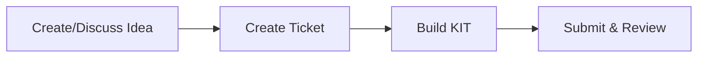
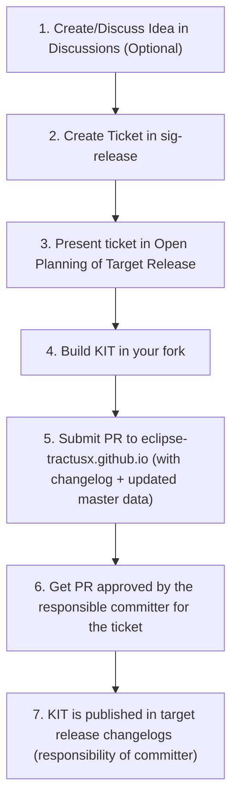

{/********************************************************************************* 
 * Copyright (c) 2025 Contributors to the Eclipse Foundation
 * 
 * See the NOTICE file(s) distributed with this work for additional
 * information regarding copyright ownership.
 * 
 * This program and the accompanying materials are made available under the
 * terms of the Apache License, Version 2.0 which is available at
 * https://www.apache.org/licenses/LICENSE-2.0.
 * 
 * Unless required by applicable law or agreed to in writing, software
 * distributed under the License is distributed on an "AS IS" BASIS, WITHOUT
 * WARRANTIES OR CONDITIONS OF ANY KIND, either express or implied. See the
 * License for the specific language governing permissions and limitations
 * under the License.
 * 
 * SPDX-License-Identifier: Apache-2.0
 ********************************************************************************/
 }

import React from 'react';
import ThemedImage from '@theme/ThemedImage';
import useBaseUrl from '@docusaurus/useBaseUrl';

import { KitStructureTable } from '@site/src/components/2.0/KitComponents';
import { GradientButton } from '@site/src/components/2.0/GradientButton';
import { TractusXBusinessCard } from '@site/src/components/2.0/TractusXBusinessCard';
import AssignmentIcon from '@mui/icons-material/Assignment';
import MenuBookIcon from '@mui/icons-material/MenuBook';
import OpenInNewIcon from '@mui/icons-material/OpenInNew';
import EmailIcon from '@mui/icons-material/Email';
import GitHubIcon from '@mui/icons-material/GitHub';
import ChatIcon from '@mui/icons-material/Chat';
import DatasetIcon from '@mui/icons-material/Dataset';
import AccountBalanceIcon from '@mui/icons-material/AccountBalance';
import RecyclingIcon from '@mui/icons-material/Recycling';

| Status     | Created      | Post-History                           |
|------------|--------------|----------------------------------------|
| Draft      | 04-Apr-2024  | Initial contribution                   |
| Active     | 07-Nov-2025  | Extended Contribution to KITs 2.0     |

Welcome to the Eclipse Tractus-X KITs Getting Started Guide! This guide is designed to help you understand what KITs are, how to get started with them, and how to create your own KITs for the Eclipse Tractus-X ecosystem.

export const InfoCard = ({ icon: Icon, title, description, href }) => {
  const [isHovered, setIsHovered] = React.useState(false);
  
  return (
    <a 
      href={href}
      style={{
        display: 'flex',
        alignItems: 'center',
        gap: '14px',
        padding: '16px 20px',
        backgroundColor: 'var(--ifm-color-emphasis-100)',
        border: '1px solid var(--ifm-color-emphasis-300)',
        borderRadius: '10px',
        textDecoration: 'none',
        color: 'var(--ifm-color-content)',
        transition: 'all 0.2s cubic-bezier(0.4, 0, 0.2, 1)',
        cursor: 'pointer',
        borderLeft: isHovered ? '3px solid var(--ifm-color-primary)' : '1px solid var(--ifm-color-emphasis-300)',
        paddingLeft: isHovered ? '18px' : '20px'
      }}
      onMouseEnter={() => setIsHovered(true)}
      onMouseLeave={() => setIsHovered(false)}
    >
      

        <Icon sx={{ fontSize: 20, color: isHovered ? 'white' : 'var(--ifm-color-primary)' }} />
      

      

        

          {title}
        

        

          {description}
        

      

      <OpenInNewIcon sx={{ 
        fontSize: 16, 
        color: 'var(--ifm-color-emphasis-600)',
        opacity: isHovered ? 1 : 0.5,
        transition: 'opacity 0.2s ease'
      }} />
    </a>
  );
};

export const ProcessReference = ({ stepNumber, detailedSteps, description }) => (
  

    

      <AssignmentIcon sx={{ fontSize: 14 }} />
    

    

      

        Detailed Process Mapping
      

      

        {description && (
          

            {description}
          

        )}
        

          {detailedSteps.map((step, index) => (
            
              Step {step.number}: {step.name}
            
          ))}
        

      

    

  

);

## What is a KIT?

  <ThemedImage
    alt="KIT Framework Overview"
    sources={{
      light: useBaseUrl('/img/kits-2.0/tx-white-kit.svg'),
      dark: useBaseUrl('/img/kits-2.0/tx-black-kit.svg'),
    }}
    style={{ 
      maxWidth: '220px',
      transition: 'transform 0.3s ease',
      cursor: 'pointer'
    }}
    onMouseEnter={(e) => e.currentTarget.style.transform = 'translateY(-10px)'}
    onMouseLeave={(e) => e.currentTarget.style.transform = 'translateY(0)'}
  />

> **KIT**, short for **Keep It Together**, is an open-source toolbox with comprehensive documentation that enables multiple stakeholders **(Business, Solution Providers, Developers)** to build interoperable applications compatible with the Eclipse Tractus-X dataspace technologies, support the compliance with industrial standards from standarization organizations (Catena-X e.V., IDTA, ISO/DIN, EDWG, Manufacturing-X, etc.) and in some use cases enable also regulatory compliance.

  <GradientButton 
    href="./kit-framework"
    text="Learn what is a KIT"
    icon={AccountBalanceIcon}
    external={false}
  />

## First Steps

Take your first steps on creating your KIT by following this guide. Here you will find detailed step by step explanations from **ZERO TO KIT**. More information can be found in other pages:

  <InfoCard 
    icon={MenuBookIcon}
    title="KIT Framework Guide"
    description="Understand the KIT structure, artefacts and requirements."
    href="./kit-framework"
  />
  <InfoCard 
    icon={RecyclingIcon}
    title="KIT Lifecycle Guide"
    description="Understand how KITs are released, quality metrics and maintained."
    href="./kit-lifecycle"
  />
  <InfoCard 
    icon={DatasetIcon}
    title="KIT Master Data Overview"
    description="Complete KIT metadata and statistics."
    href="./kit-master-data-overview"
  />
  <InfoCard 
    icon={AssignmentIcon}
    title="KIT Statistics & Analytics"
    description="Analyze KIT data, state of life and development metrics."
    href="./kit-statistics"
  />

### Prerequisites

You need to have a Github Account and to fulfill the requirements from the [Developer Hub Getting Started Guide](/docs/getting-started).

### Contact & Support

Get informed about what are the KITs and how to contribute by reaching out to the KITs Program Manager or attending our KIT community office hours:

<TractusXBusinessCard 
  name="Mathias Moser"
  title="KITs Program Manager"
  subtitle="Eclipse Tractus-X Project Lead"
  avatarUrl="https://github.com/matbmoser.png"
  email="mathias.moser@catena-x.net"
  github="matbmoser"
  matrix="@matbmoser:matrix.eclipse.org"
/>

### Community Channels

| Channel | Purpose | Link |
|---------|---------|------|
| KIT Community Office Hours | Weekly alignment meetings | [Join Meeting](https://eclipse-tractusx.github.io/community/open-meetings#Eclipse%20Tractus-X%20KITs%20Community%20Office%20Hour) |
| KIT Office Hour Kanban | Development items tracking | [Github Project](https://github.com/orgs/eclipse-tractusx/projects/92) |
| Matrix Chat | Daily discussions & support | [#tractusx-kits:matrix.eclipse.org](https://chat.eclipse.org/#/room/#tractusx-kits:matrix.eclipse.org) |
| GitHub Issues | Technical issues & bugs | [Create Issue](https://github.com/eclipse-tractusx/eclipse-tractusx.github.io/issues) |
| SIG-Release | Official KIT Release Tracking | [eclipse-tractusx/sig-release](https://github.com/eclipse-tractusx/sig-release) |
| KIT Discussions | Offical KIT Proposal and Discussion Location | [KIT Discussions](https://github.com/eclipse-tractusx/eclipse-tractusx.github.io/discussions/categories/kits) |

## KIT Template

  <ThemedImage
    alt="KIT Framework Overview"
    sources={{
      light: useBaseUrl('/img/kits-2.0/tx-assembly-kit.svg'),
      dark: useBaseUrl('/img/kits-2.0/tx-assembly-kit.svg'),
    }}
    style={{ 
      maxWidth: '200px',
      transition: 'transform 0.3s ease',
      cursor: 'pointer'
    }}
    onMouseEnter={(e) => e.currentTarget.style.transform = 'translateY(-10px)'}
    onMouseLeave={(e) => e.currentTarget.style.transform = 'translateY(0)'}
  />

Follow the KIT template to have an example of folder structure that can be followed following the [KIT Framework Guide](./kit-framework) and the needed content for each view in order to achieve all requirements from the [KIT Lifecycle](./kit-lifecycle).

  <GradientButton 
    href="https://github.com/eclipse-tractusx/eclipse-tractusx.github.io/tree/main/docs-kits/kit-template"
    text="View KIT Template"
    icon={MenuBookIcon}
    gradient="linear-gradient(135deg, #667eea 0%, #764ba2 100%)"
    shadowColor="rgba(102, 126, 234, 0.3)"
    shadowColorHover="rgba(102, 126, 234, 0.4)"
    external={true}
  />

## How to Create a KIT

### Quick Overview

<strong>Detailed Step by Step Process</strong> (click to expand)

### Step 1: Create/Discuss Idea

**Talk to the community about your KIT concept.**

- **KIT Community Office Hours**: Tuesdays at 10:00 AM CET - [Join here](https://eclipse-tractusx.github.io/community/open-meetings#Eclipse%20Tractus-X%20KITs%20Community%20Office%20Hour)
- **Matrix Chat**: [#tractusx-kits:matrix.eclipse.org](https://chat.eclipse.org/#/room/#tractusx-kits:matrix.eclipse.org)

**What to bring**: Brief description of your use case and target audience.

<ProcessReference 
  stepNumber={1}
  description="This step is optional but highly recommended for alignment and early feedback."
  detailedSteps={[
    {number: 1, name: "Formalize/Discuss Idea in Discussions"}
  ]}
/>

### Step 2: Create SIG-Release Ticket

**Create an official tracking ticket.**

1. Go to [eclipse-tractusx/sig-release](https://github.com/eclipse-tractusx/sig-release)
2. Create new issue using "Propose KIT" template
3. Fill in your KIT description and team members
4. Present it in the next [Open Planning Day](https://eclipse-tractusx.github.io/docs/oss/release-process#open-planning-day) for the target release.

<ProcessReference 
  stepNumber={2}
  description="These steps establish official tracking and community visibility for your KIT."
  detailedSteps={[
    {number: 2, name: "Create Ticket in sig-release"},
    {number: 3, name: "Present ticket in Open Planning"}
  ]}
/>

### Step 3: Build Your KIT

**Create your KIT following the standard structure.**

Follow this structure:

<KitStructureTable />
:::info Generic Requirements for All KITs
In addition to the view-specific content above, every KIT must include:
- **Copyright Notice** - Mandatory CC-BY-4.0 licensing information and contributor copyright statements at every file
- **Changelog** - Version history file following [semantic versioning](https://semver.org/)

The views above are organized in "folders" so that its sections are harmonized and the content from each view remains flexible.
:::

  <GradientButton 
    href="./kit-framework"
    text="Click here to view the KIT Framework Guide with details on content structure"
    icon={MenuBookIcon}
    external={false}
    minWidth="100%"
  />

<ProcessReference 
  stepNumber={3}
  description="This is where you create the actual KIT content in your forked repository."
  detailedSteps={[
    {number: 4, name: "Build KIT in your fork"}
  ]}
/>

### Step 4: Submit for Review

**Submit your completed KIT for community review.**

1. Fork [eclipse-tractusx.github.io](https://github.com/eclipse-tractusx/eclipse-tractusx.github.io)
2. Add your KIT to the [master data](/documentation/kit-master-data-overview)

  <GradientButton 
    href="./kit-master-data-overview"
    text="View Master Data Overview - Complete KIT metadata and statistics"
    icon={DatasetIcon}
    gradient="linear-gradient(135deg, #2563eb 0%, #1d4ed8 100%)"
    shadowColor="rgba(37, 99, 235, 0.3)"
    shadowColorHover="rgba(37, 99, 235, 0.4)"
    external={false}
    minWidth="100%"
  />

3. Add your KIT in this file by updating the sidebar configuration in ['/sidebarsDocsKits.js'](https://github.com/eclipse-tractusx/eclipse-tractusx.github.io/blob/main/sidebarsDocsKits.js) at the root folder (a template will be provided).
4. The navbar from the KITs will be updated automatically when building the website in the Github Action, and it will be stored in [`utils/generated/kitNavItems.js](https://github.com/eclipse-tractusx/eclipse-tractusx.github.io/blob/main/utils/generated/kitNavItems.js). No action is needed here.
5. Update the changelog with what was added
6. Create a pull request to `eclipse-tractusx.github.io` `main` branch
7. Request the committer assigned in the SIG-Release ticket to review, approve and merge your PR

**Timeline**: Typically 2-3 weeks from submission to approval.

<ProcessReference 
  stepNumber={4}
  description="The final phase involves submission, review, and official publication of your KIT."
  detailedSteps={[
    {number: 5, name: "Submit PR with changelog + master data"},
    {number: 6, name: "Get PR approved by committer"},
    {number: 7, name: "KIT published in release changelogs"}
  ]}
/>

### Step 5: Release your KIT (Committers)

1. The committer **MUST** create a release check issue at [sig-release](https://github.com/eclipse-tractusx/sig-release) based on the KIT Release template
2. The committer **MUST** ensure all [TRGs](/docs/release) metadata is checked in the release check issue.
3. Changelog is included in the Project Release Notes of the target release
4. KIT will be listed as part of the release notes on the [Eclipse Tractus-X Website](/blog-changelog)

Congratulations! Your KIT is now part of the Eclipse Tractus-X ecosystem!

## Additional Resources

### KIT Documentation

- [KIT Framework](./kit-framework) - Complete guide to KIT structure, artifacts, and requirements
- [KIT Lifecycle](./kit-lifecycle) - KIT maturity levels, graduation, and maintenance processes
- [KIT Master Data Overview](./kit-master-data-overview) - Complete KIT metadata, statistics, and data structure
- [KIT Statistics](./kit-statistics) - Analytics dashboard for KIT ecosystem metrics

### Documentation References

#### KIT-Specific TRGs (Tractus-X Release Guidelines)

- [TRG 10.01 - KIT Architecture](/docs/release/trg-10/trg-10-01) - KIT framework categories and classification
- [TRG 10.02 - KIT Content Structure](/docs/release/trg-10/trg-10-02) - Required content and structure
- [TRG 10.03 - KIT Lifecycle](/docs/release/trg-10/trg-10-03) - Maturity levels and lifecycle management
- [TRG 10.04 - KIT Graduation Process](/docs/release/trg-10/trg-10-04) - Graduation requirements and process
- [TRG 10.05 - KIT Deprecation Process](/docs/release/trg-10/trg-10-05) - Deprecation criteria and procedures

#### Legal & Licensing

- [TRG 7.07 - Legal notice for non-code](/docs/release/trg-7/trg-7-07) - Image and media licensing requirements
- [TRG 7.08 - Legal notice for KIT documentation (CC-BY-4.0)](/docs/release/trg-7/trg-7-08) - Documentation licensing
