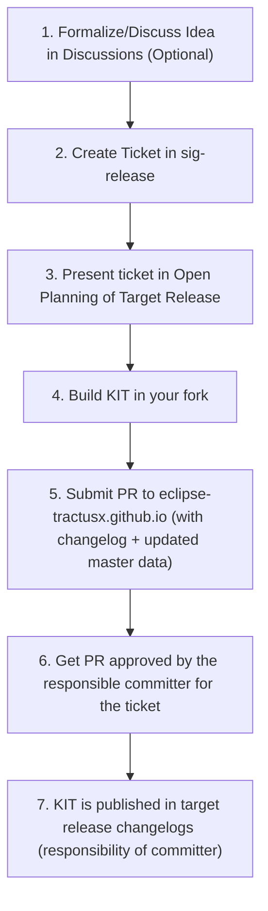

| Status     | Created      | Post-History                           |
|------------|--------------|----------------------------------------|
| Draft      | 04-Apr-2024  | Initial contribution                   |
| In Review  | 07-Nov-2025  | Extended Contribution to KITs 2.0.     |

export const StakeholderChip = ({children, color}) => (
  
    {children}
  
);

export const KitStructureTable = () => {
  const kitViews = [
    {
      view: "Adoption View",
      stakeholders: [{name: "Business", color: "#3b82f6"}],
      content: "Business Value, Motivation, Vision, Mission, Whitepapers, Semantic Models, Standards, Tutorials, Explanations why this use case is important, Context"
    },
    {
      view: "Development View", 
      stakeholders: [
        {name: "Developers", color: "#10b981"},
        {name: "Architects", color: "#10b981"}
      ],
      content: "Overall Architecture, Reference Implementations, API specifications, Policies, Algorithms, Functional Requirements, Sequence Diagrams, Process, Architecture Guidelines"
    },
    {
      view: "Operator View",
      stakeholders: [
        {name: "Operators", color: "#f59e0b"},
        {name: "Service Providers", color: "#f59e0b"}
      ],
      content: "Non-Functional Requirements, Security Requirements, Recommendations, Restrictions"
    },
    {
      view: "Documentations",
      stakeholders: [{name: "Any Stakeholder", color: "#8b5cf6"}],
      content: "Extra Documentation and Links"
    },
    {
      view: "Success Stories",
      stakeholders: [
        {name: "Operators", color: "#ef4444"},
        {name: "Service Providers", color: "#ef4444"},
        {name: "Business", color: "#ef4444"}
      ],
      content: "Success Stories from Reference Implementations that used this KIT. Open Source and COTS."
    },
    {
      view: "Dataspace Extensions",
      stakeholders: [{name: "Dataspace Adopters", color: "#6366f1"}],
      content: "One Folder per Dataspace. Extends the contents from the other views with regards to a specific dataspace."
    }
  ];

  return (
    <table style={{width: '100%', borderCollapse: 'collapse'}}>
      <thead>
        <tr style={{backgroundColor: '#faa023', borderBottom: '2px solid #e5e7eb'}}>
          <th style={{padding: '12px', textAlign: 'left', fontWeight: 'bold', color: 'black'}}>Views</th>
          <th style={{padding: '12px', textAlign: 'left', fontWeight: 'bold', color: 'black'}}>Stakeholders</th>
          <th style={{padding: '12px', textAlign: 'left', fontWeight: 'bold', color: 'black'}}>Content</th>
        </tr>
      </thead>
      <tbody>
        {kitViews.map((row, index) => (
          <tr key={index} style={{borderBottom: '1px solid #f3f4f6'}}>
            <td style={{padding: '12px', fontWeight: 'bold', verticalAlign: 'top'}}>
              {row.view}
            </td>
            <td style={{padding: '12px', verticalAlign: 'top'}}>
              {row.stakeholders.map((stakeholder, i) => (
                <StakeholderChip key={i} color={stakeholder.color}>
                  {stakeholder.name}
                </StakeholderChip>
              ))}
            </td>
            <td style={{padding: '12px', verticalAlign: 'top', lineHeight: '1.5'}}>
              {row.content}
            </td>
          </tr>
        ))}
      </tbody>
    </table>
  );
};

export const ProcessReference = ({ stepNumber, detailedSteps, description }) => (
  

    

      📋
    

    

      

        Detailed Process Mapping
      

      

        {description && (
          

            {description}
          

        )}
        

          {detailedSteps.map((step, index) => (
            
              Step {step.number}: {step.name}
            
          ))}
        

      

    

  

);

## Why

This TRG serves to maintain a **consistent structure** and ensure **content quality** for the stakeholders.
KIT means Keep It Together. A KIT contains all the artifacts that are relevant to participate in the Catena-X data space as an operator, data provider or solution / app provider. These stakeholders have one place with all the information they need. For example an explanation of an API, the specification of it and the deployment instructions. The goal of a KIT should be that you have no need to visit any other information source.
A detailed explanation can be found here:
[KIT General Introduction](https://eclipse-tractusx.github.io/Kits)

## Description

For providing a KIT to the Eclipse project Tractus-X please be aware of the "getting started" as a contributor.
Prerequisites: [Tractus-X getting started](https://eclipse-tractusx.github.io/docs/oss/getting-started)

- **TRG 9.02 KIT Maturity Levels** A KIT is always structured the same way and follows three graduation stages
- **TRG 9.03 KIT Artifacts** Each of the artifacts in a KIT are explained with examples

## How to Create a KIT

### Quick Overview

<strong>Detailed Step by Step Process</strong> (click to expand)

### Step 1: Discuss Your Idea

**Talk to the community about your KIT concept.**

- **Office Hours**: Tuesdays at 10:00 AM CET - [Join here](https://eclipse-tractusx.github.io/community/open-meetings#general-office-hours)
- **Matrix Chat**: [#tractusx-kits:matrix.eclipse.org](https://chat.eclipse.org/#/room/#tractusx-kits:matrix.eclipse.org)

**What to bring**: Brief description of your use case and target audience.

<ProcessReference 
  stepNumber={1}
  description="This step is optional but highly recommended for alignment and early feedback."
  detailedSteps={[
    {number: 1, name: "Formalize/Discuss Idea in Discussions"}
  ]}
/>

### Step 2: Create SIG-Release Ticket

**Create an official tracking ticket.**

1. Go to [eclipse-tractusx/sig-release](https://github.com/eclipse-tractusx/sig-release)
2. Create new issue using "Propose KIT" template
3. Fill in your KIT description and team members

<ProcessReference 
  stepNumber={2}
  description="These steps establish official tracking and community visibility for your KIT."
  detailedSteps={[
    {number: 2, name: "Create Ticket in sig-release"},
    {number: 3, name: "Present ticket in Open Planning"}
  ]}
/>

### Step 3: Build Your KIT

**Create your KIT following the standard structure.**

Follow this structure:

<KitStructureTable />

Use the [KIT Template](https://github.com/eclipse-tractusx/kit-template) to get started quickly.

<ProcessReference 
  stepNumber={3}
  description="This is where you create the actual KIT content in your forked repository."
  detailedSteps={[
    {number: 4, name: "Build KIT in your fork"}
  ]}
/>

### Step 4: Submit for Review

**Submit your completed KIT for community review.**

1. Fork [eclipse-tractusx.github.io](https://github.com/eclipse-tractusx/eclipse-tractusx.github.io)
2. Add your KIT to the [master data](../data/kitsData.js)
3. Create a pull request
4. Request the committer assigned in the SIG-Release ticket to review, approve and merge your PR

**Timeline**: Typically 2-3 weeks from submission to approval.

<ProcessReference 
  stepNumber={4}
  description="The final phase involves submission, review, and official publication of your KIT."
  detailedSteps={[
    {number: 5, name: "Submit PR with changelog + master data"},
    {number: 6, name: "Get PR approved by committer"},
    {number: 7, name: "KIT published in release changelogs"}
  ]}
/>

### Step 5: Submit for Review

## Contact & Support

### Primary Contact

**Mathias Moser** - KIT Program Manager  
📧 [mathias.moser@catena-x.net](mailto:mathias.moser@catena-x.net)

**For questions about:**

- KIT development process
- Technical requirements
- Master data integration
- Community alignment

### Community Channels

| Channel | Purpose | Link |
|---------|---------|------|
| Office Hours | Weekly alignment meetings | [Join Meeting](https://eclipse-tractusx.github.io/community/open-meetings#general-office-hours) |
| Matrix Chat | Daily discussions & support | [#tractusx-kits:matrix.eclipse.org](https://chat.eclipse.org/#/room/#tractusx-kits:matrix.eclipse.org) |
| GitHub Issues | Technical issues & bugs | [Create Issue](https://github.com/eclipse-tractusx/eclipse-tractusx.github.io/issues) |
| SIG-Release | Official KIT tracking | [eclipse-tractusx/sig-release](https://github.com/eclipse-tractusx/sig-release) |

## Additional Resources

### Documentation References

- [TRG 9.02 KIT Maturity Levels](./trg-9-02-kit-maturity-levels)
- [TRG 9.03 KIT Artifacts](./trg-9-03-kit-artifacts)
- [Tractus-X Developer Hub](https://eclipse-tractusx.github.io/docs/developer)
- [Community Guidelines](https://eclipse-tractusx.github.io/community)

### Templates & Examples

- [KIT Template Repository](https://github.com/eclipse-tractusx/kit-template)
- [Existing KIT Examples](https://eclipse-tractusx.github.io/Kits)
- [Documentation Style Guide](./documentation-guidelines)
