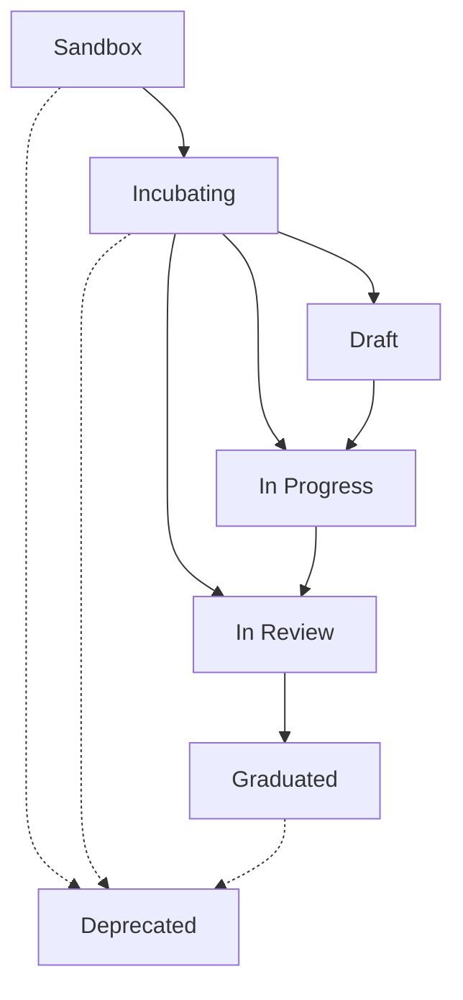

{/*
 * Copyright (c) 2025 Contributors to the Eclipse Foundation
 *
 * See the NOTICE file(s) distributed with this work for additional
 * information regarding copyright ownership.
 *
 * This program and the accompanying materials are made available under the
 * terms of the Apache License, Version 2.0 which is available at
 * https://www.apache.org/licenses/LICENSE-2.0.
 *
 * Unless required by applicable law or agreed to in writing, software
 * distributed under the License is distributed on an "AS IS" BASIS, WITHOUT
 * WARRANTIES OR CONDITIONS OF ANY KIND, either express or implied. See the
 * License for the specific language governing permissions and limitations
 * under the License.
 *
 * SPDX-License-Identifier: Apache-2.0
 */}

import { kitsData } from '../data/kitsData.js';
import SchoolIcon from '@mui/icons-material/School';
import LightbulbIcon from '@mui/icons-material/Lightbulb';
import DeveloperModeIcon from '@mui/icons-material/DeveloperMode';
import AssignmentIcon from '@mui/icons-material/Assignment';
import RateReviewIcon from '@mui/icons-material/RateReview';
import VerifiedIcon from '@mui/icons-material/Verified';
import TrendingUpIcon from '@mui/icons-material/TrendingUp';
import CheckCircleIcon from '@mui/icons-material/CheckCircle';
import EditIcon from '@mui/icons-material/Edit';
import VisibilityIcon from '@mui/icons-material/Visibility';
import Link from '@docusaurus/Link';
import DeprecatedKitsList from '../src/components/2.0/KitAnalytics/DeprecatedKitsList.js';
import ArtifactRequirementsTable from '@site/src/components/2.0/ArtifactRequirementsTable';
import { artifactRequirementsData } from '@site/data/kitArtifactRequirementsData';
import ThemedImage from '@theme/ThemedImage';
import useBaseUrl from '@docusaurus/useBaseUrl';

| Status     | Created      | Post-History                           |
|------------|--------------|----------------------------------------|
| Draft      | 04-Apr-2024  | Initial contribution                   |
| Active     | 07-Nov-2025  | Updated maturity level framework       |

export const MaturityIcon = ({ level, graduationStatus }) => {
  if (level === 'Graduated') return <SchoolIcon sx={{ fontSize: 20, color: '#8246e1ff' }} />;
  if (level === 'Incubating') {
    const status = graduationStatus?.toLowerCase();
    if (status === 'draft') return <EditIcon sx={{ fontSize: 20, color: '#f59e0b' }} />;
    if (status === 'in progress' || status === 'inprogress') return <DeveloperModeIcon sx={{ fontSize: 20, color: '#3b82f6' }} />;
    if (status === 'in review' || status === 'inreview') return <VisibilityIcon sx={{ fontSize: 20, color: '#645cf6ff' }} />;
    return <AssignmentIcon sx={{ fontSize: 20, color: '#72bd00ff' }} />;
  }
  if (level === 'Sandbox') return <LightbulbIcon sx={{ fontSize: 20, color: '#f59e0b' }} />;
  return <LightbulbIcon sx={{ fontSize: 20, color: '#f59e0b' }} />;
};

export const KitMaturityCard = ({ kit }) => (
  
 {
    e.currentTarget.style.transform = 'translateY(-2px)';
    e.currentTarget.style.boxShadow = '0 4px 12px rgba(0,0,0,0.1)';
  }}
  onMouseLeave={(e) => {
    e.currentTarget.style.transform = 'translateY(0)';
    e.currentTarget.style.boxShadow = 'none';
  }}>
    <Link to={kit.route} style={{ textDecoration: 'none', color: 'inherit' }}>
      

        

          {kit.logo && <kit.logo style={{ width: '24px', height: '24px', color: 'white' }} />}
        

        

          <h4 style={{ margin: 0, fontSize: '16px', fontWeight: '600' }}>{kit.name}</h4>
          

            <MaturityIcon level={kit.maturity?.currentLevel} graduationStatus={kit.maturity?.graduationStatus} />
            
              {kit.maturity?.currentLevel}
              {kit.maturity?.graduationStatus && kit.maturity?.currentLevel === 'Incubating' && 
                ` - ${kit.maturity.graduationStatus.charAt(0).toUpperCase() + kit.maturity.graduationStatus.slice(1)}`}
            
          

        

        {kit.deprecated && (
          

            DEPRECATED
          

        )}
      

      

        {kit.description}
      

    </Link>
  

);

export const MaturityLevelSection = ({ title, icon, description, kits, color }) => {
  if (!kits || kits.length === 0) return null;
  
  return (
    

      

        {icon}
        

          <h3 style={{ margin: 0, color: color }}>{title}</h3>
          

            {description}
          

        

        

          {kits.length} KIT{kits.length !== 1 ? 's' : ''}
        

      

      

        {kits.map(kit => (
          <KitMaturityCard key={kit.id} kit={kit} />
        ))}
      

    

  );
};

## KIT Lifecycle Overview

  <ThemedImage
    alt="KIT Framework Overview"
    sources={{
      light: useBaseUrl('/img/kits-2.0/tx-kit-lifecycle-white.svg'),
      dark: useBaseUrl('/img/kits-2.0/tx-kit-lifecycle.svg'),
    }}
    style={{
      maxWidth: '600px',
      cursor: 'pointer',
      fontFamily: "Manrope, sans-serif",
    }}
  />

The Tractus-X KIT ecosystem uses a comprehensive lifecycle framework to ensure quality, completeness, and real-world validation. KITs progress through distinct lifecycle stages: **Sandbox**, **Incubating** (with three sub-states), and **Graduated**.

### Maturity Level Process

Each maturity level signals the quality, completeness, and proof that the use case solves specific business problems and provides value to all stakeholders. To advance between levels, developers must fulfill various criteria and complete mandatory artifacts and deliverables.

## Detailed Maturity Levels

For more information look at the [TRG 10.03 - KIT Lifeclycle](https://eclipse-tractusx.github.io/docs/release/trg-10/trg-10-03) documentation.

### <LightbulbIcon sx={{ fontSize: 24, color: '#f59e0b', marginRight: '8px', verticalAlign: 'middle' }} /> Sandbox Level

**Purpose**: Initial exploration and community validation

Sandbox is the entry point for new KIT ideas. At this stage, the focus is on establishing a clear vision, mission, and business value proposition. This level serves as a preview of potential business innovation and allows for community feedback and validation.

**Key Characteristics**:

- Conceptual phase with defined vision and scope
- Community interest validation
- Basic problem definition and domain identification
- Foundation for future development
- No standards a mandatory, just a clear business vision
- Technical implementation proposal can already be done

### <AssignmentIcon sx={{ fontSize: 24, color: '#72bd00ff', marginRight: '8px', verticalAlign: 'middle' }} /> Incubating Level

**Purpose**: Active development with structured progression

Incubating represents the active development phase where KITs evolve from concept to functional implementation. This level includes three distinct sub-states that provide clear progression milestones:

#### <EditIcon sx={{ fontSize: 20, color: '#f59e0b', marginRight: '6px', verticalAlign: 'middle' }} /> Draft State

- **Focus**: Initial development and structure setup
- **Activities**: Basic artifact creation, initial documentation, architecture planning
- **Deliverables**: Core documentation framework, basic API specifications

#### <DeveloperModeIcon sx={{ fontSize: 20, color: '#3b82f6', marginRight: '6px', verticalAlign: 'middle' }} /> In Progress State

- **Focus**: Active implementation and content development
- **Activities**: Full artifact development, implementation work, testing
- **Deliverables**: Complete documentation, working implementations, test cases

#### <VisibilityIcon sx={{ fontSize: 20, color: '#8b5cf6', marginRight: '6px', verticalAlign: 'middle' }} /> In Review State

- **Focus**: Quality assurance and community review
- **Activities**: Peer review, quality validation, compliance checking
- **Deliverables**: Reviewed and approved artifacts, feedback incorporation

### <SchoolIcon sx={{ fontSize: 24, color: '#8246e1ff', marginRight: '8px', verticalAlign: 'middle' }} /> Graduated Level

**Purpose**: Production-ready with proven real-world validation

Graduated is the highest maturity level, indicating that the KIT has passed comprehensive testing, expert validation, and real-world case studies. These KITs are production-ready and have demonstrated business value through community adoption.

**Key Characteristics**:

- All mandatory artifacts completed and validated
- Successful case study with community partner
- Expert testing and approval completed
- Proven business value and clear technical implementation
- Ready for operational deployment
- Assigned Code Owner

For more information look at the [TRG 10.04 - KIT Graduation Process](https://eclipse-tractusx.github.io/docs/release/trg-10/trg-10-04) documentation.

## Current KIT Portfolio by Lifecycle Stage

The following sections display all KITs organized by their current lifecycle stage, providing a comprehensive overview of the ecosystem's development status.

export const KitsByMaturityLevel = () => {
  // Collect all KITs from different categories
  const allKits = [
    ...(kitsData.dataspaceFoundation || []),
    ...(kitsData.industryCoreFoundation || []),
    ...(kitsData.useCases || [])
  ];

  // Add dataspace-specific KITs
  if (kitsData.dataspaceKits) {
    Object.values(kitsData.dataspaceKits).forEach(kitsArray => {
      if (Array.isArray(kitsArray)) {
        allKits.push(...kitsArray);
      }
    });
  }

  // Group KITs by maturity level and graduation status
  const graduatedKits = allKits.filter(kit => kit.maturity?.currentLevel === 'Graduated');
  
  const incubatingKits = {
    draft: allKits.filter(kit => 
      kit.maturity?.currentLevel === 'Incubating' && 
      kit.maturity?.graduationStatus?.toLowerCase() === 'draft'
    ),
    inProgress: allKits.filter(kit => 
      kit.maturity?.currentLevel === 'Incubating' && 
      (kit.maturity?.graduationStatus?.toLowerCase() === 'in progress' || 
       kit.maturity?.graduationStatus?.toLowerCase() === 'inprogress')
    ),
    inReview: allKits.filter(kit => 
      kit.maturity?.currentLevel === 'Incubating' && 
      (kit.maturity?.graduationStatus?.toLowerCase() === 'in review' ||
       kit.maturity?.graduationStatus?.toLowerCase() === 'inreview')
    ),
    general: allKits.filter(kit => 
      kit.maturity?.currentLevel === 'Incubating' && 
      (!kit.maturity?.graduationStatus ||
       !['draft', 'in progress', 'inprogress', 'in review', 'inreview'].includes(kit.maturity.graduationStatus.toLowerCase()))
    )
  };
  
  const sandboxKits = allKits.filter(kit => kit.maturity?.currentLevel === 'Sandbox');

  return (
    

      <MaturityLevelSection
        title="Graduated KITs"
        icon={<SchoolIcon sx={{ fontSize: 28, color: '#8246e1ff' }} />}
        description="Production-ready KITs with proven business value through community validation"
        kits={graduatedKits}
        color="#10b981"
      />

      {incubatingKits.inReview.length > 0 && (
        <MaturityLevelSection
          title="Incubating - In Review"
          icon={<VisibilityIcon sx={{ fontSize: 28, color: '#8b5cf6' }} />}
          description="KITs undergoing final quality assurance and community review"
          kits={incubatingKits.inReview}
          color="#8b5cf6"
        />
      )}

      {incubatingKits.inProgress.length > 0 && (
        <MaturityLevelSection
          title="Incubating - In Progress"
          icon={<DeveloperModeIcon sx={{ fontSize: 28, color: '#3b82f6' }} />}
          description="KITs in active development with ongoing implementation work"
          kits={incubatingKits.inProgress}
          color="#3b82f6"
        />
      )}

      {incubatingKits.draft.length > 0 && (
        <MaturityLevelSection
          title="Incubating - Draft"
          icon={<EditIcon sx={{ fontSize: 28, color: '#72bd00ff' }} />}
          description="KITs in initial development phase with basic structure setup"
          kits={incubatingKits.draft}
          color="#72bd00ff"
        />
      )}

      {incubatingKits.general.length > 0 && (
        <MaturityLevelSection
          title="Incubating KITs"
          icon={<AssignmentIcon sx={{ fontSize: 28, color: '#72bd00ff' }} />}
          description="KITs in active development phase"
          kits={incubatingKits.general}
          color="#72bd00ff"
        />
      )}

      <MaturityLevelSection
        title="Sandbox KITs"
        icon={<LightbulbIcon sx={{ fontSize: 28, color: '#f59e0b' }} />}
        description="Early-stage KITs focusing on concept validation and community feedback"
        kits={sandboxKits}
        color="#f59e0b"
      />
    

  );
};

<KitsByMaturityLevel />

## Artifacts and Deliverables

This section provides an overview of required artifacts for each maturity level and incubating sub-state. For detailed examples and specifications, please refer to TRG 8.03 - KIT Framework.

### Artifact Requirements by Maturity Level

<ArtifactRequirementsTable data={artifactRequirementsData} />

### Incubating Sub-State Progression

**Draft → In Progress**:

- Complete basic artifact framework
- Establish development methodology
- Initial community feedback integration

**In Progress → In Review**:

- All mandatory artifacts completed
- Implementation testing completed
- Documentation review ready
- Have a clear code owner assigned

**In Review → Graduated**:

- Pass community review process
- Complete successful case study (success story)
- Expert validation and approval

## Graduation Stage

How to graduate a KIT?
Graduation is the highest quality level to achieve, all the artifacts in the table above should be completed. It has passed expert testing and been approved. Thereafter, please follow the next steps in how to graduate a KIT.

- View the [TRG 10.04 - KIT Graduation Process](https://eclipse-tractusx.github.io/docs/release/trg-10/trg-10-04) documentation for detailed graduation requirements and process.

## KIT Deprecation

- View the [TRG 10.05 - KIT Deprecation Process](https://eclipse-tractusx.github.io/docs/release/trg-10/trg-10-05) documentation for deprecation criteria and procedures.

### Currently Deprecated KITs

<DeprecatedKitsList />

## Additional Resources

### KIT Documentation

- [KIT Framework](./kit-framework) - Complete guide to KIT structure, artifacts, and requirements
- [KIT Getting Started](./kit-getting-started) - How to create a KIT
- [KIT Master Data Overview](./kit-master-data-overview) - Complete KIT metadata, statistics, and data structure
- [KIT Statistics](./kit-statistics) - Analytics dashboard for KIT ecosystem metrics

### Documentation References

#### KIT-Specific TRGs (Tractus-X Release Guidelines)

- [TRG 10.01 - KIT Architecture](/docs/release/trg-10/trg-10-01) - KIT framework categories and classification
- [TRG 10.02 - KIT Content Structure](/docs/release/trg-10/trg-10-02) - Required content and structure
- [TRG 10.03 - KIT Lifecycle](/docs/release/trg-10/trg-10-03) - Maturity levels and lifecycle management
- [TRG 10.04 - KIT Graduation Process](/docs/release/trg-10/trg-10-04) - Graduation requirements and process
- [TRG 10.05 - KIT Deprecation Process](/docs/release/trg-10/trg-10-05) - Deprecation criteria and procedures

#### Legal & Licensing

- [TRG 7.07 - Legal notice for non-code](/docs/release/trg-7/trg-7-07) - Image and media licensing requirements
- [TRG 7.08 - Legal notice for KIT documentation (CC-BY-4.0)](/docs/release/trg-7/trg-7-08) - Documentation licensing
