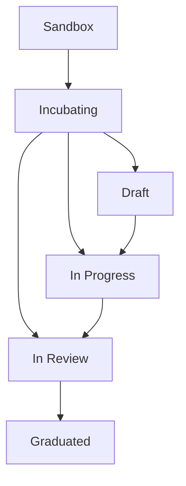

{/*
 * Copyright (c) 2025 Contributors to the Eclipse Foundation
 *
 * See the NOTICE file(s) distributed with this work for additional
 * information regarding copyright ownership.
 *
 * This program and the accompanying materials are made available under the
 * terms of the Apache License, Version 2.0 which is available at
 * https://www.apache.org/licenses/LICENSE-2.0.
 *
 * Unless required by applicable law or agreed to in writing, software
 * distributed under the License is distributed on an "AS IS" BASIS, WITHOUT
 * WARRANTIES OR CONDITIONS OF ANY KIND, either express or implied. See the
 * License for the specific language governing permissions and limitations
 * under the License.
 *
 * SPDX-License-Identifier: Apache-2.0
 */}

import { kitsData } from '../data/kitsData.js';
import SchoolIcon from '@mui/icons-material/School';
import ScienceIcon from '@mui/icons-material/Science';
import DeveloperModeIcon from '@mui/icons-material/DeveloperMode';
import AssignmentIcon from '@mui/icons-material/Assignment';
import RateReviewIcon from '@mui/icons-material/RateReview';
import VerifiedIcon from '@mui/icons-material/Verified';
import TrendingUpIcon from '@mui/icons-material/TrendingUp';
import CheckCircleIcon from '@mui/icons-material/CheckCircle';
import EditIcon from '@mui/icons-material/Edit';
import VisibilityIcon from '@mui/icons-material/Visibility';
import Link from '@docusaurus/Link';

| Status     | Created      | Post-History                           |
|------------|--------------|----------------------------------------|
| Draft      | 04-Apr-2024  | Initial contribution                   |
| Active     | 07-Nov-2025  | Updated maturity level framework       |

export const MaturityIcon = ({ level, graduationStatus }) => {
  if (level === 'Graduated') return <SchoolIcon sx={{ fontSize: 20, color: '#10b981' }} />;
  if (level === 'Incubating') {
    const status = graduationStatus?.toLowerCase();
    if (status === 'draft') return <EditIcon sx={{ fontSize: 20, color: '#f59e0b' }} />;
    if (status === 'in progress' || status === 'inprogress') return <DeveloperModeIcon sx={{ fontSize: 20, color: '#3b82f6' }} />;
    if (status === 'in review' || status === 'inreview') return <VisibilityIcon sx={{ fontSize: 20, color: '#8b5cf6' }} />;
    return <AssignmentIcon sx={{ fontSize: 20, color: '#f59e0b' }} />;
  }
  if (level === 'Sandbox') return <ScienceIcon sx={{ fontSize: 20, color: '#6b7280' }} />;
  return <ScienceIcon sx={{ fontSize: 20, color: '#6b7280' }} />;
};

export const KitMaturityCard = ({ kit }) => (
  
 {
    e.currentTarget.style.transform = 'translateY(-2px)';
    e.currentTarget.style.boxShadow = '0 4px 12px rgba(0,0,0,0.1)';
  }}
  onMouseLeave={(e) => {
    e.currentTarget.style.transform = 'translateY(0)';
    e.currentTarget.style.boxShadow = 'none';
  }}>
    <Link to={kit.route} style={{ textDecoration: 'none', color: 'inherit' }}>
      

        

          {kit.logo && <kit.logo style={{ width: '24px', height: '24px', color: 'white' }} />}
        

        

          <h4 style={{ margin: 0, fontSize: '16px', fontWeight: '600' }}>{kit.name}</h4>
          

            <MaturityIcon level={kit.maturity?.currentLevel} graduationStatus={kit.maturity?.graduationStatus} />
            
              {kit.maturity?.currentLevel}
              {kit.maturity?.graduationStatus && kit.maturity?.currentLevel === 'Incubating' && 
                ` - ${kit.maturity.graduationStatus.charAt(0).toUpperCase() + kit.maturity.graduationStatus.slice(1)}`}
            
          

        

        {kit.deprecated && (
          

            DEPRECATED
          

        )}
      

      

        {kit.description}
      

    </Link>
  

);

export const MaturityLevelSection = ({ title, icon, description, kits, color }) => {
  if (!kits || kits.length === 0) return null;
  
  return (
    

      

        {icon}
        

          <h3 style={{ margin: 0, color: color }}>{title}</h3>
          

            {description}
          

        

        

          {kits.length} KIT{kits.length !== 1 ? 's' : ''}
        

      

      

        {kits.map(kit => (
          <KitMaturityCard key={kit.id} kit={kit} />
        ))}
      

    

  );
};

## KIT Maturity Levels Framework

The Tractus-X KIT ecosystem uses a comprehensive maturity framework to ensure quality, completeness, and real-world validation. KITs progress through distinct maturity levels: **Sandbox**, **Incubating** (with three sub-states), and **Graduated**.

### Maturity Level Overview

Each maturity level signals the quality, completeness, and proof that the use case solves specific business problems and provides value to all stakeholders. To advance between levels, developers must fulfill various criteria and complete mandatory artifacts and deliverables.

## Detailed Maturity Levels

### <ScienceIcon sx={{ fontSize: 24, color: '#6b7280', marginRight: '8px', verticalAlign: 'middle' }} /> Sandbox Level

**Purpose**: Initial exploration and community validation

Sandbox is the entry point for new KIT ideas. At this stage, the focus is on establishing a clear vision, mission, and business value proposition. This level serves as a preview of potential business innovation and allows for community feedback and validation.

**Key Characteristics**:

- Conceptual phase with defined vision and scope
- Community interest validation
- Basic problem definition and domain identification
- Foundation for future development

### <AssignmentIcon sx={{ fontSize: 24, color: '#f59e0b', marginRight: '8px', verticalAlign: 'middle' }} /> Incubating Level

**Purpose**: Active development with structured progression

Incubating represents the active development phase where KITs evolve from concept to functional implementation. This level includes three distinct sub-states that provide clear progression milestones:

#### <EditIcon sx={{ fontSize: 20, color: '#f59e0b', marginRight: '6px', verticalAlign: 'middle' }} /> Draft State

- **Focus**: Initial development and structure setup
- **Activities**: Basic artifact creation, initial documentation, architecture planning
- **Duration**: Typically 2-4 weeks
- **Deliverables**: Core documentation framework, basic API specifications

#### <DeveloperModeIcon sx={{ fontSize: 20, color: '#3b82f6', marginRight: '6px', verticalAlign: 'middle' }} /> In Progress State

- **Focus**: Active implementation and content development
- **Activities**: Full artifact development, implementation work, testing
- **Duration**: Variable based on KIT complexity (4-12 weeks)
- **Deliverables**: Complete documentation, working implementations, test cases

#### <VisibilityIcon sx={{ fontSize: 20, color: '#8b5cf6', marginRight: '6px', verticalAlign: 'middle' }} /> In Review State

- **Focus**: Quality assurance and community review
- **Activities**: Peer review, quality validation, compliance checking
- **Duration**: 2-3 weeks
- **Deliverables**: Reviewed and approved artifacts, feedback incorporation

### <SchoolIcon sx={{ fontSize: 24, color: '#10b981', marginRight: '8px', verticalAlign: 'middle' }} /> Graduated Level

**Purpose**: Production-ready with proven real-world validation

Graduated is the highest maturity level, indicating that the KIT has passed comprehensive testing, expert validation, and real-world case studies. These KITs are production-ready and have demonstrated business value through community adoption.

**Key Characteristics**:

- All mandatory artifacts completed and validated
- Successful case study with community partner
- Expert testing and approval completed
- Production-ready with proven business value

## Current KIT Portfolio by Maturity Level

The following sections display all KITs organized by their current maturity level, providing a comprehensive overview of the ecosystem's development status.

export const KitsByMaturityLevel = () => {
  // Collect all KITs from different categories
  const allKits = [
    ...(kitsData.dataspaceFoundation || []),
    ...(kitsData.industryCoreFoundation || []),
    ...(kitsData.useCases || [])
  ];

  // Add dataspace-specific KITs
  if (kitsData.dataspaceKits) {
    Object.values(kitsData.dataspaceKits).forEach(kitsArray => {
      if (Array.isArray(kitsArray)) {
        allKits.push(...kitsArray);
      }
    });
  }

  // Group KITs by maturity level and graduation status
  const graduatedKits = allKits.filter(kit => kit.maturity?.currentLevel === 'Graduated');
  
  const incubatingKits = {
    draft: allKits.filter(kit => 
      kit.maturity?.currentLevel === 'Incubating' && 
      kit.maturity?.graduationStatus?.toLowerCase() === 'draft'
    ),
    inProgress: allKits.filter(kit => 
      kit.maturity?.currentLevel === 'Incubating' && 
      (kit.maturity?.graduationStatus?.toLowerCase() === 'in progress' || 
       kit.maturity?.graduationStatus?.toLowerCase() === 'inprogress')
    ),
    inReview: allKits.filter(kit => 
      kit.maturity?.currentLevel === 'Incubating' && 
      (kit.maturity?.graduationStatus?.toLowerCase() === 'in review' ||
       kit.maturity?.graduationStatus?.toLowerCase() === 'inreview')
    ),
    general: allKits.filter(kit => 
      kit.maturity?.currentLevel === 'Incubating' && 
      (!kit.maturity?.graduationStatus ||
       !['draft', 'in progress', 'inprogress', 'in review', 'inreview'].includes(kit.maturity.graduationStatus.toLowerCase()))
    )
  };
  
  const sandboxKits = allKits.filter(kit => kit.maturity?.currentLevel === 'Sandbox');

  return (
    

      <MaturityLevelSection
        title="Graduated KITs"
        icon={<SchoolIcon sx={{ fontSize: 28, color: '#10b981' }} />}
        description="Production-ready KITs with proven business value through community validation"
        kits={graduatedKits}
        color="#10b981"
      />

      {incubatingKits.inReview.length > 0 && (
        <MaturityLevelSection
          title="Incubating - In Review"
          icon={<VisibilityIcon sx={{ fontSize: 28, color: '#8b5cf6' }} />}
          description="KITs undergoing final quality assurance and community review"
          kits={incubatingKits.inReview}
          color="#8b5cf6"
        />
      )}

      {incubatingKits.inProgress.length > 0 && (
        <MaturityLevelSection
          title="Incubating - In Progress"
          icon={<DeveloperModeIcon sx={{ fontSize: 28, color: '#3b82f6' }} />}
          description="KITs in active development with ongoing implementation work"
          kits={incubatingKits.inProgress}
          color="#3b82f6"
        />
      )}

      {incubatingKits.draft.length > 0 && (
        <MaturityLevelSection
          title="Incubating - Draft"
          icon={<EditIcon sx={{ fontSize: 28, color: '#f59e0b' }} />}
          description="KITs in initial development phase with basic structure setup"
          kits={incubatingKits.draft}
          color="#f59e0b"
        />
      )}

      {incubatingKits.general.length > 0 && (
        <MaturityLevelSection
          title="Incubating KITs"
          icon={<AssignmentIcon sx={{ fontSize: 28, color: '#f59e0b' }} />}
          description="KITs in active development phase"
          kits={incubatingKits.general}
          color="#f59e0b"
        />
      )}

      <MaturityLevelSection
        title="Sandbox KITs"
        icon={<ScienceIcon sx={{ fontSize: 28, color: '#6b7280' }} />}
        description="Early-stage KITs focusing on concept validation and community feedback"
        kits={sandboxKits}
        color="#6b7280"
      />
    

  );
};

<KitsByMaturityLevel />

## Progression Requirements

**Advancement Criteria**:

- Complete all mandatory artifacts of current level
- Fulfill at least one mandatory requirement of the next level
- Pass quality review and community validation
- For Graduated: Complete successful case study with community partner

**Quality Gates**:

Each transition involves review by committers who evaluate:

- Artifact completeness and quality
- Technical implementation standards
- Documentation clarity and completeness
- Community feedback and validation

## Initiating a new KIT

To start a KIT or to be in Sandbox phase you could also be in one of two categories.
Option 1: High maturity. The reason to establish a KIT is clear, you have a scope and other interested companies in contributing to that KIT. Please go directly to Sandbox or Incubating stage.
Option 2: You have an idea and want to see if there is any relevance for this KIT. You still need to find other interested companies for contributing to this KIT:

1. Create a discussion in the SIG-Release repository under the "Ideas" category [SIG-Release repository - discussions](https://github.com/eclipse-tractusx/sig-release/discussions/categories/ideas ).
2. Provide information on the industry problem that this KIT will solve and the domain it should be placed in.
3. Seek feedback from the community and find other supporters (recommended four companies).
4. Wait for approval from corresponding committer, who will review the repository and new KIT requests./
Create request for new repository
Once approved, you can start with the Sandbox or move directly into Incubating.

## Sandbox Stage

First step is Sandbox stage. This is the starting point of the three stages for a KIT. A defined vision and mission, and business value should be clearly established. In perspective this is a preview of a dormant business innovation. (Please see the mandatory artifacts list).
Ensure the following steps have been addressed to be able to move onto the second phase: Most importantly, you need to be able to participate in open source.
[Getting started to contribute to Tractus-X](https://eclipse-tractusx.github.io/docs/oss/getting-started/)
If the KIT is directly ready to provide more than just a vision, mission and business value - than start directly with Incubating.

### Steps

- Step 1: Create an issue (template is available) within the following repository:[Tractus-X Github.io repository](https://github.com/eclipse-tractusx/eclipse-tractusx.github.io)
- Step 2: Check for the list of mandatory facts of the Sandbox phase
- Step 3: Raise a pull request to the repository [Tractus-X Github.io repository](https://github.com/eclipse-tractusx/eclipse-tractusx.github.io)
- Step 4: Your artifacts will undergo an approval phase, quality checks will be done by the committers thereafter the approval phase

## Incubating Stage

The incubation phase requires to establish a fully functioning open-source project. Incubating is the first released version of a KIT that can be used for development.
Steps of the Incubating phase:

- Step 1: Create an issue within the following repository:[Tractus-X Github.io repository](https://github.com/eclipse-tractusx/eclipse-tractusx.github.io)
- Step 2: Check for the list of mandatory artifacts for this stage
- Step 3: Raise a pull request to the repository ([Tractus-X Github.io repository](https://github.com/eclipse-tractusx/eclipse-tractusx.github.io))
- Step 4: Your artifacts will undergo an approval phase, quality checks will be done by the committers thereafter the approval phase

## Artifacts and Deliverables

This section provides an overview of required artifacts for each maturity level and incubating sub-state. For detailed examples and specifications, please refer to TRG 8.03 - KIT Framework.

**Legend**:

- <CheckCircleIcon sx={{ fontSize: 14, color: '#10b981', verticalAlign: 'middle' }} /> Mandatory
- <CheckCircleIcon sx={{ fontSize: 14, color: '#6b7280', verticalAlign: 'middle' }} />* Optional/Recommended
- <EditIcon sx={{ fontSize: 14, color: '#f59e0b', verticalAlign: 'middle' }} /> In Development
- <RateReviewIcon sx={{ fontSize: 14, color: '#8b5cf6', verticalAlign: 'middle' }} /> Under Review

### Artifact Requirements by Maturity Level

| Artifact / Stage | Sandbox | Incubating Draft | Incubating In Progress | Incubating In Review | Graduated | Additional Info |
|---|---|---|---|---|---|---|
| Vision / Mission | <CheckCircleIcon sx={{ fontSize: 14, color: '#10b981' }} /> | <CheckCircleIcon sx={{ fontSize: 14, color: '#10b981' }} /> | <CheckCircleIcon sx={{ fontSize: 14, color: '#10b981' }} /> | <CheckCircleIcon sx={{ fontSize: 14, color: '#10b981' }} /> | <CheckCircleIcon sx={{ fontSize: 14, color: '#10b981' }} /> | Core foundation document |
| Business Value(s) | <CheckCircleIcon sx={{ fontSize: 14, color: '#10b981' }} /> | <CheckCircleIcon sx={{ fontSize: 14, color: '#10b981' }} /> | <CheckCircleIcon sx={{ fontSize: 14, color: '#10b981' }} /> | <CheckCircleIcon sx={{ fontSize: 14, color: '#10b981' }} /> | <CheckCircleIcon sx={{ fontSize: 14, color: '#10b981' }} /> | May not be relevant for Network Services |
| Use Case / Domain explanation | <CheckCircleIcon sx={{ fontSize: 14, color: '#10b981' }} /> | <CheckCircleIcon sx={{ fontSize: 14, color: '#10b981' }} /> | <CheckCircleIcon sx={{ fontSize: 14, color: '#10b981' }} /> | <CheckCircleIcon sx={{ fontSize: 14, color: '#10b981' }} /> | <CheckCircleIcon sx={{ fontSize: 14, color: '#10b981' }} /> | May not be relevant for Network Services |
| Notice | <CheckCircleIcon sx={{ fontSize: 14, color: '#10b981' }} /> | <CheckCircleIcon sx={{ fontSize: 14, color: '#10b981' }} /> | <CheckCircleIcon sx={{ fontSize: 14, color: '#10b981' }} /> | <CheckCircleIcon sx={{ fontSize: 14, color: '#10b981' }} /> | <CheckCircleIcon sx={{ fontSize: 14, color: '#10b981' }} /> | Legal and compliance notice |
| Changelog | | <EditIcon sx={{ fontSize: 14, color: '#f59e0b' }} /> | <CheckCircleIcon sx={{ fontSize: 14, color: '#10b981' }} /> | <RateReviewIcon sx={{ fontSize: 14, color: '#8b5cf6' }} /> | <CheckCircleIcon sx={{ fontSize: 14, color: '#10b981' }} /> | Version history and updates |
| Standards | | <EditIcon sx={{ fontSize: 14, color: '#f59e0b' }} /> | <CheckCircleIcon sx={{ fontSize: 14, color: '#10b981' }} /> | <RateReviewIcon sx={{ fontSize: 14, color: '#8b5cf6' }} /> | <CheckCircleIcon sx={{ fontSize: 14, color: '#10b981' }} /> | Industry standards compliance |
| API-Specification / Protocols | | <EditIcon sx={{ fontSize: 14, color: '#f59e0b' }} /> | <CheckCircleIcon sx={{ fontSize: 14, color: '#10b981' }} /> | <RateReviewIcon sx={{ fontSize: 14, color: '#8b5cf6' }} /> | <CheckCircleIcon sx={{ fontSize: 14, color: '#10b981' }} /> | Technical interface definitions |
| Logic / Schema | | <EditIcon sx={{ fontSize: 14, color: '#f59e0b' }} /> | <CheckCircleIcon sx={{ fontSize: 14, color: '#10b981' }} /> | <RateReviewIcon sx={{ fontSize: 14, color: '#8b5cf6' }} /> | <CheckCircleIcon sx={{ fontSize: 14, color: '#10b981' }} /> | May not be relevant for Network Services |
| Documentation | | <EditIcon sx={{ fontSize: 14, color: '#f59e0b' }} /> | <CheckCircleIcon sx={{ fontSize: 14, color: '#10b981' }} /> | <RateReviewIcon sx={{ fontSize: 14, color: '#8b5cf6' }} /> | <CheckCircleIcon sx={{ fontSize: 14, color: '#10b981' }} /> | Complete technical documentation |
| Architecture | | <EditIcon sx={{ fontSize: 14, color: '#f59e0b' }} /> | <CheckCircleIcon sx={{ fontSize: 14, color: '#10b981' }} /> | <RateReviewIcon sx={{ fontSize: 14, color: '#8b5cf6' }} /> | <CheckCircleIcon sx={{ fontSize: 14, color: '#10b981' }} /> | System design and architecture |
| Quick Setup Guide | | <EditIcon sx={{ fontSize: 14, color: '#f59e0b' }} /> | <CheckCircleIcon sx={{ fontSize: 14, color: '#10b981' }} /> | <RateReviewIcon sx={{ fontSize: 14, color: '#8b5cf6' }} /> | <CheckCircleIcon sx={{ fontSize: 14, color: '#10b981' }} /> | Exception: not needed without reference implementation |
| Semantic Models | | | <CheckCircleIcon sx={{ fontSize: 14, color: '#10b981' }} /> | <RateReviewIcon sx={{ fontSize: 14, color: '#8b5cf6' }} /> | <CheckCircleIcon sx={{ fontSize: 14, color: '#10b981' }} /> | May not be relevant for Network Services |
| Business Processes | | | <CheckCircleIcon sx={{ fontSize: 14, color: '#10b981' }} /> | <RateReviewIcon sx={{ fontSize: 14, color: '#8b5cf6' }} /> | <CheckCircleIcon sx={{ fontSize: 14, color: '#10b981' }} /> | May not be relevant for Network Services |
| Tutorials / Videos | | | <CheckCircleIcon sx={{ fontSize: 14, color: '#6b7280' }} />* | <RateReviewIcon sx={{ fontSize: 14, color: '#8b5cf6' }} /> | <CheckCircleIcon sx={{ fontSize: 14, color: '#6b7280' }} />* | Educational content |
| Sample Data | | | <CheckCircleIcon sx={{ fontSize: 14, color: '#6b7280' }} />* | <RateReviewIcon sx={{ fontSize: 14, color: '#8b5cf6' }} /> | <CheckCircleIcon sx={{ fontSize: 14, color: '#6b7280' }} />* | Example datasets |
| Reference Implementation | | | <CheckCircleIcon sx={{ fontSize: 14, color: '#6b7280' }} />* | <RateReviewIcon sx={{ fontSize: 14, color: '#8b5cf6' }} /> | <CheckCircleIcon sx={{ fontSize: 14, color: '#6b7280' }} />* | Working code examples |
| Whitepaper | | | <CheckCircleIcon sx={{ fontSize: 14, color: '#6b7280' }} />* | <RateReviewIcon sx={{ fontSize: 14, color: '#8b5cf6' }} /> | <CheckCircleIcon sx={{ fontSize: 14, color: '#6b7280' }} />* | Research and analysis document |

### Incubating Sub-State Progression

**Draft → In Progress**:

- Complete basic artifact framework
- Establish development methodology
- Initial community feedback integration

**In Progress → In Review**:

- All mandatory artifacts completed
- Implementation testing completed
- Documentation review ready

**In Review → Graduated**:

- Pass community review process
- Complete successful case study
- Expert validation and approval

## Graduation Stage

How to graduate a KIT?
Graduation is the highest quality level to achieve, all the artifacts in the table above should be completed. It has passed expert testing and been approved. Thereafter, please follow the next steps in how to graduate a KIT.

### Step 1: Raise a issue to graduate

[KIT issue](https://github.com/eclipse-tractusx/eclipse-tractusx.github.io/issues)
You should provide information such as;

1. KIT owner’s email address
2. Solution provider / Developer’s email address
3. The KIT name

### Step 2: Kick off meeting

1. Introduction into the graduation process
2. What problems / challenges are you facing at the moment?
3. Why is the development of this KIT so relevant for you? What opportunities do you see?
4. What is in the Kick off meeting? (need to make the process slides : agenda so on)
   1. Introduction of the people (adopter and developer)
   2. Basic overview of the KIT (KIT-expert)
   3. Process of the Graduation
   4. Arrange two touch point meetings
   5. Send out the feedback survey

### Step 3: Start execution

The solution provider starts on working with the KIT.

### Step 4: Touch point meetings

1st Touch point meeting (1 week after start of the execution)

1. How long did it take to find the relevant information?
2. What do you think should be the next thing to add to help your development to become easier and faster?
3. Do you find the navigation through the pages user friendly? If not, how would you change the structure?
4. Do you think your expected time frame will be met? If not, how much more time do you expect until completion?
2nd touch point meeting (2,5 weeks after start)
1.What were some of the difficulties faced when an outsider company tested it? If there were any.
2.What are some additional remarks from the outside company testing that you would like to share with us?

### Step 5: Feedback (survey and meeting)

1. Why did you decide to participate in the KIT study?
2. What were the objectives that needed to be met?
3. What were your expectations?
4. How long did it take you?
5. How many FTEs did you need to integrate your service?
6. Do you need other functions on the API?
7. What major technical difficulties did you face during your tasks to prepare, register and get data?
8. Where there any organizational challenges? If so, what were they?
9. Anything else you would like to share with us?

### Step 6: closing meeting

Gathered information thus far. A presentation of the main points validating the KIT (summary presentation)

### Step 7: Validation

### Step 8: Publication
